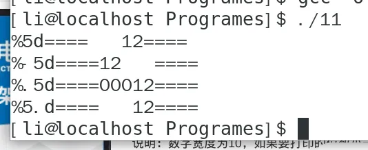
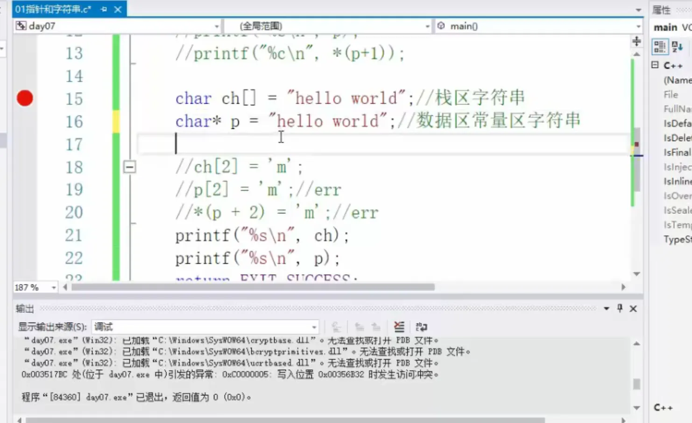

# C复健计划


本文是笔者研究生入学期间对C进行系统性复习总结而成的笔记，因此内部排版混乱，知识点散乱而不成系统，望读者谨慎参考

<!-- more -->

# C复健计划
printf函数无法打印多行字符串，若要打印多行字符串则需要在每行后加换行符\n\  
\n代表换行，\n\代表下一行是上一行的延续，如果改为\n则会报错  
变量名第一个字母不能是数字  
ANSI C C99 C11 关键字数量分别是32 32+5 37+7  
%11.2f代表输出11个占位符，其中浮点型输出到小数点后2位，如果%a.bf，其中b比a大，则直接输出到小数点后b位而忽略a的值  
%x: 十六进制 (hex) %o: 八进制(oct) %d: 十进制(dec)  

<!-- more -->


\"   代表 "   \\ 代表 \  
/*    */代表多行注释  
<>表示导入系统文件  ""表示导入自定义文件`  
Tab == 8个空格，或者4个空格  

编译分为四步
1. 预编译：宏定义展开，头文件展开，条件编译等，并将注释删除（条件编译是指根据系统位数，编译库的选择确定编译环境）
2. 编译：将预编译后的文件生成汇编文件
3. 汇编：将汇编文件生成为目标文件（二进制代码）
4. 链接：把库链接到可执行程序中（预编译只是说明函数格式）  


float 默认保留六位小数，%.2 表示保留小数点后两位（四舍五入）  
常量定义方法（不能对值进行修改）：const 数据类型 常量名 = 值 或 数据类型 const 常量名 = 值 ( 在函数中定义的常量不安全，而全局常量则安全 )，\# define 常量名 值。第一种不安全，利用指针可以修改 const 定义的值  
十六进制用 0x 开头 八进制用 0 开头 C语言不支持定义二进制数  
有符号数最高位是符号位，0 代表正数，1 代表负数  
scanf("%d",&a); 不要加\n  
%hd 短整型 %p 输出指针的地址  
char '单个字母' 此时 %c 打印字母 %d 打印ASC2码  
%c 对应的变量如果是整型，则输出ASC2码所对的字符  
0 的ASC2码是 48 A 65 a 97 小写字母 - 大写字母 == 32  
科学计数法赋值: float a = 3.2e3     \/\/3.2\*1000  
%e 以科学计数法表示数字  
WORD 双字节 16bit   DWORD (double word) 32bit  

正数: 原码 == 反码 == 补码
负数: 反码 == 原码除符号位取反        补码 == 反码 + 1 (若最高位进位，则进位舍弃)  
数据存储时，把 -0 定为区间最小值:  1111 1111 (-127) 1000 0000 (-128) 对于8bit数据，取值范围是: 2^7-1 ~ -2^7  
%s 输出一个字符串，遇到\0停止  
\0 代表字符串的结尾 printf("hello\0 word\n"); 输出的只有hello  
scanf("%d,%d",&a,&b);  键盘输入的时候应严格双引号中的格式输入，只能输入"整数，整数"不能输入"整数 整数"或其它格式  
putchar getchar 只能对单个字符进行操作  




所有非 0 的值都是真值  
C语言浮点型数据不能取余  
单目运算符优先级高于双目运算符  
int a = 10; int b = 20;  则 a && b == 1  
  
强制类型转换不考虑四舍五入，后果是损失精度，系统自动类型转换时也会损失精度  
(int) a\*b 是先将 a 损失精度，再计算结果  (int) (a\*b)是先保留精度计算，再损失精度  
表达式 ? 语句1 : 语句2  表达式为真，执行语句1，否则执行语句2  
switch 中可加 default 并且 case 后要接 break  
for 循环可以有多个判断代码，需用 , 隔开，只要一个表达式不满足就跳出循环  
goto FLAG;  ………… FLAG: …………  
数组下标必须是常量，不能写为下例：int i = 10;  int arr[i];  
**当一个数组初始化（开辟内存空间）时，内部元素默认是乱码。只有当赋值时，默认才是0**  
eg： int arr[4] = {1}; //内部元素：1,0,0,0  int arr[4]; arr[0] = 1; //内部元素：1,数字,数字,数字  
数字 0 等同于 \0 但不等同于字符 '0'  
char arr[] = “hello”; 此时arr数组共有6位（最后一位是\0）  
char arr[5] = {'h','e','l','l','o'}; 此时只有六位，打印的时候到 o 不会停止，会继续打印乱码，所以char arr[n]的数组只能存储n-1个字符  
scanf接收到空格或回车就代表接收的结束  
gets() 与 scanf() 的区别是，get 能接收空格，scanf 则不能  
sizeof() 测量字符串数组长度时包括 /0 strlen() 则不包括  
函数返回值传给寄存器后内存中的函数会被销毁  
函数声明: extern int fun_name( type a, type b );   ==   int fun_name( type a, type b );    ==     int fun_name( type , type  ); 可以不用写在主函数之内  
声明不需要内存  
exit(); 在子函数中使用主函数也会退出  
导入自己的头文件用 "myfile.h"  
#ifndef "myfile.h" #define    文件名    #endif  
char 占1个字节分配1个地址    int 占4个字节分配4个地址  
win 存储方式是小端对齐 即 低位数据存在低位地址中  
& 是取址符号，是升维的    * 是取值符号，是降维  
野指针:    指向某一个未知空间的指针变量  
int const \*p == const int\* p  是给 p 赋值，不是给 p 指向的变量赋值 因为 const 离 “\*”近  

int\* const p 是给 p 指向的变量赋值，不是给 p 赋值，因为 const 离 “p” 近  
指针 +1 == 内存地址 +(sizeof(type 指针))  
数组做为函数参数时会退化为指针，损失数组的大小信息，所以需要额外的数组长度做为函数参数  
p[-2] 等于当前指向某一数组的指针 p 向前数2个的那个元素  
2个指针相减后的结果是步长，指针与指针不能相加  
int\* arr[3]    指针数组  
arr[i] == \*(arr+i)  
一级指针加偏移量相当于跳过元素，二级指针加偏移量相当于跳过一维数组  





' 字母 ' 代表字母的ASCII码值，并可以用 %d 输出其值  
while 是先判断后执行  

主函数是程序的入口，是程序首先执行的函数  
全局变量作用域 : **单个文件(表格错了)**，其他文件调用时需要使用extern关键字来将全局变量作用域扩展到其他文件内： extern int a; 生命周期是从程序创建到程序销毁  
全局变量可以与局部变量重名，调用时程序采用就近原则的方法来选择变量  
静态局部变量在数据区存储，只会初始化一次并且发生在函数创建前，作用域 : 函数内部 生命周期 : 从程序创建到销毁 ( 作用域与局部变量一样，生命周期与全局变量一样 )  
静态全局变量作用域 : 只可在本文件中使用，但不能在其他文件中使用，生命周期 : 从程序创建到程序结束  


定义函数默认是全局的，可以在其他文件中调用，静态函数只能在本文件中使用，即使在其他文件中声明也不能使用  
即使没有声明也可以调用函数，但是在 vs 里转到定义功能不能使用  
静态函数可以和全局函数重名  
malloc 开辟的是连续的堆空间


栈由高地址向低地址增长，栈底是第一个进栈的数据，栈顶就是最后一个进栈的数据。

同理，申请0字节的空间也会报上述错误

下图报错原因是对 NULL 指针进行赋值操作。本质上由于68行函数开辟了一个堆空间同时创建形参p，在申请10个int大小的空间后fun08就被销毁了，同时销毁的还有形参p。相当于68行是废语句

free 空指针不会报错  
结构体成员大小按最大结构体成员的倍数取，下图中， char name 的大小为 21( sizeof(name) ==21 )，但是偏移对齐过后为24 ( int的整数倍 )

typedef 类型名 别名;  
struct 结构体类型名 {};    struct 结构体类型名 结构体名 = {}；//注意{}中的变量用 ; 隔开  
结构体指针 -> 成员    结构体变量 . 成员  
联合体 union 所有数据共用一块内存空间，只能输出最后一次被赋值的成员  

文件操作中的分隔符推荐以 / 正斜杠表示，如果是反斜杠，则需要输入两次  
读取文件若干个字符时不必修改文件指针，文件在读取时指针会自动向下加 1  
文件默认结尾是 -1 和 EOF  

结构体变量名不是地址  
for函数条件用 ; 隔开  
可以将枚举值赋给其他变量  
define 只做替换，所以不加 ; 否则会出现 #define NUM  3; printf("%d",3;);  
退出函数后，局部静态变量不会被销毁，仍然保留在静态区内，但是此变量只能在本函数内部使用  
define 在预处理阶段有效，仅作字符串替换，typedef 在编译阶段有效，因此会做类型检查  
&&: 逻辑与    &: 按位与    || : 逻辑或    | : 按位或  
左移丢弃符号位，右移补偿符号位  
数字前面补零编译器会认为是八进制数字，因此数字为09时编译器会报错  

[博客链接](http://jeremybai.github.io/blog/2014/01/01/const-volatile)
volatile用法：如果开启了编译器优化，或者利用无意义加减变量进行其他工作，亦或者多线程编程，读写与硬件相关的存储器时，需要加volatile关键字，防止编译器优化并提示编译器注意一致性问题，使其每次使用变量时都要去内存中取值。  

* 一个参数既可以是const又可以是volatile么？
    * const volatile常用在对于状态寄存器重新读取数值的时候，因为状态寄存器的值易变，因此加volatile，因为程序不应该修改状态寄存器的值，因此为const  

* 一个指针可以是volatile的么？
    * 可以但不常见，当需要一个经常被修改的指针时需要这么做，比如在中断子程序中会被修改的buffer指针。因为我们不知道中断处理程序何时被执行，这个指针何时被修改，因此这个指针在定义时需要使用volatile修饰  
  
[上述详解](https://blog.csdn.net/wujiangguizhen/article/details/10244627)  

SRAM没有电容结构，因此充放电比DRAM快，读取数据也就比DRAM快，并且也不需要刷新数据  

需要使用malloc来申请结构体的情况: 
1. 结构体大小需要动态分配(结构体内包含本身的指针)
2. 结构体生命周期较长，需要在函数结束时不销毁结构体时需要
3. 对性能要求不大，在栈上分配和释放内存通常比堆上快，对性能不做要求时可以使用malloc  

即使函数参数给出了const限定，但是依然有变量被更改的风险
```c
#include <stdio.h>

int add(int* const a,int* const b)
{
    int* temp1 = a;
    int* temp2 = b;
    *temp1 = 6;
    *temp2 = 4;
    return *a+*b;
}

int main()
{
    int a = 5;
    int b = 3;
    int c = add(&a,&b);
    printf("%d\n",c);
    return 0;
}
```


结果是10



define定义宏的时候不用括号括起来可能导致运算错误
```c
#define N 3+2
int a = N*N; //a = 3+2*3+2
```

内存对齐
* 为什么要进行内存对齐
    * 32位计算机是以地址为4的倍数读取数据的，如果不进行内存对齐可能会引发CPU额外进行数据裁剪与合并操作，降低CPU效率
* 怎样计算内存对齐，成员大小？
    * gcc中默认#pragma pack(4)，即默认内存对齐有效值为4字节，我们可以在编译器内设置这个值。结构体一个成员的大小为gcc的预设值和那个成员的最小公倍数，并且满足结构体总大小为内存对齐有效值的整数倍

```c
struct
{
    int i;
    char c1;
    char c2;
}x1;

struct{
    char c1;
    int i;
    char c2;
}x2;

struct{
    char c1;
    char c2;
    int i;
}x3;

int main()
{
    printf("%d\n",sizeof(x1));  // 输出8
    printf("%d\n",sizeof(x2));  // 输出12
    printf("%d\n",sizeof(x3));  // 输出8
    return 0;
}
```

##可以表示粘连两个字符串，例如下面使用##定义了两个不同的变量NAMEa与NAMEb

```c
#include <stdio.h>

#define NAME(n) int_name##n

int main()
{

    int NAME(a);
    int NAME(b);

    NAME(a) = 520;
    NAME(b) = 111;

    printf("%d\n", NAME(a));
    printf("%d\n", NAME(b));

    return 0;
}
```
结果：

