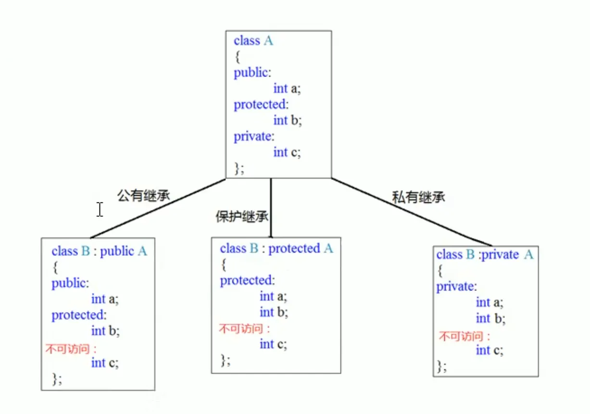
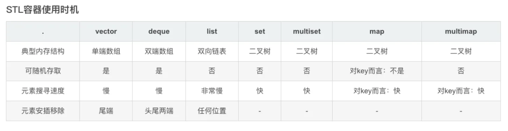
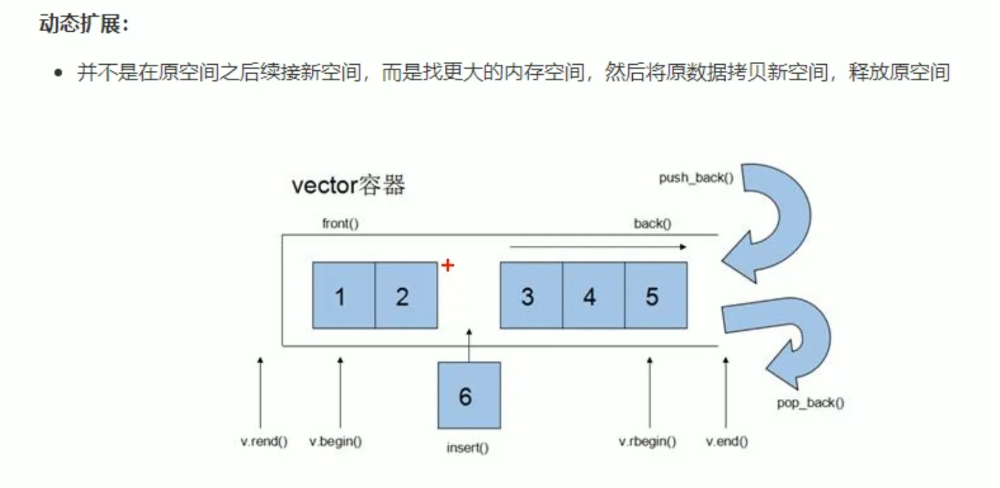

# C++


本文较为详细地介绍了C\+\+的语法和使用中需要注意的坑，还介绍了STL库和Modern C\+\+，甚至涉及C\+\+20的部分新特性。在最后，我们大致的介绍了C\+\+常用的设计模式

<!-- more -->

# C++

## 从C到C++

### new和delete  

尽管C++11引入了智能指针，但是为了兼容老程序，new和delete的方法也应值得注意

* C原生的melloc与free使用起来较为复杂，需要根据返回值来判断下一步做什么
* C原生的melloc与free也只进行内存申请但不进行对象实例化，也就是说C仅仅返回内存地址的指针，而C++返回的是一块特定类型的指针
* 更重要的是C++在调用new时会自动执行对象的构造函数，C原生的melloc与free则不支持

在使用delete回收数组时需要告诉他数组的类型
```cpp
new int arr[10];
delete [] arr;
```

```cpp
//new和delete使用时需要加上数据类型

new int(10) //从堆区获取1个整型的空间，并赋值为10
int *p = new int[10] //从堆区获取10个整型的数组空间

delete [10] p //从堆区释放10个整型的数组空间
```

### 作用域运算符  

当在函数内需要访问全局变量时我们可以使用 ::全局变量 的方式访问，这一般在全局变量和局部变量名字冲突时使用

### 命名空间  

为了在大型项目中管理符号与名称，C语言采用了static关键字，而C++采用了命名空间，这样在调用多个厂商的类库时就不会重名了

```cpp
namespace A
{
    int a = 100;
}

namespace B
{
    int a = 200;
}

int main()
{
    cout << A::a << endl;
}
```

### using的使用

使用using关键字后就可以不需要指定哪个命名空间的作用域了
```cpp
namespace A
{
    int a = 100;
}

namespace B
{
    int a = 200;
}

int main()
{
using namespace A
    cout << a << endl;
}
```

using还用于类型别名的声明，我们终于可以不用忍受蹩脚的typedef了
```cpp
using func_t = void (int);

template<class T>
using Vec = vector<T, Alloc<T>>; // 类型标识为 vector<T, Alloc<T>>
```

## 函数的别名

我们可以使用typedef与using来给函数起别名

```cpp
#include <iostream>
using func_t = void (int);    

void hello(func_t func3){    
    func3(6);
}

void func(int a){
    std::cout << a << std::endl;
}

void hello(func_t * func3){     
    func3(6);
}

int main() {
    hello(func);
    return 0;
}
```
实际上我们写成下面的形式也会过编译
```cpp
using func_t = void (int);    

void hello(func_t * func3){    
    func3(6);
}
//或者下面这样的
using func_t = void (*)(int);    

void hello(func_t func3){    
    func3(6);
}
//但就不能写成下面的的形式，这会报编译错误 error: cannot convert 'void (*)(int)' to 'void (**)(int)
using func_t = void (*)(int);    

void hello(func_t * func3){    
    func3(6);
}
```
typedef也同理
```cpp
//下面3个没问题
typedef  void(*func_t)(int);

void hello(func_t  func3){    
    func3(6);
}

typedef  void(func_t)(int);

void hello(func_t  func3){    
    func3(6);
}

typedef  void(func_t)(int);

void hello(func_t * func3){    
    func3(6);
}
//这就有问题了
typedef  void(*func_t)(int);

void hello(func_t * func3){    
    func3(6);
}
```


### .与::

点号(.)用于访问类的实例的成员，而双冒号(::)用于访问类的静态成员，因此::前面的的一定是某个类或者某个命名空间

## 引用  

```cpp
int c = 20;
int a = 10;
int &b = a;
int &b;    //错误，引用必须初始化
int &b = c;//错误，引用不能被更改
b = c;    //正确，将c的值赋值给b所指向的内存
```
此时称b为a的别名，b与a操作的是同一块内存地址，因此可以通过b来修改a的值

### 引用作为函数参数  

```cpp
void swap(int &a, int &b)    //相当于形参引用了实参:int &a = a;
{
    int temp = a;
    int a = b;
    int b = temp; 
}

int main()
{    
    int a = 10;
    int b = 20;
    swap(a, b);
}
```

### 函数调用可以作为左值  

```cpp
int& left_call()
{
    static int a = 10;
    return a;
}

int main()
{
    left_call() = 1000;    //相当于给a所引用的那块内存地址赋值
    return 0;
}
```
### 引用的本质  

引用的本质是一个指针常量

```cpp
int a = 10; 
int &ref = a;    //int* const ref = &a; 
int &b = 10;    //错误，不能将常量赋值给b的内存区域，因为b这个引用指向的是常量区的10的地址，这么操作可能修改常量区的内容
const int& b = 10;    //正确，这样可以避免修改常量区
```
## 函数  

### 函数的默认参数  

```cpp
int func(int a, int b = 10, int c = 20)    //如果b已经有了默认参数，那么b之后的形参也必须要有对应的初值(在C++11后不做要求)
{
    
}
```

函数声明与实现只能有一个赋予默认参数初值，这是为了防止二义性

### 函数重载  

函数重载条件：
* 同一个作用域下
* 函数名相同
* 函数参数类型不同，个数不同，顺序不同  

但是返回值不能作为函数重载的条件

当碰到默认参数时会产生二义性
```cpp
int func(int a, int b = 10)
{
    cout << "func(int a, int b = 10)" << endl;    
}

int func(int a)
{    
    cout << "func(int a,)" << endl; 
}

int main()
{
    int a = 10;
    fun(a);    //产生二义性，编译错误
    return 0;
}
```

## 类和对象  

### 权限管理  

* 公共权限`public`: 类内可以访问，类外也可以访问
* 保护权限`protected`: 类内可以访问，类外不可以访问，子类可以访问
* 私有权限`private`: 类内可以访问，类外不可以访问，子类不可以访问

class中默认权限为`private`，struct默认权限为`public`

我们可以利用权限控制来对成员进行操作
```cpp
class person
{
public:
    string get_name()
    {
        return m_name;
    }
    
    void set_name(string name)
    {
        m_name = name;
    }   
    
    int get_age()
    {
        return m_age;
    }
    
    void set_paaword(int pswd)
    {        
        m_passwaord = pswd;
    }
private:
    string m_name;    //可读可写
    int m_age = 18;    //只读    
    int m_password = 123456;     //只写
}；
```
这样就可以利用public的函数来控制private的成员了

### 构造与析构  

构造函数可以有参数，因此能发生重载，但构造函数没有返回值也不需要void。析构函数不可以有参数，因此不能发生重载

每当创建对象后会自动调用构造函数，当对象被销毁后会自动调用析构函数
```cpp
class person
{
    public:
    person()
    {
        cout << "person的构造" << std::endl;
    }
    ~person()
    {
        cout << "person的析构" << std::endl;
    }
};

int main()
{
    person p;
    return 0;
}
```

#### 拷贝构造函数

普通构造函数解决了成员的初值问题，但是当某个类需要另一个类的成员时就需要用到拷贝构造函数，拷贝构造函数与普通构造函数的区别在于参数，拷贝构造函数的参数是一个常量引用的类，因为我们不希望原类在拷贝时被修改，所以要加const修饰
```cpp
class person
{
    public:
    person(const person &p)
    {
        age = p.age;
    }
};

int main()
{
    person p1;    //默认构造函数
    person p2(10);    //有参构造函数，person(10)为匿名对象
    person p3(p2);    //拷贝构造函数
    person p4()(p2);    //重载()函数
}
```

调用默认拷贝构造函数时不要加"()"，这会使得编译器以为是函数的声明
产生匿名对象时，当执行完当前行时系统会回收这个匿名对象，但用一个临时变量接受匿名对象则会延长这个对象的生命周期

当进行下列操作时会调用对象的拷贝构造函数
* 使用已经初始化的对象来初始化另一个对象
* 将对象以值传递的方法给函数参数传参
* 对象以值传递的方式做函数返回值

如果我们已经提供了有参构造函数或者拷贝构造函数，那么编译器就不会提供默认构造函数，此时创建对象时必须加上参数，否则会报没有默认构造函数的错误。但编译器依然会提供拷贝构造函数

### 深拷贝与浅拷贝  

编译器默认的拷贝构造函数是浅拷贝的，这会导致在堆区申请的内存不会被拷贝，从而有多个指针指向这块堆区内存，每当调用一次拷贝构造函数后系统就会自动调用一次析构函数，而当每个对象都调用析构函数时就会导致同一块堆区被释放多次

因此当申请堆区内存时我们不能使用默认的拷贝构造函数，我们应该自己实现一个拷贝构造函数，此时的拷贝构造函数应该一起把堆区内存复制了，此时我们称这种拷贝构造函数为深拷贝
```cpp
class person
{
    public:
    person(const person &p)
    {
        age = p.age;
        height = new int(*p.height);    //实现了深拷贝
    }
    ~person()
    {
        if(height)
            delete height;    //析构函数也要进行处理
    }
};
```

### 类对象作为类成员  

当一个类中包含另一个类的对象时，我们称这个类对象为类成员。在构造过程中与c的结构体类似，首先会先构造类成员而后再构造本类。析构的顺序与构造相反，类似Linux驱动程序init和exit函数

空类耗费内存大小为1

### 静态成员与静态函数  

类中的变量使用static修饰时我们称其为静态成员变量，它有如下特点：
* 类内声明，类外初始化
* 所有对象共享同一份静态成员
* 内存分配在编译期  

```cpp
class person
{
    static int a;
};

int person::a = 10;
```

因为静态成员变量存储在全局区内，因此可以通过类名的方式访问，同时它也支持对象访问

需要注意的是静态成员变量也有访问权限

静态成员函数和静态成员变量不属于某个对象，他们只属于这个类，因此可以通过类名进行访问

需要注意的时静态成员函数不能访问非静态变量，这是因为静态成员函数不属于某个对象，这样其他对象里有什么非静态变量，这些变量是否冲突静态成员函数都不知道，因此不能访问

同时静态成员函数也是有访问权限的

只有非静态成员变量才属于类上，其他类型的成员函数和成员变量都不属于类上

### this指针  

每个非静态成员函数会诞生一份函数实例，也就是说多个同类型对象会共用同一份代码，那么怎么区分这些对象呢？答案是使用this指针，每个函数实例都会维护他自己的this指针，因此我们可以通过这个this指针来区分不同的对象

如果要返回对象本身，可以直接使用return *this

```cpp
class person
{
    public:
    person(int age)
    {
        this->age = age; 
    }
    person& person_ageadd(person& p) //返回值类型如果是person的话就会触发默认拷贝构造函数，此时返回的不是p2本身而是p2'，因此最终输出的p2就是20
    {
        this->age += p.age;
        return *this;
    }

    int age;
};

int main()
{
    person p1(10);
    person p2(10);
    p2.person_ageadd(p1).person_ageadd(p1);    //链式编程
    std::cout << p2.age << std::endl;
}
```

this指针本质是个指针常量，其指向不可修改

任何成员前面都隐藏了一个this->

### 常函数与常对象  

类的成员函数后面加 const，表明这个函数不会对这个类对象的数据成员(准确地说是非静态数据成员)作任何改变    

常函数：
* 成员函数后面加const后被称为常函数
* 常函数不能修改成员属性
* 但是成员属性加入mutable关键字后就可以在常函数中修改  

常对象：
* 声明对象前加const后被称为常对象
* 常对象只能调用常函数

常函数本质上是在this前加了一个const关键字，这样this不仅不能修改指向，它所指向的值也修改不了。函数在加入const的位置也不能随意指定，因为如果在函数前加const会与函数本身隐藏的const重复从而导致const失去意义，这样只能在函数后面加了

因为非常函数可以修改成员变量，这样当常对象调用非常函数就很危险了，因此常对象只能调用常函数

### 友元  

当外部函数或者其他的类需要用到某个类private中的成员时，我们可以使用friend关键字

需要友元操作的成员需要将其声明放到类的最前方，并前加friend
```cpp
class house
{
friend void goodgay(house &h1);    //友元

public:
    int score = 10;
private:
    int password = 123456;
};

void goodgay(house &h1)
{
    std::cout << h1->password << std::endl;
}

```

当一个函数被添加为友元符号时，这意味着这个函数已经是全局函数了，因为如果还是成员函数的话就与友元的定义起冲突

### 运算符重载

当需要对某些运算进行运算符重载时，我们需要写一个函数，函数名是编译器提供的`operator`及其运算符，函数内部写出这个运算符的实现

以`operator+`为例，在调用时我们原本需要写成person p3 = p1.operator+(p2)(成员函数的写法)，或者person p3 = operator+(p1，p2)(全局函数的写法)，但是在编译器的简化下我们可以写为person p3 = p1+p2

运算符重载也支持函数重载，所以我们不需要担心函数重名的问题

使用运算符重载()时因为写法与函数很像，因此被称为仿函数。有时我们也会将匿名对象和运算符重载连用
```cpp
class myadd
{
    public:
    operator()(int a, int b)
    {
        return a + b;
    }
};

int main()
{
    int ret;
    ret = myadd()(1, 2);    //此时执行myadd的默认构造函数，但因为构造函数是空函数所以不起作用。因此只剩下匿名对象的运算符重载起作用了，返回值是3且当这行代码执行完毕后myadd匿名函数就会被系统回收
    std::cout << ret << std::endl;
    return 0;
}
```

### 继承  



```cpp
class base
{
public:
    int a;
protected:
    int b;
private:
    int c;
};

class son: protected base
{
    a = 100;
    b = 200;
    c = 300;    //报错
}; 

void func()
{
    son.b = 300;    //报错
}
```

子类可以继承父类中的所有非静态成员，这意味着权限为private的成员变量也可以被继承，但是在访问时编译器进行了权限设置，因此我们访问不到

如果子类和父类的成员重名，我们可以通过子类对象.父类名::成员，来访问父类中的成员

静态成员我们都可以通过类名::成员来访问

#### 菱形继承

为了解决菱形继承，我们引入关键字virtual，在继承之前加上这个关键字可以让继承变为虚继承，这样原来我们不能修改的基类成员就可以修改了同时也不会发生冲突

```cpp
class animal
{
public:
    int age;
};

class sheep:virtual public animal
{
public:
    int age = 15;
};

class tuo:virtual public animal
{
public:
    int age = 20;
};

class sheeptuo:public sheep, public tuo
{
public:
    int age = 38;    //age可以重定义
};

int main()
{
    sheeptuo st;
    std::cout << st.age << std::endl;
    std::cout << st.sheep::age << std::endl;
}
```

使用virtual关键字后，编译器维护了一张vbtable(虚基类表)，当我们想要访问基类成员时通过查表即可获得指针偏移量，通过偏移量就可以找到成员的值了。这样当我们无论是否产生了菱形继承都可以使用vbtable来找到我们需要的成员了

### 多态  

静态多态：函数重载和运算符重载，这些静态多态函数在编译阶段就已经确定函数地址了
动态多态：派生类和虚函数，这些动态多态函数在运行时才确定函数地址

```cpp
class animal
{
    public:
    virtual void func()    //这里需要加virtual关键字，这样子类才会重写这个函数，如果没有使用virtual的话就会输出animal
    {
        std::cout << "animal" << std::endl;
    }
};

class cat:public animal
{
    public:
    void func()
    {
        std::cout << "cat" << std::endl;
    }
};

class dog:public animal
{
    public:
    void func()
    {
        std::cout << "dog" << std::endl;
    }
};

void func(animal& animal)    //这里需要使用引用或者指针，使用动态多态时需要对类进行实例化，如果没有使用引用的话就找不到子类的地址，这样就会输出父类中的函数
{
    animal.func();
}

int main()
{
    dog d;
    func(d);
    
    return 0;
}
```

下面的代码可能会对运行时多态有更好的理解
```cpp
class Animal
{
public :
    virtual void shout() = 0;
};
class Dog :public Animal
{
public:
    virtual void shout(){ cout << "汪汪！"<<endl; }
};
class Cat :public Animal
{
public:
    virtual void shout(){ cout << "喵喵~"<<endl; }
};
class Bird : public Animal
{
public:
    virtual void shout(){ cout << "叽喳!"<<endl; }
};

int main()
{
    Animal * anim1 = new Dog;    //运行时在堆区申请内存
    Animal * anim2 = new Cat;
    Animal * anim3 = new Bird;
     
   //藉由指针（或引用）调用的接口，在运行期确定指针（或引用）所指对象的真正类型，调用该类型对应的接口
    anim1->shout();
    anim2->shout();
    anim3->shout();
 
    //delete 对象
   return 0;
}
```

使用virtual修饰函数时，编译器会生成虚函数指针(vfptr)并指向一个虚函数表(vftable)，这张表的内容是virtual修饰的函数。子类继承父类时会将虚函数指针和虚函数表一同继承下来，子类重写父类中的虚函数时会修改虚函数表，当函数调用父类对象的引用而实际传入的是一个子类的对象时就会发生多态

重写的条件：函数返回值，函数名，参数列表均相同

### 纯虚函数与抽象类  

纯虚函数是指基类中不实现而子类中实现的虚函数。含有纯虚函数的类称为抽象类，在抽象类中允许定义数据成员

```cpp
virtual void func() = 0;    //纯虚函数写法
```

* 抽象类无法实例化对象
* 子类必须实现抽象类

### 虚析构  

当父类为纯虚函数且子类构造函数在堆区申请了内存时可能会导致内存泄漏，这是因为父类在析构时并不能调用到子类的析构函数中，解决办法是将父类的析构函数变为虚析构函数。实际操作是在父类析构函数前加virtual关键字，并且当需要加上初始化参数时要么令其 = 0并在全局作用域内给出定义(空定义也可以)，或是让析构函数 = default。这是由于析构函数必须在父类中给出定义，如果不在父类中给出定义也必须在全局作用域内重写父类 = 0的析构函数的定义，否则在删除对象时就找不到与析构函数的定义，这会报链接错误。因此在使用虚析构时要么令其 = 0并在全局作用域内给出定义，要么或是让析构函数 = default。当然，这两种方法都不影响父类调用子类析构函数

## 模板  

除了面向对象外，C++还使用了泛型编程的思想，主要用到的技术就是模板

使用模板时我们推荐通过模板参数列表显式调用函数模板或类模板，这样能够避免隐式调用造成与普通函数混淆的问题

### 函数模板

使用模板可以进行泛型编程

```cpp
template <typename T>    //除了typename外还可以使用class，这两个没有区别，只是使用习惯不同
void myswap(T &a, T &b) //不能将函数名改为swap，这会导致call of overloaded 'swap(int&, int&)' is ambiguous错误，这意味着自定义函数名与系统库的函数名冲突
{
    T temp = a;
    a = b;
    b = temp;
}

int main()
{
    int a = 10;
    int b = 20;
    myswap(a, b);
    //myswap<int>(a, b);    //显式调用模板
    std::cout << a << std::endl;
    std::cout << b << std::endl;
    return 0;
}
```

需要注意的是当显式调用函数模板时有可能发生隐式类型转换
```cpp
template <typename T>
void myswap(T &a, T &b) 
{
    T temp = a;
    a = b;
    b = temp;
}

int main()
{
    int a = 10;
    int b = 20;
    char c = 'c';
    myswap<int>(a, c);    //显式调用模板产生隐式类型转换
    std::cout << a << std::endl;
    std::cout << b << std::endl;
    return 0;
}
```

使用函数模板的注意事项
* 函数模板和普通函数都可以调用时优先调用普通函数，但当需要进行隐式类型转换时会优先调用函数模板
* 可以通过空模板列表强制调用函数模板
* 函数模板可以发生函数重载(也就是模板特化)

因此在开发中使用了函数模板就不要提供普通函数

```cpp
myswap<>(a,c);    //空模板列表
```

有些自定义数据类型的操作模板无法识别，如比较两个数组是否相等，因此模板不是万能的，但我们可以通过模板的重载来解决这个问题

```cpp
template<> bool my_compare(person &p1, person &p2)//模板的重载
{
    if(p1.name == p2.name && p1.age == p2.age)
        return true;
    else
        return false;
}
```

### 类模板  

类模板没有类型自动推导的调用方式，我们只能通过模板参数列表显式调用类模板

```cpp
#include <iostream>
#include<string>
using namespace std;

template <class nametype, class agetype>
class person
{
    public:
    person(nametype name, agetype age)
    {
        this->name = name;
        this->age = age;
    }
    void showperson()
    {
        std::cout << name << std::endl;
        std::cout << age << std::endl;
    }
    nametype name;
    agetype age;
};

int main()
{
    person<string,int>p1("xiaoming",14);   //注意对象实例化
    p1.showperson();
    return 0;
}
```

在定义类模板时可以在参数列表中指定默认参数，这样在调用时就不用指定参数列表了
```cpp
template <class nametype = string, class agetype = int>    //指定默认参数
class person
{
    public:
    person(nametype name, agetype age)
    {
        this->name = name;
        this->age = age;
    }
    void showperson()
    {
        std::cout << name << std::endl;
        std::cout << age << std::endl;
    }
    nametype name;
    agetype age;
};

int main()
{
    person p1("xiaoming",14);   
    p1.showperson();
    return 0;
}
```
<string,int
类模板中成员函数在调用时才会创建，这与普通的类中的成员函数不同

#### 类模板对象做函数参数

类模板做函数参数时需要加上对象类型和参数列表
```cpp
template <class nametype, class agetype>
class person
{
    public:
    person(nametype name, agetype age)
    {
        this->name = name;
        this->age = age;
    }
    void showperson()
    {
        std::cout << name << std::endl;
        std::cout << age << std::endl;
    }
    nametype name;
    agetype age;
};

void showperson2(person<string,int> p)    //类模板作为函数参数
{
    p.showperson();
    std::cout << "p2.name: " << p.name << std::endl;
}

int main()
{
    person<string,int>p1("xiaoming",14);
    showperson2(p1);
    return 0;
}
```

#### 类模板的继承  

类模板有两种继承方式
* 继承父类模板时在父类后指定参数列表
* 将父类模板的参数列表模板化
```cpp
template <class nametype, class agetype>
class person
{
    public:
    person(nametype name, agetype age)
    {
        this->name = name;
        this->age = age;
    }
    void showperson()
    {
        std::cout << name << std::endl;
        std::cout << age << std::endl;
    }
    nametype name;
    agetype age;
};

class son1: public person<string,int>    //注意要给出模板参数列表
{

};

template<class T1, class T2, class T3>
class son2: public  person<T1,T2>
{
    T3 obj;
};
```

#### 类模板成员函数的类外实现  

```cpp
#include <iostream>
#include <string>
using namespace std;

template <class nametype, class agetype>
class person
{
    public:
    person(nametype name, agetype age);    //这里给出声明，实现在下面
    // {
    //     this->name = name;
    //     this->age = age;
    // }
    void showperson()
    {
        std::cout << name << std::endl;
        std::cout << age << std::endl;
    }
    void showpersonname();
    nametype name;
    agetype age;
};

//注意类模板的写法
template <class nametype, class agetype>    //先利用类模板定义nametype
person<nametype, agetype>::person(nametype name, agetype age)    //再写好作用域，并且后面要跟上类模板的参数列表，即使用不到参数也必须给出，因为这是模板的类型
{
    this->name = name;
    this->age = age;
}

template <typename T1, typename T2>
void person<T1,T2>::showpersonname()
{
    std::cout << name << std::endl;
}

int main()
{
    person<string,int>p1("xiaoming",14);
    //p1.showperson();
    //showperson2(p1);
    p1.showpersonname();
    return 0;
}
```

#### 类模板分文件编写  

当代码按如下方式组织时会产生外部符号无法解析的错误
```cpp
//person.h
template <class nametype, class agetype>
class person
{
    public:
    person(nametype name, agetype age);
    // {
    //     this->name = name;
    //     this->age = age;
    // }
    void showperson()
    {
        std::cout << name << std::endl;
        std::cout << age << std::endl;
    }
    void showpersonname();
    nametype name;
    agetype age;
};

//person.cpp
#include "person.h"
template <class nametype, class agetype>
person<nametype, agetype>::person(nametype name, agetype age)
{
    this->name = name;
    this->age = age;
}

template <typename T1, typename T2>
void person<T1,T2>::showpersonname()
{
    std::cout << name << std::endl;
}

//main.cpp
#include "person.h"
int main()
{
    person<string,int>p1("xiaoming",14);
    //p1.showperson();
    //showperson2(p1);
    p1.showpersonname();
    return 0;
}
```
这是由于类模板中的成员函数只有在调用时才会实例化，因此在链接阶段时链接器无法从.o文件中找到在.h中声明的符号，这会导致未定义外部符号的错误。但当main文件包含了.cpp文件时，编译器就会自动将cpp文件中的代码实例化以保证链接通过，但这么写会导致重复包含.cpp文件的错误或者导致代码膨胀编译时间增加

因此在编写类模板时我们需要将.h和.cpp文件写在一起，即将声明和实现写在一起并统一命后缀名为.hpp

## STL  

STL(standard template library，标准模板库)，它的诞生是为了提高代码复用性的问题。主要包括算法，容器，迭代器，分配器，函数对象，适配器六大部分，stl几乎所有代码都采用了模板类或模板函数

### 容器



#### vector容器  

vector与数组很类似，但是支持动态扩展，实际上当向vector里插入数据时，vector会在内存中找一块更大的空间，然后将原数据和新数据一起拷贝进去



```cpp
#include <iostream>
using namespace std;
#include <vector>

void print(vector<int> &v)    
{
    for(vector<int>::iterator it = v.begin(); it != v.end(); it++)    //注意迭代器写法
    {
        std::cout << (*it) << " ";
    }
    std::cout << endl;
}

void test()
{
    int i;
    vector<int> v1;    //无参构造赋值
    for(i = 0; i < 10; i++)
    {
        v1.push_back(i);
    }
    print(v1);

    vector<int> v2 = v1;    //重载运算符赋值(调用到vector提供的重载函数)
    print(v2);

    vector<int> v3(v1);    //拷贝构造函数赋值
    print(v3);
}

int main()
{
    test();
    return 0;
}
```

vector容器的方法：  
```cpp
empty()    //判断容器是否为空
capacity()    //获取容器的容量
size()    //获取容器中元素个数
shrink_to_fit()    //删除元素后调用，可以释放被占用的内存
resize(int num)    //重新指定容器大小，比原来大就用默认值填充容器，比原来小将容器末尾元素舍去
push_back(element)    //尾部添加一个元素element
pop_back()    //尾部删除一个元素
insert(const_iterator pos, element)    //在pos位置插入元素element
erase(const_iterator pos)    //在pos位置删除元素
clear()    //删除容器内所有元素
at(int index)    //返回指定下标的元素
operator[]    //同上
front()    //返回容器内第一个元素
back()    //返回容器内最后一个元素
```

#### deque容器  

deque容器使用方法与vector容器一样，区别在于当在头部插入元素时由于vector是单端容器所以需要开辟一块新的内存空间并将所有元素都复制一遍，这样效率很低，但deque内部管理多块内存，所以在拷贝容器时不像vector一样将所有元素都拷贝一遍，因此在经常扩增容器容量或者频繁往头尾写入数据的情况下deque效率很高

deque容器的方法：  
其他用法与vector一样，头插数据时使用专用方法
```cpp
push_front(element)    //头部添加一个元素element
pop_front()    //头部删除一个元素
```

deque没有capacity的方法

#### stack容器  

与栈的结构相同，不允许遍历，这是因为栈只能查看栈顶元素

stack容器的方法：
```cpp
push(element)    //向栈顶添加元素
pop()    //从栈顶移除第一个元素
top()    //返回栈顶元素但并不移除
empty()    //判断栈是否为空
size()    //返回栈的大小
```

#### queue容器  

与队列的结构相同，同样也不允许遍历，这是因为只有队列头和队列尾才能访问到

queue容器的方法：
```cpp
push(element)    //从队尾添加元素
pop()    //从队头移除第一个元素
back()    //查看队尾元素
front()    //查看对头元素
empty()    //判断队列是否为空
size()    //返回队列的大小
```

#### list容器  

与链表的结构相同，stl中是一个双向循环链表，同样也维护了begin()，end()迭代器，迭代器不支持随机查找，只支持前移后移

list和vector是最常使用的容器

list容器基本使用方法与vector一样

list容器的方法：
```cpp
erase(const_iterator pos)    //在pos位置删除元素
remove(element)    //删除容器中所有与element值匹配的元素
reverse()    //反转排序
sort()    //排序函数，默认从小到大
```

由于list不支持随机访问，因此也没有实现[]和at的方法

所有不支持随机访问的迭代器不可以使用标准算法(算法库中的算法)，但内部会提供对应算法
```cpp
list<int> l;
l.sort()    //默认排序从小到大
```

#### set/mutiset容器  

所有元素插入时会被自动从小到大排序，底层是二叉树

set与mutiset区别：
* mutiset允许元素重复，但set不允许

set只有insert()的方法，同时set也不支持resize()，因为假如支持resize的话，新的set比原来set大会添加多个默认元素，而set是不允许元素重复的

set容器的方法：
```cpp
find(key)    //查找key是否存在，若存在，返回该元素的迭代器，若不存在，返回set.end()
count(key)    //查找key的个数
```

指定set从大到小排序：
```cpp
class mycompare
{
    public:
    bool operator()(int val1, int val2)    //重载仿函数
    {
        return val1 > val2;
    }
};

int main()
{
    set<int,mycompare> s;    //在此处传入回调函数
}
```

存放自定义数据类型时必须指定仿函数
```cpp
class person
{
    public:
    person(string name, int age)
    {
        this->name = name;
        this->age = age;
    }
    
    string name;
    int age;
};

class mycompare
{
    public:
    bool operator()(const person val1, const person val2)   
    {
        return val1.age > val2.age;
    }
};

int main()
{
    set<person,mycompare> s;
   /* todo */
}
```

#### map/mutimap容器  

* map中所有元素都是pair
* pair中第一个元素为key，起索引作用，第二个元素为value
* 所有元素否会根据key值进行排序
* map底层使用二叉树实现  

map操作与上述容器类似

#### pair(对组)  

队组在stl中应用非常广泛，常用于存储成对的数据

创建队组的方式：
```cpp
pair<type,type> p(typeval1,typeval2);
pair<type,type> p = make_pair(typeval1,typeval2)
```

### 函数对象  

那些重载函数操作运算符的类我们称为函数对象
函数对象使用重载的()时，我们称为仿函数

函数对象实际上是个类，并不是函数

#### 谓词(predicate)  

* 我们将返回值为bool类型的仿函数称为谓词
* 如果operator()()接受一个参数我们称为一元谓词
* 如果operator()()接受两个参数我们称为二元谓词

```cpp
#include <iostream>
#include <vector>
#include <algorithm>
using namespace std;

class mycompare
{
    public:
    bool operator()(int v1, int v2)   //二元谓词
    {
        return v1 > v2;
    }
};

void test()
{
    vector<int> v1;
    v1.push_back(10);
    v1.push_back(50);
    v1.push_back(40);
    v1.push_back(20);
    v1.push_back(30);

    for(vector<int>::iterator it = v1.begin(); it != v1.end(); it++)
    {
        cout << (*it) << " ";
    }
    cout << endl;
    //这里的greater是函数模板的名字，<>代表是个模板，()代表参数列表
    sort(v1.begin(),v1.end(),greater<int>());    //sort默认的排序方式为less<>，如果我们需要自定义排序函数就需要传入系统提供的谓词greater，也别忘了需要引入头文件functional
    
    for(vector<int>::iterator it = v1.begin(); it != v1.end(); it++)
    {
        cout << (*it) << " ";
    }
    cout << endl;

    sort(v1.begin(),v1.end(),mycompare());    //sort默认的排序方式为less<>，如果我们需要自定义排序函数就需要传入仿函数
    
    
    for(vector<int>::iterator it = v1.begin(); it != v1.end(); it++)
    {
        cout << (*it) << " ";
    }
    cout << endl;

}

int main()
{
    test();
}
```

### 算法  

算法需要引入头文件`algorithm`

#### 遍历算法

##### for_each算法  

```cpp
for_each(iterator begin(), iterator end(), for_eachobj);
```

```cpp
#include <iostream>
#include <vector>
#include <algorithm>
#include <functional>
using namespace std;

void print1(int val)
{
    cout << val << " ";
}

class print2
{
    public:
    void operator()(int v1)
    {
        cout << v1 << " ";
    }
};

void test()
{
    vector<int> v1;
    v1.push_back(10);
    v1.push_back(50);
    v1.push_back(40);
    v1.push_back(20);
    v1.push_back(30);

    for_each(v1.begin(),v1.end(),print1);    //传入函数地址
    for_each(v1.begin(),v1.end(),print2());    //传入函数对象，必须加括号，要不然白重载()了
    
    cout << endl;

}

int main()
{
    test();
}
```

##### transform算法  

将一个容器的数据转移到另一个容器

使用transform前必须使用resize方法指定容器大小
```cpp
transform(iterator src_begin(), iterator src_end(), iterator des_begin(), funcclass fun);
```

#### 查找算法  

##### find算法  

find的返回结果是个迭代器，如果找到的话返回迭代器，没找到的话返回end()
```cpp
container<type>::iterator it = find(iterator begin(), iterator end(), findobj);
```
下面是实例：
```cpp
#include <iostream>
#include <vector>
#include <algorithm>
#include <functional>
using namespace std;

class person
{
    public:
    person(string name, int age)
    {
        this->age = age;
        this->name = name;
    }
    bool operator==(const person& p)    //如果不想编译器给你写小作文的话这里必须使用const
    {    //如果这里没有运算符重载的话，下面的if(it == v1.end())就不知道怎么做了
        if(this->age == p.age && this->name == p.name)
            return true;

        else
            return false;
    }
    string name;
    int age;
};

void test()
{
    vector<person> v1;
    person p1("aaa",10);
    person p2("bbb",20);
    person p3("ccc",30);
    person p4("ddd",40);
    person p5("eee",50);

    v1.push_back(p1);
    v1.push_back(p2);
    v1.push_back(p3);
    v1.push_back(p4);
    v1.push_back(p5);

    person p6 = person("bbb",20);
    vector<person>::iterator it = find(v1.begin(), v1.end(), p6);    //find的返回值是个迭代器

    if(it == v1.end())
    {
        cout << "not find" << endl;
    }
    else
    {
        cout << "find" << endl;
    }
}

int main()
{
    test();
    return 0；
}
```

##### find_if算法  

从此处开始，predicated(谓词)被简写为pred

```cpp
container<type>::iterator it = find_if(iterator begin(), iterator end(), pred);
```
下面是实例：
```cpp
#include <iostream>
#include <vector>
#include <algorithm>
#include <functional>
using namespace std;

class person
{
    public:
    person(string name, int age)
    {
        this->age = age;
        this->name = name;
    }
    // bool operator==(const person& p)    //相比find来说由于find_if需要传入返回值为bool的仿函数(谓词)，在仿函数中就已经表明了要对数据进行的操作，因此不需要进行重载了
    // {
    //     if(this->age == p.age  && this->name == p.name)
    //         return true;

    //     else
    //         return false;
    // }
    string name;
    int age;
};

class greater20
{
    public:
    bool operator()(person& p)
    {
        if(p.age > 20)
            return true;

        else
            return false;
    }
};

void test()
{
    vector<person> v1;
    person p1("aaa",10);
    person p2("bbb",20);
    person p3("ccc",30);
    person p4("ddd",40);
    person p5("eee",50);

    v1.push_back(p1);
    v1.push_back(p2);
    v1.push_back(p3);
    v1.push_back(p4);
    v1.push_back(p5);

    person p6 = person("bbb",20);
    vector<person>::iterator it = find_if(v1.begin(), v1.end(), greater20());

    if(it == v1.end())
    {
        cout << "not find" << endl;
    }
    else
    {
        cout << "find" << endl;
    }
}

int main()
{
    test();
}    
```

##### adjacent_find算法  

查找相邻元素是否重复
```cpp
container<type>::iterator it = adjacent_find(iterator begin(), iterator end()） 
```

##### binary_search算法  

二分法查找元素是否存在

* 在使用`binary_search`前的数据必须是有序序列，这是二分法原理要求的，并且`binary_search`源码要求必须为升序排列

##### count算法  

查询元素数量

count参数并没有谓词，因此需要自己进行==运算符重载

##### count_if算法  

需要谓词的count算法

#### 排序算法  

##### sort算法  

对容器进行排序，默认为升序
```cpp
sort(iterator begin(), iterator end(), pred)
```

##### merge算法  

将两容器合并到一个容器里，使用前要保证两个容器都是有序的
```cpp
merge(iterator container1_begin(), iterator container1_end(),iterator container2_begin(), iterator container2_end(), iterator dest_begin())
```

##### reverse算法  

将容器元素进行反序排列
```cpp
reverse(iterator begin(), iterator end())
```

#### 拷贝和替换算法  

##### copy算法  

将一个容器的数据转移到另一个容器中
```cpp
copy(iterator begin(), iterator end(), iterator dest())
```

无论在使用merge还是copy算法，使用前都应该将目标容器resize一个新的空间

##### replace算法  

将区间内的旧元素替换为新元素
```cpp
replace(iterator begin(), iterator end(), oldvalue, newvalue)
```
##### replace_if算法  

将符合条件的元素替换为新元素
```cpp
replace(iterator begin(), iterator end(), pred, newvalue)
```

##### swap算法  

将两个同种容器内的元素进行替换
```cpp
swap(container c1, container c2)
```

#### 算数生成算法

##### accumulate算法  

计算区间内容器元素总和
```cpp
replace(iterator begin(), iterator end(), value)    //第三个参数是起始的累加值，以应对有初始值的情况
```

#### 集合算法  

##### set_intersection算法  

求两个容器的交集，并且这两个容器必须是有序序列
```cpp
container<type>::iterator it = set_intersection(iterator begin1(), iterator end1(), iterator begin2(), iterator end2(), iterator dest())
```

使用前目标容器也要提前开辟空间，空间大小为`dest.resize(min(it1.size,it2.size))`

返回值是交集中最后一个迭代器的位置，当遍历时需要使用，因为迭代器后面可能还有占位0元素

##### set_union算法  

求两个容器的并集，并且这两个容器必须是有序序列
```cpp
container<type>::iterator it = set_union(iterator begin1(), iterator end1(), iterator begin2(), iterator end2(), iterator dest())
```

使用前目标容器也要提前开辟空间，空间大小为`dest.resize(it1.size + it2.size)`

##### set_difference算法

求两个容器的差集，并且这两个容器必须是有序序列
```cpp
container<type>::iterator it = set_difference(iterator begin1(), iterator end1(), iterator begin2(), iterator end2(), iterator dest())
```

使用前目标容器也要提前开辟空间，空间大小为`dest.resize(max(it1.size,it2.size))`

### 杂项  

#### std::ref  

首先引用不是对象，而引用本身进行运算时则需要对象，为了能够进行引用的引用等操作，我们可以采用std::ref来包装引用，使其生成一个引用的包装器，而这个包装器则是对象并可以被引用进行运算。这种情况多用于thread传参时必须使用std::ref对参数进行包装。其次当模板函数传左值引用时函数本身并不能辨别到底是传引用还是传值，使用std::ref对参数进行包装可以明确告诉编译器：我传入的是左值引用，这是个引用不是值。std::ref在底层调用的是std::reference_wrapper

这样看std::ref使用方法与std::move非常类似，只不过std::ref获得的结果是左值引用
[参考文档](https://www.cnblogs.com/jerry-fuyi/p/12747850.html)

#### 函数对象与函数对象类型

类是在内存中生成的数据(对象)的蓝图，任何对象都是类实例化出来的，函数对象也不例外。相比其他对象，函数对象实例化需要在对象名称后加()

那些重载函数操作运算符的类我们称为函数对象(function object)，使用时需要加{}或()来实例化对象
```cpp
class myadd
{
    public:
    operator()(int a, int b)
    {
        return a + b;
    }
};

int main()
{
    int ret;
    ret = myadd()(1, 2);    //实例化匿名对象并将(1, 2)参数传入
    std::cout << ret << std::endl;
    return 0;
}
```

而函数对象类型(function object type)是一个类型，使用时无需后加()或{}来实例化，典型应用是stl的set容器的参数，当我们需要指定set容器默认排序为从大到小时我们要给出模板参数列表的函数对象类型
```cpp
class mycompare
{
    public:
    bool operator()(int val1, int val2)    
    {
        return val1 > val2;
    }
};

int main()
{
    set<int,mycompare> s;    //指定函数对象类型，无需添加()或{}
}
```

# Mordern C++  

下列语法特性默认C++版本为C++11

## extern “C”

```cpp
#ifdef __cplusplus
extern "C" {
#endif

int add(int x, int y);

#ifdef __cplusplus
}
#endif
```

## nullptr  

nullptr是从C++11开始引入的，首先是为了与NULL区分，因为有的编译器会将NULL定义为`(void*)0`，但C++不允许定义void*类型隐式转换为其他类型，因此NULL就被定义为`int 0`，但当函数重载时，如果函数参数传入的是NULL那么很有可能会重载到参数为int类型的重载函数下，而这是非预期的结果。为了解决这个问题我们引入了`nullptr`

`nullptr`的类型为`nullptr_t`，能够隐式的转换为任何指针或成员指针的类型，也能和他们进行相等或者不等的比较

## constexpr  

在用const或者static关键字修饰的变量或数据类型时我们需要**显式**指明变量或数据类型的值，但C++11提供了`constexpr`关键字来支持隐式转换：
```cpp
#include <iostream>
#define LEN 10

int len_foo() {
    int i = 2;
    return i;
}
constexpr int len_foo_constexpr() {
    return 5;
}

constexpr int fibonacci(const int n) {
    return n == 1 || n == 2 ? 1 : fibonacci(n-1)+fibonacci(n-2);
}

int main() {
    char arr_1[10];                      // 合法
    char arr_2[LEN];                     // 合法，宏定义只是字符替换

    int len = 10;
    // char arr_3[len];                  // 非法，变量是隐式表达式

    const int len_2 = len + 1;
    constexpr int len_2_constexpr = 1 + 2 + 3;
    // char arr_4[len_2];                // 非法
    char arr_4[len_2_constexpr];         // 合法，使用constexpr修饰的变量或数据类型可以支持隐式表达式

    // char arr_5[len_foo()+5];          // 非法
    char arr_6[len_foo_constexpr() + 1]; // 合法

    std::cout << fibonacci(10) << std::endl;
    // 1, 1, 2, 3, 5, 8, 13, 21, 34, 55
    std::cout << fibonacci(10) << std::endl;
    return 0;
}
```

## 初始化列表  

我们可以使用{}来统一为变量，容器，非静态成员初始化(C++11)，这相比曾经()与{}混用的情况会好很多

下面是示例代码：
```cpp
struct  A
{
    int a;
    string b;
    std::vector<int> c;
};


int main()
{
    A a = {5, "hello", {1, 4, 40}};    //这样初始化很方便，写法也很统一
    int b = {6};    //这个也是可以编译通过的
    string c {"string"};    //甚至可以不带等号
    std::cout << a.a << std::endl;
    std::cout << a.b << std::endl;
    for_each(a.c.begin(),a.c.end(),[](int value){std::cout << value << " ";});
    std::cout << std::endl;
    std::cout << b << std::endl;
    return 0;
}
```

实际上，标准容器初始化利用的是`std::initializer_list<type>`来进行的，我们也可以利用`std::initializer_list<type>`来初始化任意对象，但前提是`std::initializer_list<type>`必须作为构造函数的实参，这样编译器才能够支持
```cpp
class MagicFoo {
public:
    std::vector<int> vec;
    MagicFoo(std::initializer_list<int> list) {
        for (std::initializer_list<int>::iterator it = list.begin();
            it != list.end(); ++it)
            vec.push_back(*it);
    }
};
int main() {
    // after C++11
    MagicFoo magicFoo = {1, 2, 3, 4, 5};

    std::cout << "magicFoo: ";
    for (std::vector<int>::iterator it = magicFoo.vec.begin(); 
        it != magicFoo.vec.end(); ++it) 
        std::cout << *it << std::endl;
}
```

## auto  

auto关键字可以进行自动类型推导，甚至可以用在函数传参(C++20)，但**不能用于数组类型的推导**

之前我们写迭代器时需要吟唱这些：
```cpp
for(vector<int>::iterator it = v.begin(); it != v.end(); it++)
```

但是有了auto关键字后我们可以将其简化为：
```cpp
for(auto it = v.begin(); it != v.end(); it++)
```

一些其他常见的写法：
```cpp
auto i = 5;              // i 被推导为 int
auto intp = new auto(10); // arr 被推导为 int *
```

## 区间for迭代  

有了区间for迭代，我们也可以写出像python那样的for循环了，再结合auto的特性，迭代器的写法会更简单，但是区间for迭代会遍历整个区间，因此如果只想要操作偶数或者奇数位置的元素就需要内嵌条件控制语句了

```cpp
#include <iostream>
#include <vector>
#include <algorithm>

int main() {
    std::vector<int> vec = {1, 2, 3, 4};
    if (auto itr = std::find(vec.begin(), vec.end(), 3); itr != vec.end()) *itr = 4;    //冗长的写法
    for (auto element : vec)    //这语法糖甜死了
        std::cout << element << std::endl; // read only
    for (auto &element : vec) {
        element += 1;                      // writeable
    }
    for (auto element : vec)
        std::cout << element << std::endl; // read only
}
```

## final与override  

在传统C++中，我们经常在函数重载方面发生错误，例如重载了我们不想重载的方法，部分方法不能被重载
```cpp
struct Base {
    virtual void foo();
};
struct SubClass: Base {
    void foo();    //这个函数并不是我们想重载的，但是由于继承了父类，此时就会发生重载
};
```

解决的好方法是使用final关键字，final是为了防止类被继续继承以及终止虚函数继续重载引入的。
```cpp
struct Base {
    virtual void foo() final;
};

struct SubClass3: Base {
    void foo(); // 非法, foo 已 final
};

struct SubClass1 final: Base {
}; // 合法

struct SubClass2 : SubClass1 {
}; // 非法, SubClass1 已 final
```

当重载虚函数时，引入override关键字将显式的告知编译器进行重载，编译器将检查父类是否存在与函数签名一致的虚函数，若有就进行重载，没有将无法通过编译
```cpp
struct Base {
    virtual void foo(int);
};
struct SubClass: Base {
    virtual void foo(int) override; // 合法
    virtual void foo(float) override; // 非法, 父类没有此虚函数
};
```

## decltype与typeid  

decltype(declare type，声明类型)与typeof用法类似

```cpp
decltype(表达式)

auto x = 1;
auto y = 2;
decltype(x+y) z;
```

decltype与auto都是在编译期进行类型推导的

typeid虽然也是类型推导，但是可以进行动态类型推导，而`decltype`是在运行期进行推导的

## "<"尖括号带来的歧义问题

在传统的C++编译器中，>>被视为右移操作符，但这很容易造成歧义
```cpp
std::vector<std::vector<int>> matrix;
```

在C++11中这段代码会被编译通过，但在之前的版本中则不会

## 变长参数模板  

类似printf，变长参数模板可以处理不定长的参数变量，并且相对于printf自身实现的变长参数模板更安全

```cpp
template<typename... Ts> class Magic;
class Magic<int,
            std::vector<int>,
            std::map<std::string,
            std::vector<int>>> darkMagic;
```

我们可以通过变参模板实现printf函数
```cpp
#include <iostream>
template<typename T0>    //终止递归条件，如果没有这个函数模板当参数为空时就会无限调用空模板printf1()；导致编译错误
void printf1(T0 value) {
    std::cout << value << std::endl;
}
template<typename T, typename... Ts>
void printf1(T value, Ts... args) {
    std::cout << value << std::endl;
    printf1(args...);    //每次调用变参模板时循环调用，printf1(T0 value)
}
int main() {
    printf1(1, 2, "123", 1.1);
    return 0;
}
```

我们可以使用变参模板展开来简化代码(C++17)
```cpp
template<typename T0, typename... T>
void printf2(T0 t0, T... t) {
    std::cout << t0 << std::endl;
    if constexpr (sizeof...(t) > 0) printf2(t...);    //用constexpr关键字来保证编译时添加终止条件而不是运行时，不仅简化代码还优化效率。sizeof...()是专门用于计算变长模板长度的运算符
}
```
还要注意参数包展开的方式
```cpp
#include <iostream>
#include <algorithm>

template<class...Args,class Ty = std::common_type_t<Args...>>    //将Args...转换为共同类型，例如double或float
auto max(Args...args) {
    return std::max({ static_cast<Ty>(args)... });    //这里的static_cast<Ty>(args)...若改为static_cast<Ty>(args...)就会展开成static_cast<Ty>(args0，args1，args2)，而这不能满足我们的需求
}

int main() {
    std::cout << ::max(1, 1.2,5, 'a') << '\n';
}
```

## Lambda表达式  

lambda表达式又称为闭包，我们可以利用lambda表达式来获得暂时性的函数对象，因此lambda表达式在创建时(不是调用时)耗费资源，在调用完成时销毁资源，并且在访问时，如不特殊指定访问对象，lambda表达式默认禁止访问外部数据

先看个实例
```cpp
int main() 
{
    std::vector<int> vec {1, 5, 10, 4, 7, 15, 12};
    auto f = [](int a, int b)    //lambda表达式
    {
        return a > b;
    };
    
    std::sort(vec.begin(), vec.end(), f);
    return 0;
}
```

lambda表达式的格式如下：
```cpp
[捕获列表](参数列表) mutable(可选) 异常属性 -> 返回类型 {
// 函数体
}

//对于返回类型可以自动推断，因此我们常用的是：
[捕获列表](参数列表) mutable(可选) 异常属性 {
// 函数体
}
```
捕获列表中捕获的是外界的变量，并且分为值捕获和引用捕获，值捕获的权限是只读的，引用捕获的权限是读写的

值捕获：
```cpp
void lambda_value_capture() {
    int value = 1;
    auto copy_value = [value] {
        return value;
    };
    value = 100;
    auto stored_value = copy_value();
    std::cout << "stored_value = " << stored_value << std::endl;
    // 这时, stored_value == 1, 而 value == 100.
    // 因为 copy_value 在创建时就保存了一份 value 的拷贝
}
```

引用捕获：
```cpp
void lambda_reference_capture() {
    int value = 1;
    auto copy_value = [&value] {
        return value;
    };
    value = 100;
    auto stored_value = copy_value();
    std::cout << "stored_value = " << stored_value << std::endl;
    // 这时, stored_value == 100, value == 100.
    // 因为 copy_value 保存的是引用
}
```

如果[]中只有&或者=号，这就代表lambda表达式能够访问区域范围内所有的数据，并按&(引用捕获)或者=(值捕获)的方式来获取

全局引用捕获：
```cpp
void lambda_reference_capture() {
    int value1 = 1;
    value2 = 100;
    auto add_value = [&] {
        return value1 + value2;
    };
    auto stored_value = add_value();
    std::cout << "stored_value = " << stored_value << std::endl;
}
```

## 函数对象包装器  

将lambda表达式的返回值传入一个函数，在函数内部对这个lambda表达式进行调用或处理，我们称这个函数为函数对象包装器

相对于直接调用lambda函数，使用包装器的方法因为需要调用并处理lambda表达式，因此相比原生lambda表达式更灵活
```cpp
#include <iostream>

using foo = void(int); // 定义函数类型, using 的使用见上一节中的别名语法
void functional(foo f) { // 参数列表中定义的函数类型 foo 被视为退化后的函数指针类型 foo*
    f(1); // 通过函数指针调用函数
}

int main() {
    auto f = [](int value) {
        std::cout << value << std::endl;
    };
    functional(f); // 传递闭包对象，隐式转换为 foo* 类型的函数指针值
    f(1); // lambda 表达式调用
    return 0;
}
```

## 左值引用与右值引用  

在C++中所谓的左值一般是指一个指向特定内存的具有名称的值(具名对象)，它有一个相对稳定的内存地址，并且有一段较长的生命周期。而右值则是不指向稳定内存地址的匿名值(不具名对象)，它的生命周期很短,通常是暂时性的。基于这一特征,我们可以用取地址符&来判断左值和右值，能取到内存地址的值为左值，否则为右值

我们可以通过在数据前加&来判断这个数据是左值还是右值，左值可以被改变，因此可以取地址，而右值不可以改变，因此对数据&会报编译错误

除字符串外的所有字面量都是右值，因为字符串存储在常量区，生命周期极长。值得注意的是，**函数返回值和函数地址是右值**

左值引用是在类型后面添加&，右值引用是添加&&

但是判断左右值会出现一定的困难：
```cpp
int&& rv2 = 5;     //这个rv2究竟是左值还是右值？
```
rv2实际上是个声明为右值的左值变量，具体是左值还是右值需要看与谁进行绑定。在上面那一行代码结束后，rv2就被绑定到5这个右值身上了，因此rv2在上面那行代码结束后就变为了右值变量

我们可以先从简单的例子开始来了解右值引用
```cpp
void reference(int& v) {
    std::cout << "左值" << std::endl;
}
void reference(int&& v) {
    std::cout << "右值" << std::endl;
}
template <typename T>
void pass(T&& v) {
    std::cout << "普通传参:";
    reference(v); // 始终调用 reference(int&)
}
int main() {
    std::cout << "传递右值:" << std::endl;
    pass(1); // 1是右值, 但输出是左值

    std::cout << "传递左值:" << std::endl;
    int l = 1;
    pass(l); // l 是左值, 输出左值

    return 0;
}
```
第10行的`reference(v)`实际上进行了`reference(T&& v = int& v)`的操作，因此上面的代码块总会输出左值

### 移动语义

为了方便进行左右值的类型转换，C++11提供了`std::move`这个方法将左值转换为右值使其减少生命周期
```cpp
#include <iostream>
#include <string>

void reference(std::string& str) {
    std::cout << "左值" << std::endl;
}
void reference(std::string&& str) {
    std::cout << "右值" << std::endl;
}

int main()
{
    std::string lv1 = "string "; 
    // std::string&& r1 = lv1; // 非法, 右值引用不能引用左值
    std::string&& rv1 = std::move(lv1); // 合法, std::move可以将左值转移为右值
    std::cout << rv1 << std::endl; 
    std::cout << lv1 << std::endl;    //当第15行代码执行完毕后，lv1的值就被移动到rv1的位置了，此时访问lv1是ub，即使能访问成功也是编译器的特性。而rv1的生命周期是根据所绑定资源的生命周期决定的，"string"的生命周期是整个程序，因此rv1的生命周期就是整个程序
}
```

使用右值引用最大的用途就在于我们可以数据的拷贝换成指针的移动，这对于提高性能有巨大的帮助，由于右值引用是对原来右值对象的生命周期的延长，因此我们可以将这些延长生命周期的对象延伸到代码块外部，这样我们可以通过操作这些对象(实际上就是指针)来”移动“数据而非拷贝数据了
```cpp
#include <iostream>
class A {
public:
    int *pointer;
    A():pointer(new int(1)) {
        std::cout << "构造" << pointer << std::endl;
    }
    A(A& a):pointer(new int(*a.pointer)) {
        std::cout << "拷贝" << pointer << std::endl;
    } // 无意义的对象拷贝
    A(A&& a):pointer(a.pointer) {    //移动构造函数，return时会自动调用
        a.pointer = nullptr;    //先将a.pointer的指针置空，防止其他程序操作这块内存
        std::cout << "移动" << pointer << std::endl;
    }
    ~A(){
        std::cout << "析构" << pointer << std::endl;
        delete pointer;
    }
};
// 防止编译器优化
A return_rvalue(bool test) {
    A a,b;
    if(test) return a; // 等价于 static_cast<A&&>(a);
    else return b;     // 等价于 static_cast<A&&>(b);
}
int main() {
    A obj = return_rvalue(false);
    std::cout << "obj:" << std::endl;
    std::cout << obj.pointer << std::endl;
    std::cout << *obj.pointer << std::endl;
    return 0;
}
```

在上面的代码中：
* 首先会在 return_rvalue 内部构造两个 A 对象，于是获得两个构造函数的输出
* 函数返回后，产生一个将亡值，被 A 的移动构造（A(A&&)）引用，从而延长生命周期，并将这个右值中的指针拿到，保存到了 obj 中，而后将亡值的指针被设置为 nullptr，防止了这块内存区域被销毁

调用移动构造函数的时机：
* return一个对象时
* 使用 std::move 将一个对象转换为右值引用时
* 使用容器的insert、emplace_back、emplace等函数时

通过上面的介绍我们可以发现移动语义实际上是在做指针的拷贝，这与浅拷贝的行为很类似。实际上移动语义就是深化了权限管理和资源管理的浅拷贝，这避免了双重释放，内存泄漏和资源共享等问题

### 完美转发  

让我们再次审阅右值引用的代码，我们怎样才能让`reference(v)`按我们预期的行为运行呢？C++11提供了`std::forward`这个方法进行参数左右值的状态的转发

```cpp
#include <iostream>
#include <utility>
void reference(int& v) {
    std::cout << "左值引用" << std::endl;
}
void reference(int&& v) {
    std::cout << "右值引用" << std::endl;
}
template <typename T>
void pass(T&& v) {
    std::cout << "              普通传参: ";
    reference(v);
    std::cout << "       std::move 传参: ";
    reference(std::move(v));
    std::cout << "    std::forward 传参: ";
    reference(std::forward<T>(v));
    std::cout << "static_cast<T&&> 传参: ";
    reference(static_cast<T&&>(v));
}
int main() {
    std::cout << "传递右值:" << std::endl;
    pass(1);

    std::cout << "传递左值:" << std::endl;
    int v = 1;
    pass(v);

    return 0;
}
```
输出结果：
```cpp
传递右值:
              普通传参: 左值引用
       std::move 传参: 右值引用
    std::forward 传参: 右值引用
static_cast<T&&> 传参: 右值引用
传递左值:
              普通传参: 左值引用
       std::move 传参: 右值引用
    std::forward 传参: 左值引用
static_cast<T&&> 传参: 左值引用
```
从结果中可以看到，`std::forward`和`static_cast<T&&>`会原封不动的将参数类型转发出去，因此他们呢可以完成我们参数类型转发的任务。实际上`std::forward`是`static_cast<T&&>`的封装

:::alert-info
当在调用链中传递右值时，有一处变为了左值且后续没有调用std::move()，那么这个值就被强转为左值

当在调用链中传递左值时，若后续没有调用std::move()，那么这个值就依然为左值
:::

## 智能指针  

智能指针实际上是个对象，它们是为了解决申请资源忘记释放的问题而诞生的。每个智能指针对象背后都有一套析构函数，当程序结束运行时会自动执行析构函数以释放资源，这样就不会产生内存泄漏的问题

### shared_ptr  

shared_ptr又名共享指针，其内部维护一个引用计数器，每当一个shared_ptr指向同一块内存区域或被引用时引用计数就会自增，每当一个shared_ptr改变指向或者销毁时对应的引用计数器就会自减，当引用计数器自减到0时系统就会自动回收这块内存

```cpp
shared<type> ptr_name = make_shared<type> (value);    //创建智能指针
shared<func_type> funcptr_name {func, del};    //创建智能指针ptr_name令其指向func函数，当引用计数器减为0时调用del函数
ptr_name.usecount();    //获取引用计数器的值
ptr_name.reset(ptr_new);    //改变ptr_name的指向为ptr_new，不加参数为指向nullptr
```

下面是使用方法
```cpp
#include <memory>
#include <iostream>

int main()
{
    int a = 20;
    std::shared_ptr<int> p1 = std::make_shared<int> (a);
    std::shared_ptr<int> p2 = p1;
    std::shared_ptr<int> p3 = std::make_shared<int> (a);
    std::cout << p1.use_count() << std::endl;    
    std::cout << p2.use_count() << std::endl;
    std::cout << p3.use_count() << std::endl;
    p1.reset();
    std::cout << p1.use_count() << std::endl;
    std::cout << p2.use_count() << std::endl;
    return 0;
}
```
输出结果：
```cpp
2    //此时p1，p2都指向同一块内存地址，因此前两行的输出是2
2    
1    
0    //由于p1被reset了，p1指向nullptr，这里的p1引用计数为0
1    //但是p2没有被reset，他还是指向原来的地址，因此此时的p2的指向没有变化，但是指向内存地址的指针只剩下p2了，因此此时的p2引用计数是1
```

### unique_ptr  

unique_ptr又名独占指针，相比shared_ptr来说unique_ptr不允许多个指针指向同一块内存区域，例如下列操作是不允许的
```cpp
std::unique_ptr p1(p2);
p1 = p2; 
```
因此unique_ptr不用维护引用计数器，而这是运行时的开销，因此unique_ptr相比shared_ptr性能更好

unique_ptr是自动管理控制权的，当程序运行到超出控制权管理范围时会自动释放掉unique_ptr及其管理的资源。当unique_ptr使用reset()时也会释放原来指向的资源

unique_ptr虽然不允许左值赋值但允许右值赋值并支持移动语义，这意味着unique_ptr的控制权可以转移，转移之后解引用新的unique_ptr就可以获得对应的值了
```cpp
std::unique_ptr<int> p1 = std::make_unique<int>(10);
std::unique_ptr<int> p2(p1.release());    //p1的控制权就转移到了p2
std::unique_ptr<int> p2(std::move(p1));    //我们也可以使用move()来转移控制权
p1.reset(new_ptr);    //reset会删除原p1所指向的对象，而release则需要手动删除
```

函数传参时会默认复制参数，这给unique_ptr传参造成不便，但我们也有对应解决办法
```cpp
#define change_unique_ptr_in_func 1

void unique_param1(std::unique_ptr<int>& p)    //引用传址
{
    std::unique_ptr<int> p1 = std::make_unique<int>(100);
    std::cout << *p << std::endl;

    #if change_unique_ptr_in_func
    p.reset();    //我们甚至可以改变std::unique_ptr<int>& p的值
    //p = p1;    //当然这是不行的
    #endif
}

void unique_param2(std::unique_ptr<int> p)    //使用move传值
{
    std::cout << *p << std::endl;
    
    #if change_unique_ptr_in_func
    p.release();
    #endif
}

int main()
{
    std::unique_ptr<int> p1 = std::make_unique<int>(10);
    unique_param1(p1);

    #if change_unique_ptr_in_func
    if(p1 == nullptr)
    {
        std::cout << "p1 was reseted" << std::endl;
    }
    #endif

    std::unique_ptr<int> p2 = std::make_unique<int>(20);
    unique_param2(std::move(p2));

    #if change_unique_ptr_in_func
    if(p2 == nullptr)
    {
        std::cout << "p2 was reseted" << std::endl;
    }
    #endif

    return 0;
}
```
输出结果为：
```cpp
10
p1 was reseted
20
p2 was reseted
```

我们甚至可以让函数返回一个unique_ptr：
```cpp
std::unique_ptr<int> return_uniqueptr(int value)
{
    return std::make_unique<int>(value);    
    //正常来说这个uniqu_ptr被return了应该被系统回收，
    //因此main里面打印p3的操作并没有结果，但事实是我们能正常打印。
    //造成这个的原因是return后的数据会被转换为右值，具体操作根据编译器的不同而不同
    //实际上我们如果使用move来修饰返回值也可以正常运行
}

int main()
{
    int value = 30;
    std::unique_ptr<int> p3 = return_uniqueptr(value);    //返回值用unique_ptr接收
    std::cout << *p3 << std::endl;
    return 0;
}
```

### weak_ptr  

当使用shared_ptr时可能会产生死循环：
* A类中资源a有共享指针asp指向B类中的资源b
* B类中资源b中有共享指针bsp指向A类中的资源a  
此时会像死锁那样造成资源不能释放和析构，为了解决这些问题我们引入了weak_ptr

仔细观察上述问题，我们也可以自行解决问题：如果说shared_ptr会造成类似死锁的死循环的问题，那么我们只要想解决死锁那样将循环的其中一边解开，死循环的问题就迎刃而解了。实际上weak_ptr也是这么做的。weak_ptr本质上是个不占用资源的shared_ptr，他只负责监视shared_ptr的状态，这就是将循环的一边解开的操作，由于weak_ptr不占用资源，因此不会造成死循环的问题

因此我们在使用weak_ptr时也需要遵守一些规定：
首先是创建指针时weak_ptr无法主动申请资源，必须由已经初始化的shared_ptr或weak_ptr来给它赋值
```cpp
//这是错误的初始化方法，C++不允许在同一行同时声明和初始化两个变量，其中一个变量依赖于另一个变量的初始化结果。
std::weak_ptr<int> wp =std::shared_ptr<int> sp(std::make_shared<int>(a));

//正确的初始化方法
int a = 10;
std::shared_ptr<int> sp1 = std::make_shared<int>(a);
std::weak_ptr<int> wp1 = sp1;    //用shared_ptr给weak_ptr赋值
std::weak_ptr<int> wp2 = wp1;    //用weak_ptr给weak_ptr赋值
```

虽然不能通过weak_ptr修改对应的值，但是我们可以通过weak_ptr.lock()来访问值，如果这个值或者最初的shared_ptr已经被释放了，那么weak_ptr.lock()就会返回nullptr，否则就会返回对应的值
```cpp
int main()
{
    int a = 10;
    std::shared_ptr<int> sp1 = std::make_shared<int>(a);
    std::weak_ptr<int> wp1 = sp1;
    std::weak_ptr<int> wp2 = wp1;
    std::cout << *sp1 << std::endl;
    std::cout << *wp1.lock() << std::endl;

    sp1.reset();
    if(sp1 == nullptr)
    {
        std::cout << "sp1 == nullptr" << std::endl;
    }

    if(wp1.lock() == nullptr)
    {
        std::cout << "wp1 == nullptr" << std::endl;
    }
    return 0;
}
```

那么具体如何解决死循环的问题呢？我们只要将其中一个类下面的shared_ptr改为weak_ptr即可

## 异常  

### try-catch  

当函数发生异常时，会被try块检测到，在此之后try会根据异常的类型执行到对应的catch()项进行处理
```cpp
try
{
    f();
}
catch (const std::overflow_error& e)
{} // 如果 f() 抛出 std::overflow_error 就会执行它（“相同类型”规则）
catch (const std::runtime_error& e)
{} // 如果 f() 抛出 std::underflow_error 就会执行它（“基类”规则）
catch (const std::exception& e)
{} // 如果 f() 抛出 std::logic_error 就会执行它（“基类”规则）
catch (...)
{} // 如果 f() 抛出 std::string 或 int 或任何其他无关类型就会执行它
```

### noexcept(C++11)  

使用`noexcept`代替`throw`，因为`throw`在移动构造函数中会产生异常陷阱，这是由于throw并不能根据容器中移动的元素是否会抛出异常来确定移动构造函数是否允许抛出异常

`noexcept`除了作为限定符外还可以当作运算符，其返回值的类型是bool，产生异常时返回值为false，无异常返回true

函数不加`noexcept`修饰符时默认会抛出异常
```cpp
#include <iostream>
int foo() noexcept
{
    return 42;
}
int foo1()
{
    return 42;
}
int foo2() throw()
{
    return 42;
}
int main()
{
    std::cout << std::boolalpha;
    std::cout << "noexcept(foo()) = " << noexcept(foo()) << std::endl;
    std::cout << "noexcept(foo1()) = " << noexcept(foo1()) << std::endl;
    std::cout << "noexcept(foo2()) = " << noexcept(foo2()) << std::endl;
}
```
输出结果
```cpp
noexcept(foo()) = true
noexcept(foo1()) = false
noexcept(foo2()) = true
```

## 三路比较运算符(C++20)  

三路比较运算符(<=>)可以取代<=,<,>,>=,!=运算符，因此只要我们能够实现<=>和==两个运算符就可以实现所有的运算符功能，当然实现的过程中离不开运算符的重载
```cpp
#include <compare>
#include <iostream>
#include <set>
 
struct Point
{
    int x;
    int y;
    auto operator<=>(const Point&) const = default;
    // ... 非比较函数 ...
};
// 编译器生成全部六个双路比较运算符
 
int main()
{
    Point pt1{1, 1}, pt2{1, 2};
    std::set<Point> s; // OK
    s.insert(pt1);     // OK
 
    std::cout << std::boolalpha
        << (pt1 == pt2) << ' '  // false; operator== 被隐式预置。
        << (pt1 != pt2) << ' '  // true
        << (pt1 <  pt2) << ' '  // true
        << (pt1 <= pt2) << ' '  // true
        << (pt1 >  pt2) << ' '  // false
        << (pt1 >= pt2) << ' '; // false
}
```

## 用户类模板推导(C++17)  

-> 运算符只能用于类模板中的普通构造函数的推导，对于其他成员函数和函数模板，编译器会自动进行推导

对于函数：
```cpp
auto fun3() -> int    //将函数返回值推导为int类型
{
    double a = 2;
    return a;
}
```

对于模板：
```cpp
template<typename T, typename U>
auto add2(T x, U y) -> decltype(x+y){    //C++14已经支持auto自动推导模板函数返回值了，因此此处的 -> decltype(x+y)可以省略
    return x + y;
}
```

## explicit(C++11)  

有时由于我们的粗心会造成程序未预料的行为
```cpp
#include <iostream>
#include <string.h>

class SomeString {
public:
    SomeString(const char * p) : str_(strdup(p)) {}
    SomeString(int alloc_size) : str_((char *)malloc(alloc_size)) {}
    //explicit SomeString(int alloc_size) : str_((char *)malloc(alloc_size)) {}
    ~SomeString() { free(str_); }
private:
    char *str_;
    friend void PrintStr(const SomeString& str);
};
void PrintStr(const SomeString& str)
{
    std::cout << str.str_ << std::endl;
}
int main()
{
    PrintStr("hello world");
    PrintStr(58);    // 这里想输入的是"58"，但却编译成功，但加入explicit时就会产生编译错误
    //PrintStr(SomeString(58));    //使用explicit时必须显式调用，这样会减少错误
}
```

上述问题的解决办法是按注释那样使用`explicit`修饰符修饰，这样我们在调用`PrintStr(58);`时需要显式指明调用`PrintStr(SomeString(58));`，否则就会报错

## 弃置函数(C++11)  

传统C++在解决一些函数生成行为时做法很令人迷惑，例如当需要禁用某个类的拷贝构造函数时，我们需要将这个拷贝构造函数用private声明，这样当外部访问这个函数时就会报错，但是这会让人对函数的所有权感到迷惑

在C++11后我们引入了`delete`关键字显式删除我们不需要的函数
```cpp
class Magic {
    public:
    Magic() = default; // 显式声明使用编译器生成的构造
    Magic& operator=(const Magic&) = delete; // 显式声明拒绝编译器生成构造
    Magic(int magic_number);
}
```

这常用于定义了析构函数时，因为**定义了析构函数就必须删除移动构造函数、移动赋值函数、拷贝构造函数、拷贝赋值函数**(别细问，我也不知道）
[parallel101.md](https://github.com/parallel101/course/blob/master/slides/design/dtor.md)

## 折叠表达式(C++17)

折叠表达式常与形参包结合使用，下面是C++11不使用折叠表达式写求和函数的例子
```cpp
#include <iostream>
using namespace std;
 
template<typename First>  
First sum1(First&& value)  
{  
    return value;  
}
 
template<typename First, typename Second, typename... Rest>  
First sum1(First&& first, Second&& second, Rest&&... rest)  
{  
    return sum1(first + second, forward<Rest>(rest)...);  
}
 
int main()
{
    cout << sum1(1) << sum1(1, 2) << sum1(1, 2, 3) << endl; // 136
    cout << sum2(1) << sum2(1, 2) << sum2(1, 2, 3) << endl; // 136
}
```

我们可以看出不使用折叠表达式时必须给求和函数参数数量为一时给出模板特化，而使用折叠表达式则不必给出此特化
```cpp
#include <iostream>
using namespace std;
 
template<typename First, typename... Rest>
First sum2(First&& first, Rest&&... rest)
{
    return (first + ... + rest);    //折叠表达式
}
 
int main()
{
    cout << sum1(1) << sum1(1, 2) << sum1(1, 2, 3) << endl; // 136
    cout << sum2(1) << sum2(1, 2) << sum2(1, 2, 3) << endl; // 136
}
```

如果要细分的话可以分为下几种(E为形参包)：
* 一元右折叠 (E 运算符 ...) 成为 (E1 运算符 (... 运算符 (EN-1 运算符 EN)))
* 一元左折叠 (... 运算符 E) 成为 (((E1 运算符 E2) 运算符 ...) 运算符 EN)
* 二元右折叠 (E 运算符 ... 运算符 I) 成为 (E1 运算符 (... 运算符 (EN−1 运算符 (EN 运算符 I))))
* 二元左折叠 (I 运算符 ... 运算符 E) 成为 ((((I 运算符 E1) 运算符 E2) 运算符 ...) 运算符 EN)

要理解上面的内容需要把握以下两点：
* 折叠表达式运算时要视为一个整体
* 加法运算符结合性是从左至右的

## 概念与约束(C++20)

概念是约束的体现，而约束需要表达式来定义

```cpp
#include <string>
#include <cstddef>
#include <concepts>
using namespace std::literals;
 
// 概念 "Hashable" 的声明，可被符合以下条件的任何类型 T 满足：
// 对于 T 类型的值 a，表达式 std::hash<T>{}(a) 可编译且其结果可转换为 std::size_t
template<typename T>
concept Hashable = requires(T a) {
    { std::hash<T>{}(a) } -> std::convertible_to<std::size_t>;    //看不懂别急，下面有解释
};
 
struct meow {};
 
template<Hashable T>
void f(T); // 受约束的 C++20 函数模板
 
// 应用相同约束的另一种方式：
// template<typename T>
//    requires Hashable<T>
// void f(T); 
// 
// template<typename T>
// void f(T) requires Hashable<T>; 
 
int main() {
  f("abc"s); // OK，std::string 满足 Hashable
  f(meow{}); // 错误：meow 不满足 Hashtable
}
```
首先解释一下`{ std::hash<T>{}(a) } -> std::convertible_to<std::size_t>;`这段代码，这段代码是用初始化列表{}来初始化对象，而后调用对象的重载()运算符函数并传入a这个参数，最后将其结果的类型使用->传给`std::convertible_to<std::size_t>`，假如能够正常编译就可以返回true或false，若不能编译则会报错

实际上了解了上述代码后就可以理解概念与约束了，概念可以说是一个有名的约束，约束是对若干语句进行求值，实际上更类似于函数，其返回值是bool类型的，因此概念实际上是一个谓词。使用时当泛型满足这个概念时就会编译通过，反之则会不通过。使用这个新特性的好处是可以在编译期更好的输出编译错误(要不然产生模板编译错误的时候就等着编译器给你写小作文吧)

# 设计模式  

开闭原则：对于源代码的扩展应该是开放的，而修改则是关闭的
单一责任原则：每个接口只应该负责独立的一个功能，如果违背此原则就会造成模块耦合程度高
依赖倒置原则：高层模块不要直接依赖底层模块，而是依赖高层的抽象类来实现，这些抽象类是继承了底层的模并重写方法形成的，这是为了实现更好的代码复用

## 策略模式  

实际上就是虚函数+继承使得子类重写父类接口，这是为了实现更好的代码复用。如果我们深入理解了策略模式就会发现，它其实就是依赖倒置原则的具体应用

## 迭代器模式  

提供一个抽象的接口来顺序访问一个集合中的各个元素，而又无需暴露该集合的内部表示

## 适配器模式  

将父类的接口或者方法进行继承并再次包装从而生成新子类，这样就能在新子类的中引入新的参数或者方法。从外界看新子类就有了接受新参数的新功能，当调用第三方库而第三方库要求输入一个额外的参数时可以采用此方法

我们不仅可以把普通的函数或者方法包装为适配器，还可以把适配器包装为一个新的适配器

## 工厂模式  

当需要创建多个重复的对象时可以采用工厂模式。其具体实现是将想要创建的对象抽象出一个纯虚类，这个纯虚类只返回一个智能指针(普通指针的话会导致内存管理困难)用来控制调用哪个对象，并在后续代码中创建子类继承这个纯虚类并重写这个纯虚类从而返回不同的智能指针

那么如何创建多个重复对象呢？我们只需要在上面的基础上使用循环结构来初始化上面指针指向的子类，之后创建这个指针的数组或容器来容纳返回的智能指针，这样我们就可以用智能指针来控制相应的对象了

## 代理模式  

当函数或类有**大量的重复数据存储**要求时(比如游戏的贴图)，我们需要把这些数据单独封装存储，然后使用指针寻址到这块数据，这样可以避免这些数据块被生成多次(我们当然不想每射击一次就让子弹的贴图生成一遍，那样内存会爆掉的)，这种利用指针去访问类的数据或者调用类的方法来操控数据的方法被称为代理模式，也被称为享元模式(共享多个对象中的元素，减小内存开销)

例如下方代码，我们使用texture单独存储大块的不会改变的数据，这些数据被放在Sprite类中，而经常改变的数据如位置，速度等被分离在Bullet类中。当我们需要改变子弹的时候只需要调用Bullet类就可以了，而Sprite类不会被实例化只会使用到他的draw函数，这样就可以将不同的数据分离了
```cpp
struct Sprite {  // Sprite 才是真正持有（很大的）贴图数据的
    vector<char> texture;

    void draw(glm::vec3 position) {
        glDrawPixels(position, texture);
    }
};

struct Bullet {
    glm::vec3 position;
    glm::vec3 velocity;
    shared_ptr<Sprite> sprite;  // 允许多个子弹对象共享同一个精灵贴图的所有权

    void draw() {
        sprite->draw(position);  // 转发给 Sprite 让他帮忙在我的位置绘制贴图
    }
};
```

## 单例模式  

整个程序中只有一个实例对象存在，任何对该对象的操作都是全局生效的。常用于项目中的全局对象

为了实现单例模式我们需要使用static修饰类内部的对象，使其作用域扩大为整个文件。如果对象的定义是在头文件中，在定义对象时我们还需要加上inline关键字，这样C++编译器就会在全局范围内查找同名符号并只实例化一次。这就能保证整个程序中只有一份实例化对象

## 模板模式  

模板模式用于封装项目中一些相似的操作，把共同部分集中到基类中。而后使用protected关键字将共同部分封装起来，这样可以既保证子类中可以继承甚至重写这些共同部分，同时也可以避免暴露成员，对于共同部分的逻辑实现则需要使用一个公共类将其封装，并用public修饰来提供给下游

我们可以发现，策略模式与模板模式很像。只不过策略模式采用的是子类继承并重写父类虚函数的方式实现对共同部分的封装，而模板是在类内部实现，并采用权限管理的方式来实现相应的功能。因此策略模式适合于对象需要多种行为，或行为需要经常变动的情况，模板模式则适合于对象行为比较少且固定，容易在类内部实现的方式

模板模式的一个实际应用是封装接口。这与适配器的封装方式很像，但是适配器需要继承那个封装的类，而模板模式不需要。模板模式将其封装在内部的protected作用域下，而在public作用域下对其进行改造和封装。值得注意的是，这里的虚接口使用do_xxx的命名方式

## 状态模式  

实际上就是状态机，只不过使用类将状态进行包装了，这样当有更改状态的需求时就不必翻源代码改if-else的内容，我们只需要改对应的类或者直接继承重写就可以了，这样才符合开闭原则

## 原型模式  

当对象的一次拷贝具有多种类型或多种情况时，普通的拷贝构造函数以及模板就不能满足我们了，因为它不能拷贝虚函数的多态的对象，即使可以使用指针来实现这点，但也不过是浅拷贝，倘若加入类型判断以支持深拷贝的话我们还需要传入类型参数，这样就过于麻烦了

我们的解决办法是将拷贝构造函数变虚函数，在子函数内部重写相应对象的拷贝构造函数，而后返回一个拷贝出来对象的指针
```cpp
struct Ball {
    virtual Ball *clone() = 0;
};

struct RedBall : Ball {
    Ball *clone() override {
        return new RedBall(*this);  // 调用 RedBall 的拷贝构造函数
    }
};

struct BlueBall : Ball {
    Ball *clone() override {
        return new BlueBall(*this);  // 调用 BlueBall 的拷贝构造函数
    }

    int someData;  // 如果有成员变量，也会一并被拷贝到
};
```

这与我们之前介绍的工厂模式很像，只不过原型模式是传入一个子类，而后可以获得很多拷贝的子类对象。工厂模式则是传入任意类，而后获得拷贝出来的对象

为了保证内存安全，我们还可以像工厂模式那样使用智能指针来管理生成的对象
```cpp
struct Ball {
    virtual unique_ptr<Ball> clone() = 0;
};

struct RedBall : Ball {
    unique_ptr<Ball> clone() override {
        return make_unique<RedBall>(*this);  // 调用 RedBall 的拷贝构造函数
    }
};

struct BlueBall : Ball {
    unique_ptr<Ball> clone() override {
        return make_unique<BlueBall>(*this);  // 调用 BlueBall 的拷贝构造函数
    }

    int someData;  // 如果有成员变量，也会一并被拷贝到新对象中
};
```

我们可以更进一步使用模板来强化原型模式
```cpp
struct Ball {
    virtual unique_ptr<Ball> clone() = 0;
};

template <class Derived>
struct BallImpl : Ball {  // 自动实现 clone 的辅助工具类
    unique_ptr<Ball> clone() override {
        Derived *that = static_cast<Derived *>(this);
        return make_unique<Derived>(*that);
    }
};

struct RedBall : BallImpl<RedBall> {    //没有发生循环引用？下文有解释
    // unique_ptr<Ball> clone() override {       // BallImpl 自动实现的 clone 就是这样子
    //     return make_unique<RedBall>(*this);  // 调用 RedBall 的拷贝构造函数
    // }
};

struct BlueBall : BallImpl<BlueBall> {
    // unique_ptr<Ball> clone() override {       // BallImpl 自动实现的 clone 就是这样子
    //     return make_unique<BlueBall>(*this);  // 调用 BlueBall 的拷贝构造函数
    // }
};
```
如果细心的话可以发现，在第13行竟然没有发生循环引用的错误，这是因为使用了CRTP技术，简而言之就是积累在实例化成员函数时是惰性的。因此我们可以将子类作为模板类型传入基类模板中并由子类继承，这样就可以通过调用不同的子类产生不同的原型对象

## 组件模式  

组件模式通常用于游戏行业，实际上游戏行业的C++开发者做的更多的是解释器的工作，因为如果按常规的组件模式也就是说将各个对象分成组件而后组装就会造成程序死板，每更新一次就要进行一次程序编译，app审查，apk更新等操作，这是十分耗时耗力的。我们的解决办法是将C++作为解释器(也就是游戏引擎)的开发语言，真正的游戏逻辑使用python，lua等脚本语言进行开发。脚本语言的优势是灵活，安全，不需要进行编译，审查(C++很容易写出病毒的)等操作。这样当游戏更新时就直接发布这些脚本语言和音视频图片等资源的包即可，只有当更新游戏引擎时才需要更新游戏apk

### 组件之间的通信模式  

每个组件就是一个单独的对象，也是一个单独的类

组件之间需要通信，为了解决这个难题便提出了下列设计模式

#### 观察者模式

每个组件都有内部的消息处理函数，发送消息的组件会将消息发送给所有组件，各自组件使用`dynamic_cast<type *>(msg)`来判断消息是否应该处理这些消息，如果需要处理的话就调用组件内部的消息处理函数
```cpp
struct Message {
    virtual ~Message() = default;  // C++ 规定：只有多态类型才能 dynamic_cast，这里我们用不到虚函数，那就只让析构函数为虚函数，即可使 Message 变为多态类型
};

struct MoveMessage : Message {
    glm::vec3 velocityChange;
};

struct Component {
    virtual void update(GameObject *go) = 0;
    virtual void handleMessage(Message *msg) = 0;
    virtual ~Component() = default;
};

struct Movable : Component {
    glm::vec3 position;
    glm::vec3 velocity;

    void handleMessage(Message *msg) override {
        // 所有不同的消息类型都会进入此函数
        if (MoveMessage *mm = dynamic_cast<MoveMessage *>(msg)) {
            // 但只有真正类型为 MoveMessage 的消息会被处理
            velocity += mm->velocityChange;
        }
    }
};

struct PlayerController : Component {
    void update(GameObject *go) override {
        if (isKeyPressed(GLFW_KEY_W)) {
            MoveMessage mm;
            mm.velocityChange.y += 1;
            go->send(&mm);
        }
        if (isKeyPressed(GLFW_KEY_S)) {
            MoveMessage mm;
            mm.velocityChange.y -= 1;
            go->send(&mm);
        }
        if (isKeyPressed(GLFW_KEY_A)) {
            MoveMessage mm;
            mm.velocityChange.x -= 1;
            go->send(&mm);
        }
        if (isKeyPressed(GLFW_KEY_D)) {
            MoveMessage mm;
            mm.velocityChange.x += 1;
            go->send(&mm);
        }
    }
};

struct GameObject {
    vector<Component *> components;

    void add(Component *component) {
        components.push_back(component);
    }

    void update() {
        for (auto &&c: components) {
            c->update(this);
        }
    }

    void send(Message *msg) {
        for (auto &&c: components) {
            c->handleMessage(msg);
        }
    }
};
```

但是这样会造成每个组件都需要处理所有消息，这会导致性能问题

#### 发布订阅模式  

发布订阅模式应用广泛，他是观察者模式的改良版。它的原理是构建一个系统总线，让相同类型的消息存储在这个总线上同一个vector，当消息发送时，会调用注册函数将消息发送到指定的vector中，这样就不必像观察者模式那样每次发送时组件内部都要判断是否是发送给他的消息

```cpp
struct Message {
    virtual ~Message() = default;
};

struct MoveMessage : Message {
    glm::vec3 velocityChange;
};

struct GameObject {
    vector<Component *> components;
    unordered_map<type_index, vector<Component *>> subscribers;  // 事件总线

    template <class EventType>
    void subscribe(Component *component) {
        subscribers[type_index(typeid(EventType))].push_back(component);
    }

    template <class EventType>
    void send(EventType *msg) {
        for (auto &&c: subscribers[type_index(typeid(EventType))]) {
            c->handleMessage(msg);
        }
    }

    void add(Component *component) {
        components.push_back(component);
        component->subscribeMessages(this);
    }

    void update() {
        for (auto &&c: components) {
            c->update(this);
        }
    }
};

struct Component {
    virtual void update(GameObject *go) = 0;
    virtual void subscribeMessages(GameObject *go) = 0;
    virtual void handleMessage(Message *msg) = 0;
    virtual ~Component() = default;
};

struct Movable : Component {
    glm::vec3 position;
    glm::vec3 velocity;

    void subscribeMessages(GameObject *go) {
        go->subscribe<MoveMessage>(this);
    }

    void handleMessage(Message *msg) override {
        if (MoveMessage *mm = dynamic_cast<MoveMessage *>(msg)) {
            velocity += mm->velocityChange;
        }
    }
};

struct PlayerController : Component {
    void update(GameObject *go) override {
        if (isKeyPressed(GLFW_KEY_W)) {
            MoveMessage mm;
            mm.velocityChange.y += 1;
            go->send(&mm);
        }
        if (isKeyPressed(GLFW_KEY_S)) {
            MoveMessage mm;
            mm.velocityChange.y -= 1;
            go->send(&mm);
        }
        if (isKeyPressed(GLFW_KEY_A)) {
            MoveMessage mm;
            mm.velocityChange.x -= 1;
            go->send(&mm);
        }
        if (isKeyPressed(GLFW_KEY_D)) {
            MoveMessage mm;
            mm.velocityChange.x += 1;
            go->send(&mm);
        }
        if (isKeyPressed(GLFW_KEY_SPACE)) {
            JumpMessage jm;
            go->send(&jm);
        }
    }
};
```

#### 访问者模式  

尽管发布订阅模式性能有了很大的提高，但仍然需要动态类型转换`dynamic_cast<type *>(msg)`才能获得消息，并且无法对消息处理进行细化，因此就诞生了访问者模式

访问者模式特化了数据处理方式，这样我们就可以对每种消息执行对应的处理。比如对于发布订阅的Movable类而言，只继承了component组件，Movable下的跑，跳，减速等移动方式还需要进行动态类型转换才能够处理数据，使用了访问者模式之后就可以在Movable类中通过不同的访问者来处理各种消息了
```cpp
struct MessageVisitor;  // 前向声明

struct Message {
    virtual void accept(MessageVisitor *visitor) = 0;
    virtual ~Message() = default;
};

struct MoveMessage {
    glm::vec3 velocityChange;

    void accept(MessageVisitor *visitor) override {
        visitor->visit(this);  // 会调用到 visit(MoveMessage *mm) 这个重载
    }
};

struct JumpMessage {
    double jumpHeight;

    void accept(MessageVisitor *visitor) override {
        visitor->visit(this);  // 会调用到 visit(JumpMessage *mm) 这个重载
    }
};

struct MessageVisitor {
    virtual void visit(MoveMessage *mm) {}  // 默认不做任何处理，这里最好给上{}来表示空实现，否则我们就需要在每个没有重写这个虚函数的子类中加上空实现，这很麻烦
    virtual void visit(JumpMessage *jm) {}  // 默认不做任何处理
};

struct Movable : MessageVisitor {
    glm::vec3 position;
    glm::vec3 velocity;

    void handleMessage(Message *msg) {
        msg->accept(this);
    }

    void visit(MoveMessage *mm) override {
        velocity += mm->velocityChange;
    }

    void visit(JumpMessage *jm) override {
        velocity.y += sqrt(2 * 9.8 * jm->jumpHeight);
    }
};
```

