# Linux高级驱动


Linux高级驱动的粗浅介绍，包含PCIE，USB以及其他常用子系统

<!-- more -->

# Linux深入  

## 内联汇编  

为了保证效率或者使用特殊指令(如原子操作)时需要使用汇编，使用方法是：单独将汇编代码放在.S文件中，在C程序中使用extern声明要引入的汇编函数之后就可以使用了  

对于内联汇编需要使用__asm___关键字修饰函数
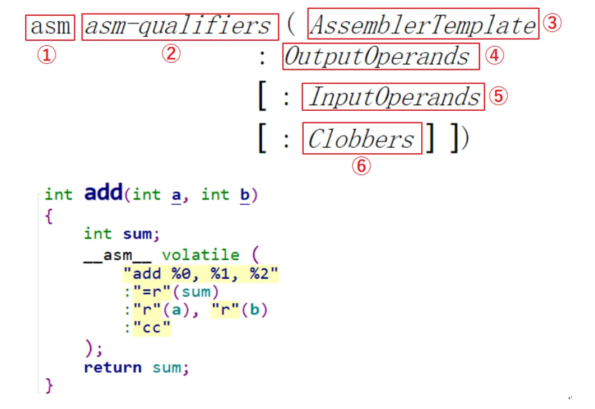  

%0，%1，%2分别代表sum，a，b。=r代表当前寄存器是存储结果用的，不要进行寄存器优化，防止结果不正确  

## 同步互斥的深入  

在单核CPU上关中断开中断是可以实现同步互斥的，但是在多核CPU上开关中断不能保证其他CPU不会修改临界变量

### 原子操作

对于ARMv6之前的内核，通过关中断恢复中断来实现原子操作，但是在v6之后(包括v6)，由于arm支持SMP(多核CPU)，因此不能简单的使用开关中断来实现原子操作，而是使用ldrex，strex汇编语句来实现，其原理是在要ldr数据上打上标记，在要str的数据上消除标记，根据能否消除标记而返回不同的值，根据值来判断是否申请资源成功，不成功的话则再次重复，直到能申请资源为止

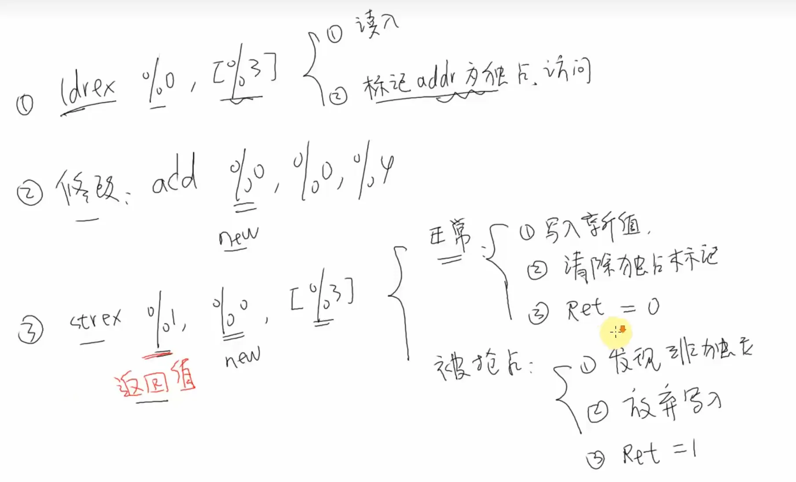  

## 锁  

### 自旋锁  

自旋锁无法休眠，当一段临界区被加上自旋锁时，如果CPU0与CPU1都竞争临界区只有CPU0获得资源的话，那么CPU1不会休眠而是会反复请求资源(当写程序时，在进中断时也要加自旋锁来防止其他CPU打断当前CPU执行irq)，因此，使用自旋锁时临界区代码要尽量精简(5行左右)，且不能休眠  

自旋锁在 **单核系统(UP)** 还可以用来禁止调度防止抢占，对于不同的自旋锁他有不同的防止抢占方式，比如对于最普通的spin_lock()而言，他只能关闭调度，而对于spin_lock_irq()而言，它可以关闭中断  

自旋锁的实现：每个自旋锁上都有当前任务编号，和当前任务编号+1的下一个任务编号，内核会检查想要申请资源的自旋锁任务编号与当前自旋锁下一个任务编号是否相同，相同的话则获得锁，否则让这个任务wfe休眠一段时间。值得注意的是，申请当前任务编号这一过程也有可能发生竞态，为了保证编号与任务是一一对应的，这里应该使用原子变量  

自旋锁的实现中，通常为每个锁维护两个变量：当前任务编号和下一个可被唤醒的任务编号。内核在判断某个任务是否可以获得锁时，会比较该任务的编号是否等于当前锁的“下一个任务编号”。若相同，任务即可获得锁；否则，它会进入 wfe（wait for event）状态等待一段时间后重试。在锁的控制方面，当一个任务想要获得锁时，内核会根据当前已经分发的编号的数量将下一个编号交给任务，任务会保存这个编号并会不停地检查内核中的下一个编号是否与手中的编号相同，如果相同就获得锁并进入临界区  
值得注意的是，申请任务编号本身也可能存在并发竞争，因此内核必须使用原子操作来确保任务编号与具体任务的一一对应关系，从而避免竞态条件


自旋锁不可递归，因为这可能会把自己死锁
  

### 睡眠锁  

睡眠锁有mutex和semaphore两种  

对于信号量来说，它可以休眠，因此对于临界区代码可以比自旋锁复杂很多，信号量用于多进程间访问同步和互斥，更多用于控制并发数量，而互斥锁用于保护某个临界资源  

在信号量结构体中，需要用到自旋锁  

semaphore的实现：semaphore结构体中有spinlock，还有个count和wait_list，count负责记录wait_list中任务的数量，有新任务申请信号量时count++，老任务归还信号量时count--。当使用spinlock_up获取semaphore时，首先需要获得spinlock，如果成功获得则需要让count++，如果失败的话让内核把该任务挂载到wait_list上并令其休眠，直到前方的任务都被执行完毕，内核会从wait_list唤醒该任务  

mutex的实现：与semaphore类似，但是由于追求效率会更为复杂，里面配置了宏开关来优化效率，通过宏可以选择等待mutex的线程是否休眠(休眠开销太大)。当进入临界区获取资源时内核也可以自动判断使用fastpath还是slowpath  

fastpath与slowpath：
当一段临界区代码很短且需要mutex时，这时大概率会出现线程不需要等待而直接获取资源，并且解锁时也不需要唤醒其他线程，这种情况称为fastpath，而需要等待获取资源且需要唤醒其他线程称为slowpath，两个的选择取决于mutex结构体中的count(是个原子变量)，count值为1时表示unlocked，此时其他线程可以获得锁，count值为0时代表locked，需要解锁，但是当前执行任务的线程解锁后不需要唤醒其他任务此时为fastpath，当count值为-1时，代表当前任务解锁后还需要唤醒其他线程，这时是slowpath  

mutex的实现比semaphore更复杂，这是因为mutex追求更高的效率，在写驱动程序的时候尽量使用mutex

## USART  

访问虚拟终端中的**前台**终端：/dev/tty0  
访问当前程序运行的终端(考虑真实的USART等终端)：/dev/tty (不会输出信息到其他tty)  

例如`echo "hello" > /dev/tty0`会始终打印hello到在前台终端，即使使用Ctrl+Alt+F1~6切换终端，打印也会出现在新切换的终端上。`echo "hello" > /dev/tty`会始终打印hello到在执行命令的那个终端，使用Ctrl+Alt+F1~6切换终端，打印就会消失  

在驱动模块崩溃时可以查看LR寄存器来找到崩溃的函数  
当驱动程序错误时，可以使用**strace  -o  log.txt ./exe**可以在log.txt里获得系统调用

### printk 

printk后面可以加上打印级别，如果不指定打印级别则会默认打印级别，当console设置的打印级别低于内核级别时则不会打印printk。如果想在多个控制台打印时，可以在设备树或者uboot指定console=tty0，console=tty1，但是只有最后指定的console会收到串口信息。实际上，uboot也是通过修改设备树来实现更改打印终端的

```shell
echo "1    4    1    7" > /proc/sys/kernel/prink
//可以修改打印级别，第一个1为console消息级别，4为默认级别
```

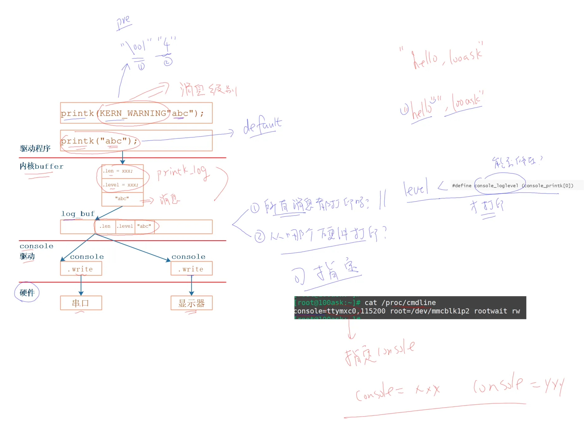

## PCI与PCIe  

为了简化CPU与外部设备通信及硬件连线使得访问外设像访问内存一样，PCI总线应运而生。有了PCI后，CPU不必关注具体的操作细节，例如不使用PCI，CPU与GPIO，I2C等设备直接相连时，程序员需要关注GPIO，I2C等设备的具体实现，而使用PCI总线时，直接访问PCI设备控制器即可，具体访问操作会由PCI硬件实现，这同时也会简化硬件的连线复杂度  
但是引入PCI总线也会导致设备地址空间分配问题，为了解决这个问题，PCI采用地址偏移量的思想：首先由CPU分配设备内存地址空间，并由PCI设备控制器维护并计算所需要的地址偏移量，待到CPU需要访问具体地址时，由PCI所记录的地址偏移量即可算出真实的物理地址，PCI地址数据线是复用的  
为了保证传输速率，PCI一开始被设计为并行总线，但由于速率提高之后并行总线会导致信号干扰，因此新的PCIe总线也诞生了，它采用了串行总线差分信号的结构，这会支持更高的速率  

在PCIe中，一对发送接收差分线称为lane，对于低速PCIe，例如PCIe转串口而言只有一条lane，对于视频音频卡而言有多条lane，两PCIe设备之间称为一条link

### PCI总线原理  

由于PCI总线为并行传输，数据地址统一不做区分的发送到AD引脚上

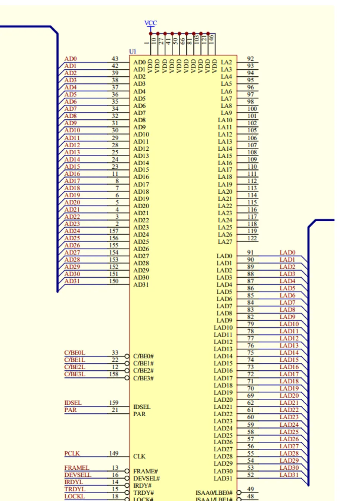

对于非桥设备而言会PCI会发出type0信号以表示访问非桥设备

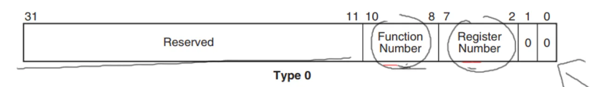

如果想设置PCI设备的地址，首先要在IDSET引脚置高电平，然后由CPU发出cpuaddr，经PCI控制器转换后得到PCIaddr，再发送type1命令并根据type0的function number设置具体的功能，最后按照register number设置寄存器的值，具体的配置项如下图，此配置项写在PCI设备的寄存器内，包含了设备ID，厂家ID以及创建设备时申请多大的PCI空间  
如果想读写PCI设备的地址，需要按照手册在C/BE引脚设置值，然后设置frame引脚，再发送type0命令，当frame引脚为低电平时遇到的第一个时钟发出的AD信号是addr，第二个发出的则是data

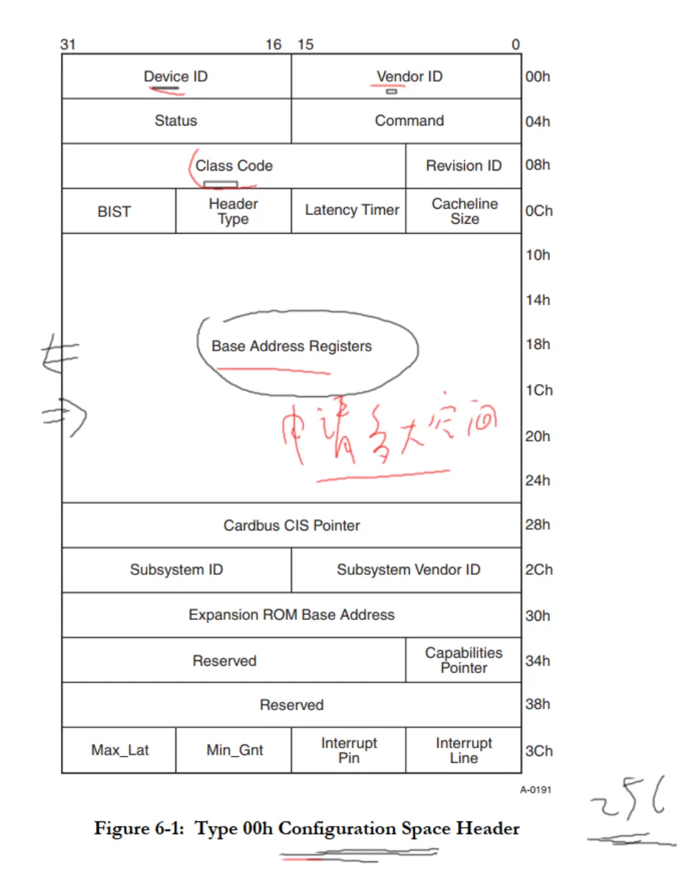

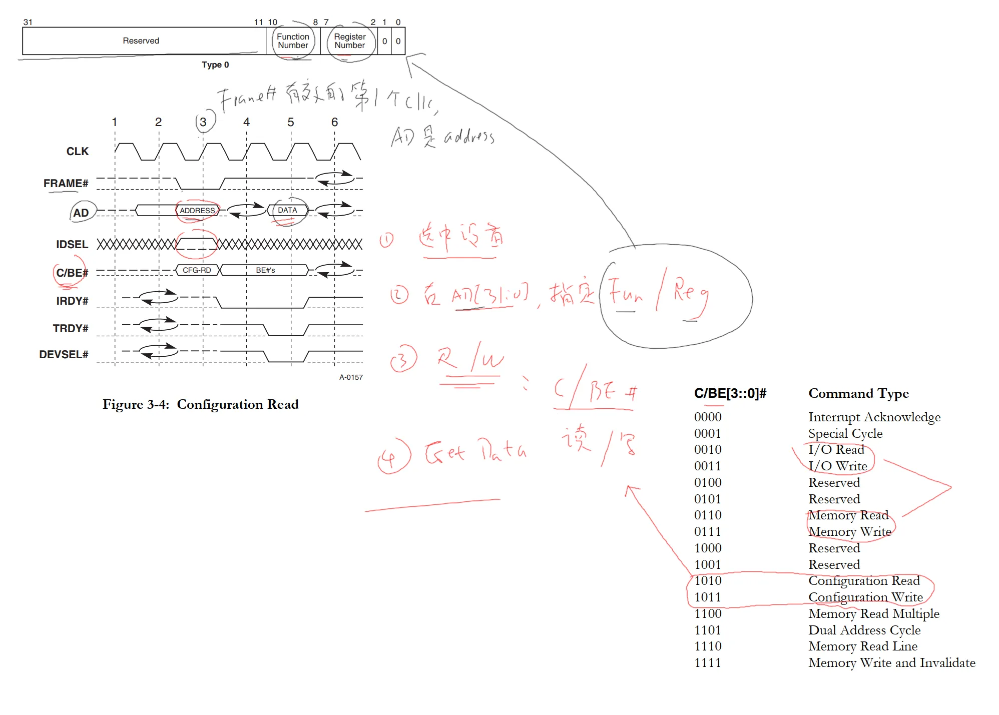

对于桥设备而言，如果需要配置PCI设备需要发送type1命令，若header type的值为01h则为桥设备，此时需要根据收到的信息检测bus number，如果在子节点找到bus number那么就转发到下一层PCI设备，如果下一层设备还是桥设备的话就继续转发，直到遇到非桥设备且是目标设备为止，然后根据发送的信息判断是配置还是读写寄存器

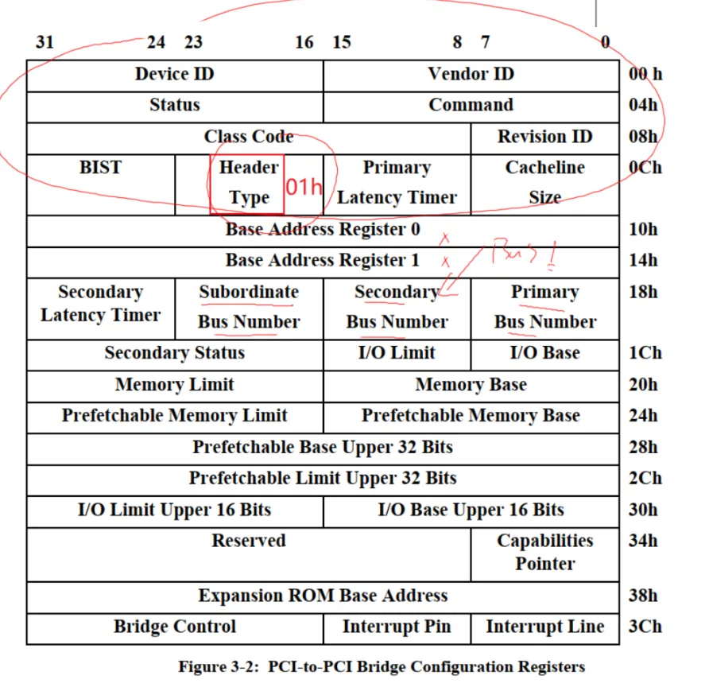

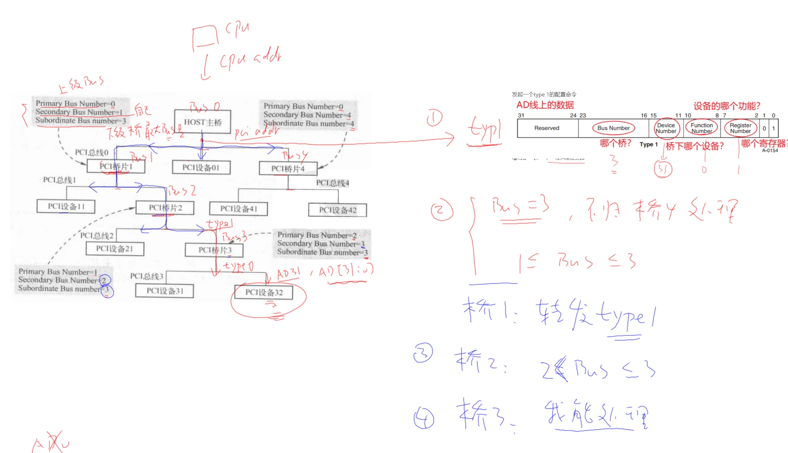

### PCIe总线原理

PCIe的配置过程(基于ID的路由方式)：  
PCIe采用深度优先的配置模式，首先由Host将配置信号发送至子设备，首先由 A设备先进行配置，A设备的上层总线号是Bus0，下层总线号是Bus1，于是A设备在其配置寄存器内记录，由于子设备数sub并不确定，A设备先令其值为255。而后再配置A的子设备C，同理将其配置为1，2，255，之后再配置D，当配置到Bus3的下层的具体设备时，会将bus，dev，fuction的值3，0，1、3，0，0记录在设备中，由于遇到了end point，所以返回至D端口，修改sub将其从255修改至3(bus的最大值)，但由于只配置了D，因此还需要配置同层的E设备，配置方式同D下面的end point。之后返回至上层C，将sub值修改为4(C设备下总线号的最大值)

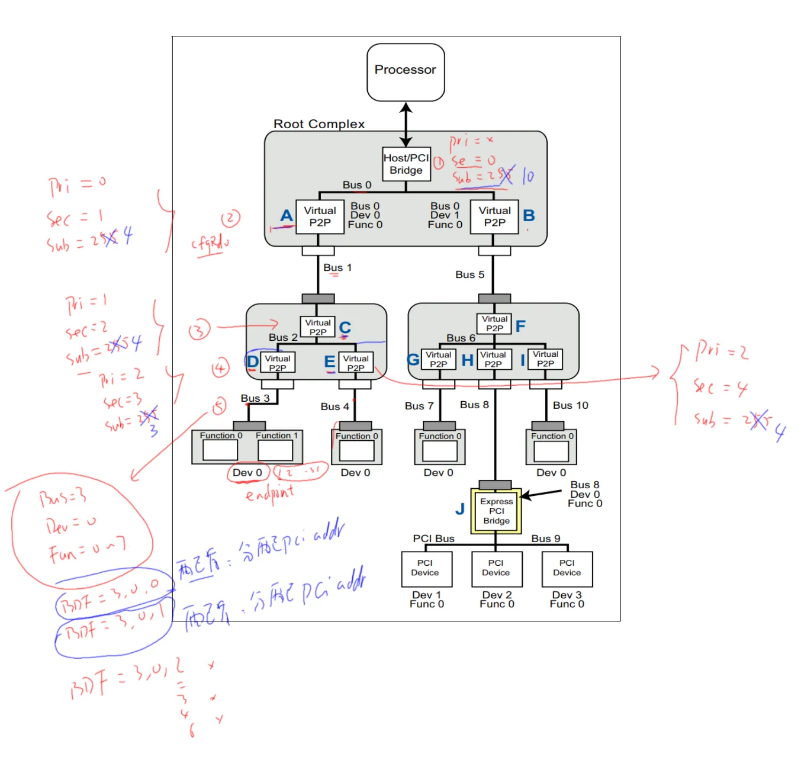

PCIe将发送数据分为三层，分别为：事务层，数据链路层，物理层，每层将上下层数据处理后传递给下一层或者上一层，具体收发数据原理如下：  

发送数据时：
* 首先由CPU发送原始数据至root complex，由rc处理数据后在事务层得到TLP
* 事务层将原始数据前加入header，数据后加入CRC校验，header内包含数据是读写数据还是配置寄存器，包装后的数据被称为TLP，处理后将数据发至数据链路层
* 数据链路层规定了数据的重传方式，为此在数据头部添加了seg段，在数据尾部添加了LCRC校验，数据处理完成后将数据发至物理层
* 物理层负责将信号拆分并发送出去

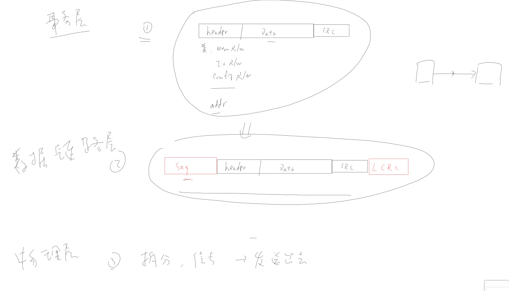

#### PCIe三种路由方式  

上述的配置使用基于ID的路由方式，所谓路由，就是如何找到通讯另一方，隐式路由指的是地址和ID这种不单独声明，而是根据type确定通讯地址  

* 物理层负责将信号接收并组合，而后发给数据链路层
* 接收方的数据链路层所做的与发送方相反，即去掉seg和LCRC，处理完毕后发送给事务层
* 同理，事务层将接收的数据，去掉CRC校验和header，从而获得原始的data  

* 配置读、配置写：使用基于ID的路由，就是使用<Bus, Device, Function>来寻找对方。配置成功后，每个PCIe设备都有自己的PCIe地址空间了。
* 内存读、内存写或者IO读、IO写：
    * 发出报文给对方：使用基于地址的路由
    * 对方返回数据或者返回状态时：使用基于ID的路由
* 各类消息，比如中断、广播等：使用隐式路由

### PCIe驱动设备模型  


## USB2.0  

* USB设备插到电脑上去，接触到的设备是什么？
    * 是USB Host hub，一个usb controller，管理所有的USB设备
* 既然还没有"驱动程序"，为何能知道是"android phone"
    * 在电脑中USB总线协议驱动程序已经写好了，USB总线根据协议知道是"android phone"
* 为什么一接入USB设备，PC机就能发现它？
    * PC的USB控制器内有下拉电阻，USB设备通过引流5v电源在Data+/Data-引脚处产生上拉电阻，使得当USB插入主机时PC的USB控制器D+引脚有电压跳变，PC通过检测引脚的电压跳变来知道是否有设备连接
* USB设备种类非常多，为什么一接入电脑，就能识别出来它的种类？
    * USB协议指定设备种类对应的描述符，通过描述符来知道设备的种类
* PC机上接有非常多的USB设备，怎么分辨它们？
    * 根据分配的编号来分辨他们
* USB设备刚接入PC时，还没有编号；那么PC怎么把"分配的编号"告诉它
    * 刚接入的设备默认编号为0，通过此编号就可以与设备通信并分配新的编号

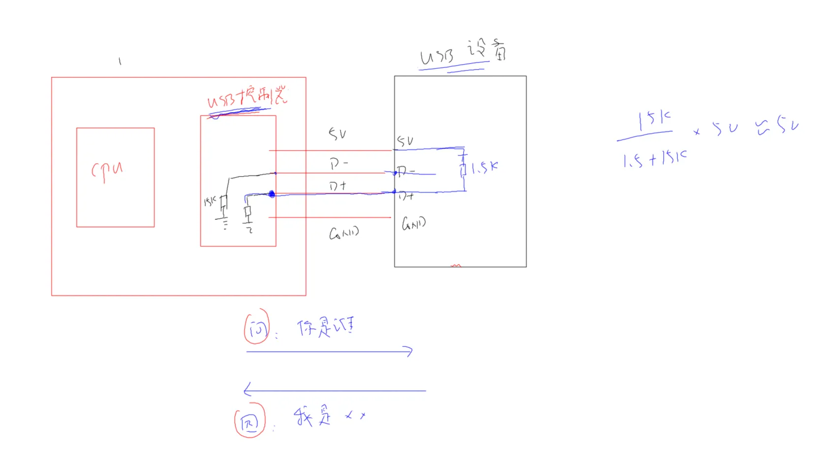

### 低速，全速与高速信号的识别  

对于USB2.0而言，支持了高速信号就不能支持低速信号，其设备速率识别方法如下
* 对于全速或低速设备而言，由于在Data+/Data-引脚处有个上拉电阻，因此PC可以通过检测Data    +/Data-引脚的电平高低来检测支持的速率，如果Data+为高电平，那么支持全速速率，Data-为高电平，那么支持低速速率
* 对于高速设备而言，如果检测到设备支持全速速率，那么就断开上拉电阻并给设备发送一个SE0信号，如果设备支持高速模式，那么就会回应一个特殊信号，主机就知道了设备支持高速模式  

工作在高速模式下的设备会断开Data的上拉电阻，这是为了保证高速传输数据时发生干扰，并且还需要在通信双方的D+/D-引脚串联一个45Ohm的电阻，如果不串联电阻，那么发送端的信号到达接收端就会反射，当下次发射信号时，上一次反射的信号会和这一次的信号叠加使信号失真，这种加电阻的方法就叫做**阻抗匹配**，我们检测高速设备是否断开连接时就是检测反射信号的强弱，当设备断开连接时，接收方相当于阻抗无穷大，会造成反射信号的增强。在开发中，如果发现设备总是断开连接也有可能是阻抗匹配没有做好

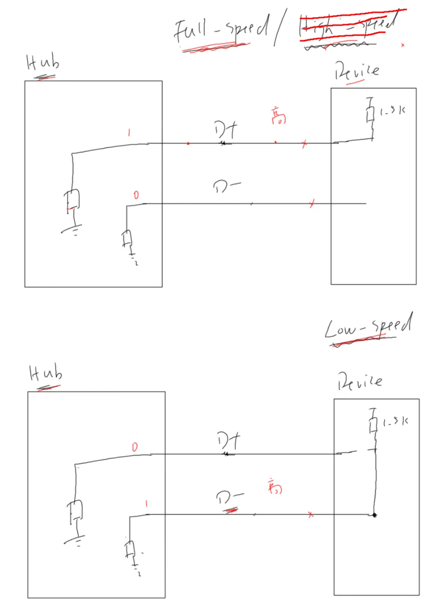

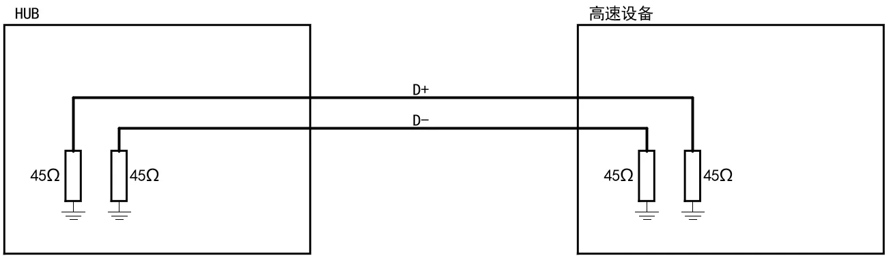

USB协议通信数据如下
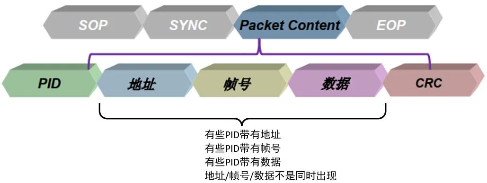

sop(start of package)，具体信号参见手册  
eop(end of package)，具体信号参见手册  
sync，同步信号，由于USB没有时钟线只有两条数据线，因此sync是为了确定通信速率的

### 数据传输特点

在数据传输方面，USB采用了NRZI(Non Return Zero Inverted Code，反向不归零编码)，NRZI的编码方式为：对于数据0，波形翻转；对于数据1，波形不变。例如对01011110为例，传输的结果是11000001，使用NRZI可以发送一串0来把时钟频率告诉对方  
位填充：由于USB没有时钟线，因此还需要考虑通信双方晶振的误差对信号的影响，例如当传输100个1时，由于晶振的误差会产生接收端接收了99个或101个1的现象，因此协议规定数据包每隔6个连续的1后插入1个0

### 协议内容

一次传输由一个或多个事务实现，事务下层根据目的不同被划分成了三种包，令牌包指明传输的对象和地址，数据包只传输数据，握手包由接收方设备发出，内容为各种应答信号。每个包内部又分为各种域(field)，sop field代表传输的开始，sync field代表传输的速率，PID filed代表传输的包的ID，根据取值不同PID被分为四类，令牌类，数据类，握手类，特殊类，令牌类用于令牌包，表明发送的是令牌类数据。在PID field后的filed就是传输的数据，为了保证数据正确还需要CRC field，在传输的末尾还要加上eop field来表明传输完成  

对于握手包而言没有Data field与CRC field  

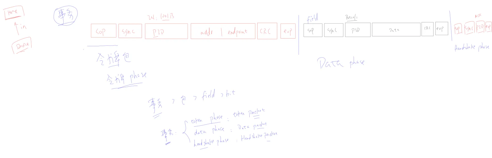

USB设备种类繁多有不同要求，这些要求可以分为下列几种
* 批量传输：对实时性要求不高，但要求传输可靠，且传输的数据量很大，例如U盘
* 实时传输：对数据量要求不大，可靠性要求也不高，但实时性要求很高，例如摄像头
* 中断传输：对可靠性和实时性要求都很高：如鼠标
* 控制传输：对设备进行控制  

对于批量传输而言，每次传输有三个阶段  
对于中断传输而言，每次传输有三个阶段，但需要Host定期访问设备请求数据以保证实时性  
对于实时传输而言，每次传输有两个阶段，去掉了握手包，类似UDP  

注意中断传输，这里的中断传输与一般意义上的中断没有关系，因为USB协议要求Host拥有总线控制权，从设备不能主动访问Host，因此中断传输只能由主设备通过轮询来模拟 

### 设备配置过程  

* 得到设备描述符
* 设置非零的新地址
* 再次获得设备描述符
* 获得配置描述符，并同时获得接口描述符和端点描述符
* 设置配置

### OTG

OTG(On To Go)，插上即用的缩写。OTG是USB2.0协议的补充，当设备使用OTG连接时，两方设备可以在不经过PC的情况下可以直接通信  

OTG通过内部硬件的上拉电阻来识别Host/Device，Host通过ID引脚的取值决定是否向Device供电，供电引脚为VBUS  

| 引脚名 |                          作用                           |
| ------ | ------------------------------------------------------ |
| VBUS   | 作为Host时，对外供电<br />作为Device时，接收外部输入的电源 |
| DM     | 数据信号                                                |
| DP     | 数据信号                                                |
| ID     | 分辨自己角色的引脚：<br />1：作为Device<br />0：作为Host  |
| GND    | 地线                                                    |  

当插入OTG接口时，id引脚(typec模式时为cc引脚)被连接，id引脚的取值被Host设备的主控芯片(arm)所决定，当arm板以Device模式通信时，由于arm芯片内部有100k的上拉电阻因此三极管是导通的，EN引脚为低电平，5v的电源不能输出，此时为Device模式。而当转换器接入板子时，转换器内部的下拉电阻会将arm的上拉电阻拉低，导致5v电源能够输出，此时arm板可以给外界设备供电，工作在Host模式

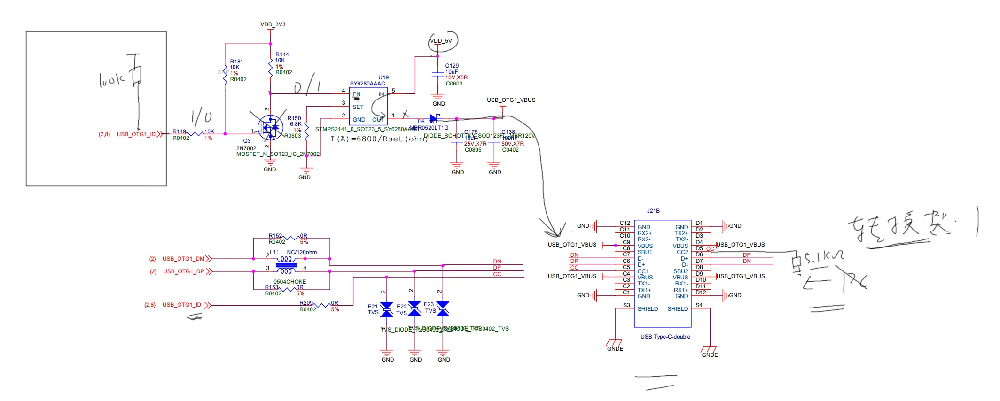

## I2C深入  

对于通用的platform_device在i2c驱动模型中被称为i2c_client


I2C驱动框架如图所示，在基础的设备总线驱动模型的基础上加入了adapter适配器，这可以使每一个I2C硬件设备支持不同的adapter使其产生不同的功能。具体的驱动编写框架如下：
* 修改设备树或者对应.c文件
* 调用i2c专用的register函数使其调用probe函数注册adapter
* 实现adapter结构体，实现master_xfer函数以作为adapter成员，master_xfer是最为关键的传输函数

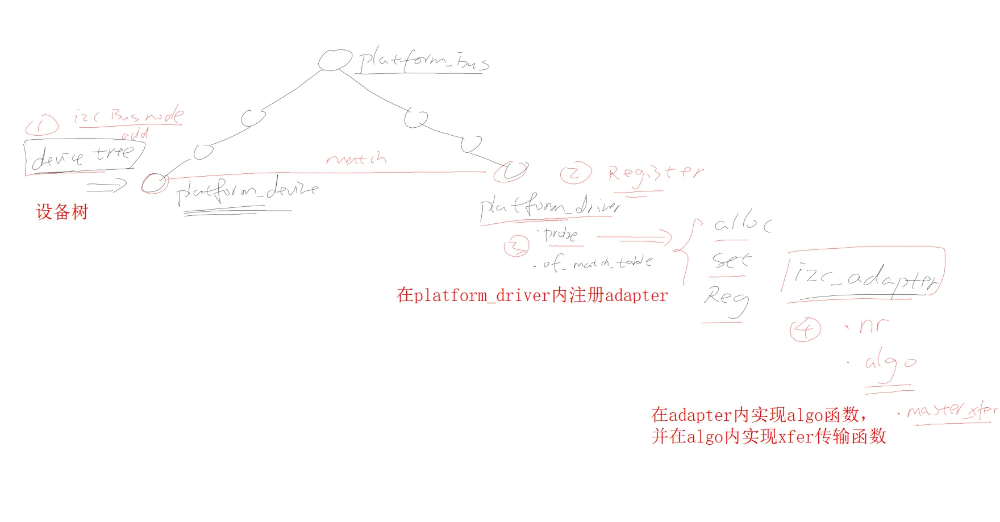

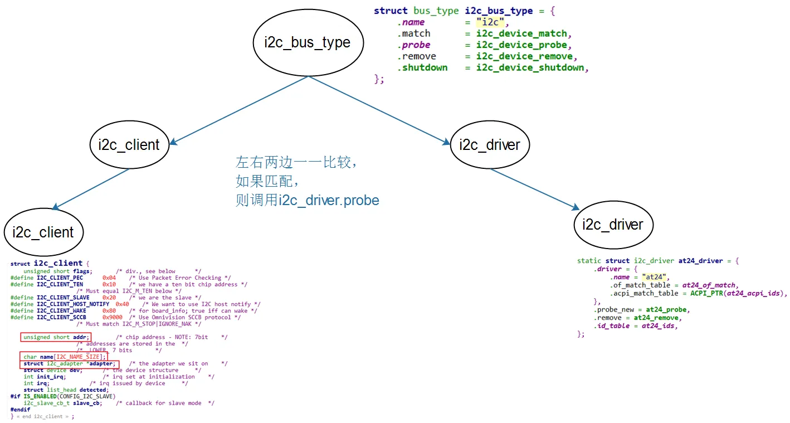

总结：
* i2c驱动注册时：
    * 由底层向高层注册，首先根据设备树的配置项注册adapter(i2c的Controller)，配置相关的时序，模式，频率等基本参数，使得芯片可以驱动i2c设备，在注册adapter的同时顺便把client注册了(cilent注册的时机是在adapter靠后的位置)，client负责具体的i2c外设，这由外设厂家编写，通过配置i2c的初始信号来访问某个固定的寄存器，确定信息传输完成后延时时间，以及对应外设芯片的寄存器配置，使得芯片可以与外设通信
    * 在adapter注册时需要的模型是platform-bus模型，内核会根据设备树中的adapter的数量来确定有几个adapter即几条总线，并根据驱动程序和设备树来两两匹配。在每次注册adapter的过程中还需要顺便注册client，它是device-bus模型。内核在注册client时会发送探测信号来扫描总线上是否存在设备，并根据设备树和驱动来两两匹配并注册进内核
* i2c驱动使用时：
    * 由高层向底层调用，当app需要访问某个设备时，首先会找到对应外设的client，根据内部client经过内核的i2c_core找到对应adapter，再找到对应的xfer发送函数来控制adapter发送到对应外设

[Linux驱动：I2C驱动学习看这一篇就够了](https://www.eet-china.com/mp/a228520.html)

## SPI深入  


spi框架与i2c极为相似，只不过原本在i2c中的adapter变成了master，需要配置的重点由adapter.xfer变为了master.transfer
  

SPI驱动程序设备树框架：
* 对于SPI控制器而言，如果使用platform_bus的match函数匹配到了platform_device与platform_driver的话就会调用SPI控制器的probe函数注册生成一个spi_master，除此之外还会由设备树生成一个spi_device
* 内核从上面得到的spi_device解析，并调用match函数来检测spi设备驱动spi_driver是否匹配，如果匹配就调用SPI设备的probe函数注册生成一个字符设备以及file_operation结构体

对于SPI控制器而言可以扩展多个设备，具体可以看设备树文件  
由于SPI控制器与SPI设备分别由内核解析，并且采用了分离的思想，因此在写SPI设备的驱动程序时需要调用Linux提供的函数接口来引入SPI控制器的资源，尤其是spi_master.transfer函数

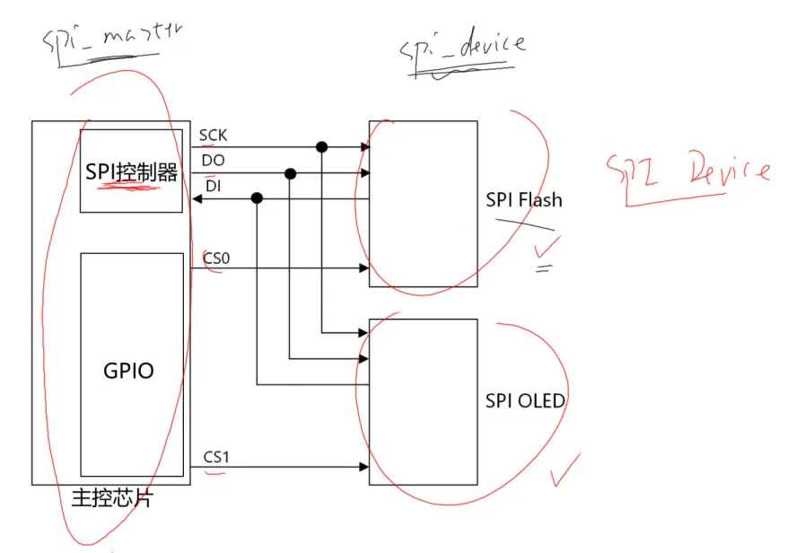

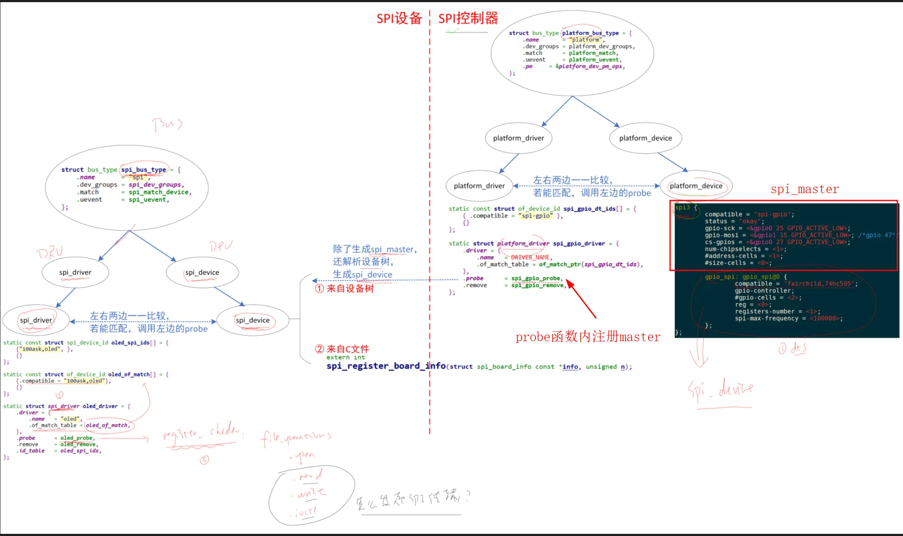

在SPI子系统一个transfer对应一个传输，为了管理多个传输采用了链表结构，SPI控制器的驱动程序spi_master内部有一个queue，每一个具体设备spi_device都会生成一个message并挂载到queue，每一个message会有多种transfer，这些transfer会挂载到message上

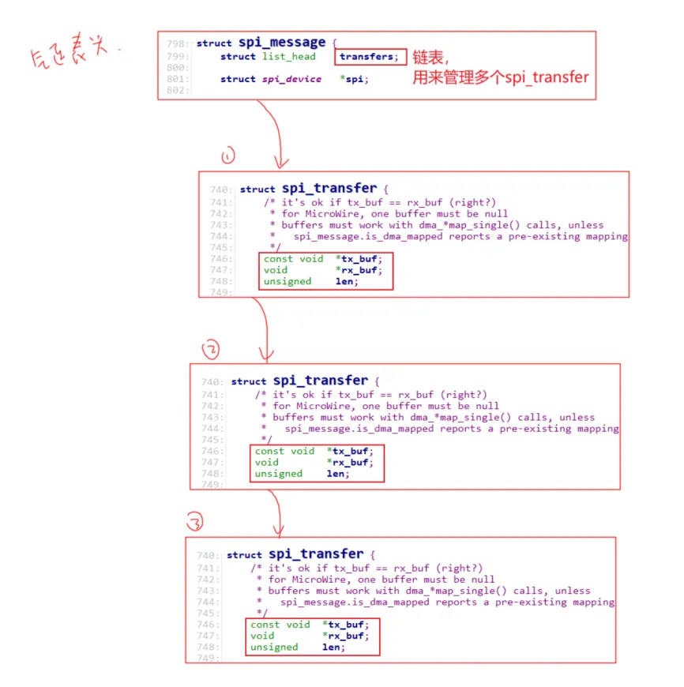

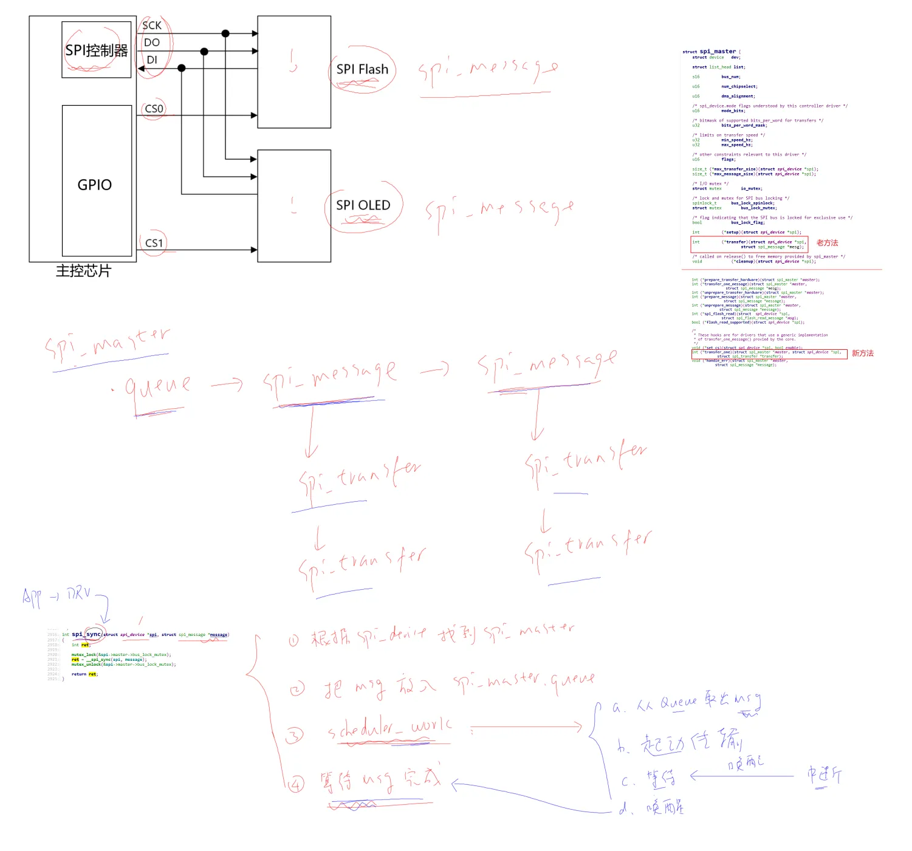

新方法的spi_master的驱动程序，使用方便但规矩多，支持同步异步传输

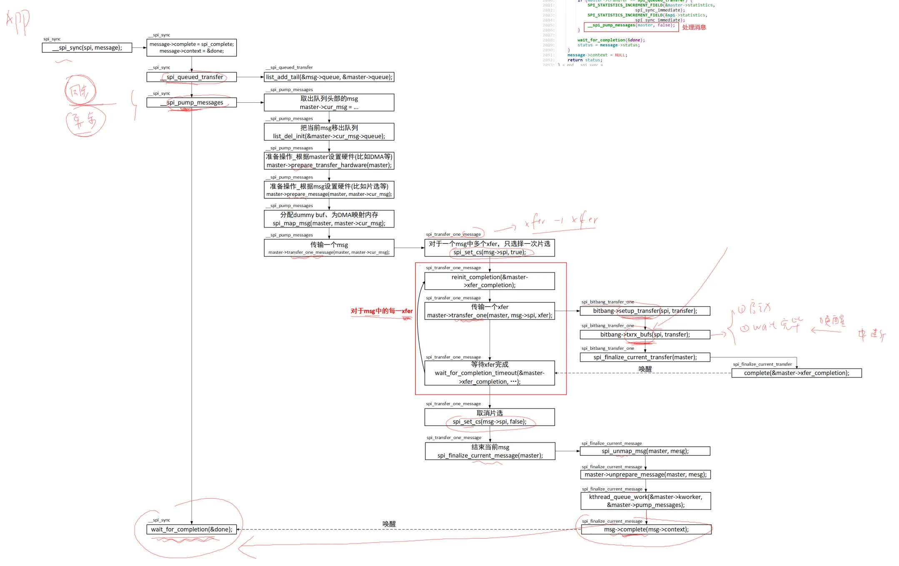

老方法的spi_master的驱动程序，使用繁琐规矩少，支持同步异步传输

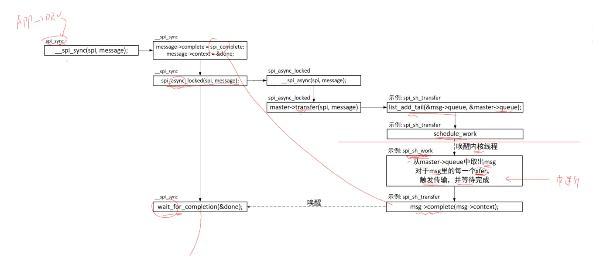

## GPIO深入  

GPIO Controller驱动是GPIO编程的核心，其他LED，Button驱动程序只是调用GPIO Controller驱动的函数，对于LED，Button驱动程序只需要调用内核的GPIO lib库即可，我们编写控制器驱动程序的时候也只需要将驱动注册进GPIO lib库

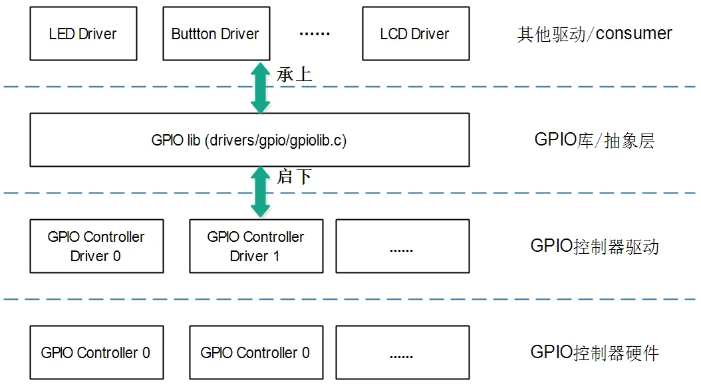

一个GPIO Controller对应一个GPIO device结构体，其内部有chips(相当于fop)，desc(描述单个引脚的数组指针，内部描述了引脚的高低电平，输入输出模式等)，base(引脚基地址等)

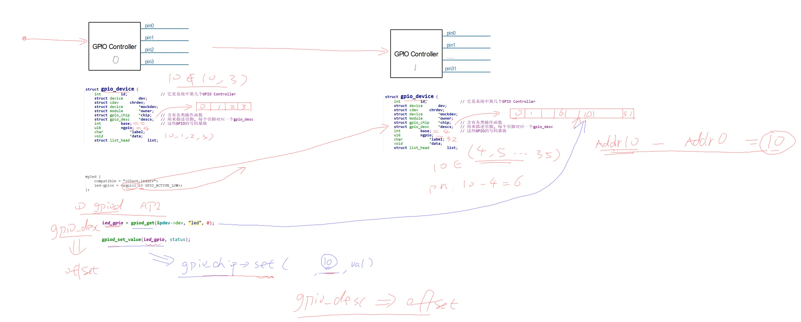

Pinctl子系统会统一管理引脚，GPIO引脚与Pinctl引脚的映射统一在设备树中管理

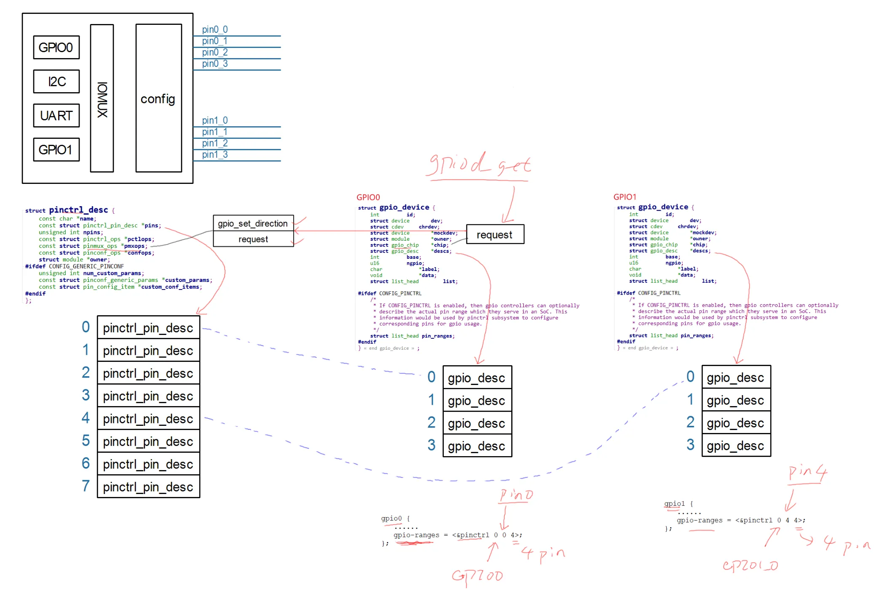

## Pinctl深入  

使用设备树时分为Pinctl Controller与Client

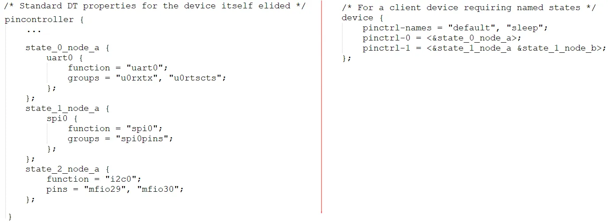

每一个Pinctl Controller都会使用Pinctl device来描述，Pinctl Controller有三大功能：引脚配置，复用及命名，三者统一在pinctrl_dev.pinctrl_decs结构体中实现  
如果写Pinctl Controller驱动，则需要实现pinctrl_decs，并使用pinctrl_register注册

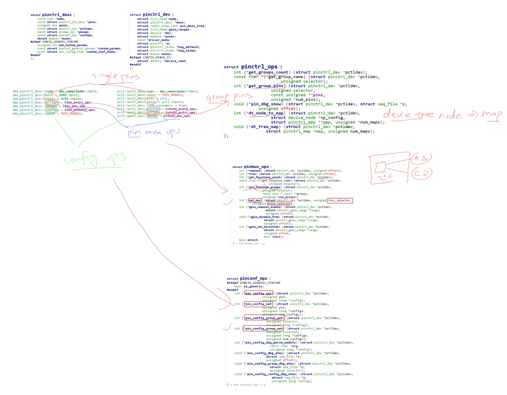

platform_device从设备树中解析得到，里面会构造一个dev.dev_pin_info结构体，内部的pinctrl与pinctrl_state结构体储存了设备树中节点的信息

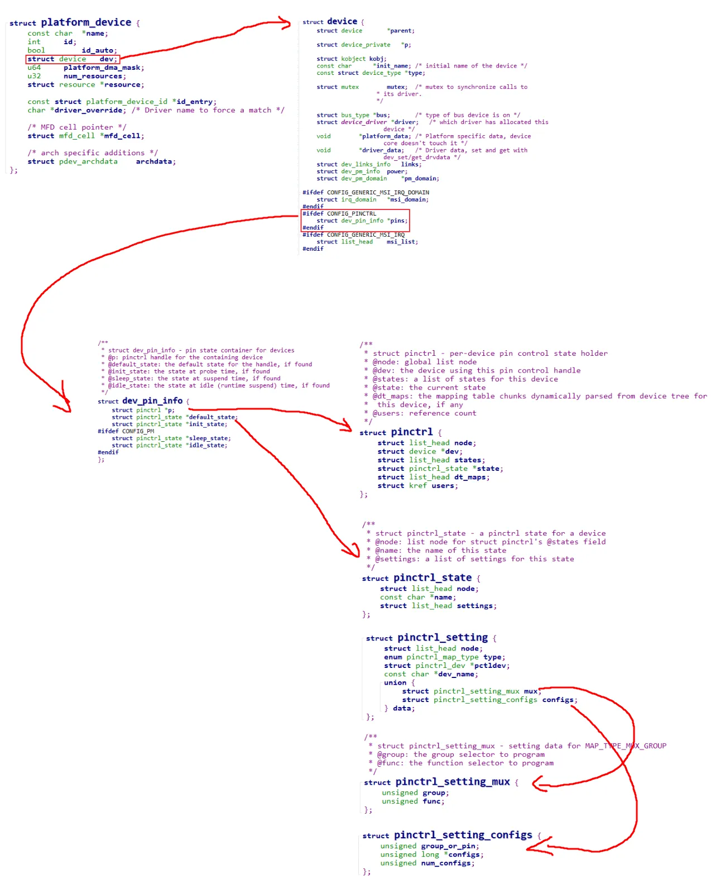

Pinctl Controller下的子节点会被内核解析成一个个pinctrl_map，然后被转换为成一个个pinctrl_setting挂载到pinctrl_state，client就可以从pinctrl_state结构体中获得设备树信息

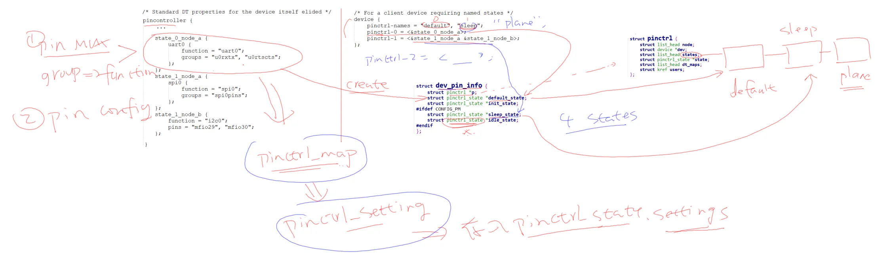

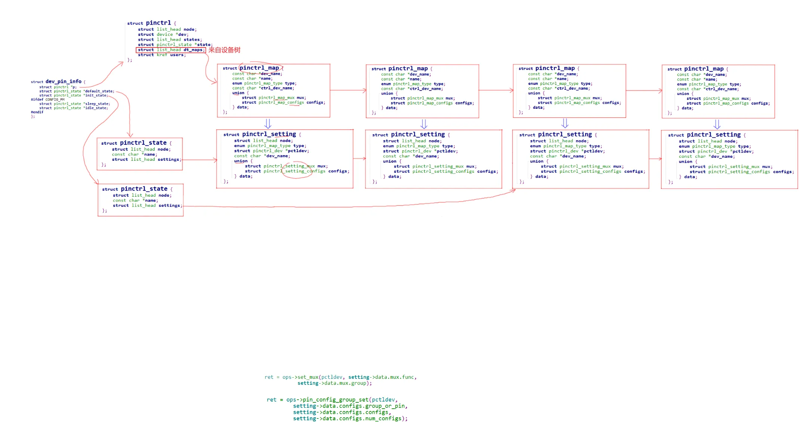

