# Linux基础


基础的Linux应用与驱动开发

<!-- more -->

# Linux


## Linux基础  

shell负责解析命令，当用户在shell中输入命令时，根据输入的结果，shell根据PATH环境变量的位置找到相应的程序执行，因此可以通过将.o文件复制到PATH来直接在任何目录下执行程序，否则只能使用绝对路径或相对路径的方式来执行


[]代表可选参数 <>代表必选参数

### Linux基础命令与操作  
        
. 当前目录 .. 上一级目录 - 切换前上一次的目录
```shell
cd .. 返回到上一级目录
cd - 返回到切换前上一次的目录
rm -r 递归删除
touch existfile 修改文件更改时间
```

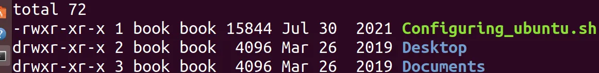  

拥有文件权限的组分别为：book用户，book用户所在组的其他用户，其他用户

```shell
file 文件名 查看文件详细信息
chmod 777 赋予所有权限
chmod a-x filename 去除所有用户的x权限
chmod u+x filename 加上拥有者的x权限

chown 用户组:用户组 filename 改变文件的拥有者
su 用户名 切换用户

find 目录名 选项 查找条件
find directoryname -name "*1.txt*" 在directoryname下找到包含为1.txt的文件

grep 参数 "字符串" 文件名 
grep -rwn "abc" * 在当前目录中查找含有abc字符串的文件，查找模式是，递归的(r)，整词的(w)，找到行号(n)

ifconfig 查看网络
```


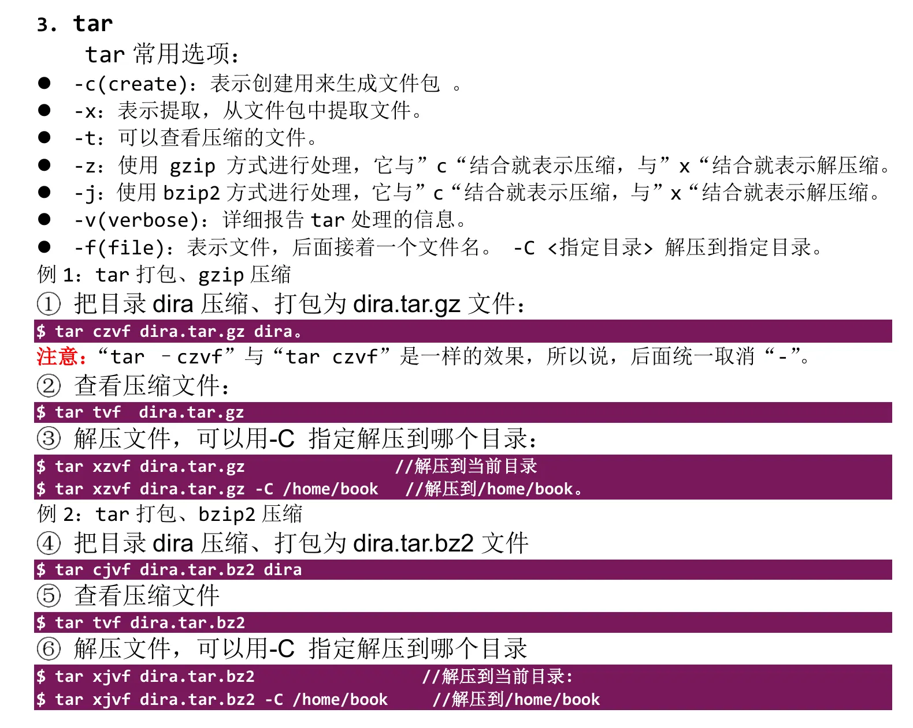  

tar命令
```shell
tar cjf filename.tar.bz2 filename 文件使用bzip2压缩算法压缩
tar czf filename.tar.gz filename 文件使用gzip压缩算法压缩

tar xjf filename.tar.bz2 文件使用bzip2压缩算法解压
tar xzf filename.tar.gz 文件使用gzip压缩算法解压 
```

## Linux环境搭建  

为了能够便捷配置环境以及工具链，我们需要在Linux环境下进行开发，因此我们就需要选择**Ubuntu虚拟机作为我们的服务器**，为了能够将Ubuntu上编译后的程序在开发板上也能运行，我们需要配置**交叉编译环境**，为了开发板与Ubuntu能够传输文件，我们需要**设置网口，配置ip，开启nfs服务**，由于我们是小白，为了能够使用win下的笔记，截图工具，我们需要win下的通信工具mobaxterm，同时我们**需要保证win，Ubuntu，开发板能够互相通信** 

网络拓扑如下
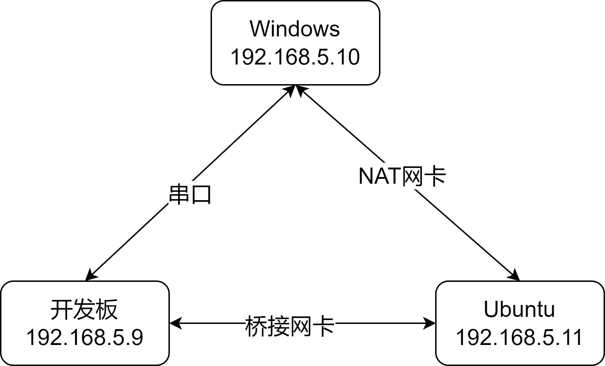

### 设置NAT以及桥接网卡  

NAT网卡可以保证Ubuntu可以上网，NAT实现Ubuntu与Windows网络互通
桥接网卡保证Ubuntu可以与开发板互通

* 默认ip：
    * 开发板 192.168.5.9
    * windows 192.168.5.10
    * Ubuntu 192.168.5.11  
    
### 开启NFS  

NFS(net file system)，为了方便开发板与Ubuntu之间通信，可以设置开启NFS

* 开启步骤
    * 在Ubuntu中开启开发板访问Ubuntu的权限，在/etc/export中加入要共享的文件夹
    * 开启NFS服务
    * 在开发板中挂载Ubuntu中的某个目录(默认为/home/book/nfs_rootfs)到/mnt下  
    
### 交叉编译环境的使用  

* 环境变量有三种方式可以修改
    * 永久修改：
        * 修改`/etc/environment`，添加对应的目录，对所有用户有效
        * 修改`~/.bashrc`，在行尾添加`export PATH=$PATH:对应的目录`，并执行`source ~/.bashrc`，只对当前用户有效
    * 临时设置：
        * 在终端执行`export PATH=$PATH:对应的目录`，但只对当前终端有效

由于开发板使用的是arm架构，虚拟机使用的是x86架构，且环境、资源基本不同，因此为了能够使由Ubuntu编译后的文件在开发板上使用，需要配置交叉环境编译链，百问网使用脚本自动配置，我们只需在编译时使用这些编译工具即可  

如果没有使用交叉编译链编译文件，在开发板上执行时会提示格式错误

### IMX6ULL工具链  

IMX6ULL工具链有两种分别为arm-buildroot-linux-gnueabihf-gcc 与 arm-linux-gnueabihf-gcc，前者工具链较全，包含了zlib等库，后者较为精简，有的库没有包含

### 编译第一个应用程序  

在Ubuntu上执行`arm-buildroot-linux-gnueabihf-gcc -o hello hello.c`使得编译后的文件能够在开发板上执行  

### 编译第一个驱动程序  

由于驱动程序依赖内核，因此必须有内核的源码且内核必须编译过，这样驱动程序才能根据配置编译过的内核而运行
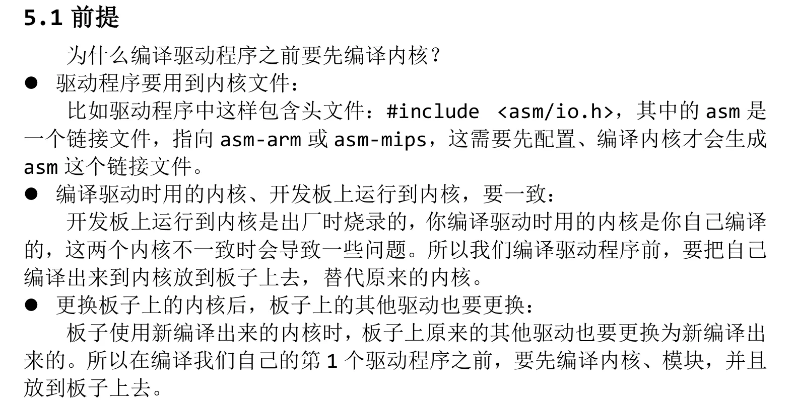

步骤如下：
1. 准备好内核，设备树，并编译
2. 将编译后的文件拷贝到nfs文件夹下，以便开发板能够访问
3. 编译驱动模块，将驱动模块安装在nfs文件夹下
4. 将挂载在开发板的/mnt下的内核，驱动程序放在/boot下，将编译产生的lib放在开发板的lib下
5. 执行sync命令，以便将内存中的内容刷写到flash上
6. 重启开发板，这样就诞生了一个自己编译内核的，驱动的开发板

## Linux应用开发基础  

在int  main(int argc, char** argv)中，编译执行输入`./filename command`时argc是2，argv[0]是filename，argv[1]是command，argv的值可以传进函数做参数

* 引用的头文件在哪？
    * 在工具链的系统目录，或者编译时-I指定目录

* 头文件和库文件的区别
    * 头文件是文本文件，可供阅读，库文件是二进制文件，不可阅读，因此库文件有一定的保密性
    * 头文件在编译阶段使用，库文件在链接阶段使用
    * 头文件一般只包括声明，库文件包括了内部实现
    * 头文件是手动编写的，库文件是生成的  
    
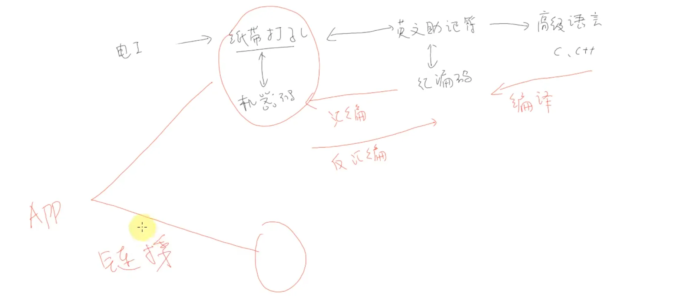  

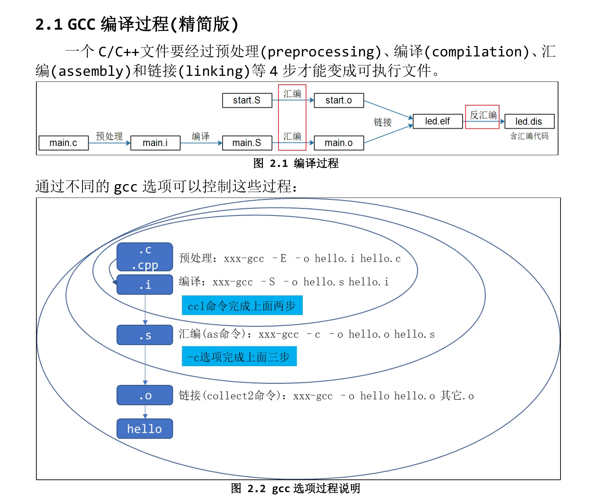  

### GCC

#### GCC操作  

gcc(g++) <options> <sourcefile>
    options
        -o<filename>                    指定文件名
        -fexec-charset=GBK            指定运行时编码
        -finput-charset=UTF-8        指定源文件编码
        -Wall                                    输出警告信息
        -O(0-3)                                 指定代码优化等级(0为不优化)
        -I                                          指定文件目录来查找头文件(一般为./)
        -L                                         指定文件目录来查找库文件(一般为./)
        -v                                         输出编译的信息 
        
#### 编译过程  

* 预处理阶段    (-E，得到.i文件)（巧记：ESC，iso）
    * 处理#include预编译指令，将被包含的文件直接插入到预编译指令的位置
    * 处理所有的条件预编译指令，比如#if，#else，#endif，#ifdef等
    * 预处理器将所有的#define删除，并且展开所有的宏定义
    * 删除所有的注释
    * 添加行号和文件标识，以便编译错误时提供错误或警告的行号
    * 保留所有#pragma编译器指令
```shell
gcc -E -o hello.i hello.c
```
    
* 编译阶段    (-S，得到.s文件)
    * 将预处理后的file.i文件进行语法词法分析，翻译成文本文件file.s
```shell
gcc -S -o hello.s hello.i
```

* 汇编阶段    (-c，得到.o文件)
    * 得到二进制机器码文件，生成各个段，生成符号表
```shell
gcc -c -o hello.o hello.s
```    

* 链接阶段    (gcc file.o)    
    * 将链接文件链接到file.o文件中
    * 静态链接：内存开销大，速度快。将所有需要的函数的二进制代码拷贝到可执行文件中去
    * 动态链接：内存开销小，速度慢。不需要将所有需要的函数的二进制代码拷贝到可执行文件中去，而是记录一系列符号和参数，在程序运行或加载时将这些信息传递给操作系统，操作系统将这些动态库加载到内存中，然后当程序运行到指定代码时，去共享执行内存中找到已经加载动态库可执行代码，最终达到运行时链接的目的  
    
```shell
gcc -M hello.c    打印hello.c的依赖
gcc -M -MF hello.d hello.c    输出hello.c的依赖到hello.d文件内
gcc -c -o hello.o hello.c -MD -MF  hello.d    编译hello.c并输出依赖到hello.d文件
```  

**为了防止编译大型项目后再对其中某一个文件修改而重新编译整个系统，可以采用先编译大型项目，最后再链接**

使用"include"文件代表去当前目录下查找库文件
使用<>include文件代表去工具链目录下查找库文件

静态库以.a结尾，动态库以.so结尾

## Makefile    

* 如何判断哪个文件被更改了？
    * 比较源文件与输出文件的时间，如果源文件更新的话，那就意味着源文件已经被修改了  
    
```makefile    
#makefile核心：规则

#目标：依赖1 依赖二...
#[TAB]命令  
#下列目标文件test由a.o b.o链接生成
  
test:a.o b.o
    gcc -o test a.o b.o
    
a.o:a.c
    gcc -c -o a.o a.c

b.o:b.c
    gcc -c -o b.o b.c
```

通配符：
    \*： 任意字符，但对于目标文件，优先使用%代替\*
    $：取值
    @：目标值，@后加shell命令可以不显示命令但输出结果
    $@：目标文件
    $<：第一个依赖文件
    $^：所有依赖文件
$(shell 命令)可以执行shell命令    
假想目标文件：.PHONY 用于当目标文件与make命令重名时使用，用法：在makefile文件末尾加上.PHONY: 命令

A = xxx 变量赋值
$(A) 变量取值
= 延时变量，makefile分析完成整个文档后才会对变量赋值，没有写程序时的类似顺序执行的逻辑
:= 即时变量，类似写程序时的顺序执行的关系，需要在当前行之前声明定义变量
?= 在此行之前就已经定义变量时该语句无效，类似#ifndef
+= 附加，并不是加，是延时变量还是即时变量取决于前文
    
$(foreach var,list,text)    在list中的每一个var，都换为text
$(filter pattern,text)    在text中取出符合pattern的值
$(filter-out pattern,text)    在text中取出不符合pattern的值
$(wildcard pattern)    在已存在的文件中取出符合pattern的值
\$(patsubst pattern,replacement,\$(var))    在var中取出符合pattern的值，并替换为replacement
CFLAGS 这个变量可以后加gcc的编译选项

## 文件IO和标准IO

Linux是参照Unix制作出来的，为了使App能够在Linux与Unix上都能运行，Linux就需要实现与Unix相同的接口，这套接口统称为**POSIX接口**(posix Portable Operating System Interface for uniX)，任何支持POSIX标准的操作系统都支持文件IO

* 文件IO，IO函数包括read/open/write，每次调用的时候都会直接进入内核，实现了POSIX接口的APP可以在Linux，Unix上运行
* 标准IO，IO函数包括fread/fopen/fwrite，是为了解决App读写数据时频繁进入内核而诞生的，通过App自身的buffer来减少访问内核的次数从而提高效率，标准IO是从POSIX接口封装出来的，标准IO函数包括fread/fopen/fwrite。同时，如果使用了标准IO开发App，经过编译后还可以Windows上运行  
    
文件IO的内部原理是：open，read等函数在访问文件资源时，需要从用户空间转移到内核空间，此时函数的内部实现会抛出异常，也就是触发软中断，将svc或swi设置为0，对应的异常编号会放在R7寄存器(arm64架构放在R8)，而后转到内核，调用sys_call_table处理异常，这样当CPU处理异常时就知道异常的具体行为

glibc将系统调用标准IO封装出了fread/fopen/fwrite，不仅自带缓冲区，更可以增加代码移植性

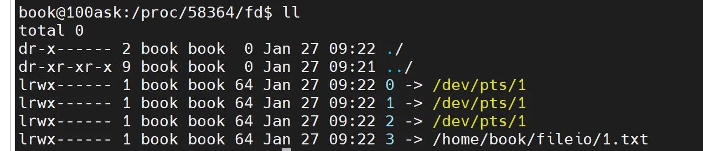  

文件0代表stdin，以后scanf等操作产生的信息将会发送到此处
文件1代表stdout，以后printf等操作产生的信息将会发送到此处
文件2代表stderr，以后perror等操作产生的信息将会发送到此处
文件3代表文件句柄信息

:::alert-info
如果用同一个open程序打开不同的文件，返回的文件操作符有可能值相等，这是为什么呢？原因在于，即使文件操作符相等，但是open程序处理的文件也处于**不同的进程**且有独立的进程号，因此有不同的**文件句柄空间**，这样，文件操作符相等也没有关系。而当不同的句柄指向同一个文件结构体时，这两个句柄也不会相互干扰，例如当一个文件中内容是123，同一个进程读两次这个文件每次读一个字符时，由于两次读文件返回的是不同的句柄，指向file结构体中的f_pos彼此独立，这样读两次的内容分别为1，1，而不是1，2。若想文件句柄相互关联，可以使用dup(fd)函数复制某个文件句柄，这样，对应句柄指向的file结构体中的f_pos也会被复制下来，于是可以读出1，2了。
:::

### 文件IO的内部机制  

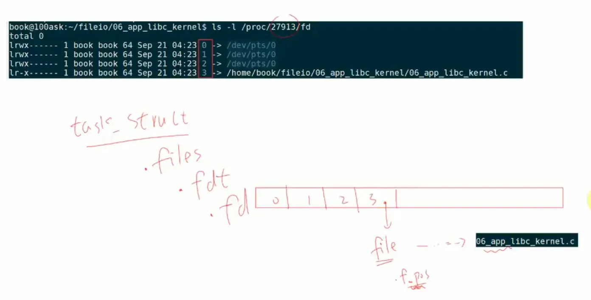  
内核中有task结构体，其中包含了files结构体，files内还有fdt(fdtable)结构体，fdt内部有fd数组，这个数组储存了文件操作符与文件的关系，fd中每个元素都指向了一个file结构体，这样在不同task内即使fd的值相同，所指向的文件也会不同

### open函数  

具体open函数用法和原理见 man 2 open

```c
/* 打开文件名为argv[1]的文件，以读写模式打开(O_RDWR)，如果没有这个文件就创建这个文件(O_CREAT)，如果文件存在，且权限是读写的话就清空文件(O_TRUNC)，设置文件访问权限为664 */
fd = open(argv[1],O_RDWR |  O_CREAT | O_TRUNC, 0664); //0代表8进制
```

### write函数  

相关函数均可以 man 2 fun

```c
/* 文件指针移到当前位置之后的第9个字符，打开文件时，默认指针位于文件开头 */
lseek(fd, 9, SEEK_SET); 
/* 对fd文件写not字符串，3为写字符串的长度，第二个参数也可以是argv，这样的话长度使用strlen()来获取 */
write(fd, "not", 3);
/* 上面的结果是覆盖写 */
```

### read函数

```c
/* 对文件读sizeof(buf)-1个内容，并存在bbuf中 */
read(fd, buf, sizeof(buf)-1);
```
当读一个文件时，是从f_pos位置开始读的，f_pos由内核维护，每读一次文件都会更新f_pos的值

### dup函数  

```c
/* 将文件句柄复制一份 */
new_fd = dup(fd)
```
使用dup后，文件句柄被复制，对应的f_pos也被复制，下次使用new_fd打开文件时，文件指针就是f_pos的位置  

```c
/* 将old_fd重定向到new_fd，使用dup2后，可以将new_fd的io重定向到old_fd */
dup2(old_fd, new_fd)
/* 可以将stdin重定向到1.txt中，这样在shell内打印的结果就不会显示，而是输出到1.txt */
dup2(1_txt_fd,1)
```
## framebuffer  

bpp(bits per pixel)

framebuffer是一个由驱动程序分配的在内存中的一段区域，其中存储了每个像素的颜色，具体由LCD的硬件控制器实现，值得注意的是写framebuffer到LCD执行会有一定的延迟，尽管肉眼看不到  

framebuffer有不同的bpp(bits per pixel)，一般而言有以下几种  
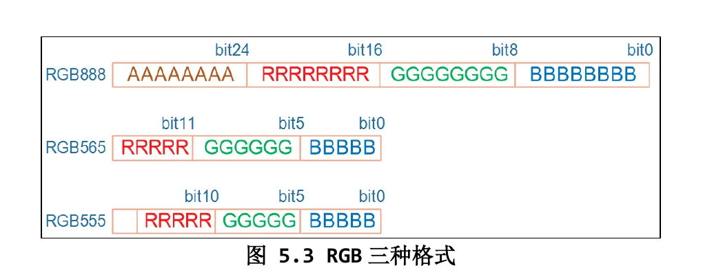  

由于framebuffer由驱动掌管，因此读写framebuffer时需要使用mmap函数映射到用户空间

如果将32bit的像素转换为16bit的像素，则需要将RGB的高n位保留，舍弃掉低n位

### fork调用  

fork只进行页表项的拷贝，对于物理地址的拷贝放在cow时

* fork执行的时候，会有两个返回值，一个是父进程的返回值，一个是子进程的返回值
* 在父进程中fork的返回值是子进程的PID
* 在子进程中fork的返回值是0
* fork失败，返回值为-1


```c
#include <stdio.h>
#include <unistd.h>
 
int main(int argc, char *args[])
{
	pid_t id = fork();
	if (id > 0)
		printf("father id = %d\n", id);
	else
		printf("son id = %d\n", id);
	return 0;
}

//结果如下

[negivup@negivup mycode]$ gcc -o main main.c
[negivup@negivup mycode]$ ./main
father id = 12467
[negivup@negivup mycode]$ son id = 0
```

## 文本及图像显示  

### 文本显示  

文本显示 = 编码 + 字体

ASCII定义了128个字符，因此在7bit位上始终为0
ASNI由Windows提出，包含了ASCII，根据7bit位是否为0来判断该字是否为ASCII，若不为ASCII，则需要使用两个字节表示一个字，并且之后还需要选定字符集
Unicode不需要判断字符集，主要分为UTF-16 和 UTF-8两种，UTF-16根据大小端模式分为2种，每种效率相比UTF-8较低，因此主流使用UTF-8编码  

对于UTF-8，内部保存了长度信息，因此即使某部分字节信息丢失也不会影响整体信息  
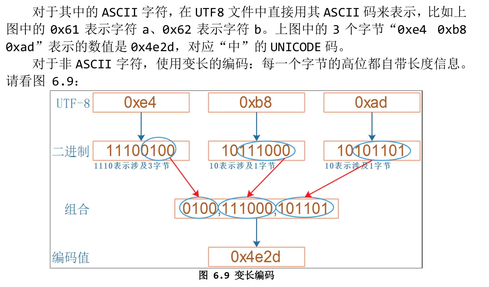  

若要显示矢量位图文字，需要使用freetype库，注意编译freetype时还需要freetype的依赖

## Linux应用输入系统编程的四种方式  

* 对于Linux来说，输入设备多种多样，Linux把所有的输入设备的输入数据处理成3种：
    * type：哪类事件？比如EV_ABS类
    * code：哪个操作？比如ABS_X
    * value： 值  
    
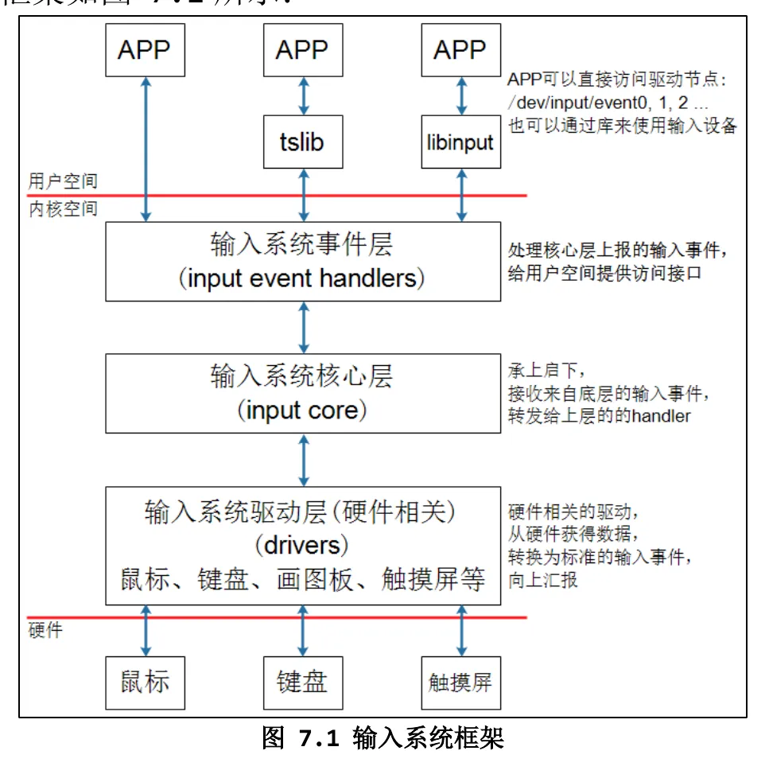
内核中使用input_event结构体来上报三种数据，除此之外，结构体还有时间信息
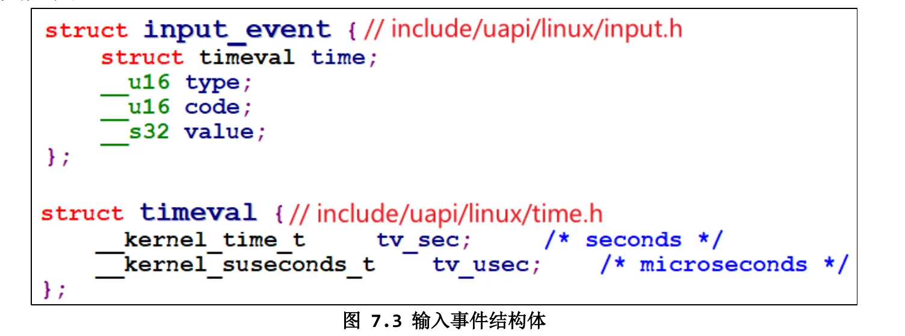  

当type，code，value都为0时，代表已经获得了完整的数据，也称为同步事件，同步事件用来分隔普通事件  

输入系统支持的API操作：阻塞，非阻塞，poll/SELECT，异步通知

### 阻塞非阻塞方式访问硬件  

默认文件API是阻塞执行的，除非在API中或上 O_NONBLOCK，当阻塞执行时，任务收不到数据将会不断的查询，直至硬件产生数据，当非阻塞方式访问硬件资源时，任务如果得不到硬件数据就会休眠，直至内核将其唤醒
```c
if (argc == 3 && !strcmp(argv[2], "noblock"))
{
	fd = open(argv[1], O_RDWR | O_NONBLOCK);
}
```

### poll/SELECT方式访问硬件  

APP主动访问硬件数据的通信方式，与阻塞非阻塞方式的区别是poll函数支持超时时间，poll函数还可以监测多个文件
poll与select区别在于，select单个进程的连接数有限制，由`FD_SETSIZE`宏定义，而poll由链表实现，对于连接数没有限制

```c
struct input_event event; //存放ioctl获得的数据
struct pollfd fds[1];
nfds_t nfds = 1;

...

while (1)
{
	fds[0].fd = fd;
	fds[0].events  = pollIN; //想要在硬件中读取数据
	fds[0].revents = 0; //存放poll函数的返回值
	ret = poll(fds, nfds, 5000); //5000为超时时间
	/* 检查poll是否正常、不超时的返回 */
	if (ret > 0)
	{
	    /* 检查返回事件是否是预期的pollIN事件 */
		if (fds[0].revents == pollIN)
		{
			while (read(fd, &event, sizeof(event)) == sizeof(event))
			{
				printf("get event: type = 0x%x, code = 0x%x, value = 0x%x\n", event.type, event.code, event.value);
			}
		}
	}
	else if (ret == 0)
	{
		printf("time out\n");
	}
	else
	{
		printf("poll err\n");
	}
}
```

### 异步通知  

硬件产生数据了主动通知APP的通信方式

通知流程：
1. 编写信号处理函数，当硬件给APP发消息时会自动执行此函数
2. 注册信号处理函数，使用signal函数在内核中注册信号处理函数
3. 打开驱动设备
4. 把进程ID告诉驱动，这样驱动才能通知指定APP
5. 使能驱动FASYNC位，此位控制驱动是否应该发送消息给应用  

```c
void my_sig_handler(int sig)
{
	/* Todo */
}

int main()
{
    /* 注册信号处理函数 */
    signal(SIGIO, my_sig_handler);
	
	/* 打开驱动程序 */
    fd = open(argv[1], O_RDWR | O_NONBLOCK);
    
    /* Todo */
    /* Todo */
    /* Todo */
    
    /* 把APP的进程号告诉驱动程序 */
	fcntl(fd, F_SETOWN, getpid());
	
	/* 使能"异步通知" */
	flags = fcntl(fd, F_GETFL);
	fcntl(fd, F_SETFL, flags | FASYNC);
}
```

### 同步异步阻塞非阻塞  

只有同步才分阻塞非阻塞，非阻塞指的是当进行数据交换时才阻塞，而等待数据交换时为非阻塞。阻塞指的是全过程都阻塞  

异步不分阻塞非阻塞(他本身就是非阻塞的)

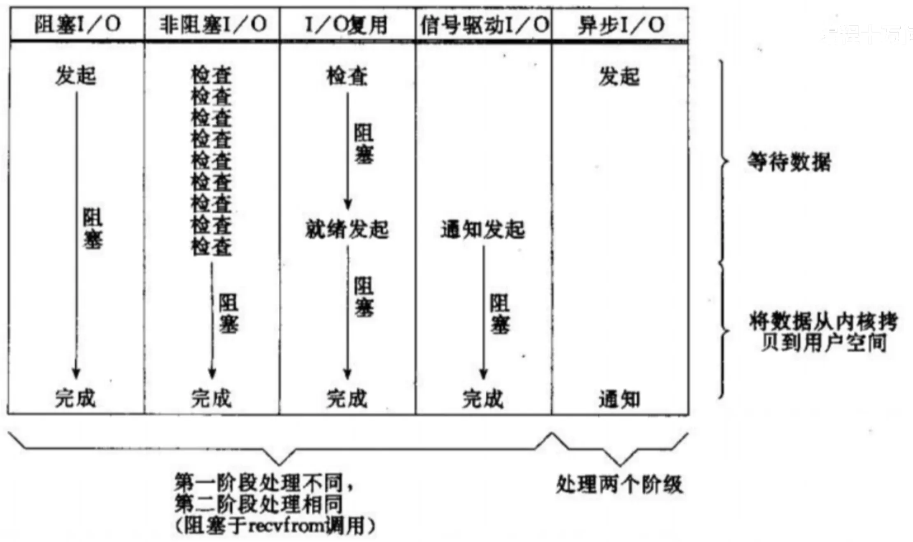

## 网络编程  
  
本课程主要讲授TCP与UDP编程，其他网络编程可自行查找资料
TCP是一种可靠的，有连接的网络通信方式，UDP是一种不可靠的，无连接的网络通信方式，相比UDP，TCP会检查双方通信数据是否送达，若不送达还会进行等待操作，对延迟敏感的可能需要考虑是否使用TCP传输数据

### TCP编程  

|                                                                                                   服务器                                                                                                   |                                                                                客户端                                                                                 |
| ---------------------------------------------------------------------------------------------------------------------------------------------------------------------------------------------------------- | -------------------------------------------------------------------------------------------------------------------------------------------------------------------- |
| **int socket(int domain, int type,int protocol);** socket的返回值类似句柄，它负责表明通讯所需要的协议族及协议，函数内需要填入domain（通讯协族），type（通讯协议），protocol（由于通讯协议已经指定了，因此此处可以填0） | **int socket(int domain, int type,int protocol);** 用法及参数同服务器                                                                                                  |
| **int bind(int sockfd, struct sockaddr \*my_addr, int addrlen);** bind负责连接socket产生的句柄和服务器参数的信息，比如在my_addr结构体内传入端口，ip，协议族信息                                                   |                                                                                                                                                                      |
| **int listen(int sockfd,int backlog);** listen负责监听端口是否被访问，它需要bind之后的socket文件描述符，而backlog指的是最多允许多少个客户端连接端口                                                               |                                                                                                                                                                      |
| **int accept(int sockfd, struct sockaddr \*addr,int \*addrlen);** accept负责接收客户端的连接请求，addr填入bind的**客户端结构体**的地址，这样服务器才能知道客户端的具体信息                                         | **int connect(int sockfd, struct sockaddr * serv_addr,int addrlen);** connect负责连接服务器，sockaddr填入**客户端结构体**的地址，这样才能让服务器知道连接的客户端的具体信息 |
| **ssize_t recv(int sockfd, void \*buf, size_t len, int flags);** recv负责接收客户端数据，它需要一个buf来存储数据，len可以使用strlen来获取，flag一般填0                                                           | **ssize_t send(int sockfd, const void \*buf, size_t len, int flags);** 用法及参数类似服务器                                                                            |

### UDP编程  

|                                                                                                                                                         服务器                                                                                                                                                          |                                                                      客户端                                                                       |
| ----------------------------------------------------------------------------------------------------------------------------------------------------------------------------------------------------------------------------------------------------------------------------------------------------------------------- | ------------------------------------------------------------------------------------------------------------------------------------------------ |
| **int socket(int domain, int type,int protocol);** 同TCP                                                                                                                                                                                                                                                                | **int socket(int domain, int type,int protocol);** 用法及参数同服务器                                                                              |
| **int bind(int sockfd, struct sockaddr \*my_addr, int addrlen);** 同TCP                                                                                                                                                                                                                                                 |                                                                                                                                                   |
| **ssize_t recvfrom(int sockfd, void \*buf, size_t len, int flags, struct sockaddr \*src_addr, socklen_t \*addrlen);** 由于TDP是非连接型网络通讯协议，因此不需要listen和accept函数，但是向服务器传输数据时必须指明客户端的ip地址，因此在接收数据时，服务器需要定义一个struct sockaddr \*src_addr结构体来储存客户端的本机ip，端口等信息 | **ssize_t sendto(int sockfd, const void \*buf, size_t len, int flags,const struct sockaddr \*dest_addr, socklen_t addrlen);** 用法及参数类似服务器 |

## 多线程编程

在Linux中，调度的单位是线程，资源分配的单位是进程  

互斥量用于多线程中临界资源的互斥访问，不能控制线程执行的先后顺序
信号量用于多线程中程序先后执行顺序的控制

```c
/* 创建线程 */
int pthread_create(pthread_t *thread, const pthread_attr_t *attr,void *(*start_routine) (void *), void *arg);

/* 线程主动退出 */
void pthread_exit(void *retval);

/* 线程被动退出 */
int pthread_cancel(pthread_t thread);

/* 线程资源回收(阻塞方式)，即使用上面两个函数后，调用此函数会回收系统分配给这个线程的资源，并获得线程的返回值 */
int pthread_join(pthread_t thread, void **retval);

/* 线程资源回收(非阻塞方式) */
int pthread_tryjoin_np(pthread_t thread, void **retval);

/* 初始化互斥量 */
int pthread_mutex_init(phtread_mutex_t *mutex, const pthread_mutexattr_t *restrict attr);

/* 互斥量加锁/解锁 */
int pthread_mutex_lock(pthread_mutex_t *mutex);
int pthread_mutex_unlock(pthread_mutex_t *mutex);

/* 互斥量加锁(非阻塞方式) */
int pthread_mutex_trylock(pthread_mutex_t *mutex);

/* 互斥量销毁(非阻塞方式) */
int pthread_mutex_destory(pthread_mutex_t *mutex);

/* 初始化信号量 */
int sem_init(sem_t *sem,int pshared,unsigned int value);

/* 信号量 P/V 操作(默认为阻塞操作) */
int sem_wait(sem_t *sem);
int sem_post(sem_t *sem);

/* 信号量申请(非阻塞方式) */
int sem_trywait(sem_t *sem);

/* 信号量销毁 */
int sem_destory(sem_t *sem);

/* 创建和销毁条件变量 */
int pthread_cond_init(pthread_cond_t *cond, pthread_condattr_t *cond_attr);//cond_attr 通常为 NULL
int pthread_cond_destroy(pthread_cond_t *cond);

/* 等待条件变量 */
int pthread_cond_wait(pthread_cond_t *cond, pthread_mutex_t *mutex);//需要与互斥锁共同使用

pthread_mutex_lock(&g_tMutex);
// 如果条件不满足则,会 unlock g_tMutex
// 条件满足后被唤醒,会 lock g_tMutex
pthread_cond_wait(&g_tConVar, &g_tMutex);
/* 操作临界资源 */
pthread_mutex_unlock(&g_tMutex);

/* 通知条件变量 */
int pthread_cond_signal(pthread_cond_t *cond);

```

### 条件变量与信号量  

条件变量与信号量的区别：
* 使用条件变量可以一次唤醒所有等待者，而信号量不能
* 信号量始终有一个值（状态），而条件变量是没有值的
* 信号量的意图在于进程间同步，条件变量意图在于线程间同步

## 串口编程  

UART共有4根线，RX，TX，GND，VCC，默认情况下是低位先行
TTL电平为0V\~5V，RS232为-12V\~12V，在转换时不仅仅是买个转接口，还需要注意是否购买电平转换芯片  

* 开发板UART发送数据流程：
    * 开发板从内存中读入数据，并将数据载入FIFO
    * 移位寄存器从FIFO中获得数据，将数据通过TX口发送出去

### TTY  

tty(teletype，电传机)，以前电脑庞大又昂贵，多个科研院所通过多个硬件终端(tty)共用一台计算机。随着科技发展，现在的计算机可以通过一台硬件终端(键鼠+显示器)来模拟多个虚拟终端

tty0代表位于前台的那个终端，因此，只要将信息发给tty0，无论位于哪个tty，都会收到信息。
在当前shell中访问/dev/tty就可以知道当前shell使用的是哪个tty  

由于历史原因，现在的UART驱动程序都放在了tty中

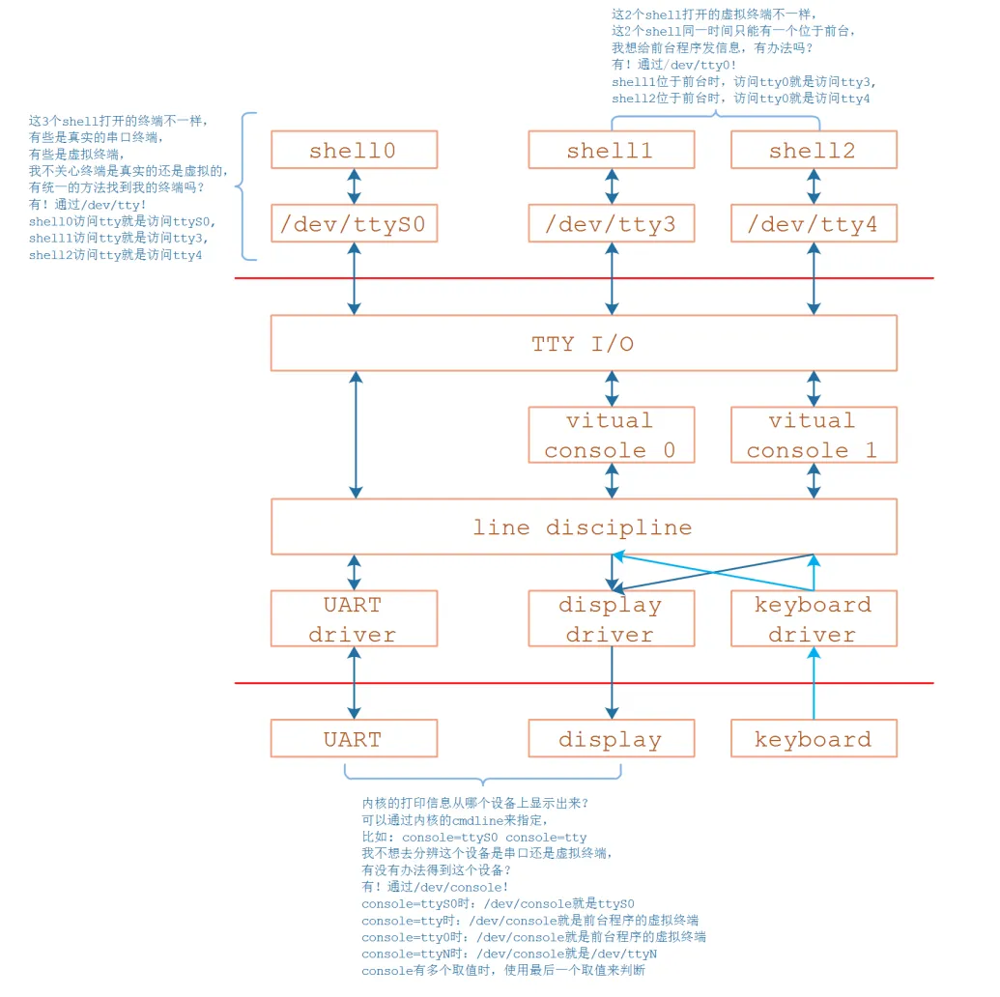

console(控制台)，可以理解为权限更大的终端

当PC机发送lsa+退格键+回车键命令给arm板时，首先l通过UART被发送给arm板的UART，而后经过UART Driver处理后发送给**line discipline(行规范)**，可以将行规范理解为一个缓冲区，行规范发现l是一个普通字符，于是将l保存在缓冲区中并回显给PC机：首先由行规范将l发送给UART Driver，而后由UART Driver处理将l通过UART发送给PC机，再经由PC机的UART Driver处理后发送给屏幕，此时完成回显。s，a字符同理，但当发送退格键时，行规范会执行退格操作，将缓冲区的a字符清除，之后再次回显。最后当PC发送回车键时，行规范将缓冲区的所有数据发送给APP(此时是shell)，由shell处理后的结果通过串口发送给PC机

需要注意的是，默认情况行规范会自动处理数据，在UART外接其他模块时(比如GPS)，需要将行规范的数据处理模式改为RAW，默认不处理数据，并且还要设置一有数据就返回
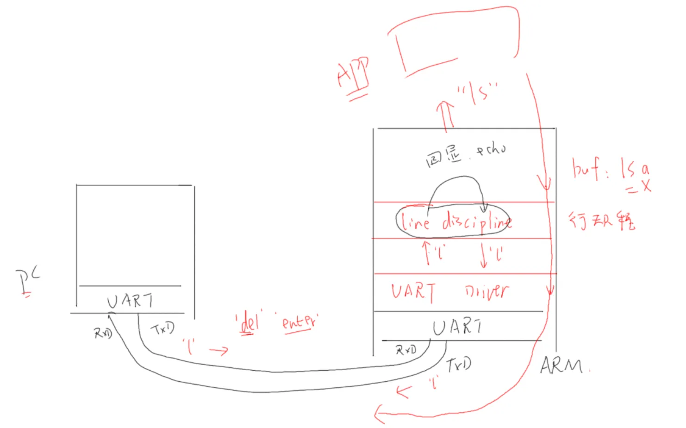


## I2C编程  

i2c高位先行
写操作由7位地址位+1位读写方向位构成，读写方向位中0代表写，1代表读
为了防止主从设备一个输出高电平一个输出低电平导致短路，而又因为主从设备均操控SDA，SCL，因此i2c的采用了弱上拉结构
一旦设备接收到信息了，那么就意味着设备需要驱动三极管使上拉电阻接地，这样ACK信号永远是低电平信号

Linux中，主设备使用i2c_adapter结构体表示，里面保存了需要的传输函数，以及自己位于第几条i2c总线，从设备使用i2c_client结构体表示，里面保存了设备地址，需要与第几条总线的主设备连接，传输时使用i2c_meg结构体保存传输数据，里面有从机地址，数据的buf

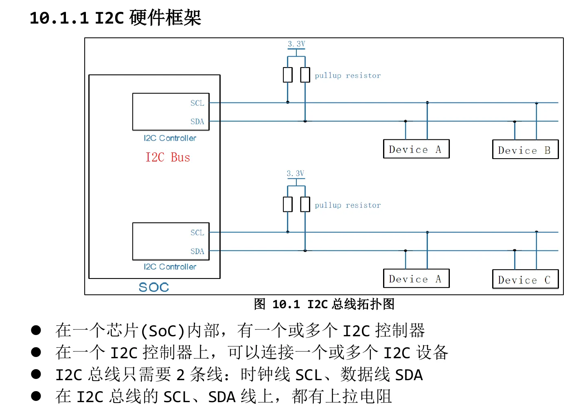

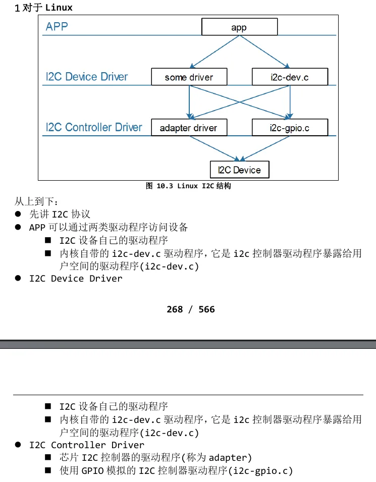

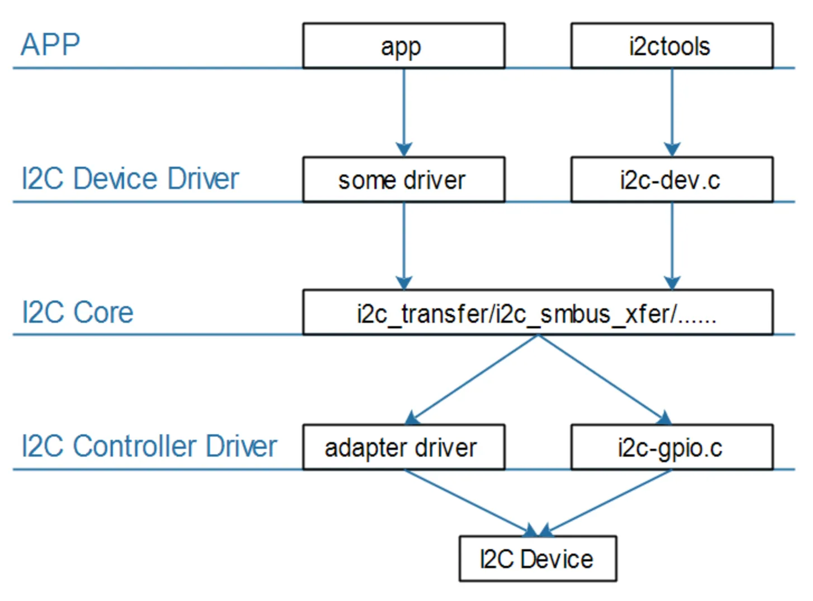

在I2C通讯中，从硬件上来说每个I2C芯片都有若干个I2C Controller(I2C Bus)，与之对应的我们在软件上需要实现若干个adapter(也可以用gpio模拟i2c实现)，但是不同的i2c协议的设备需要与之对应的通讯规则(读取某个寄存器代表开始传输)，因此对于at24芯片来说，我们还要实现与之对应的驱动，这在上图中来说就是I2C Device Driver层。I2C Controller Driver层与I2C Device Driver层之间的Core层由内核实现，简便了我们对应用程序的编写 

驱动调用关系：
```c
i2c_client
    addr
    i2c_adapter
        nr
        i2c_algorithm
            master_xfer
```


## SMB协议

SMB协议是i2c的子集

相比i2c，协议增加了
* 对电压的规定：
    * I2C 协议：范围很广，甚至讨论了高达 12V 的情况  
    * SMBus：1.8V~5V
* 最小时钟频率、最大的 Clock Stretching(某个设备需要更多时间进行内部的处理时，它可以把 SCL 拉低占住 I2C 总线)
    * I2C 协议：时钟频率最小值无限制，Clock Stretching 时长也没有限制
    * SMBus：时钟频率最小值是 10KHz，Clock Stretching 的最大时间值也有限制
* 地址回应
    * I2C 协议：没有强制要求必须发出回应信号
    * SMBus：强制要求必须发出回应信号，这样对方才知道该设备的状态：busy，failed，或是被移除了
* 重复起始条件
    * I2C 协议：读写寄存器时，需要发送停止信号p，再发送起始信号s
    * SMBus：规定了重复起始条件，节省了重复操作
* SMBus有低功耗版本  

Linux推荐使用SMBus，即使从设备缺少硬件支持，Linux也有软件模拟SMBus的功能 

# Linux驱动开发基础  

## 驱动开发的原则  

只提供功能不提供策略，这意味着驱动开发只提供基础的查询，休眠唤醒，poll，寄存器封装等机制，但是对于这些函数怎么使用则由APP决定

## 驱动的框架  

实现驱动的步骤如下：
1. 指定主设备号major，如果为0则代表让系统自动分配
2. 实现具体驱动的相关函数，如open/read/write/close等操作，并将操作保留在`file_operations`结构体中
3. 在设备初始化函数(也称为入口函数)中调用`register_chrdev`以及`class_create`函数注册设备并在`sysfs`下创建设备类，并调用`device_create`去寻找`sysfs`下的设备，若找到新设备那么就在/dev/下创建设备
4. 在设备退出函数(也称为出口函数)中依次调用`device_destroy`，`class_destroy`，`unregister_chrdev`函数注销设备
5. 准备其他信息如`module_init`，`module_exit`等函数来初始化第4步的函数，使用`MODULE_LICENSE("GPL");`来表明协议(内核驱动强制开源，应用驱动可以不开源)  

:::alert-info
驱动代码中没有主函数，并且编译时需要与内核一起编译
:::

:::alert-info
对于与linux很相似的rtthread而言，register与unregister是将设备挂载到设备管理器的链表上或将其在设备管理器的链表上移除，但这一操作并不会申请或回收初始化设备时申请的内存空间。而creat与destory是将设备完全从内存中移除，这个操作会申请或回收内存空间
:::

### 最简单的LED驱动程序  

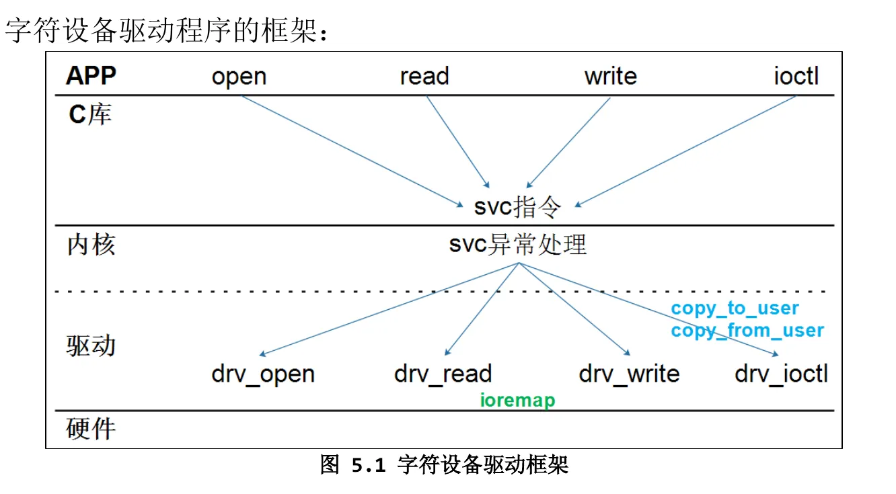

```c
dmesg | grep filename.c //可以获得在内核中打印的信息，用于检测驱动设备是否正常运行
```

对于读写硬件的驱动程序，具体操作如下
1. 指定主设备号major，如果为0则代表让系统自动分配
2. 实现具体驱动的相关函数，如open/read/write/close等操作，并将操作保留在`file_operations`结构体中，**同时还需要将寄存器的读写操作在具体函数中实现**
3. 在设备初始化函数(也称为入口函数)中调用`register_chrdev`以及`class_create`函数注册设备并创建设备类，并调用`device_create`在/dev/下创建设备，**并且还需要使用`ioremap`函数来映射硬件地址到虚拟地址中**
4. 在设备退出函数(也称为出口函数)中依次调用`device_destroy`，`class_destroy`，`unregister_chrdev`函数注销设备，**并且还需要使用`iounmap`来解除映射**
5. 准备其他信息如`module_init`，`module_exit`等函数来初始化第4步的函数，使用`MODULE_LICENSE("GPL");`来表明协议(内核驱动强制开源，应用驱动可以不开源)  

## 驱动设计的思想  

### 面向对象  

`file_opration`结构体中有函数指针，可以使用指针来进行操作  

### 分层  

```c
/*************************在下层的驱动文件中定义，直接操作硬件*******************/
static struct led_operations board_demo_led_opr = {
	.num  = 2,
	.init = board_demo_led_init,//这个结构体赋值了.h文件中的结构体，并将返回值付给了get_board_led_opr
	.exit = board_demo_led_exit,
	.ctl  = board_demo_led_ctl,
};

struct led_operations *get_board_led_opr(void)
{
	return &board_demo_led_opr;
}

/***********在.h文件中定义作为接口，上下层的驱动文件都要包含这个头文件***********/
struct led_operations {
	int num;
	int (*init) (int which); /* 初始化LED, which-哪个LED */
	void (*exit) (int which); /* 取消初始化LED, which-哪个LED */
	int (*ctl) (int which, char status); /* 控制LED, which-哪个LED, status:1-亮,0-灭 */
};

struct led_operations *get_board_led_opr(void);

/*************************在上层的驱动文件中定义，注册驱动*******************/
struct led_operations *p_led_opr;

p_led_opr = get_board_led_opr();//从.h文件中得到接口的地址

static int led_drv_open (struct inode *node, struct file *file)
{
	int minor = iminor(node);
	p_led_opr->init(minor);
}

static ssize_t led_drv_write (struct file *file, const char __user *buf, size_t size, loff_t *offset)
{
	struct inode *inode = file_inode(file);
	int minor = iminor(inode);
	/* 根据次设备号和status控制LED */
	err = copy_from_user(&status, buf, 1);
	p_led_opr->ctl(minor, status);
}

//给Linux内核的fop函数
static struct file_operations led_drv = {
	.owner	 = THIS_MODULE,
	.open    = led_drv_open,
	.read    = led_drv_read,
	.write   = led_drv_write,
	.release = led_drv_close,
};
```

驱动程序分为boarda.c，boardb.c，以及上层的drv.c，在前两者中，只进行寄存器和内存映射操作，是单片机的延续，后者是进行注册驱动等操作  

### 分离  

除了上下层分层外，有的复杂驱动还需要同层分离，比如对于某种主板来说，尽管LED会有不同，但是芯片是只有一种的，因此对于不同的LED需要一个resource.h文件来管理具体LED寄存器，而board.c文件则需要负责将这些管理好的寄存器进行配置和高级的封装，并将函数在和结构体在resource.h文件声明，日后chip.c会直接调用resource.h的函数和结构体声明

## 总线设备驱动模型  

为了解决设备和驱动资源的相互关系，更好的解耦两者，Linux推出了Bus(虚拟总线)机制，设备会在内核中注册`platform`结构体，这个结构体会通过`platform_device`被挂载到设备链表上，驱动程序也有类似操作，最终会通过`platform_driver`被挂载到驱动链表上，两个链表由内核统一管理，根据在`platform`中注册的设备ID，名字等参数来耦合两者

## 设备树驱动模型

随着越来越多的设备加入了内核，即使使用总线设备驱动模型也难以让各个设备使用统一的接口来接入Linux，使得相似的驱动程序充斥着内核源码，为了解决这个问题，Linux推出了设备树  

进入内核根目录后执行`make dtbs`即可编译内核，在编译过程中，内核使用gcc将dtbs文件预处理，而后由内核中的脚本文件将预处理完成的文件转化为dtb文件  

将修改的设备树挂载到设备上的操作：
```shell
/* 进入Linux内核主目录 */
make dtbs

/* 将生成的dtb文件拷贝到目标机器的/boot目录下 */


/* 重启目标设备 */
reboot

/* 查看设备树是否更新,base为设备树的根节点 */
cd /sys/firmware/base

```
在设备树模型中，每个节点都会被内核构造成`device_node`，只有位于根节点下的子节点或者标明了`compatile = "xxxbus"`属性的父节点下的子节点才会有被转换成`platform_device`，在根节点下的I2C、SPI节点也会被转换成`platform_device`，但是I2C、SPI下的子节点**不转换为**`platform_device`，这是因为总线下的子节点应该交由对应的总线控制器(如I2C Controller)处理

在`platform_driver`中有`of_match_table`结构体，这个结构体中有`compatible`，执行`probe`操作时就是比较`compatible`

:::alert-info
采用了设备树后我们应该怎么调用设备树里的资源呢？
使用of_开头的函数就可以调用内核解析出来的设备树的资源了，例如of_gpio_count，这是因为根节点被保存在全局变量 of_root 中,从 of_root 开始可以访问到任意节点
:::

## Linux驱动输入系统编程的四种方式  

### 查询方式


查询与休眠唤醒对应了应用开发的阻塞非阻塞机制，查询方式是应用层使用open,read函数时调用驱动层的drv_open,drv_read来获得硬件接口状态

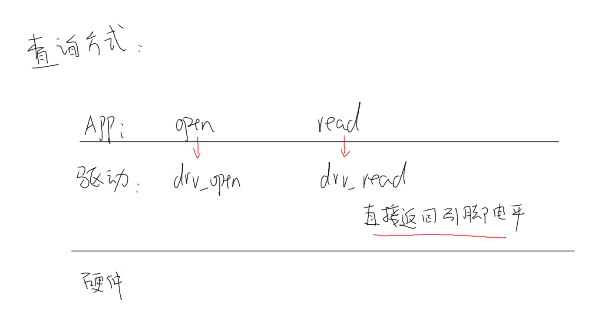

### 休眠唤醒机制

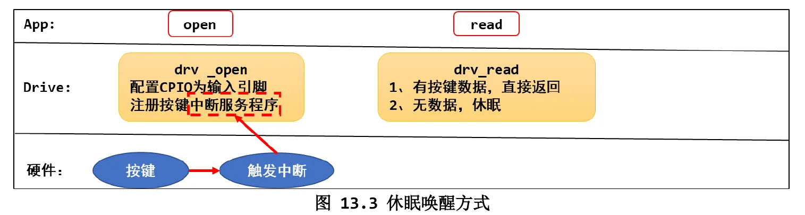

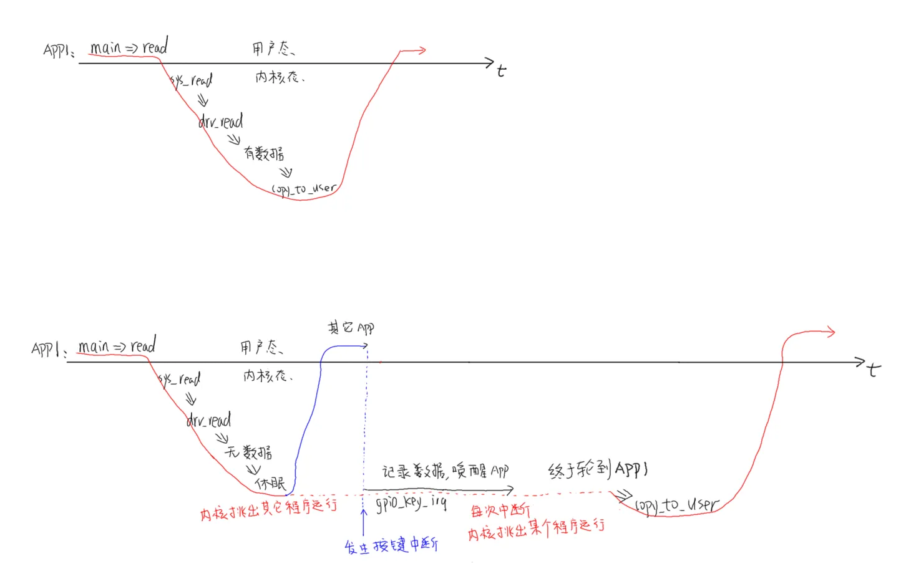

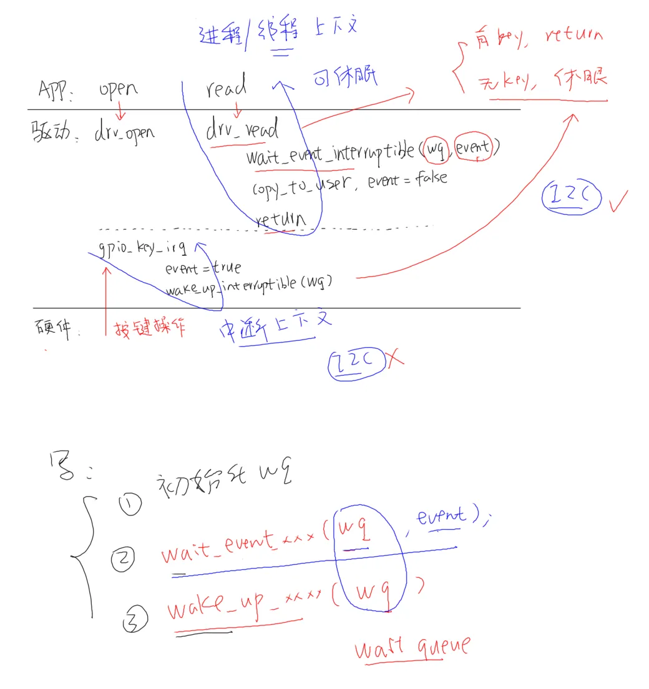

休眠唤醒机制需要在驱动层注册中断服务程序，当外部信号触发了驱动层时，会直接将获得的数据发送给应用层

在驱动层中使用`wait_event(wq, condition)`来完成休眠唤醒操作，但是首先需要初始化等待队列wq，这需要使用`DECLARE_WAIT_QUEUE_HEAD`宏来初始化

### poll(轮询)机制  

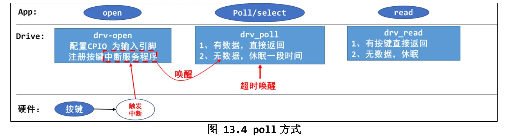

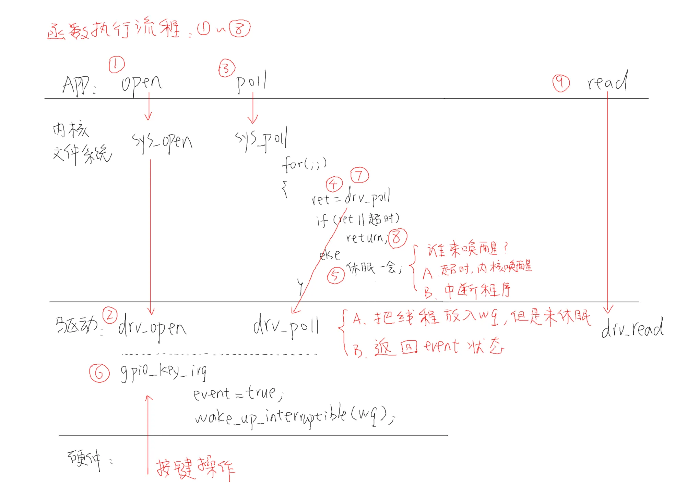

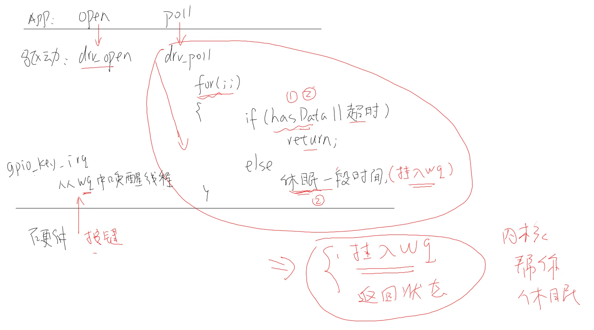

在休眠唤醒机制的中断基础上又发展了poll机制，首先驱动层需要在fop中实现poll函数，当应用调用poll函数时会使用驱动层的drv_poll函数，如果在给定的超时时间内触发中断，则会将数据返回，没有数据则会休眠，如果超时时间内都没有触发中断，则在超时时间后程序也会被内核自动唤醒。需要注意的是，poll的超时时间并不是一次性的，而是每隔若干时间去查看是否有数据给APP

### 异步通知  

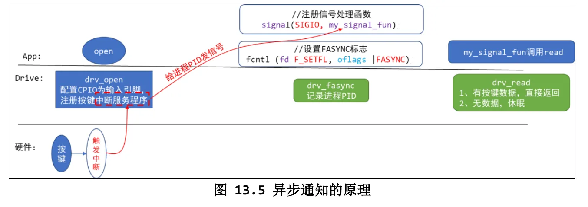

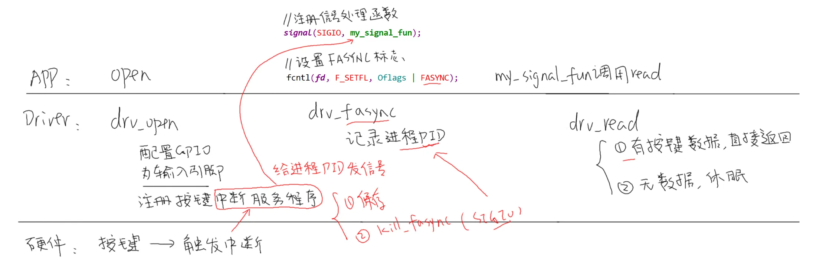

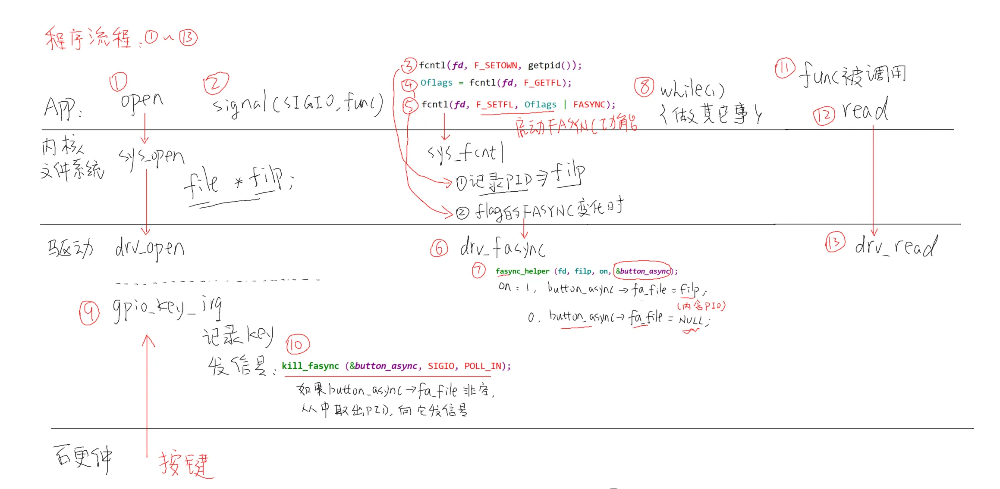

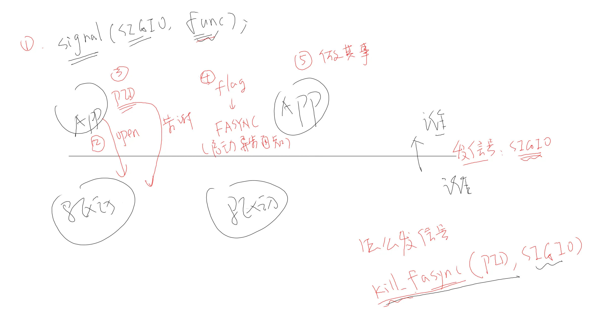

对于异步通知来说，驱动层需要实现`drv_fasync`函数，这个函数中仅仅记录进程号，在应用层需要提供注册信号处理函数signal，当触发外部中断时，由内核统一接管，首先将触发终端的数据保存，然后从驱动程序获得给注册信号处理函数的程序的进程号，并发送`kill_fasync`信号(kill在Linux中就是发送信号的意思)给注册信号处理函数的程序，从而通知应用程序

异步通知时启动信号函数以及恢复现场的过程：
* 首先根据驱动程序所保存的PID找到进程在内核的task_struct结构体，修改里面的某些成员表示收到了信号
* APP从内核态返回到用户态前，内核发现APP有信号在等待处理时，会修改APP的栈，增加一个新的“运行环境”，新环境里“运行地址”是信号处理函数的地址。这样，APP从内核态返回用户态时，运行的是信号处理函数。信号处理函数执行完后，会再次返回到内核态，在内核态里再使用旧的“运行环境”恢复APP的运行

:::alert-info
kill在Linux中就是发送信号的意思，使用的kill -9是将九号信号发给程序，也就是杀掉程序
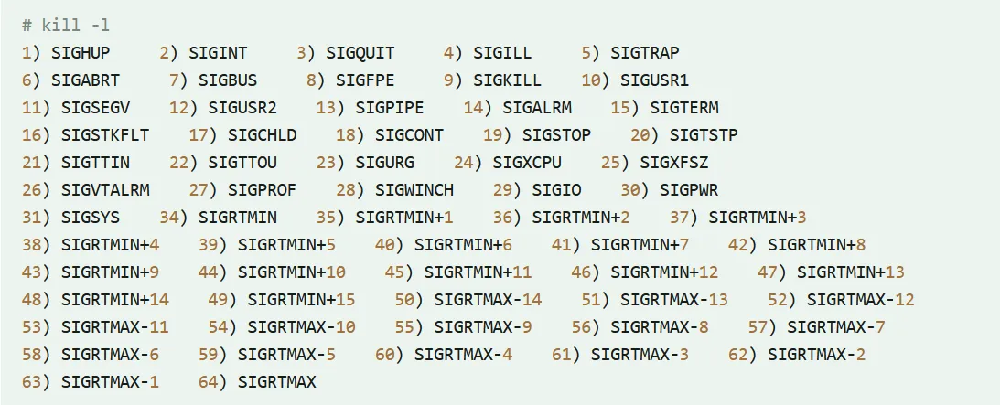
:::

## 阻塞与非阻塞  

APP调用open函数时，传入O_NONBLOCK，就表示要使用非阻塞方式，默认是阻塞方式
:::alert-warning
注意：对于普通文件、块设备文件，O_NONBLOCK 不起作用
注意：对于字符设备文件，O_NONBLOCK起作用的前提是驱动程序针对O_NONBLOCK做了处理
:::

## Pinctrl子系统  

由于接入设备过多，即使有数百的引脚的CPU也不能承受，此时就需要通用中断控制器(GIC)，由于此时的映射关系导致了若想知道是哪个外部设备引起的中断就必须经历CPU->GIC->GPIO->具体中断设备，这就要求了在设备树中应有多个cell来描述外部设备
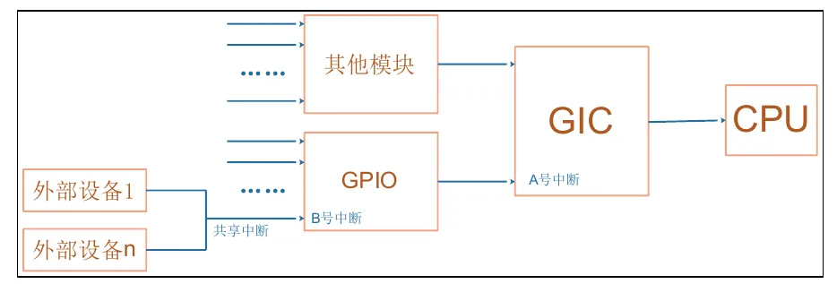

为了管理数量众多的引脚(一个芯片可引出数百个引脚)，不再频繁使用IOMUX和GPIO，Linux提供了Pinctrl子系统功能，使得可以在设备树中指定资源

有的厂家，像NXP，会推出GUI的设备树代码生成软件

:::alert-info
给这些引脚引入Pinctrl功能的一定是对芯片特别熟悉的人，这些人就是**BSP工程师**，我们驱动工程师会使用即可，但是对于优秀的驱动工程师也需要能够实现Pinctrl功能
:::

可以从设备树开始学习Pinctrl，在图片中，左侧称为controller，右侧称为client，两侧都处于同一个设备树文件中，controller可以根据client的需求将引脚划分为group，并根据功能划分function，尽管在芯片厂家中并不一定看到这两个关键字，但是思想是一样的。对于client来说，可以配置若干功能，在左侧的controller可以一一对应

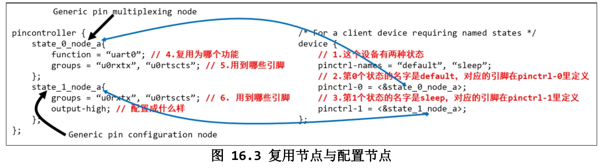  

## 异常，中断与轮询  

中断与轮询的区别：
中断是CPU处于被动状态下来接受设备的信号，而轮询是CPU主动去查询该设备是否有请求
* 对于一个频繁请求CPU的设备，或者有大量数据请求的网络设备，那么轮询的效率比中断高
* 如果是一般设备，并且该设备请求CPU的频率比较低，则用中断效率要高一些

对于外界的可以屏蔽的信号来源，比如按键，定时器，网络报文等称为中断，对于无法屏蔽的信号来源，比如指令错误，内存访问错误等称为异常，中断属于异常中的一种 

由于Linux任务调度的最小单位是线程，而资源分配的最小单位是进程，因此每个线程都有一个栈，每个进程都有公共资源，比如文件句柄，全局变量

中断流程
* 中断源发出信号，CPU被硬件设置为强制跳转到异常向量表中的某个异常向量的地址
* 在异常向量表中找到要执行的中断服务函数，跳转到那个函数
* 保存现场
* 执行中断服务程序
* 恢复现场  

Linux为了防止中断多层嵌套后导致爆栈，因此**不支持中断嵌套**，但是Linux不支持中断嵌套会导致一个中断服务程序执行时间过长而导致其他线程不能响应的问题，所以**中断程序应该执行的越快越好**，但是对于网卡这类需要在中断中读取大量数据的设备则无能为力，解决办法是中断分为上半部和下半部，在上半部分处理紧急的事务，在下半部分处理不那么紧急的事务，这个下半部分由软件中断实现，当执行完硬件中断后，系统会顺便执行软件中断，在软件中断中有标志位，用来识别这个硬件中断是否需要软件中断。
* 当中断下半部耗时不是很长且中断服务程序较简单时，使用`tasklet`，但是`tasklet`并不支持与APP竞争
* 当下半部分耗时比较长时，由于中断下半部分属于软中断，优先级比APP高，会霸占CPU使得APP卡顿，这时就需要`work`来将中断下半部放入`workqueue`，使其成为**内核线程**以便与APP共同竞争
* 但是对于多核处理器来说，使用`workqueue`会造成一个`workqueue`中`work`数量过多，这不利于线程并行，因此又引入了`threaded irq`操作来将中断线程并行化  

由于初始化tasklet后需要把tasklet放入内核链表，而运行taklet函数后会把tasklet从链表中删除，因此想要再次执行tasklet函数就需要再次调度

Linux中的内核线程是一个while(1)循环，里面是一个`workqueue`，驱动程序使用work相关函数将想要执行的函数放入`workqueue`时会唤醒内核线程，并执行放入的那个函数。但是这种做法有个缺点：当内核线程里有某个线程执行时间过长时会导致下一个线程执行不及时，解决办法是在内核中单开一个内核线程运行这个线程
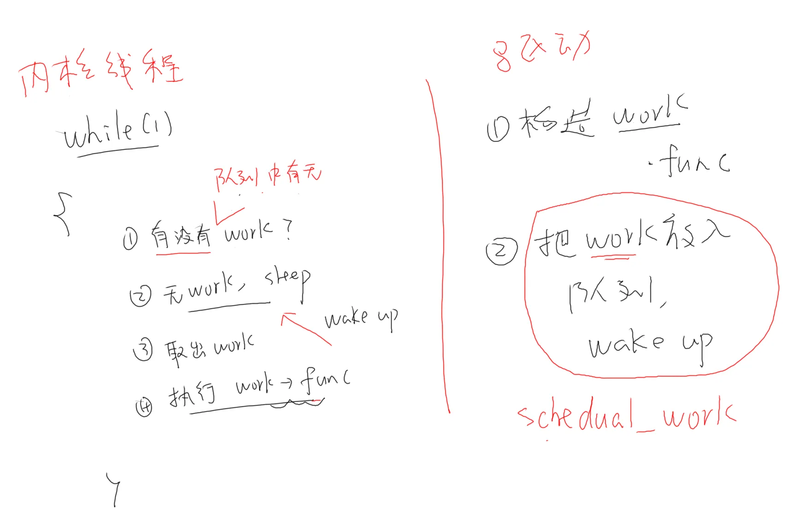

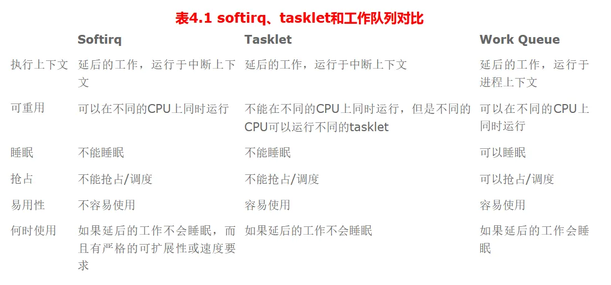

## 定时器  

硬件定时器systick每次中断时就会触发内核中的`jiffies`加一，我们只要检测`jiffies`是否超过定时器结构体中的`expires`参数就能判断是否timer超时
timer定时器属于软件中断

```c
/* 初始化timer结构体 */
setup_timer(timer, fn, data)

/* 将初始化的timer结构体加入timer链表中 */
void add_timer(struct timer_list *timer)

/* 修改定时器的时间 */
int mod_timer(struct timer_list *timer, unsigned long expires)

/* 删除定时器 */
int del_timer(struct timer_list *timer)

```

## mmap  

一般情况下，APP数据交换发生在用户态和内核态之间，但是当交换数据量很大时效率会很低，改进的方法是让APP直接读取驱动程序的buffer，这时可以使用mmap，一般读写大文件如framebuffer时需要用到此函数，当为了保证大文件的堆管理效率，malloc空间大于128k时会在系统层面自动调用mmap

### 地址映射  

地址映射是MMU维护的，MMU的两大作用：
* 地址映射：在访问一个被执行两次的程序中的全局变量时，全局变量的地址是一样的，但是真实的物理地址一定不同，这是由MMU维护的
* 权限保护：CPU访问的硬件地址需要MMU审核后才可访问


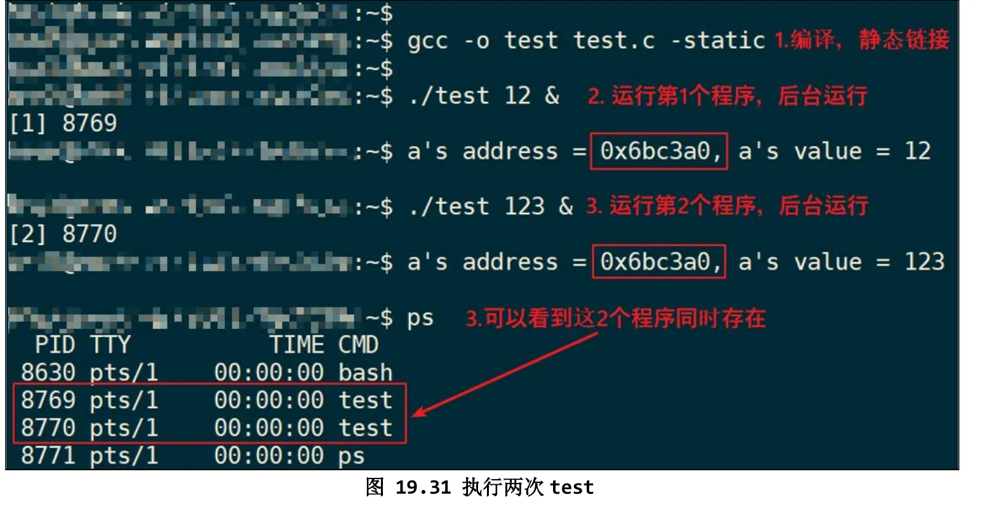

执行两次test后发现a的地址相同但值不同，这是因为CPU看到的是MMU给的虚拟地址，每一个进程都有其页表，这个局部描述表由内核维护且处于内核空间，每个进程自己的页表都有对应的虚拟地址与物理地址映射关系，因此虚拟地址可以重复。
[详解](https://cloud.tencent.com/developer/article/2008239)

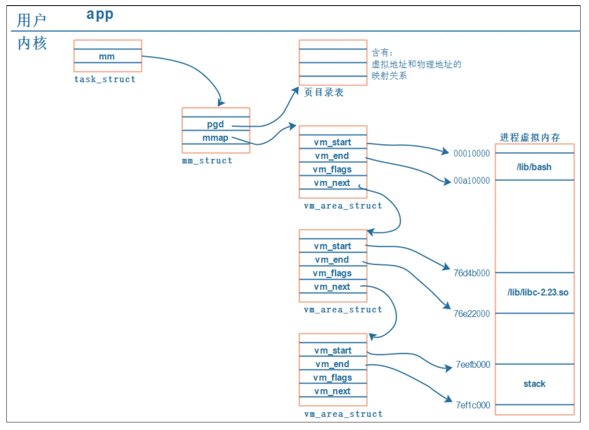

进程的空间由内核维护，具体的虚拟地址与物理地址映射关系放在了页目录表里，页目录表分为一级页目录表和二级页目录表，一级页目录表大小最小为1M，二级页目录表最小为1k，Linux下默认为4k，以下是通过查找页目录表来寻找物理地址的过程：
* CPU 发出虚拟地址 vaddr,假设为 0x12345678
* MMU 根据 vaddr[31:20]\(0x123)找到一级页表项里的第123项，根据读取的[1:0]发现这是个一级页表项，从而获得section base address，假如为0xabc00000
* 将vasddr的剩下的[20:0]与section base address拼接找到偏移地址0xabc45678，此时为真实的物理地址  

对于二级页表，由于二级页表是放在一级页表中的，因此首先查询一级页表：
* CPU 发出虚拟地址 vaddr,假设为 0x12345678
* MMU 根据 vaddr[31:20]\(0x123)找到一级页表项里的第123项，根据读取的[1:0]发现这是个二级页表项，从而获得level 2 descriptor base address
* 使用level 2 descriptor base addres找到二级页表的地址
* 根据vasddr的[19:12]找到二级页表的第45项，从而得到page base addr，假设为0xabc00000
* 将vasddr的剩下的[11:0]与page base addr拼接找到偏移地址0xabc00678，此时为真实的物理地址  


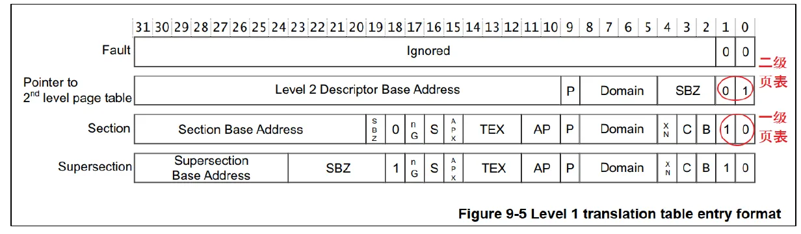

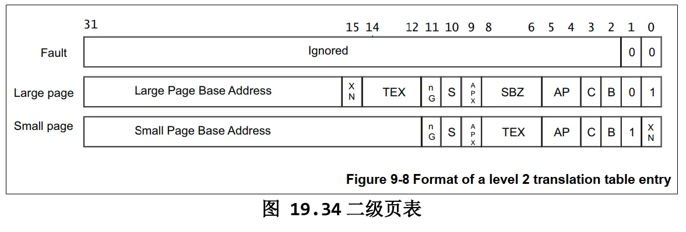

为了保证数据能够尽快写入其他硬件，CPU应该绕过cache直接访问内存，有如下情况时应该使用这种方法：
* 读写寄存器时
* 读写framebuffer时
* 读写DMA控制的区域时  

新数据由CPU写入cache的同时也从cache写入内存的方式叫做`write through`(写通)
新数据由CPU写入cache，但需要等数据满一章后再从cache写入内存的方式叫做`write back`(写回)，写回操作经过写缓冲器，其本质是个FIFO

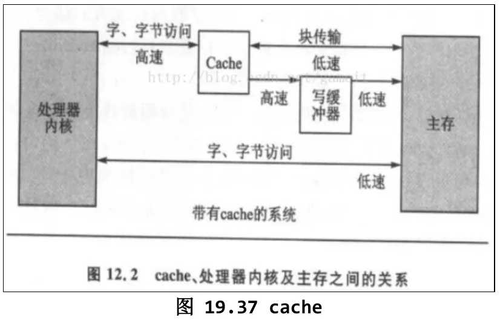

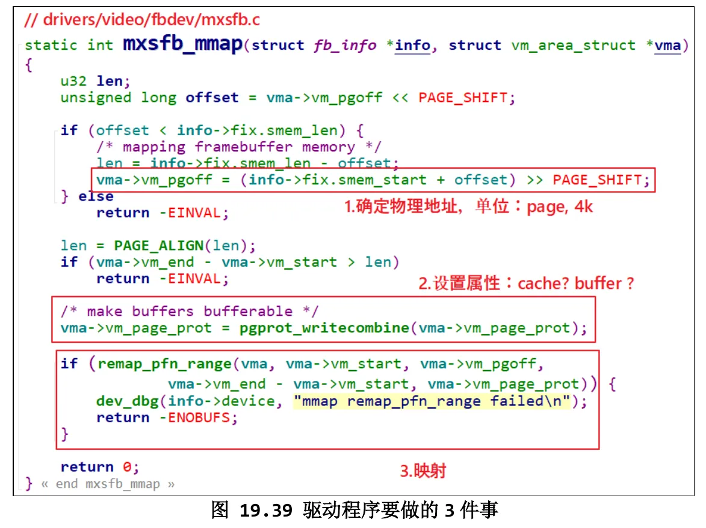

### cache与写buffer

cache负责加速CPU读数据的效率，写buffer本质上是个FIFO，能提高cache写内存的效率

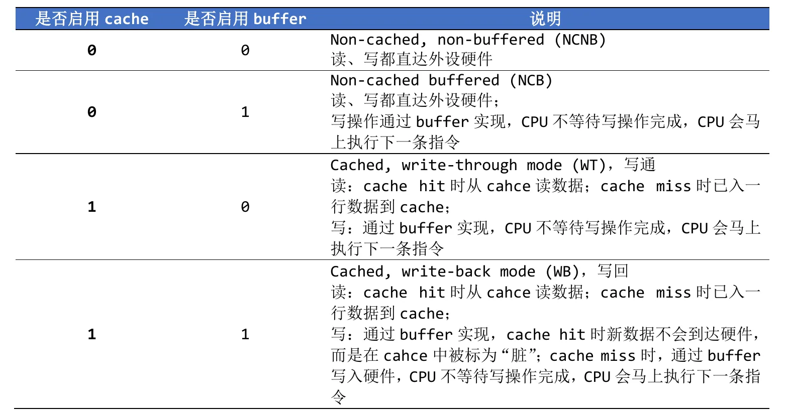  

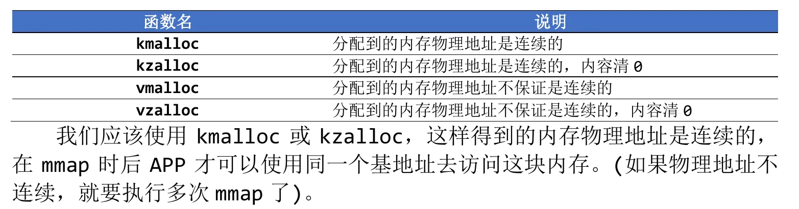  


