# 项目


参考书籍：《FreeRTOS 内核实现与应用开发实战指南》  
  
> 一个工程如果没有 main 函数是编译不成功的，因为系统在开始执行的时候首先执行启动文件里面的复位程序，复位程序里面会调用 C 库函数__main，__main 的作用是初始化好系统变量(将.data段从falsh拷贝到ram)，清零未初始化全局变量或静态变量(清.bss段)，设置堆栈等等。__main 最后会调用__rtentry，该函数主要负责初始化标准I/O以及异常处理，但最主要工作是设置入口函数，例如__rtentry 调用 main 函数，从而由汇编跳入到 C 的世界，这里面的 main 函数就需要我们手动编写，如果没有编写 main 函数，就会出现 main 函数没有定义的错误。 __rtentry 函数存在于armcc工具链中(如keil)，而gcc-arm就可能缺失(例如cubeide)  
  
<!-- more -->

# 项目

## FreeRTOS内核实现  

生成的startup_ARMCM3.s负责启动startup_ARMCM3.c负责时钟配置，本项目默认时钟为25M 

```c
/*----------------------------------------------------------------------------
  Define clocks
 *----------------------------------------------------------------------------*/
#define  XTAL            ( 5000000UL)      /* Oscillator frequency */
#define  SYSTEM_CLOCK    (5U * XTAL)
```
  
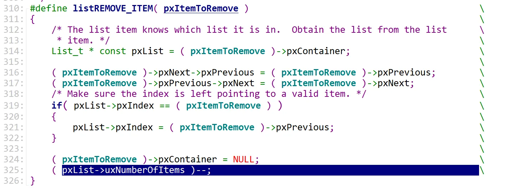
  
对于这种多行宏定义，每行结尾要加 \ 表示该行未结束
  

若使用 \ 表示该行未完结，务必注意 \ 后不能加任何字符，尤其是空格或者Tab。报错如下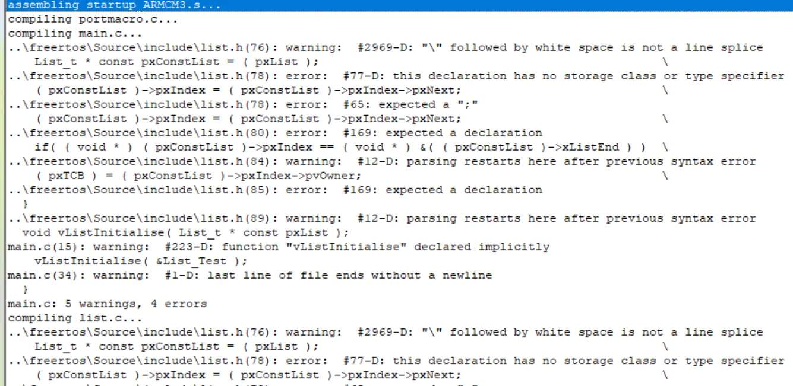

   
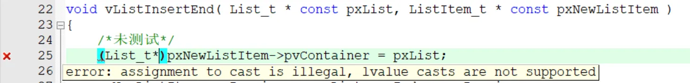
  
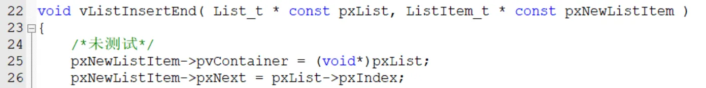
  
左值不能进行类型转换，类型转换本质上是在寄存器内对原值进行位操作，得到的结果不放入内存，而左值是需要放进内存的，因此类型转换与左值冲突，若要类型转换，则需要对右值进行操作  


当一个a.c文件需要b.h，而b.h包含了c.h，且c.h也包含了b.h时，会发生编译冲突。表现为有未定义的类型或变量，详情参考[博客园](https://www.cnblogs.com/skullboyer/p/8891579.html)，解决办法是理清编译关系，去除重复包含的头文件
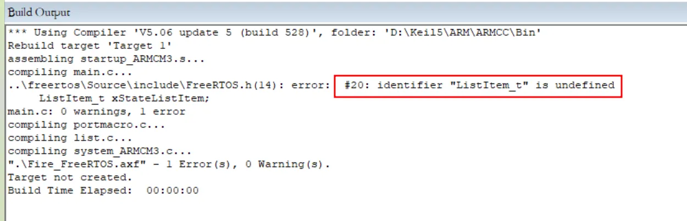


栈由高地址向低地址增长，栈顶是第一个进栈的元素，栈底是最后一个进栈的元素  
因为32位机的指令一般都是32位的，栈顶指针只需4字节对齐即可，但是考虑兼容浮点运算的64位操作则需要8字节。对齐完成后，栈顶指针即可确定位置，而后开辟空间  

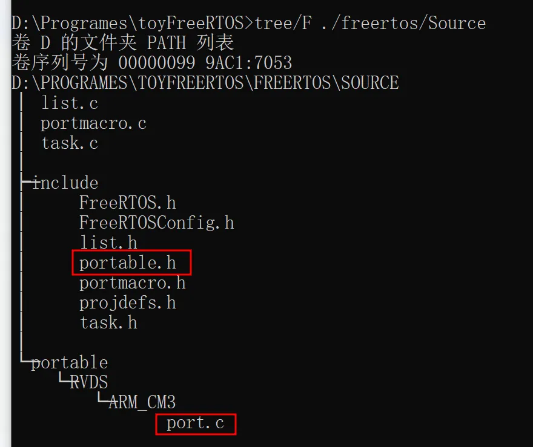
项目的.c 与 .h文件可以不重名，位置可以不同，例如port.c文件放在\freertos\Source\portable\RVDS\ARM_CM3，但是引用port.c内容的portable.h放在\freertos\Source\include  

```c
/* 这行代码的意思是定义了TaskFunction_t类型的函数指针，参数和返回值都是void，这样就可以进行函数“赋值”，进而从Task1，Task2中抽象出TaskFunction_t这一类型了，并且使用起来很方便 */
typedef void (*TaskFunction_t)( void * );

/* 类似用法如下 */

void tech(void) { printf("tech dreamer"); }
//命名一个类型，那么这个时候func不可以直接调用，而是一个类型了
typedef void (*func)();
void main()
{
    //定义一个可调用的指针变量（函数）：myfunc
    func myfunc;
    myfunc = &tech; //&可以不加
    /* 下面两种方法体现了函数名和函数地址是一回事 */
    myfunc();         //第一种调用方式，带参数也可以
    (*myfunc)();      //第二种调用方式，带参数也可以
}

```

### 实现就绪链表  
```c
typedef void (*TaskFunction_t)( void * );//将TaskFunction_t函数指针重定义为void*类型

//FreeRTOS中TaskFunction_t内部包含了一个栈顶指针，因此返回值为uint32型
```


在FreeRTOS里TaskHandle_t是个TCB_t的指针  
在toyFreeRTOS里TaskHandle_t是个void*类型的指针，使用时需要类型强转


#### 设置任务栈时栈顶指针的移动  

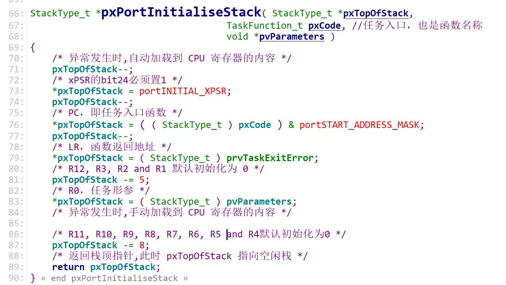

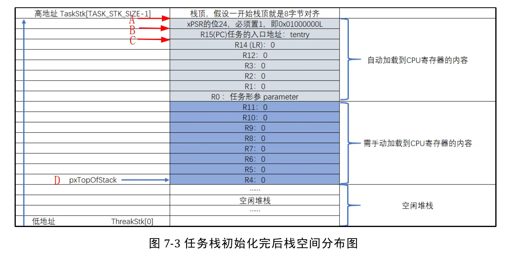  

首先由外部函数prvInitialiseNewTask构造出的pxTopOfStack指针传入pxPortInitialiseStack函数，此时pxTopOfStack指针指向A位置，而后移动指针至B，C点并将xPSR，PC，LR的值依次写入栈顶，方便之后寄存器读取。之后设置R0为传入的参数，最后将指针下移至D并返回，从而使任务得到空闲堆栈的指针  

### 实现调度器  

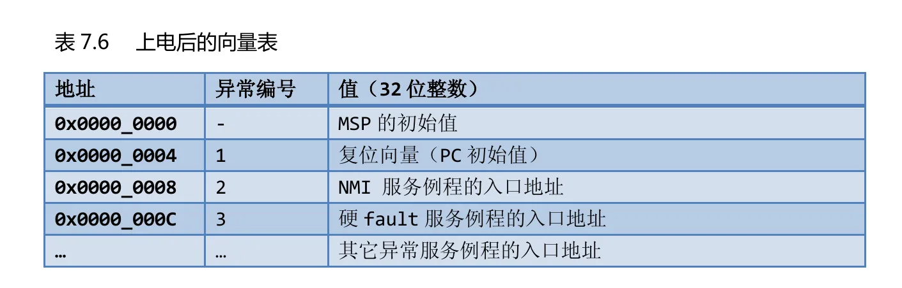
向量表最前面是MSP的地址

配置寄存器：
```c

/* 对0xe000ed20地址处取值，此处为SHPR3寄存器，设置的是pendsv和systick优先级 */
#define portNVIC_SYSPRI2_REG	*(( volatile uint32_t *) 0xe000ed20) 

/* 配置 PendSV 和 SysTick 的中断优先级为最低 */
	 portNVIC_SYSPRI2_REG |= portNVIC_PENDSV_PRI;	//SHPR3寄存器被设置为 0x**FF ****
	 portNVIC_SYSPRI2_REG |= portNVIC_SYSTICK_PRI;	//SHPR3寄存器被设置为 0xFFFF ****

```

开启第一个任务：
```c

/* 通过查找SCB_VTOR最终将__initial_sp处的指令传到msp内，然后调用svc启动第一个任务 */
__asm void prvStartFirstTask( void )
{
	/* 当前栈按照8字节对齐 */
	PRESERVE8

	/* 将SCB_VTOR寄存器地址加载到R0，SCB_VTOR寄存器存储__initial_sp的地址，
	__initial_sp也是msp的地址，还是向量表的起始地址，因为CM3支持更改向量表的起始地址，
	所以需要以下四条指令以重定位__initial_sp */
	ldr r0, =0xE000ED08
	/* 将__initial_sp的地址加载进r0,STM32的__initial_sp为0x0800 0000 */
	ldr r0, [r0]
	/* 将__initial_sp中的值，也就是msp初始化的值加载到r0，可能是0x20005B30 */
	ldr r0, [r0]

	/* 将上一步初始化__initial_sp在r0中的值加载到msp */
	msr msp, r0

	/* 开中断 */
	cpsie i
	cpsie f
	/* 等待上面所有指令执行完成 */
	dsb
	isb

	/* 调用SVC去启动第一个任务 */
	svc 0
	nop
	nop
}

/* 处理第一个任务的SVC */
__asm void vPortSVCHandler( void )
{
    extern pxCurrentTCB;
    PRESERVE8
    ldr r3, =pxCurrentTCB    //TCB_t volatile *pxCurrentTCB = NULL;
    ldr r1, [r3]             //volatile StackType_t *pxTopOfStack;
    ldr r0, [r1]             //r0 = *pxTopOfStack
    ldmia r0!, {r4-r11}
    msr psp, r0
    isb
    mov r0, #0
    msr basepri, r0	    //开中断
    orr r14, #0xd		//设置LR的值
    bx r14				//此处不会返回r14(LR),而是返回到任务堆栈，具体看CM3手册
}

 __asm void xPortPendSVHandler( void )
{
	extern pxCurrentTCB;
	extern vTaskSwitchContext;

	PRESERVE8

	mrs r0, psp
	isb
	ldr r3, =pxCurrentTCB
	ldr r2, [r3]
	stmdb r0!, {r4-r11}
	str r0, [r2]
	stmdb sp!, {r3, r14}
	mov r0, #configMAX_SYSCALL_INTERRUPT_PRIORITY
	msr basepri, r0
	dsb
	isb
	bl vTaskSwitchContext
	mov r0, #0
	msr basepri, r0
	ldmia sp!, {r3, r14}
	ldr r1, [r3]
	ldr r0, [r1]
	ldmia r0!, {r4-r11}
	msr psp, r0
	isb
	bx r14	//此处不会返回r14(LR),而是返回到任务堆栈
	nop
}

```
  
* 为什么需要PendSV？
    * pendsv是最低优先级的异常，常用于任务切换，这是为了保证系统实时性所提出的方法。在此之前，采用时间片流转的os经常遇到任务切换的时钟中断将其他中断打断的问题，甚至引发硬件错误。有了pendsv后，定时器中断被延迟到了普通中断之后，以此来保证普通中断的优先级，同时也不会忽略定时器中断。但是会引起上下文切换不精确的问题，通常情况下由pendsv引发的延时可以忽略，但在中断风暴中问题尤为严重

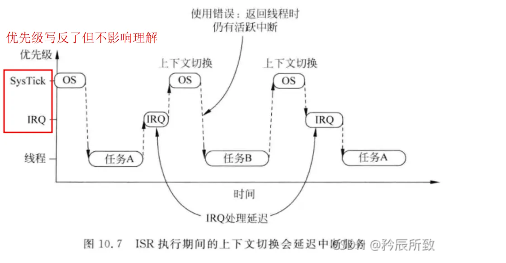  

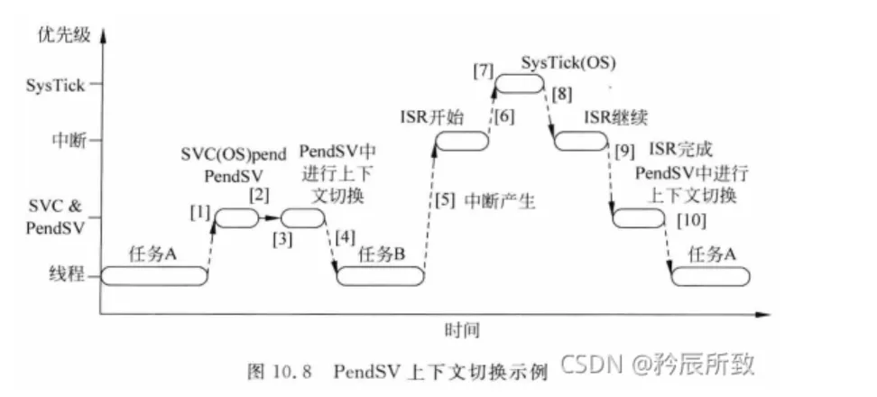  

* 调用svc(请求管理调用)的原因
    * 用户与内核进行操作，但如需使用内核中资源时，需要通过SVC异常来触发内核异常，从而来获得特权模式，这才能执行内核代码
* 为什么需要SVC启动第一个任务
    * 使用了os后，任务调度交给内核，因此不能同裸机一样使用任务函数来启动，必须通过内核的服务才能启动任务
* 相比pendsv，svc有什么特点
    * 触发svc中断，其处理是及时的，若不及时会导致硬件fault。svc多用于权限切换或申请内核资源

更多关于pendsv与svc的内容，详见[矜辰所致-infoq](https://xie.infoq.cn/article/e0c671e5ca2d472ce40d272d4)  

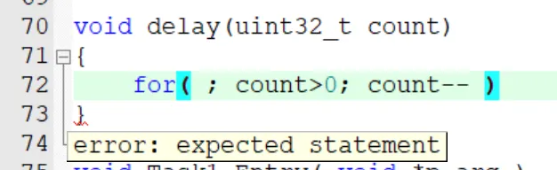

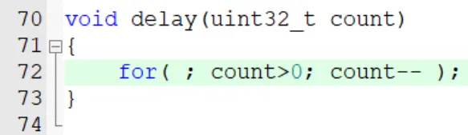
  


for循环无循环体时末尾加分号


#### 实现调度器总结 

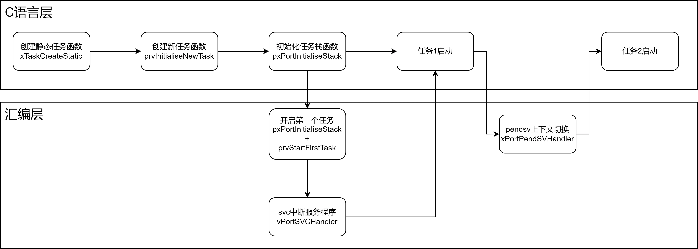

* 初始化任务步骤
    * 调用创建静态任务函数
        * 设置TCB指针和栈指针
        * 调用创建新任务函数，传入Handle，函数名称，参数，栈的深度等参数
        * 返回Handle
        
    * 创建新任务函数操作：
        * 获取栈顶地址并对齐
        * 将任务名称复制到TCB中
        * 设置container与owner(container指的是处于哪个链表，owner是自身的TCB)
        * 调用初始化任务栈函数，并返回一个栈顶指针
        * 将任务的自身地址传给Handle，这样可以通过Handle控制任务  
        
    * 初始化任务栈函数操作：
        * 对栈指针之前的16位进行设置以便加载到CPU寄存器中
        * 返回空闲堆栈的栈指针
        
    * 开启第一个任务步骤(汇编)：
        * 设置堆栈按8字节对齐
        * 从SCB_VTOR取出向量表地址，进而获得msp的内容（即复位中断处理函数）
        * 开中断
        * 调用svc指令去获取硬件权限，从而执行svc中断服务程序，并启动第一个任务(svc替代了以前的swi也就是软中断指令)
        
    * svc中断服务程序的操作：
        * 将第一个任务的参数加载到寄存器，包括第一个函数的地址，形参，返回值
        * 开中断，使用psp寄存器，返回到任务堆栈，这样就可以执行第一个，执行完毕后CPU等待执行下一个任务
        
* 上下文切换的操作：
    * 总体与svc中断服务程序的操作类似，但是加上了将优先级载入到basepri的操作
    * 设置好优先级后直接运行至跳转上下文 c 函数
    * 最后开中断，使用psp寄存器，返回到任务堆栈，CPU可以执行下一个任务，调度器功能就实现了
  
[具体任务切换过程参考资料](http://bbs.eeworld.com.cn/thread-617606-1-1.html)

### 临界段保护  

临界段就是在执行时不能被中断的代码段，典型的就是全局变量，系统时基

#### 中断管理  

FreeRTOS中的中断管理通过汇编完成，对于关中断而言，其内部实现了两个中断函数，分别是能保存当前中断有返回值的函数，可以在中断中使用。另一个是不能保存当前中断无返回值的函数，不能在中断使用。  本质是操作basepri寄存器，大于等于basepri寄存器的值的中断会被屏蔽，小于则不会。但当basepri为0时，则不会屏蔽任何中断

#### 关中断  

```c
/* 不带返回值的关中断函数,不能嵌套,不能在中断里面使用 */
#define portDISABLE_INTERRUPTS() vPortRaiseBASEPRI()

static portFORCE_INLINE void vPortRaiseBASEPRI( void )
{
	//中断号大于191的中断全部被屏蔽
	uint32_t ulNewBASEPRI = configMAX_SYSCALL_INTERRUPT_PRIORITY;

	__asm
	{
//将FreeRTOS最大优先级的中断加载到basepri寄存器中，这样会屏蔽FreeRTOS管理的所有中断

		msr basepri, ulNewBASEPRI
		dsb
		isb
	}
}

/* 带返回值的关中断函数,可以嵌套,可以在中断里面使用 */
#define portSET_INTERRUPT_MASK_FROM_ISR() ulPortRaiseBASEPRI()
static portFORCE_INLINE uint32_t ulPortRaiseBASEPRI( void )
{
	uint32_t ulReturn, ulNewBASEPRI = configMAX_SYSCALL_INTERRUPT_PRIORITY; 

	__asm
	{
		mrs ulReturn, basepri    //先对当前中断进行保存并返回
		msr basepri, ulNewBASEPRI
		dsb
		isb
	}
	return ulReturn;
}

#endif /* PORTMACRO_H */

```  


#### 开中断  

```c

/* 不带中断保护的开中断函数，与portDISABLE_INTERRUPTS()成对使用 */
#define portENABLE_INTERRUPTS() vPortSetBASEPRI( 0 )

/* 带中断保护的开中断函数，与portSET_INTERRUPT_MASK_FROM_ISR()成对使用 */
#define portCLEAR_INTERRUPT_MASK_FROM_ISR(x) vPortSetBASEPRI(x) 

void vPortSetBASEPRI( uint32_t ulBASEPRI ) 
{
	__asm
	{
		msr basepri, ulBASEPRI
	}
}

```
#### inline关键字与内联函数  
  
inline关键字用于C++，__inline，__forceinline既可用于C，也可以用于C++

在程序中，如果在关键代码频繁调用某个函数，则会频繁的压栈出栈。为了**提高效率**，C语言提供了inline关键字来优化代码，例如在开关中断时需要inline关键字  

标记有inline修饰符的函数，编译器会将该函数内容原封不动的放入引用处，这样就不会频繁的入栈出栈了。虽然inline减少了函数调用的开销，但会使代码膨胀。  

```c

#include <stdio.h>

//函数定义为inline即:内联函数
inline char* dbtest(int a)
{
	return (i % 2 > 0) ? "奇" : "偶";
}

int main()
{
	int i = 0;
	for (i=1; i < 100; i++) 
	{
		printf("i:%d    奇偶性:%s /n", i, dbtest(i));
	}
}

```

更详细用法参考[CSND](https://blog.csdn.net/jackailson/article/details/114781887)  

inline，__inline，__forceinline等用法参考[51CTO](https://blog.51cto.com/u_15614325/5272494)
  
#### volatile限定左值时，即使类型相同右值也需要类型强转么？  

不需要，Keil编译器问题，但是可能会报warning甚至error，最好类型强转一下

### 空闲任务与阻塞延时的实现  

* 为了能够自动进行任务调度，需要：
    * 设置CPU重装器，设置主频并调用系统中断向量表提供的SysTic中断服务函数
    * 提供一个函数，内部能够完成时基自增和任务延时自减**(后期会取消自减的设置，转而使用“[闹钟](#clock)”的思想)**，并将这个函数放入上一步的SysTick服务函数中，这样能够定时触发从而进行时基自增，在放入SysTick中时，还需要注意此函数前后需要开关中断以保证时基的实时性
    * 将任务调度器函数`vTaskSwitchContext`重写，调度方式需要判定TCB中的任务延时，值为零，则触发SysTick中断服务函数，而后将任务放入就绪链表
    
* 为了加入IdleTask支持，需要：
    * 在启动调度器函数 vTaskStartScheduler中加入空闲任务的启动，这需要设置IdleTask的TCB，栈，函数名称等参数，但**不设置延时**，因为CPU空闲时长不确定，设置完成后将其挂载到就绪列表  
  

注意不要在IdleTask中加入任何阻塞或者死循环，否则由于IdleTask没有设置延时且目前抢占式算法未完成，导致调度器将与IdleTask同一优先级的所有任务阻塞！！！


### 支持多优先级  

CM内核有个计算前导零的指令，以此可以优化寻找最高优先级任务的方法
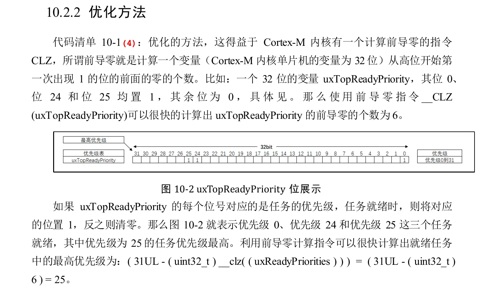  

主要原理是：找到一个32位变量的最高非零位，此位就是最高的有任务的链表的优先级(支持的最大优先级数目为32)
支持多优先级实现过程如下
* 将`uxPriority`添加到TCB及其相关的函数内使其支持优先级
* 之后在`prvInitialiseNewTask`函数内添加初始化优先级，并做判断使任务初始化的优先级大于等于`configMAX_PRIORITIES`退化成`configMAX_PRIORITIES-1`的优先级
* 在`prvInitialiseTaskLists`中初始化5个就绪链表，每个链表内的任务都有相同的优先级
* 在`prvAddTaskToReadyList`宏函数中完成将任务移就绪入链表的操作
    * 记录当前优先级并将当前任务插入到获得的那个优先级链表的尾部
* **在`prvAddNewTaskToReadyList`函数**中完成具体操作
    * 如果`pxCurrentTCB`为空，意味着可能是第一次创建任务，则将传进来的`pxNewTCB`赋值给`pxCurrentTCB`，并且调用`prvInitialiseTaskLists`函数以创建任务链表
    * 如果`pxCurrentTCB`不为空，则根据优先级将`pxCurrentTCB`设置为优先级最高的那个任务，可能是`pxNewTCB`也可能是`pxCurrentTCB`，这需要做好判定再赋值
    * 最后调用`prvAddTaskToReadyList`

### 任务延时列表的实现

* 首先初始化两条链表`&xDelayedTaskList1`与`&xDelayedTaskList2`，并将其赋址给`pxDelayedTaskList`和`pxOverflowDelayedTaskList`
* 在`vTaskStartScheduler`中初始化全局变量`xNextTaskUnblockTime`为最大值，这个变量表示下一次任务被唤醒的时刻，也就是所提到的“<span id="clock">**闹钟**</span>”
* 在`vTaskDelay`函数中插入`prvAddCurrentTaskToDelayedList`函数，`prvAddCurrentTaskToDelayedList`函数实现如下
    * 将当前任务从就绪链表中移除，并检查移除任务后，就绪链表是否为空，若为空则将优先级位图上对应的位清除
    * 记录`xTimeToWake`的值，它等于当前时钟加上`vTaskDelay`的参数，也就是`闹钟值`，与`xNextTaskUnblockTime`相等，但是为局部变量，并将此值设置为链表节点的排序值
    * 比较`xTimeToWake`与`xConstTickCount`大小以判断是否闹钟溢出，溢出了就将当前任务移至`pxOverflowDelayedTaskList`链表，否则移至`pxDelayedTaskList`链表
    * 然后更新`xNextTaskUnblockTime`使其等于`xTimeToWake`
* 在`xTaskIncrementTick`函数中判断延时任务是否到期，若到期且延时链表为空，则将`xNextTaskUnblockTime`设为最大值。若到期但延时链表不为空，则将延时链表中的每个节点的值`xItemValue`取出并与当前时刻做对比，若`xItemValue`大于当前时刻，则将`xNextTaskUnblockTime`更新为`xItemValue`，然后将任务从延时链表移入就绪链表

* 判断链表为空的方式：
    * 调用`uxListRemove`时会返回`pxList->uxNumberOfItems`，或者调用宏函数

FreeRTOS内部有两个延时链表，当系统时基计数器xTickCount没有溢出时，用一条链表(`pxDelayedTaskList`)，当xTickCount 溢出后，用另外一条链表(`pxOverflowDelayedTaskList`)。

```c

static void prvTaskExitError( void )
{

/* 没有可供执行的任务时会停在这里，如果发生了这种情况，看一下空闲任务是否被执行 */

/* 函数停止在这里 */
for (;;);

}

```
### 支持时间片  

* 抢占式调度(configUSE_PREEMPTION)：高优先级任务可以打断低优先级任务
    * 时间片流转(configUSE_TIME_SLICING)：同优先级任务之间每隔一定时间片进行任务切换
        * 空闲任务让步(configIDLE_SHOULD_YIELD)：空闲任务与用户任务处于同一优先级时，空闲任务等待用户任务使用完CPU后才能获取资源  

默认情况，FreeRTOS上面三个选项均开启

* 支持时间片的操作非常简单
    * 分别在`FreeRTOSConfig.h`与`FreeRTOS.h`文件中引入`configUSE_PREEMPTION`和`configUSE_TIME_SLICING`两个宏，默认为1
    * 修改`xPortSysTickHandler`函数，使得当`xTaskIncrementTick`返回值为`pdTrue`时才进行任务切换
    * 修改`xTaskIncrementTick`函数，使得在延时链表中有任务被唤醒时，判断被唤醒的延时任务优先级与当前任务优先级，若被唤醒的延时任务优先级高则返回`pdTrue`，意味着进行任务切换
    * 如果当就绪链表中任务数大于1，那么每进入`xTaskIncrementTick`函数就意味着过去了一个时间片，因此需要进行任务切换。注意在修改该函数时还需要判断上面两个宏是否为1

### 自己实现
#### 信号量  

* 初始化Semaphore链表并设置Semaphore结构体的值
* 完成Take函数
    * 检测当前Semaphore个数是否大于0，若大于0则关中断，Semaphore数量--，不大于零则说明没有Semaphore可供Take，所以需要进行任务切换
* 完成Give函数
    * Give函数简单很多，只需要归还Semaphore然后开中断，将任务管理权归还给调度器即可


#### 队列

* 为了保证数据能在不同函数间传递，静态创建资源时需要在创建资源的函数内传入在main函数中预设的结构体或数组的地址，对于Queue来说，官方使用
 `xQueueCreateStatic(    UBaseType_t uxQueueLength,
                            UBaseType_t uxItemSize,
                            uint8_t *pucQueueStorageBuffer,
                            StaticQueue_t *pxQueueBuffer    );`函数来传参
* 在创建函数内还需要初始化Queue链表和结构体及其参数，最后返回一个void*类型的handle
* 创建环形缓存区来保存数据，做好数据发送和接收的准备工作
    * Buffer实际上是有一个head标志变量和一个tail标志变量的数组，发送数据时head++，接收数据时tail++，当head或tail等于数组结尾时需要把他们设置为数组开头
    * Buffer还要有检测是否为空的功能
* 队列发送函数`QueueSend`中，在发送数据前需要关中断，发送数据后开中断
* 队列接收函数`QueueReceive`中，也需要同`QueueSend`开关中断

##### 静态创建和动态创建的区别  

静态创建因为需要防止函数退出时销毁数据和栈，因此需要传入指针，所需的内存大小以及需要保存相关结构的地址等条件  

```c

// 示例代码
#define QUEUE_LENGTH 10
#define ITEM_SIZE sizeof( uint32_t )

// xQueueBuffer用来保存队列结构体，内部存储了队列的相关参数
StaticQueue_t xQueueBuffer;

// ucQueueStorage 用来保存队列的数据
// 大小为:队列长度 * 数据大小
uint8_t ucQueueStorage[ QUEUE_LENGTH * ITEM_SIZE ];

void vATask( void *pvParameters )
{
    QueueHandle_t xQueue1;
    // 创建队列: 可以容纳QUEUE_LENGTH个数据,每个数据大小是ITEM_SIZE
    xQueue1 = xQueueCreateStatic( QUEUE_LENGTH,
                                ITEM_SIZE,
                                ucQueueStorage,
                                &xQueueBuffer );
}

```

动态存储使用malloc函数因此不需要传入指针，但是程序速度运行比静态分配慢且需要对内存进行管理

```c
BaseType_t QueueReceive(QueueHandle_t QueueHandle, 
							void* const ReceiveData )
{

	Queue_t* QueueTemp;
	QueueTemp = (Queue_t*)QueueHandle;
	BaseType_t rtval = pdFALSE;
	portDISABLE_INTERRUPTS();
	rtval = BufferReceive( ReceiveData,
						/* 只能使用QueueTemp这种中间变量做强制类型转换，如果写成
						((Queue_t*)QueueHandle)->uxQueueLength则会找不到成员
						而报错 */
						QueueTemp->uxQueueLength,
						QueueTemp->uxItemSize,
						QueueTemp->pvDataStore);
	portENABLE_INTERRUPTS();
	return rtval;
}
```

### 遇到的困难与学到的经验  

* 编译关系复杂，各种头文件相互包含导致类型重定义或者定义冲突
    * 理清编译关系，在项目之前做好文件规划，划分各文件的职责
    * 注意头文件引用顺序  

* Keil编译器有问题，有时候类型符合的赋值编译器不通过，必须类型强转才可编译通过。再或者，虽然已经定义了条件编译但还是对循环引用的头文件报错，这时就需要考虑编译器的问题了，Keil失效的通常的现象和解决办法：
    * 一般出现编译器问题的条件是：当一个错误卡住了很长时间，并且确定这段代码没有错误，而且当按照编译器的提示将这段代码彻底的进行修改后会爆出更多error，这时就可以考虑是编译器的问题了(在写下这篇文章两年后的视角来看，应该是右值类型转换时缺失volatile关键字)
    * 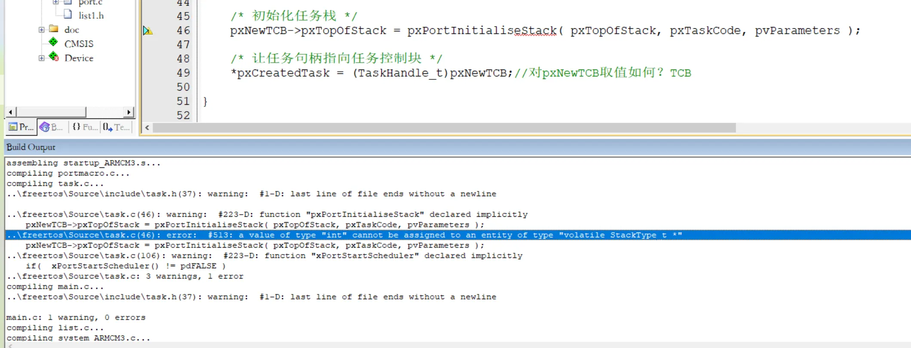
    * 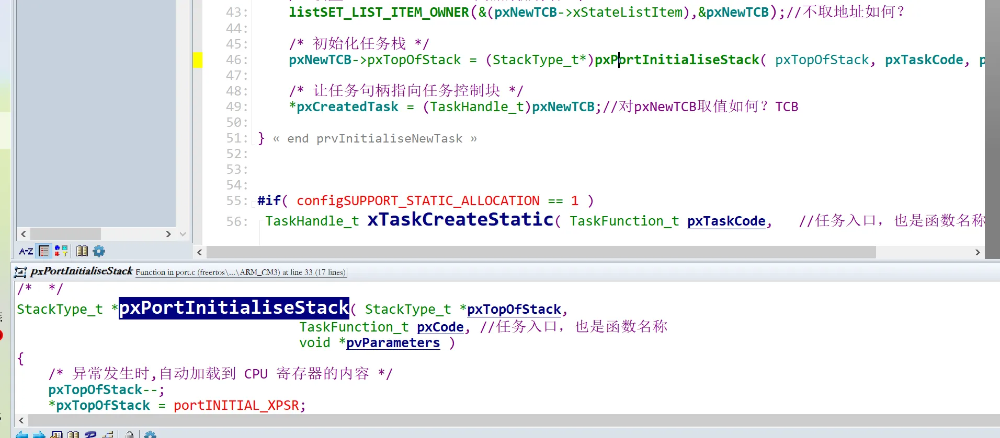
    * 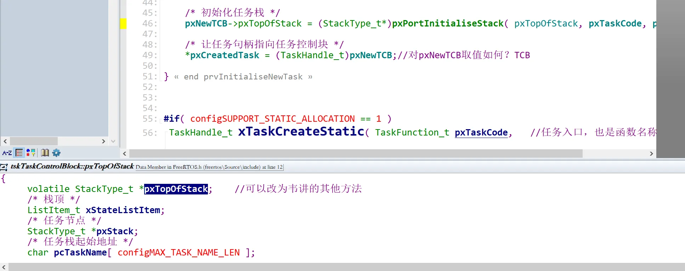
    * 
    * 所有可能的解决办法都失效了，可以考虑是Keil的问题
    * 待补充  


```c

void prvIdleTask( void *p_arg )
{

/* 永远不要在空闲任务里加入阻塞或者死循环！！！！！！！！！！！！！！！
	否则当其他任务优先级为0时，空闲任务会霸占整个时间片(没有设置时间片流转和抢占式调度的话)*/
//	for( ;; )
//	{
//		flagIdle = 1;
//		flag1 = 0;
//		flag2 = 0;
//	}

}

```
因为在第十章已经实现支持多优先级了，且Task1，Task2优先级均大于0，因此此时空闲任务内可以加循环



* 遇到调不出来的Bug不要怕，解决方法如下
    * 保持一个清醒的状态
    * 快速定位问题的大概位置
    * 在Bug大概位置处**逐步**调试

```c
void tickconst(int tick)
{
    const int consttick = tick;
    printf("%d\n",consttick);
}

// void tickstatic(int tick)
// {
//     static int statictick = tick;//static不能被变量赋值
//     printf("%d\n",statictick);
// }

int main()
{
    int i = 0;
    for(i=0; i<10; i++)
    {
        tickconst(i);//const的值可以在定义的时候被修改，但不能在其他地方被修改，也就是说，const可以被变量赋值`
    }
    return 0;
}
```

在时基函数调用时会用到
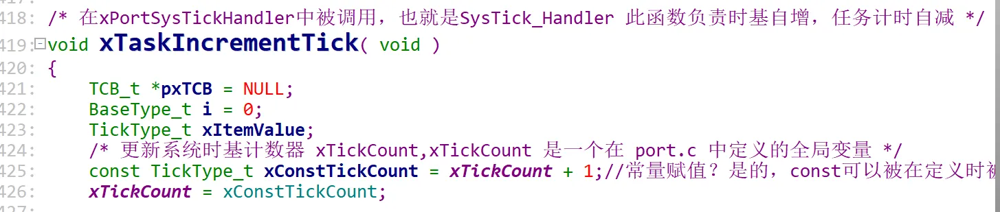  
  


```c
#include <stdio.h>

int a = 4;
int b = 5;

//宏定义地址交换会修改值，这是因为函数宏定义不会产生栈
#define swapdef(addra,addrb)\
{\
    int *temp;\
    temp = a;\
    a = b;\
    b = temp;\
}

//地址交换不会修改值
void swapadd(int* a,int* b)
{
    int* temp;
    temp = a;
    a = b;
    b = temp;
}

void swapnum(int* a,int* b)
{
    int temp;
    temp = *a;
    *a = *b;
    *b = temp;
}

int main()
{
    printf("原值=%d %d\n",a,b);
    swapdef(&a,&b);
    printf("宏地址交换=%d %d\n",a,b);
    swapadd(&a,&b);
    printf("函数地址交换=%d %d\n",a,b);
    swapnum(&a,&b);
    printf("指针地址解引用交换=%d %d\n",a,b);
    a = 6;
    printf("%d %d\n",a,b);
    return 0;
}
```
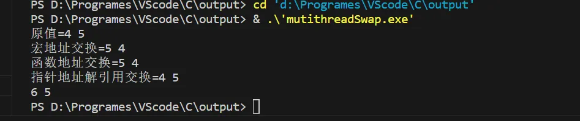    


堆栈太小可能会导致程序停止在HardFault


#### int (\*array)[20] 与 int \*arrary[20]的不同

前者代表一个指向具有20个整型元素数组的**指针**，后者代表一个具有20个指针元素的**数组**

#### 宏定义函数
* 为什么要使用宏定义函数？
    * 宏定义函数可以在预编译阶段直接展开，省下了压栈出栈的资源
    * 那他与内联函数的区别是什么？
        * 宏定义函数只做展开和替换，不检查参数类型。而内联函数需要检查参数类型

#### C99特性  

在keil中可以在“魔术棒”的C/C++设置C99模式，指定后可以在**非全局**作用域下定义不定长数组(vla)  
```c
#define ListNum 5//只能使用宏定义，变量赋值也不行
#define ItemNum 10
/* 不能在全局作用域下定义，同时也不能加static关键字 */
int arr[ListNum][ItemNum];

```  

#### 不允许使用void数组  

```c
void arr[20];//非法定义，因为无法知道开辟空间的大小
```

## 电子产品量产工具  

### 调试经验  


善用printf和printk，尤其利用好 \_\_FILE\_\_，\_\_FUNCTION\_\_，\_\_LINE\_\_这三个宏


不要忽略编译器的警告，否则可能出现逻辑问题，在下图中，编译器的警告是“变量未初始化”，这是因为在错误的那行得到的是地址而不是值  

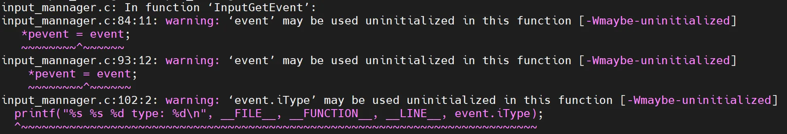  

```c
/* 中间层，只进行数据的上报和汇总 */
static int InputGetEvent(pInputEvent pevent)
{
	InputEvent event;
	int ret;
	pthread_mutex_lock(&g_tMutex);
	if(GetEventBuf(&event))//得到的不是InputEventbuf[iread]的数据，而是InputEventbuf[iread]的地址
	{
		*pevent = event;
		pthread_mutex_unlock(&g_tMutex);
		return 0;
	}
	/* ... */
}

static int GetEventBuf(pInputEvent pEvent)
{
	if(!DataEmpty())
	{
		pEvent = &InputEventbuf[iread];//错误，修改的只是栈中的pEvent，而对想要修改的pEvent没进行任何操作
		//*pEvent = InputEventbuf[iread];//正确，通过地址的方式修改的pEvent
		iread = (iread + 1) % BUF_LEN; 
		return 1;
	}
	else
	{
		return 0;
	}
}
```

### 头文件交叉包含解决办法  

解决办法：将引起交叉包含的那部分内容提取出来，统一放在common.h的文件中，然后再包含common.h并排除冲突的头文件即可  

sscanf可以处理复杂字符串  

```c
#include <stdio.h>
#include <stdlib.h>
#include <string.h>

int main()
{
   int day, year;
   char weekday[20], month[20], dtm[100];

   strcpy( dtm, "Saturday March 25 1989" );
   sscanf( dtm, "%s %s %d  %d", weekday, month, &day, &year );

   printf("%s %d, %d = %s\n", month, day, year, weekday );

   return(0);
}
```

