# RISC-V


本文是笔者学习RISC-V时系统总结而成的，包含上下两部分，第一部分对RISC-V进行系统性介绍，包含RISC-V项目的基本情况与规范，基本命令的介绍，与OS的关系等内容。其参考资料为b站的[rvos](https://www.bilibili.com/video/BV1Q5411w7z5/)，视频由中科院软件所汪辰主讲，PLCT项目负责人吴伟发布。第二部分系统的介绍了RISCV体系结构部分，虽然与源码级别工程仍有差距，但作为嵌入式软件/系统工程师来说深度广度足够了，该部分参考书籍为《RISCV体系结构编程与实践    -笨叔》，笨叔也有arm相关的著作以及更为出名的Linux相关的书籍，因此笔者也推荐使用笨叔的两本不同体系结构的书籍对比学习。

<!-- more -->

# RISC-V

## 前置知识  

ISA: 指令集架构，是底层硬件向上层软件提供的一层接口规范。ISA的出现使得软件开发者不必关心具体的硬件电路结构
ISA定义了如下方面
* 基本数据类型(byte,word,halfword)
* 寄存器
* 指令
* 寻址模式
* 异常和中断
* ……  

微架构：硬件对指令集架构的实现，注意功耗，发热，速度，成本等制造的问题

ISA的宽度与指令宽度无关，它指的是通用寄存器的宽度

riscv灵感来自于mips，mips最初是斯坦福大学教授的产品，后来由于经营问题失败，该教授也是riscv之父

## RISCV的ISA基本情况

riscv由一个基本指令集+若干个可选的扩展指令集组成，基本指令集永远不会变，

**riscv每条指令宽度32位(虽然有16位的压缩指令集)，但是并没有64位宽的指令。这是由于无论是riscv32还是riscv64都只有32个通用寄存器，区别在于寄存器的位宽是32位还是64位，因此控制这32个寄存器只需要5个位宽的索引就够了，因此riscv只有32位宽的指令，尽管只有32位宽的指令，我们还可以通过LUI以及ADDI指令灵活访问超过4GB内存大小的地址**

基本整数指令集(I)：唯一要求强制实现的指令集，其他指令集都是扩展模块
扩展指令集：M(整数乘法指令集)，A(原子指令集)，F(浮点指令集)，D(双精度指令集)，C(压缩指令集)
特定组合：IMAFD被称为通用组合，用G表示
RV64I：64位的riscv整数指令集，兼容RV32I

压缩指令集是为了提高指令密度出现的。有时arm的一条指令可以执行两个操作，例如LDP和STP内存存储指令，但是在riscv中需要两条指令才能完成: 一条负责执行加载/存储内存数据，另一条负责修改基地址。而这直接导致了编译同一份代码，riscv生成的机器码指令多于arm，这不仅需要更大的存储空间同时还会降低缓存命中率。因此riscv使用16位宽指令代替32位宽的指令产生了RVC指令集，RVC可用于RV32，RV64，RV128上

riscv定义了一32个通用寄存器x0...x31，以及一个pc。pc与arm和x86的不同，它无法在编程中访问
* 对RV32I/64I/128I都一样
* RV32E将32个寄存器缩减为16以满足嵌入式场景
* 如果要支持FD模块则需要额外的32个浮点寄存器  

hart(hardware thread)：为了防止超线程概念被混淆，riscv标准规定了hart概念，一个hart对应的就是一个超线程

riscv规定了三个特权级：machine supervisor user，三个特权级权限依次降低
特权级别的区分在于他们分别有各自的csr(control and state)寄存器，高特权级别可以访问低级别的csr

物理内存保护和虚拟内存：
* 物理内存保护类似x86的实模式，在machine模式中可以指定user模式下可以访问的内存空间及其权限。这样就完成了分段的概念
* 虚拟内存需要supervisor和mmu的支持

异常与中断：尽管在之前已经多次学习了这两个概念，但是在riscv规范中还有不同之处
* 当程序触发异常时，cpu会跳转到异常处理程序，这个处理程序由开发者自行编写，当处理程序执行完毕后**跳回到发生异常的代码重新执行**
* 当触发中断时，cpu会跳转到中断处理程序，这个处理程序由开发者自行编写，当处理程序执行完毕后**跳回到发生中断的下一行代码执行**

elf文件主要有四类：
* .o
* .out
* .so
* 核心转储core文件

elf文件大致内容如下

elf header指定了该elf文件的基本内容，包括编译器，可运行的架构等内容，program header table指定了运行时该以何种方式加载进内存。section header table表示了该文件链接时是如何生成的。不将这些section直接加载进内存的原因是这些段需要内存对齐，一旦对齐会浪费很多空间。因此program header table将相似的section作为segment来将其加载进内存

由于elf文件内有许多运行代码时不需要的调试信息，我们可以生成.bin文件来删除这些信息

## RISCV汇编

**下面的指令均以RV32I为例**

汇编程序语法与编译器有很大关系，在gnu工具链上的汇编程序在llvm可能不会运行

riscv汇编的结构：
[label:][operation][comment]
* label：gnu汇编中，任何以冒号为结尾的标识符都被视作标号，label可以被视为地址
* operation：
    * instruction：直接对应机器指令的汇编指令
    * pseudo-instruction：一条伪指令可以产生多条机器指令
    * directive：以"."用来控制汇编器处理代码的指令
    * macro：采用.macro自定义的宏
* comment：注释，常用# ; //

指令长度ILEN：32bits(RV32I)
指令对齐IALIGN：32bits(RV32I)
指令在内存中按小端序排列

大段序：数据高位放在内存低地址
小段序：数据低位放在内存低地址

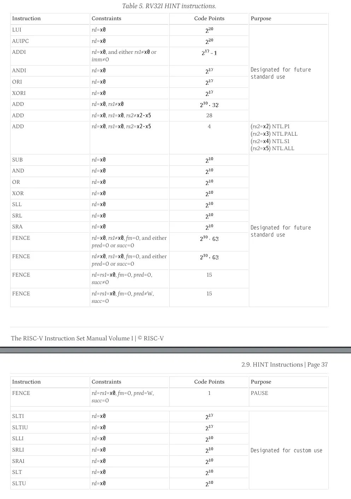


### 算数运算指令  

rs：register source
rd：register destination


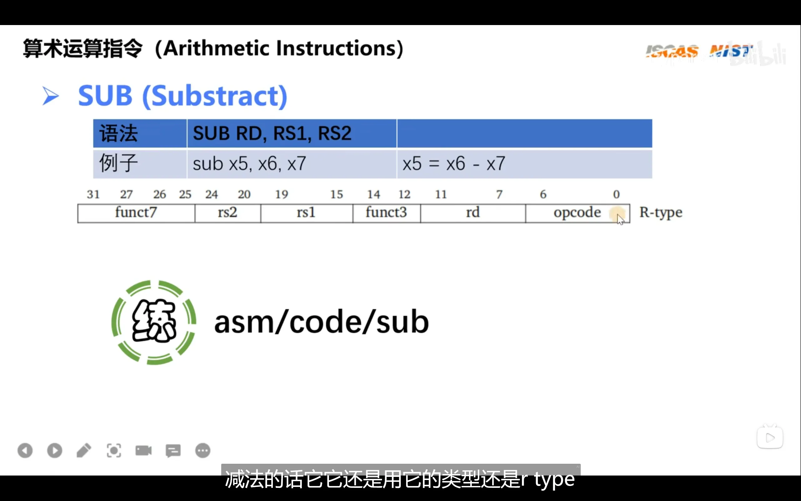

立即数


riscv没有subi指令，这是由于subi可以用addi代替


直接加载一个大数会出现符号问题

这时会出现addi x1,x1,0xfff实际上加的是-1的情况


代码中常用li指令赋值，之后由汇编器进行判断对指令转换成何种形式


auipc用于构造相对地址，常用于相对寻址和位置无关码的生成中


使用la伪指令后，链接器会自动找到label的地址并替换，最后使用auipc进行寻址

### 逻辑运算指令  

riscv只提供了与，或，异或等指令，并没有直接提供非指令，非指令通过伪指令来提供，实际上它是使用异或来实现的

> 如下异或运算
>    10101010
> ^11111111
>    01010101
因此可以凭借异或取反  

### 移位运算指令

移位运算可以通过寄存器指定移位的值，也可以通过立即数指定
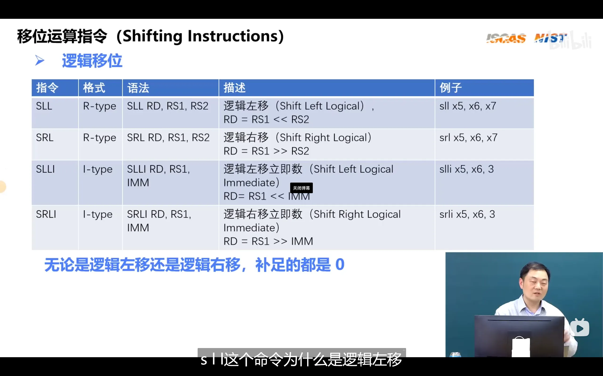

算数移位只有右移没有左移，因为左移会把符号位移丢弃
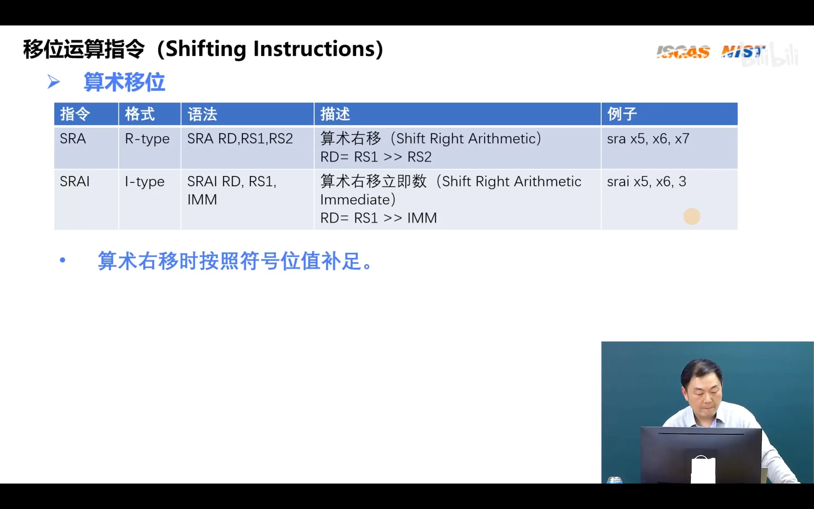

### 内存读写指令

sign-extended：符号扩展，如果取到的数的位数不足32bit，那么剩下的bit使用该数的符号位填充剩余的位
zero-extended：零扩展，如果取到的数的位数不足32bit，那么剩下的bit使用0填充剩余的位


内存写指令没有0扩展或者符号扩展是因为磁盘存储单位是字节，不必区分两种扩展

### 条件分支指令  


### 无条件跳转指令

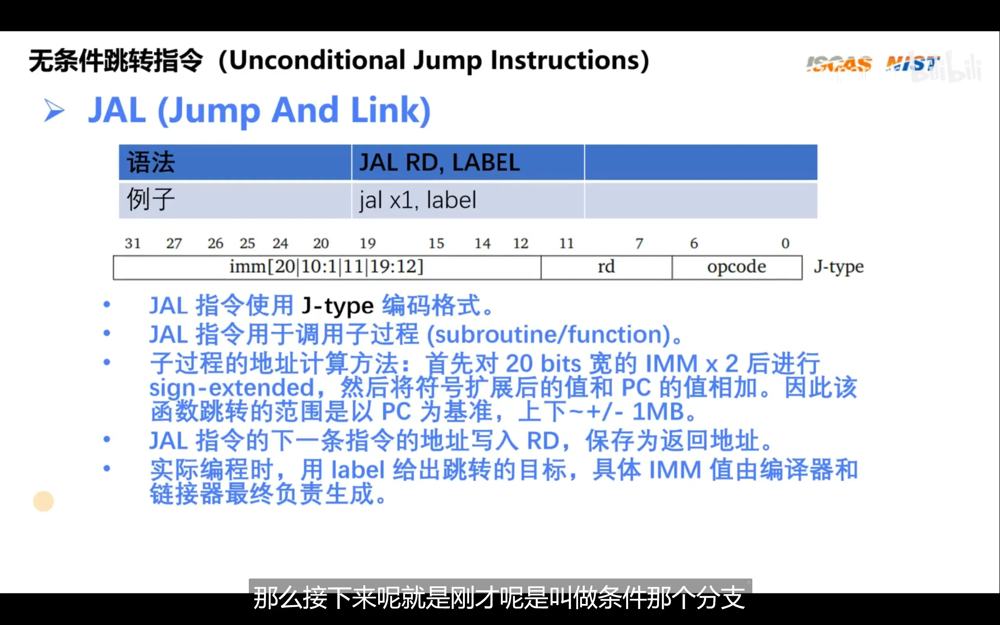

## 汇编函数调用约定  

**注意：ra存放的是函数返回地址，a0存放的是函数参数和返回值**


函数参数使用a0-a7传递，返回值使用a0和a1传递

我们在编程时常使用伪指令，尤其是call和ret
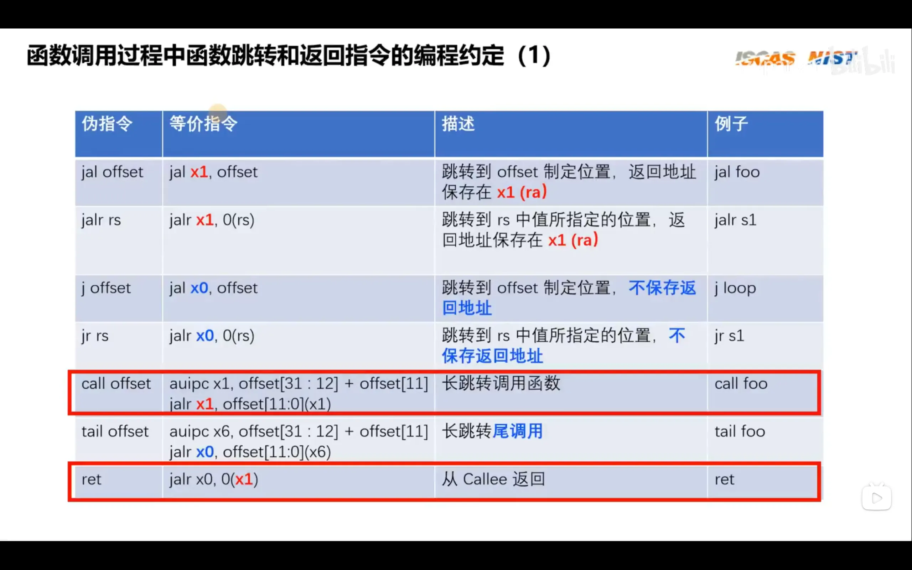

编写汇编调用函数时需要在被调用的函数最前方写压栈操作，末尾写出栈操作。在编写c代码时不必如此，因为编译器会自动生成这些代码

## 汇编与C混合编程

在汇编中调用c函数直接使用call func_name即可

在c中调用汇编代码规则如下：
```c
asm volatile(可选)(
        "汇编指令"
        :输出操作数(可选)
        :输入操作数(可选)
        :可能影响的寄存器(可选)
    );
```
volatile可以取消编译器的优化

例如如下代码
首先是复杂一点的
```c
int add(int a, int b){
    int c;
    asm volatile(
        "add %[sum], %[add1], %[add2]"
        :sum"=r"(c)
        :[add1]"r"(a),[add2]"r"(b)    
    );
    return c;
}
```
sum，add1，add2是寄存器的代号，这里要求编译器提供，因为如果我们强行指定寄存器可能会丢失这个寄存器之前的内容。"r"代表对寄存器进行操作，同时我们也可以使用m代表对内存进行操作

由于sum，add1，add2是寄存器的代号，因此上面的代码还可以进行简化
```c
int add(int a, int b){
    int c;
    asm volatile(
        "add %0, %1, %2"    //这里可以不必指定名称
        :"=r"(c)
        :"r"(a),"r"(b)    
    );
    return c;
}
```

## 杂项  

在启动时，无论有多少个核，只会有一个hart id为0的才会进入启动流程，其他核都被wfi
```c
_start:
    #park hart with id != 0
    csrr t0 mhartid
    mv tp t0
    bnez t0 park
    
park:
    wfi
    j park
```
csrr是csrrs的伪指令，csrrs(control state register atomic read and set)，csrr只保留了读取csr的功能

riscv采用了类似arm的统一编址的方法，不必像x86那样需要使用独立的io命令才能读取对应的寄存器，我们只需像使用内存那样使用io的寄存器即可。但是在使用时需要先将io寄存器映射至地址空间，这个过程类似加载dram：如图所示，尽管dram拥有0x8000 0000-0x8800 0000的128m地址空间，但并不意味着cpu可以任意访问这128m地址空间，这只是说明，在这台机器上支持插入不大于128m的内存。同理，io的映射也是如此


各个.o文件统一被链接为可执行文件的过程会使用链接器脚本，脚本内部指定了链接时各个.o文件的各个段该如何加载为一个.elf文件中的一个段，以及该段应该被加载进内存的哪个位置。而这些信息会根据板子的不同而不同

链接器脚本会自动帮我们算出各段的起始地址和大小，我们可以给予其名称来在c代码中调用


## rvos  

rvos启动流程(没有bootloader)：
* 设置全局栈的大小
* 选择id为0的hart
* 利用该hart和全局栈大小初始化栈指针
* 跳转到start_kernel函数
* 在start_kernel内初始化第一个任务(将第一个任务的地址放入ra，第一个任务的栈地址放入sp)并执行调度器

### 中断和异常

riscv的csr


mtvec类似arm的中断向量表的基址寄存器

mtvec的vectored mode类似于arm的中断向量表

类似函数调用时需要保存当前指令地址，调用中断处理函数也需要保存当前正在执行的函数的执行位置，这时应把当前执行指令的**当前指令或下一条指令**保存到mepc


mcause是中断异常原因寄存器


mtval可以获得更详细的异常信息
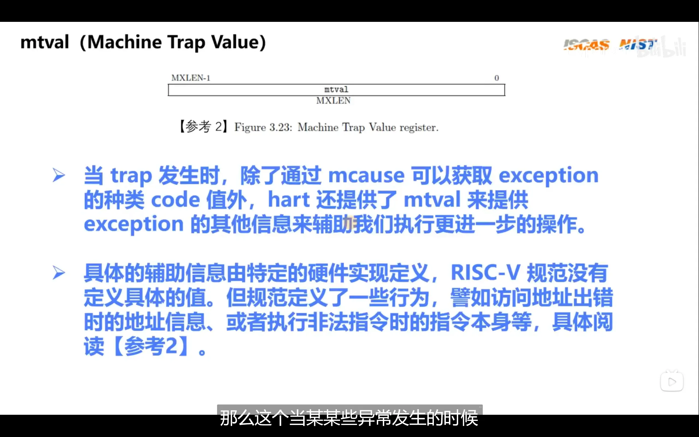

mstatus的xpie可用于恢复中断时获取原中断状态，xpp用于保存中断发生值前的权限级别(user/supervisor/machine)
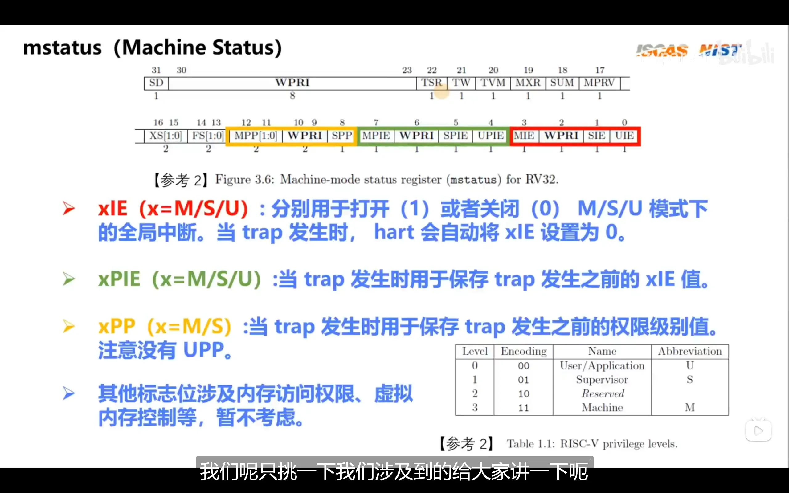
xpie与xpp的p指的是previous

riscv的trap处理流程分为上下两部分，上半部通过硬件设置寄存器完成，下半部通过软件处理trap完成
需要注意的是，riscv默认不支持中断嵌套


从特权模式下返回


mie可以被写，用来控制中断开关，mip可以被读，用来获取中断状态


plic(paltform level interrupt controller)类似于linux的pinctrl子系统中的gic，它负责将多个中断源汇聚起来分配给若干个hart
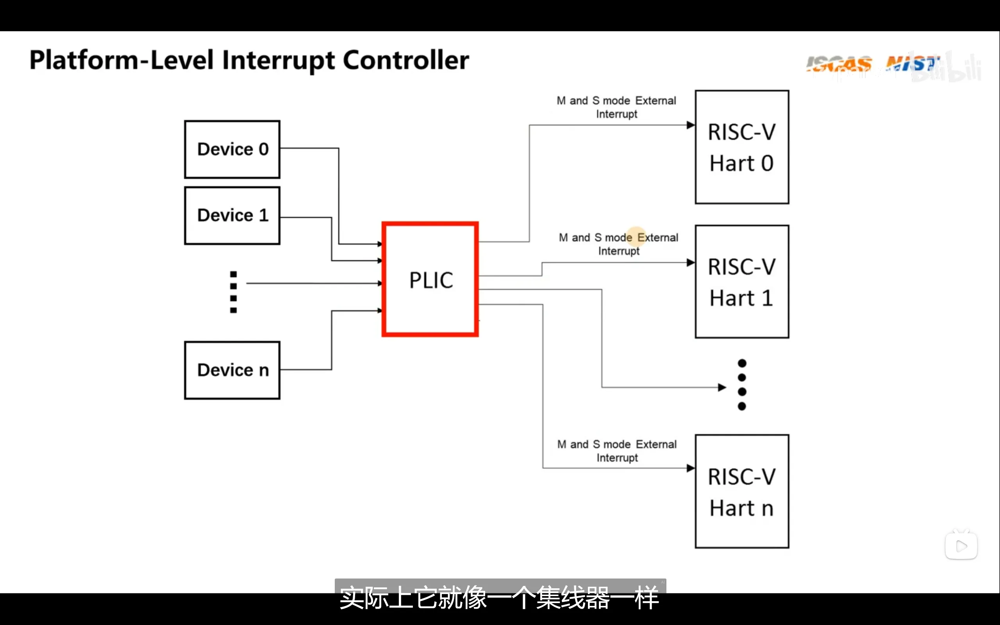


软中断不同于外部中断和定时器中断是硬件触发的中断，它是软件触发的中断。我们只需要在clint的msip寄存器写1即可触发，这样就实现了软件控制

异常处理流程总结
* 发生异常时，触发异常的指令被保存进mepc寄存器内
* 根据异常来源设置mcause寄存器
* 将mstatus寄存器的mie位保存进mpie位，并将mie位清零即禁止中断，同时还要通过软件将触发异常时的权限模式保存进mstatus的mpp位
* 将pc值修改为mevec寄存器的值，该值保存了异常处理入口
* 处理异常
* 处理完成后使用mret指令返回
    * 该指令将pc设置为触发异常时保存的mepc的值
    * 将mstatus的mpie位恢复到mie位来恢复中断，同时通过软件将权限模式设置为mpp位的值

### 内核态与用户态  

rvos只实现了m，u两种状态，其原理是在start_kernel之前的汇编代码中需要设置mstatus寄存器的mpp标志位来使中断恢复后系统位于m特权级，为了支持用户态，我们只需取消设置mpp位即可，这样在中断恢复时系统会变为用户态

在用户态我们就无法获取内核态所能访问的寄存器，例如mhartid寄存器，当用户态强行访问该寄存器时会触发异常，之后系统会转到异常调用表里执行对应异常处理函数(此时并未涉及到系统调用号)。从用户态转为内核态时需要使用ecall指令，内核处理完成转为用户态时使用eret指令

ecall用于主动触发异常，根据触发异常时系统的特权模式产生不同的异常码，异常产生时epc寄存器存放的是ecall指令本身的地址，我们还需要将其+4后执行否则会造成死循环，处理异常后需要调用mret指令将内核态切换到用户态


与其他体系架构不同的是，riscv在切换特权级别时并没有寄存器或者比特位来存储系统调用号，它参考linux系统调用，规定了系统调用号放在a7寄存器中

上图的trap_handler是根据riscv芯片手册指定的异常处理函数编写的，内部包含了缺页异常，io异常，系统调用，除零异常等异常

对于syscall头文件需要分为两份，一份给c库，一份给内核。这样在程序开发者的手中可以根据libc的库文件编译出来包含系统调用的app，app在运行时就可以调用内核的系统调用


## RISCV体系结构编程与实践    -笨叔

### 链接器与脚本  

链接器ld(loader)：在早期unix系统中被称为加载器，是os的一部分，后来由于os越来越复杂，链接器就独立出来了 

ld常用选项： -T    指定链接脚本
                     -Map    输出一个符号表文件
                     
链接脚本：采用AT&T链接脚本语言

SECTIONS{
    .=0x80000000;
    .text:{\*(.text)}
    .=0x80002000;
    .data:{\*(.data)}
    .bss:{\*(.bss)}
}
"."表示当前位置计数器，用于把代码段和数据段的链接地址设置为0x80000000和0x80002000
"\*"表示所有.o文件，\*(.text)表示所有.o文件的代码段。可以看出，连接器脚本只指定段，符号的地址，而不指定符号的值，具体值如何是在高级语言内指定的

在实际的编程中，我们常常要访问链接脚本的符号(如rtt中将at命令单独放在一命名符号段)，我们可以进行如下操作

```c
start_of_ROM=.ROM
end_of_ROM=.ROM+SIZEOF(ROM)
start_of_FLASH=.FLASH
```

在C中可以通过以下操作访问符号的段

```c
extern char start_of_ROM, end_of_ROM, start_of_FLASH;
memcpy(&start_of_FLASH, &start_of_ROM, &end_of_ROM - &start_of_ROM);
```
这样就可以将ROM段的内容拷贝到FALSH
实际上，我们也可以将段视为数组
```c
extern char start_of_ROM[], end_of_ROM[], start_of_FLASH[];
memcpy(start_of_FLASH, start_of_ROM, end_of_ROM - start_of_ROM);
```
这样就不用取址了

脚本语言内置函数
* ABSOLUTE(exp)

```c
SECTIONS
{
    .=0xb000;
    .myoffset:{
        myoffset1 = ABSOLUTE(0x100);    #myoffset1地址: 0x100
        myoffset2 = (0x100);        #myoffset1地址: 0xb100
    }
}
```

* SIZEOF(SECTION)
返回一个段的大小
* PROVIDE
将链接脚本中的一个符号导出
* INCLUDE
引入另外的链接脚本

### 内联汇编与C宏结合

宏参数使用"#"，预处理器会将其转为字符串
"##"用于连接两个标识符
```c
#define ATOMIC_OP(op, asm_op,i,asm_type,c_type,prefix)
static __always_inline
void atomic##prefix##_##op(c_type,I,atomic##prefix##_t *v)
{
    __asm__ __volatile__(
        "amo"#asm_op"."#asm_type"zero, %1, %0"    #假设asm_op参数为add，那么该行为amoadd.w zero %1, %0
        :"+A"(v->counter)
        :"r"(I)
        :"memory");
    
}

#define ATOMIC_OPS(op, asm_op,I)
ATOMIC_OP(op, asm_op,I,w,int,)

ATOMIC_OPS(add,add,i)
ATOMIC_OPS(add,add,-i)
```


### 加载地址，运行地址与链接地址

### 加载重定位

### 链接器松弛优化  

链接器松弛优化可以分为两种优化方式
* 函数跳转优化
这种优化可以减少不必要的指令，本质是编译器使用jal指令代替auipc(20位imm左移12位)+jalr(12位有符号数内寻址)指令，前者可在PC±1MB(21位有符号数)范围内寻址，后者可在PC±2GB(32位有符号数)范围内寻址
例如该指令
```c
auipc ra 0x0
jalr -24(ra) #5fc<foo>
```
可被替换为
```c
jal ra, 5ea <foo>
```

* 符号地址访问优化
使用gp寄存器进行相对寻址以节省指令，gp指向.sdata段中的一个地址，若某变量位于改机制±2KB范围内，可以使用lw或addi来代替auipc+addi指令

### SBI

SBI(system binary interface)：sbi与abi类似，前者是isa给os提供的接口，用于串口打印，中断管理，tlb管理以及启动管理，后者是os给app提供的接口，用于资源管理，锁管理等等

sbi提高了硬件的可移植性，可以在不同种类的os上无感移植，并且提高了芯片的安全性。sbi固件运行在m模式，给s模式的os提供接口

### 异常处理

riscv支持的异常处理模式
* 直接访问模式
所有陷入m模式的异常都会跳转到mtvcc的base字段的地址，但**需要软件去判别mcause的值并指定对应的异常处理程序**
* 向量访问模式
跳转到异常向量标的某一项，该项**由硬件查询mcause的值并计算出来，无需软件帮助**

异常不仅有m模式还有s模式，这可以避免因模式切换带来的性能损失

riscv中断分为本地中断(软件，定时器)，和外部中断(外设等)，本地终端通过CLINT(core local interruptor)产生并直接发送给hart来处理，外部中断由外设等产生，经由PLIC路由再发给对应的hart处理，因此内部中断无需PLIC路由


svc是arm的触发软件中断进入内核层的命令，ecall是riscv的。svc通过立即数传递系统调用号，ecall通过寄存器传递。并且ecall还支持从s模式向m模式切换

### 主存，高速缓存与TLB简要介绍

多进程访问同一个虚拟地址可以成功的原因是，每个进程都有自己的运行空间，也就有一套自己的页表，根本原因是切换进程时需要切换页表基地址寄存器，这样在查找n级页表时就是对应进程的n级页表了

rv64通常使用3(sv39)或4级页表(sv48)，rv32使用二级页表(sv32)，所谓的svxx指的是虚拟地址的低xx位用于页表索引

以内存为视角，体系结构分为两种：UMA(均匀存储器)， NUMA(非均匀存储器)
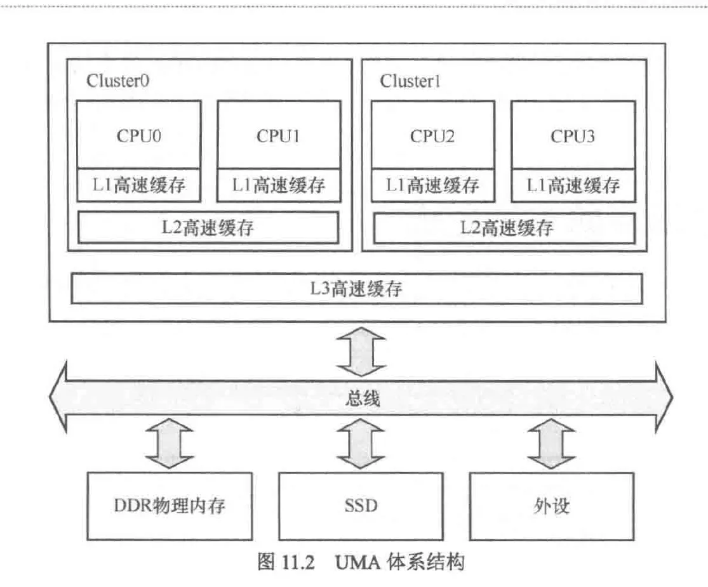


tlb只缓存查询页表的结果

以vipt(virtual index physical tagged)为例讲解cpu寻址过程：
cpu访问虚拟地址时，会将其同时发给tlb和高速缓存，若tlb未命中，则需创建对应线程的页表，并将地址和数据写入高速缓存中以待cpu读取。若tlb命中，则直接获取物理地址，并根据该地址从告诉缓存中获取数据


同时高速缓存根据虚拟地址的索引来确定所需的数据位于哪个组，并通过标记域修在组内寻找高速缓存的某一行，若找到就被称为高速缓存命中。若未命中，则需要重新从主存获取数据

由于高速缓存是按行来组织的，因此cpu每次访问内存都至少会将一个高速缓存行大小的数据写入高速缓存，这样，内存中实际的最小单元就不是字节而是高速缓存行大小了。例如某个高速缓存有如下组织：
* 1路，128行，共64KB高速缓存，每行512字节
因此，在主存就被划分为若干块的区域，每块大小32KB，内存地址与高速缓存的地址映射关系是：数据在高速缓冲区的行号=主存地址%32KB/512，在缓存的内的偏移量为主存地址%32KB%512


如果我们访问内存的数据都落在0x80000000-0x8000000FF，高速缓存将发挥他的最大威力，但是当我们访存的数据位于0x80000000，0x80000100，0x80000200，那么高速缓存的第一个缓存行就会被频繁的换入换出，这就是高速缓存颠簸

高速缓存的组织方式包括以下三种
* 直接映射
* 全相联映射
* 组相联映射


为了解决缓存颠簸问题我们采用了组相连缓存的组织方法，我们只需要将原来的缓存大小一分为二，这被称为2路组相连缓存，其中一个作为备份以应对缓存颠簸，当颠簸发生时，我们有50%的可能性会发生缓存换入换出的问题，如果是4路，该问题发生的可能性降低为25%
**注意，当采用组相连缓存时，新的组概念意味着彼此不同路的行的集合，路概念被保留**


cpu使用地址访问高速缓存时，传入的地址是虚拟地址还是物理地址？这实际上分为3种情况
1. cpu通过物理地址查询高速缓存，这种方式每次都需要查询tlb，效率较低

2. cpu通过虚拟地址查询高速缓存

3. 实际上，还有一种物理地址和虚拟地址结合的查找方式，详见下文

当cpu通过地址来查找高速缓存时，该地址被解析乘标记域和索引域。也就是说标记域与索引域可能来自虚拟地址也可能来自物理地址，因此有如下3种情况
1. PIPT(physical index physical tagged)，传入的是mmu转换过的物理地址，该地址的索引段和标记段均由物理地址组成，不会导致重名问题以及别名问题。该种组织方式对于大规模高速缓存很友好，但代价是每次获取数据时都需要mmu的参与
2. VIPT(virtual index physical tagged)，传入的是物理地址与虚拟地址的混合体，该地址的索引段为虚拟地址，标记段为物理地址。查找缓冲区项时，需要比较虚拟索引查找高速缓存组与并使用物理标记判断是否为所需的内存地址，这会有重名问题
3. VIVT(virtual index virtual tagged)，传入的是虚拟地址，会导致重名问题以及别名问题，相比PIPT方式，该方式实现的mmu更简单

VIPT可以完全避免歧义问题，这是因为无论进程如何切换，尽管va可以重复，但仍需pt才能识别对应的高速缓存行。而pt则是唯一的，因此VIPT可以完全避免歧义问题
VIPT解决别名问题的办法：由于别名问题产生的根本原因是多个va引用了同一个pa导致数据不同步的现象，并且在同一个进程内是不会产生别名的，哪怕该进程使用了共享内存。因此要避免别名只需上下文切换时通过冲刷高速缓存(先使主存有效，后令高速缓存无效)保证数据同步即可


tlb的作用类似高速缓冲区，因此可以由直接映射，全相联映射，组相联映射三种方式组成


arm9采用的是VIVT方式，arm11采用的是VIPT方式，arm偏爱虚拟索引的原因是不必每次访存都依赖mmu，后期采用物理标记的原因是避免虚拟标记产生的重名问题

* 重名(也被称为歧义)问题：多个不同的VA映射到一个PA
* 缺点：
    * 浪费高速缓存空间
    * 缓存一致性问题
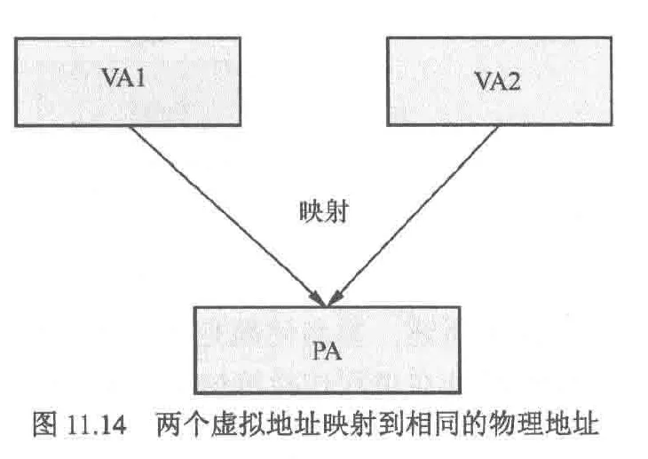

* 同名(也被称为别名)问题：相同的VA对应不同的PA，这产生于进程切换时，由于不同进程的VA空间是相同的，这就造成了不同进程可能拥有相同的VA，但VA对应的PA不同
* 缺点：
    * 获取到其他线程数据造成错误
* 解决办法：切换线程时把脏的高速缓存写回内存，然后使所有高速缓存行失效，这样新进程就会得到干净的虚拟高速缓存，同时，也有对tlb执行清除操作。但是这个办法并不好，由于每次切换进程时都需要让高速缓存的数据失效，这会造成效率问题。rv架构给出了ASID的解决方案，这会在后文详细介绍


在rv规范中，要求处理器不允许产生别名问题，因此该问题需要在微架构层面得到解决

重名问题的解决：

总结：重名，同名问题都存在于虚拟高速缓存中

高速缓存策略：
* 写命中时(在高速缓冲区找到要写的数据)
    * 直写：将数据不通过写缓冲区直接写回内存，这会占用总线带宽
    * 回写：将数据暂存到写缓冲区里，等到合适的时机在回写内存，这会产生缓存一致性的问题
* 写未命中时
    * 写分配：把要写的数据加载到高速缓存中，后修改缓存内容
    * 无写分配：不分配高速缓存，直接写回内存
* 一致性策略：LRU，最近最少使用算法

高速缓存管理指令：
* 失效(CBO.INVAL)：使某一缓存行失效，丢弃上面的数据
* 清理(CBO.CLEAN)：把标记位脏的缓存行写入下一级缓存或内存，然后清除脏位
* 冲刷(CBO.FLUSH)：失效+清理

在缓存一致性系统中，一个数据可能在各种主控制器(cpu，gpu，加速器等)内有多个副本，其中任意一个主控制器执行高速缓存管理指令就会通过广播导致其他所有主控制器执行该指令

### 缓存一致性与MESI协议

尽管MESI协议对软件透明且解决了大部分一致性问题，但仍有少部分问题需要软件解决

cpu簇的一致性需要AXI总线协议实现

解决多核间缓存一致性的方法
1. 关闭高速缓存：这会造成功耗上升，性能下降
2. 使用软件维护一致性：调试难度上升，增加软件复杂度
3. 使用硬件维护一致性：MESI协议，实现该协议的硬件被称为scu(snoop control unit)，监听控制单元
系统间缓存一致性的方法需要使用缓存一致性总线协议，如ACE

下面对MESI协议做简要介绍：
M：数据有效，已被修改，只存在于本地cpu高速缓存中
E：数据有效，**数据和内存中一致**，只存在于本地cpu高速缓存中
S：数据有效，已被修改，**存在于多个cpu高速缓存中**
I：**数据无效**

假设系统有cpu0-cpu3 共4个cpu，每个cpu都有各自的一级缓存，他们都想访问数据a
* T0时，4个cpu默认状态为I(数据无效)
* T1时，cpu0率先访问a(读)，cpu0进行本地读时发现并没有数据，因此通过总线发送BusyRd信号询问其他cpu，其他cpu回应无数据，因此，cpu0只能老老实实的从主存中获取数据，并将高速缓存行状态设置为E(数据和内存状态一致)
* T2时，cpu1发起读操作，此时只用cpu0有副本，因此cpu0会应答cpu1的读操作并将数据发送，同时cpu0，cpu1将状态设置为S
* T3时，cpu2想修改a(写)，cpu2发送BusRdX(总线写)信号到总线，其他cpu会将数据对应的的高速缓冲行失效，也就是设置为I，并发送应答信号。cpu2收集所有应答信号后将本地高速缓存设置为M状态，并写入a的值

#### 高速缓存伪共享

当某2个数据位于同一行高速缓存行且有2个cpu想修改这2个数据时就会出现问题，其表现是2个cpu会反复修改本地的缓存行并反复让对方的缓存行失效，这会带来严重的性能问题

解决的办法是在软件中避免此类问题
1. 缓存行对齐技术：通过__attribute__(__aligned__xxx)将一个结构体的所有成员对齐到同一个高速缓冲行，因此当需要修改该结构体时只需要一个cpu的一次操作。多个cpu想同时修改该成员的情况也就不会发生了
2. 缓存行填充技术：通过数组占位来时结构体成员对齐到复数行，其中需要频繁修改的成员单独占一行。这常用于无法使用的缓存行对齐的大型结构体
缓存行填充技术的例子：
```c
struct zone{
    spinlock_t lock;
    struct zone_padding pad2;    //填充数组使两个自旋锁分别位于缓存行两行
    spinlock_t lru_lock;
}

strcut zone_padding{
    char x[0];
}__cacheline__internodealigned_in_smp;    //使用该内建函数可以填充某一个高速缓存行
```

高速缓存伪共享十分影响性能，我们可以使用perfC2C工具检查代码是否存在高速缓存伪共享的问题

#### DMA与高速缓存一致性

DMA的数据运输对cpu来说是高效但透明的，这会产生一致性问题
解决：
* 当数据需要从内存发送到设备fifo时
    * cpu侧软件的数据先对内存中的DMA段进行刷写，防止DMA数据是旧的或者cpu的高速缓存已经产生新的数据但并未同步到DMA
    * 外设通过DMA将DMA缓冲区的数据转移到外设fifo中
    * 当cpu软件侧产生新数据时立即使用缓存清理命令将数据刷写到内存的DMA缓冲区中
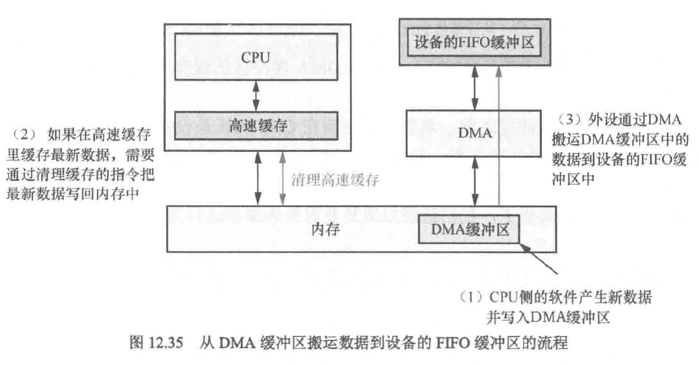

* 当数据需要从设备fifo发送到内存时
    * 首先由设备接受新的数据并转交给内存中的DMA段
    * 若高速缓冲区有数据则令其失效，因为此时的数据是上次传输的旧数据
    * DMA将设备数据由fifo搬运到DMA缓冲区中
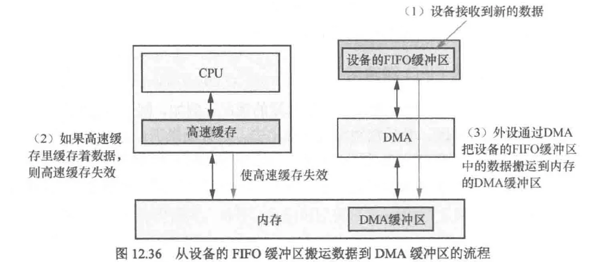

因此，DMA的缓存一致性问题只需要考虑两个方面
* 最新的数据在cpu侧还是设备侧？若为cpu侧则立即清理高速缓冲区，若为设备侧，则令缓冲行失效
* DMA缓冲区对应的高速缓冲区的数据是最新的还是过时的？是最新的则清理，过时的就失效
还需要注意的是，有的系统会将冲洗高速缓存操作放到上下文切换中进行，这样，cpu每次读写高速缓存时就不必显式冲洗高速缓存了。但该方式不能用于异步io，这是因为异步io要求进程和io操作并行完成。而DMA与io本身并不包含冲洗这种阻塞操作，该操作是位于两者之间的过度操作，无法将其放于异步io的框架下

#### MESI协议的问题与内存屏障

MESI进行数据同步时需要操作发起方进行等待，如cpu0想要写a这个变量，如果此时a不再cpu0的本地，那么他就会发送BusRdX信号给其他cpu，并**等待**其他cpu的结。其他cpu会将a标记位I(无效)并广播修改完毕的信号。此时cpu0才能收集到全部信息并写a的值。这样会使cpu0进入停滞(stall)
解决办法是另设存储缓冲区，其位于cpu和l1缓存之间，这样在cpu0等待时执行其他操作，并将a写入存储缓冲区，等到其他cpu完成广播时再将数据从存储缓冲区转移到l1缓存
但是这也带来了乱序的问题，当其他核的代码依赖于a时，由于其他cpu实际上并未使a失效，只是将a阻塞在它们自己的存储缓冲区内，这样当乱序执行时，如果再次使用a，则会使用到a的旧值
这个问题的解决办法是使用写内存屏障指令(fence w w)将所有写内存屏障指令之前的存储操作完成后才处理该指令之后的存储操作
例如下图会将abcd写入l1完成后，再写入ef
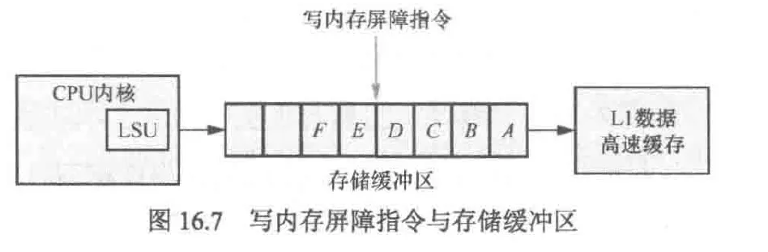

同样的，令其他值失效时MESI也有类似的缺点，当cpu0需要写一个本地无缓存的数据，此时其他cpu的失效操作仍需要一定时间，这时，当系统需要大量加载和写操作时，整体效率会变低。因此可以引入无效队列，当其他cpu想要令本地cpu某个数据失效时，本地cpu会将该数据放入无效队列，并立即恢复应答信号等之后有空闲时再执行失效操作
同样的，这也会产生乱序问题，当失效操作只是挂载到失效队列而没有执行时，如果其他cpu发来读数据的操作，那么就会读到该数据的旧值，解决办法是使用读内存屏障指令(fence r r)将读数据之前的所有无效队列的数据全部失效

对于自旋锁而言，不同体系结构有不同实现方式，对于x86而言，由于其内部结构是强内存一致性模型，自旋锁实现就隐含了内存屏障。但对于rv的rvwmo规范，其实现的是弱一致性模型，自旋锁的实现并不包括内存屏障指令，这也是弱一致性模型效率高的表现，但这也会造成指令乱序的问题，因此rv为了保证锁的正确性，在自旋锁的实现中也引入了内存屏障指令作为每次调用smp自旋锁后的api，这样，在linux内核中rv的锁编程会多出一步调用内存屏障指令api的操作

### ASID

由于tlb方指的是VA与PA的对应关系，而pa是不会变得，因此没有重名问题(多个不同的VA映射到一个PA)，但在线程切换时会有同名问题，这可以通过刷新tlb解决，但这不是好的方法，更好的解决方案是使用asid

由于tlb可以分为以下两种
* 全局类型tlb：用于内核空间，可以不刷新
* 进程独有tlb：用户进程空间，应当刷新
因此rv体系提供了这样一种方案：让tlb识别asid属于哪个进程。这样，即使是进程独有的tlb，与可以在进程切换时不刷新tlb了，rv的asid储存在satp寄存器中
这样通过tlb查询页表步骤如下：
1. 通过va的索引域找到对应的tlb组
2. 通过虚拟地址的标记域找到组内某行
3. 和stap寄存器的asid以及属性进行匹配，若匹配，则tlb命中，这是新增的步骤
在页表项内，还有一位和tlb相关，这就是G位，用于表示全局类型的tlb页表项
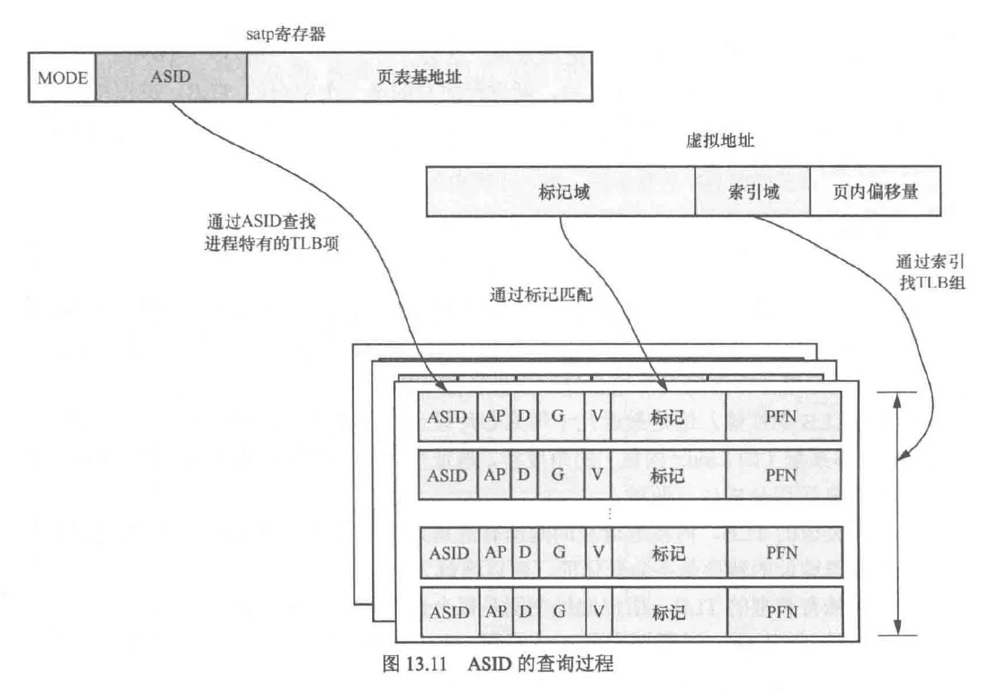

rlb刷新查找页表的操作已被OpenSBI实现了，并开放接口给Linux

### BBM(break before make)

Linux中，在一些复杂的替换操作执行前，首先要让被替换的内容失效，以防止其他进程引用了过时的资源导致错误

原子指令是一个整体，不能用仿真器调试，如下3-5行
```c
my_atomic_set:
1:
    lr.d a2 (a1)
    or a2, a2, a5
    sc.d a3, a2, (a1)
    bnez a3,1b
```

### 原子指令与CAS

rv中，原子指令的实现方式并不做规定，不同厂家有不同厂家的实现方式

cas是arm的重要特性，该指令用于比较并交换值，常用于无锁编程。期内不愿理乳腺癌：cas检查某个值是否是原值，若为原值则赋为新值。但是在rv中却没有对应的指令。这是由于cas会有ABA的问题：既原值在检查时变化了两次，比如由1变3再变回1，这就会使系统误以为原值未改变，因而rv推荐使用lr，sc命令见识所有写操作的地址，从而避免该问题

内存一致性：由于乱序执行，多发射，超标量，编译优化带来的cpu执行代码顺序与源代码顺序不一致的现象

解决办法：使用内存屏障指令

rv中使用fence作为内存屏障指令

内存屏障指令格式：fence iorw, iorw
iorw：邀约数的前后指令类型，io代表设备输入输出类型指令，rw代表读写类型指令
fence rw, w 代表fence语句**之前的rw操作**不应越过fence语句，代表fence语句**之后的w操作**不应越过fence语句
`
### C语言陷阱

类型转换：C的隐射类型转换会造成该问题。例如在赋值表达式中，表达式右侧的值会自动的隐式转换为表达式左边的值。在算术表达式中，段类型，有符号的数据向着长类型，无符号的数据类型进行引述转换。这就带来了隐式转换的问题
```c
#include <stdio.h>

void main()
{
    unsigned int i = 3;
    printf("0x%x\n",i * -1);
}
```
输出结果
```c
0xffff fffd
```
这是因为-1被隐式的转换为unsigned int，其十六进制表达式为0xffff ffff，i * -1就变成了3 * 0xffff ffff

整型提升：使用段类型的数据时，入否该数据可以用int表示则转换为int，否则用unsigned int表示。这么做的目的是使cpu内部的alu充分利用通用寄存器的长度，对于两个char类型的计算，cpu乃以实现字节相加的运算，这就需要在cpu内部要转换为通用寄存器的长度再运算

```c
#include <stdio.h>

void main()
{
    char a;
    unsigned int b;
    unsigned long c;
    a = 0x88;
    b = ~a;
    c = ~a;
    printf("a = 0x%x, ~a = 0x%x, b = 0x%x, c = 0x%x\n",a, ~a, b, c);
}
```
结果为
```c
a = 0x88 ~a = 0xffff ff77 b = 0xffff ff77 c = 0xffff ffff ffff ff77
```
这是因为~a会转为int类型

移位操作：在C中，整数变量被看作int类型，如果一味地范围超过int的位数，那么就会失效了
```c
#include <stdio.h>

void main()
{
    unsigned long reg = 1<<33;
    printf("0x%x\n", reg);
}
```
上面的代码虽然可以编译通过，但是有警告，正确的做法是使用`1UL`，这样编译器会把1视作`unsigned long`类型

C语言还有符号扩展的问题，当要把一个带符号的整数提升为统一类型或更长类型的无符号整数时，它首先被提升为更长类型的带符号等价数值，然后转换为无符号值
```c
#include <stdio.h>

struct foo{
    unsigned int a:19;
    unsigned int b:13;
}

void main()
{
    struct foo addr;
    unsigned long base;
    addr.a = 0x40000;
    base = addr.a << 13;
    
    printf("0x%x, 0x%lx\n", addr.a << 13, base);
}
```
结果为
```c
0x8000 0000 0xffff ffff 8000 0000
```
给base赋值时，addr.a<<13为int类型，它先转换为long再转为unsigned long，从int转为long会发生符号扩展，被移动到最高位的1被认为是符号，被扩展到其余高位以补码形式存在，因此高位显示为ffff

系统启动时建立恒等映射是必要的，这有助于mmu的启动，因为一旦mmu启动，它就会将已经预取的指令按va的方式进行地址转换，因此如果不建立恒等映射使va=pa，那么指令流水就会失败

### 可伸缩矢量计算与优化

SISD(single instruction single data，单指令单数据)，同一时刻只能处理一条数据，大多数rv指令是sisd的
当处理小数据时，需要将一个8位数据对应的加载到一个单独的64位寄存器中，不能有效利用cpu资源
simp对多个数据元素同时执行相同的操作，这些数据元素被打包成一个更大的寄存器中的独立通道(也被称为元素)，假设矢量寄存器的长度是128位，那么add指令会把4个32位数据元素加在一起，这些值被打包到两对128寄存器(v1，v2)中的单独通道中，然后对第一个源寄存器的每个通道与第二个源寄存器的对应通道相加，结果存在v0对应通道中
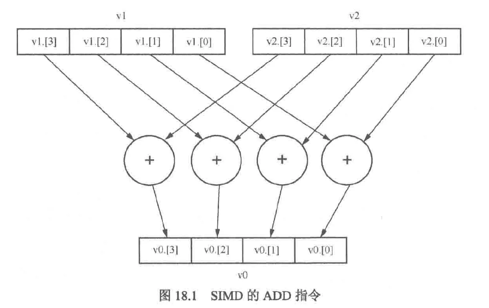

simd非常适合图像处理场景。图像常用rgb565，rgba8888，yuv422等格式的数据，这些格式的特点是一个像素的一个分量用3或4个8位数据表示，处理的时候是能够行处理

#### SIMD的历史

1999年，Intel推出SSE(streaming SIMD extension， 流式SIMD扩展)指令集，解决浮点数运算问题并把矢量寄存器的宽度升级到128位
2008年，Intel发布AVX(advanced vector extension， 高级矢量扩展)，兼容sse的同时把矢量寄存器的长度从128位提升至256位
2013年，Intel发布A V X512，矢量寄存器长度进一步提高至512位

arm阵营中，armv7a推出NEON指令集，矢量寄存器128位，在v8下为256位

由于上述指令集都属于顶长度指令集，64位矢量寄存器无法运行128位的程序，因此arm在armv8.2中引入了可伸缩矢量扩展(SVE，scalable vector extension)指令集，其编程模型被称为可变矢量长度(VLA)模型

rv中，rvv也支持可伸缩矢量计算，rvv支持的矢量长度最大达65536位

矢量运算指令提供3个版本：矢量，标量，立即数
矢量版本：把矢量寄存器1的所有通道与矢量寄存器2的所有通道进行计算
标量版本：通用寄存器的数据与矢量寄存器进行计算
立即数版本：矢量寄存器与矢量寄存器生成的立即数进行计算

#### rvv寄存器组

rvv为矢量计算提供了一个全新的寄存器组，包括
* 32个矢量寄存器(v0~v31)
* 7个非特权级寄存器：vtype，vl，vlenb，vstart，vxvm，vxsat，vcsr

参与运算的矢量长度：必须是$2^n$，最大长度为$2^{16}$(65536位)
元素长度：必须是$2^n$，最小长度为8位

mstatus寄存器：内部的vs字段(Bit[10:9])不仅描述矢量上下文状态，还会映射到sstatus寄存器的Bit[10:9]，在将vs字段赋值为0时，若执行rvv只inghuo访问rvv中7个非特权寄存器都会触发指令异常。当vs字段处于初始状态也就是clean状态时，使用rvv指令或访问非特权寄存器都会改变状态触发指令异常

vtype寄存器：用来描述矢量寄存器中数据类型，决定了数据组织方式和如何对多个矢量寄存器分组。vlmul字段决定了多少个矢量寄存器可以组成一个矢量寄存器组，这样一条指令就可以同时操作这组寄存器了，vlmul不仅可以被设置为整数也可以设置为分数，这样就完成了高位宽rvv指令集对低位宽指令集的兼容

vl寄存器：用来记录在矢量指令中处理元素的数量

vlenb寄存器：指定一个矢量寄存器内有多少字节，该值在硬件设计时就确定了

vstart寄存器：用来只是第一个参与匀速啊的呢数据元素的索引，通常位0，不为0时执行某些运算会触发指令异常

#### VLA模型

vla的实现依靠软硬件共同完成，硬件方面由底层提供配置寄存器，vtype以及vl，前者配置要处理数据类型的位宽后者配置每次处理数据元素的个数
一般使用vsetvli指令设置：

```c
//初始化vl和vtype寄存器，其中有效元素位宽为8(eew=8)，有效组乘系数=1(emul=1，使用一个寄存器组成一个寄存器组)。假设矢量寄存器长度为128位，那么一个寄存器组内元素的数量为16
//并把vl的值存在t0寄存器中，a2表示要处理的字节数
vsetvli t0, a2, e8, m1

//初始化vl和vtype寄存器，其中有效元素位宽为16(eew=16)，有效组乘系数=1/2(emul=1/2，使用一个寄存器组成两个寄存器组)。假设矢量寄存器长度为128位，那么一个寄存器组内元素的数量为8
vsetvli to, a2, e16， mf2
```

一般情况下，矢量寄存器的长度组乘系数与有效组乘系数是相等的(lmul=emul)，并且sew=eew，但是在处理不同位宽的数据时不会相等，例如8位与16位数据相加，后者自身有2lmul=emul

#### 加载和存储指令

##### 单位步长模式

```c
//从rs1指向的地址加载8位宽的数据元素，vm为掩码操作数
vle8.v vd (vs1) vm

//向rs1指向的地址存储16位宽的数据元素，vm为掩码操作数
vse16.v vd (vs1) vm
```
掩码操作数：rvv提供可以控制每一个数据的方法，若vm为v0.t，则表述用v0矢量寄存器作为掩码，每位表示一个数据元素的状态，若v0[i]==1，表示第i个元素被激活，被激活的元素参与计算，未被激活的则不参与。若未激活的元素的计算策略除了保持不变外还有可能令其为1，这就被称为未知策略，保持不变的策略被称为不打扰策略。这两种策略可以通过配置vtype寄存器的vta，vma字段实现。当掩码操作数在汇编代码中为空时代表激活所有的元素

.v 被称为修饰符，该符号决定了要操作的寄存器的元素的类型，例子如下：
.vv：矢量数据元素与矢量数据元素
.vx：矢量数据元素与整型标量数据元素
.vf：矢量数据元素与浮点标量数据元素
.vi：矢量数据元素与立即数数据元素
.m：掩码元素

##### 任意步长格式

加载指令
```c
//任意步长模式会从内存中以rs1为起始地址，每隔r2为步长，依次将下一个元素加载到vd中，r2的值可以为负数或0
vlse8.v vd (vs1) rs2 vm
```

存储指令
```c
vsse8.v vs (vs1) rs2 vm
```

#### 聚合加载与离散存储

聚合加载与离散存储均支持以下两种模式
* 有序索引：在访问内存时按照索引的顺序有序的访问
* 无序索引：访问内存时不保证索引的顺序

有序索引的集合加载指令
```c
//加载8位宽度数据
vloxei8.v vd (rs1) vs2 vm
```
上述指令以rs1为基地址，vs2中每个通道的数据作为偏移量，而后从内存有序的加载元素到vd中

有序索引的离散存储指令
```c
vsoxei8.v vs (rs1) vs2 vm
```
上述指令以rs1为基地址，vs2中每个通道的数据作为偏移量，而后从vs有序的存储元素到内存中

无序索引的聚合加载指令
```c
vluxei8.v vd (rs1) vs2 vm
```
无序索引的离散存储指令
```c
vsuxei8.v vs (rs1) vs2 vm
```

#### 打包数据的加载与存储

现实中有一些数据是以以定格时打包的，如rgb24，正常情况下需要将rgb24加载到矢量寄存器中，之后将其解包为r，g，b三个不同的寄存器组，这很麻烦。为此rvv推出此指令，打包数据的加载存储指令也有单位步长，任意步长，聚合加载与离散存储三种模式

单位步长的打包数据加载存储指令如下：
```c
vlseg<nf>e<eew>.v vd (rs1) vm
vsseg<nf>e<eew>.v vs (rs1) vm
```
其中，nf是构成打包数据的元素个数，eew是每个元素的位宽

对于rgb24：
```c
//从a1地址开始加载rgb24数据到v4，v5，v6矢量寄存器中
vsseg3e8.v v4 (a1)
```

#### 加载和存储全部矢量数据

```c
//从rs地址处开始将两个矢量寄存器大小的数据加载到vd以及vd+1的寄存器中
vl2r.v vd (rs)

//存储指令
vs2r.v vs (rs1)
```

#### 矢量掩码指令

##### 逻辑操作指令

我们可以让两个矢量之间进行逻辑运算
```c
vmand.mm vd vs2 vs1
vmxor.mm vd vs2 vs1
vmor.mm vd vs2 vs1
```

与位操作指令不同的是，掩码制控制数据元素的激活与否，而位操作指令是修改元素的值

此外，rvv的指令集还支持如下伪指令
```c
vmmv.m vd vs
vmclr.m vd 
vmset.m vd
vmnot.m vd vs 
```

```c
//统计矢量寄存器内活跃元素的数量
vcpop.m rd vs2 vm

//查找第一个活跃数据的元素，然后将其索引写入rd中，如果没有活跃元素则写入-1
vfirst.m rd vs2 vm

//查找vs2中第一个活跃的元素，其索引为n，然后在vd中设置第0~(n-1)个元素为活跃状态，剩余元素为不活跃状态
vmsbf.m vd vs2 vm

//查找vs2中第一个活跃的元素，其索引为n，然后在vd中设置第0~n个元素为活跃状态，剩余元素为不活跃状态
vmsif.m vd vs2 vm

//查找vs2中第一个活跃的元素，其索引为n，然后在vd中设置第n个元素为活跃状态，剩余元素为不活跃状态
vmsof.m vd vs2 vm
```

#### 矢量整型算术指令

##### 加宽和变窄算数指令

```c
//vd[i]=vs2[i] op vs1[i]，其中op为算数操作。加入vw前缀的为加宽，vn的为变窄，vfw，vfn为浮点型
vwop.vv vd vs2 vs1 vm
//上述操作会将vs2，vd寄存器的emul=2lmul，要求vd与vs1寄存器必须用序号为偶数的寄存器，否则会触发指令异常，这是因为rvv的寄存器的分组机制决定的，如果rvv支持不进行分组而使用加宽指令的话会导致硬件设计复杂，因为这需要额外电路处理跨寄存器组的边界的情况。所以rvv将寄存器划分v0，v1一组，v2，v3一组，或者更宽的数据，v0，v1，v2，v3一组等等
```

##### 加减法指令

```c
//矢量元素加法指令
vdd.vv vd vs2 vs1 vm

//矢量与标量元素间的加法指令
vdd.vx vd vs2 vs1 vm

//矢量与立即数间的加法指令
vdd.vi vd vs2 vs1 vm

//矢量元素减法指令
vsub.vv vd vs2 vs1 vm

//矢量与标量元素间的减法指令
vsub.vx vd vs2 vs1 vm

//矢量与立即数间的减法指令可以由矢量与立即数间的加法指令构造，因此并无对应的减法指令
```


##### 加宽模式的加减法指令

```c
//只有vd寄存器加宽了
vwaddu.vv vd vs2 vs1 vm

//vd，vs2寄存器都加宽了
vwaddu.wv vd vs2 vs1 vm
```


##### 位操作指令

```c
//矢量与矢量间的与操作
vand.vv vd vs2 vs1 vm

//矢量与标量间的与操作
vand.vx vd vs1 rs1 vm

//矢量与立即数间的与操作
vand.vi vd vs1 imm vm

//矢量与矢量间的或操作
vor.vv vd vs2 vs1 vm

//矢量与矢量间的异或操作
vxor.vv vd vs2 rs1 vm
```

##### 比较指令

比较指令可以对每个矢量元素进行比较操作，符合条件会在目标掩码寄存器对应位记1，否则记0
```c
//判断是否相等
rmseq.vv vd vs2 vs1 vm
```
除了相等外还有各种比较指令，详见rvv手册

例如实现以下比较：(a<b)&&(b<c)
其中abc均为矢量，rmslt指令查手册获取，可以通过vo.t来存储a<b判定的结果从而实现与操作
```c
//将va vb寄存器的内容进行比较，若a<b，则在v0的对应位记1，否则为0
vmslt.vv v0 va vb
//将vb vc寄存器的内容进行比较，比较时，只比较v0.t对应位为1的值，若b<c，则在v0的对应位记1，否则为0
vmslt.vv v0 vb vc v0.t
```


##### 其他

gcc提供了rvv的内置函数，我们可以像c风格一样直接调用，编译器会自动生成对应汇编
我们也可以使用gcc提供的自动矢量化选项来自动矢量化代码，从而充分利用矢量寄存器的带宽。其原理之一是将已知循环次数的循环体展开到矢量寄存器内，具体选项为-free-loop-vectorize，开启o3优化时会自动选择该项


### 压缩指令集

由于riscv指令集相比其他risc商业指令集(如armv8)密度低，例如arm有专用的成对加载/存储指令，一条指令完成riscv两条指令的工作。这就会造成编译后的代码增多，从而需要更大的存储介质并提高指令缓存的未命中率导致降低程序效率

因此rv推出压缩指令扩展(C)，压缩指令扩展使用16位宽指令替换32位宽或64位宽指令，由于32/64位指令严格兼容16位指令，因此效率不会降低，实验表明，一个程序中有50%的指令可以使用压缩指令集中的指令来替代

具体的替代策略为
* 当立即数或地址偏移量很小时
* 当有一个寄存器是x0，x1或x2时
* 当第一个源寄存器和目标寄存器是同一个寄存器时
* 当所有寄存器都使用C指令集常用的8个寄存器时

### 虚拟化

实现虚拟化3要素
* 资源控制：vmm(virtual machine manager)必须能够管理所有的系统资源
* 等价性：虚拟机的运行行为与裸机行为已知
* 效率性：虚拟机运行的程序不受vmm的干涉

敏感指令：操作某些特权资源的指令，如访问，修改vm模式或机器状态指令
特权指令：具有特殊权限的指令，这类指令只用于操作系统或其他系统软件，一般不直接供用户使用

3要素中第二点的实现较为困难，要实现就必须保证敏感指令是特权指令的子集。也就是说，当执行敏感指令来操作vm时，一定要陷入特权指令。这样vm就不会发现自己处于用户模式还是系统模式，它只会运行于用户模式。而vmm使用位于系统模式，vm相对于vmm就类似于app相对于os，前者会认为没有其他的vm或app存在而独享所有资源，为了解决这个问题，x86采用了二进制翻译的计数，vmm在vm运行中会动态的将所有有问题的指令替换为符合条件的指令，这被称为**软件虚拟化**

2005年，Intel引入了硬件虚拟化技术(virtualization technology，vt)。vt的基本思想是创建可以运行虚拟机的容器。vt中，cpu有两种模式：根与非根，这两种模式都有ring0~ring3四个特权级

根模式是个vmm用的，这种模式支持vmx指令集。非根模式是给vm用的，该模式不支持vmx。进入与退出根模式可以通过指令进行，类似ecall
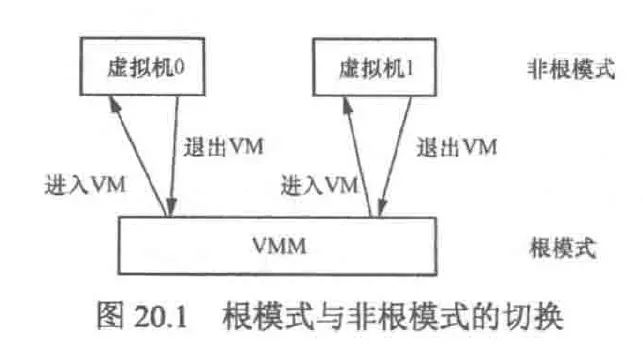

#### 内存地址的虚拟化

在内存虚拟化中：存在四种地址
* GVA(guest virtual address)：虚拟机虚拟地址
* GPA(guest physical address)：虚拟机物理地址
* HVA(host virtual address)：宿主机虚拟地址
* HPA(host physical address)：宿主机物理地址

在访问内存时，由于页表项位于内存，因此当需要修改页表项时仅是对非敏感内存的操作，这并不涉及敏感指令。因此vm不会陷入vmm中，为了能捕获vmm行为，vmm会创建影子页表供vm修改。但这个影子页表是只读的，一旦修改就会触发缺页异常导致陷入vmm
这样，vm修改pa就需要3步：GVA->GPA->HPA，这三步也被称为影子页表。相比于HVA->HPA的宿主机的页表查询，前者会产生性能问题，为了解决这个问题，可以使用硬件来加速影子页表的查询速度。Intel就实现了这种被称为EPT的技术


#### io虚拟化  

vm使用io的同时也会使用到dma，但这会造成内存问题，例如vm改写宿主机的内存。因此在vm场景下，需要将GPA，HPA的关系进行映射，并由iommu硬件保证安全。iommu类似cpu中的mmu，只不过iommu用来将设备访问的虚拟地址转换为物理地址。因此在vm场景下，iommu能够根据GPA和HPA的转换重新建立映射，这样就能避免vm的外设在进行dma时影响到vm以外的内存，这个过程被称为dma重映射。iommu的另一个好处是实现了设备隔离，从而保证设备可以直接访问分配到的vm内存空间而不影响其他vm的完整性

#### rv的虚拟化扩展

rv的cpu在虚拟化方面有两个改进：
* 将s模式扩展为hs模式，增加寄存器和指令来同时兼容两类虚拟机(第一类指的是vmm作为宿主机的os，第二类指的是vmm作为宿主机os管理的一个应用程序)，例如在mstatus寄存器添加了模式(v)字段，v=0表示位于非虚拟化模式，如m，hs或u，v=1表示系统位于vs或vu模式
* 新增vs和vu模式，给vm内部划分权限
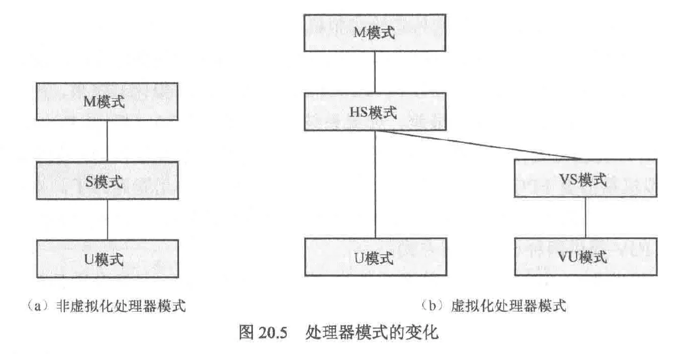

在虚拟化场景下，新增了vmm，它被允许运行在hs模式。而vm的os运行在vs模式，vm的应用程序运行在vu模式


#### rv内存虚拟化

与Intel的ept技术类似，riscv也才用了硬件加速影子页表查询来优化内存虚拟化的性能。谓词riscv准备了两个寄存器：vsatp与hgatp。这两个寄存器分别存储v模式和hs模式下的页表基地址，并且hgatp的支持模式包括sv39x4，sv48x4等，相比普通的映射模式，x4代表额外支持2位的页表，如sv39x4支持41位的GPA

虚拟机两阶段的地址映射过程


包括宿主机的映射过程
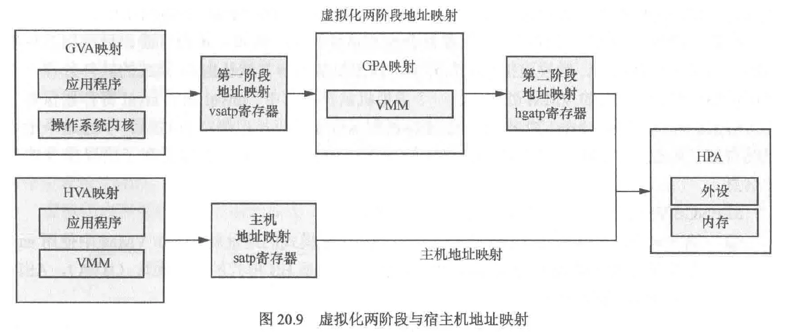

对于tlb刷新指令来说，sfence.vma与v相关，v=0，也就是位于m或hs模式，此时该指令与普通的sfence指令并无区别，都是刷新宿主机tlb缓存或指定asid刷新tlb缓存。v=1时仅仅作用于vs模式的第一阶段地址转换的tlb说的话新，同样的也可以指定asid刷新vm第一阶段地址转换的tlb缓存
新增指令hfence.gvma：该指令作用于第二阶段地址转换的tlb刷新

riscv虚拟化扩展提供两种模式：虚拟化模式和非虚拟化模式，这类似于Intel vt中的根模式与非根模式
虚拟化模式(v=1)：指cpu运行在vm中，如vs或vu模式
非虚拟化模式(v=0)：指cpu运行在vmm中，如m或hs模式

进入vm：可以配置hstatus的spv以及spvp字段，然后执行sret指令从而进入vm
退出vm：vm在运行中遇到需要vmm处理的事件，如外部中断或却也异常，cpu可以自动挂起vm，切换到非虚拟化模式(hs或m)从而退出vm


#### 中断虚拟化

由于中断虚拟化标准尚未成熟，此处只做简要介绍，rv的中断虚拟化主要采用中断注入和陷入模拟。注入指的是提供hvip寄存器来讲虚拟中断注入虚拟机。hvip支持软件中断，定时器中断和外设中断

陷入与模拟：目前riscv在硬件中断虚拟化中仅支持最基本的中断注入功能，要完成一次中断处理过程需要陷入vmm中模拟

下面以定时器中断触发流程讲解中断注入，非陷入与模拟
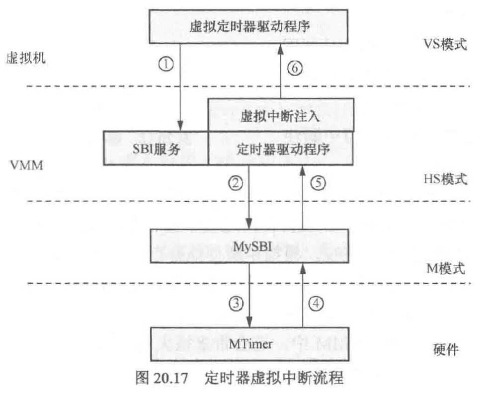
1. vm中的虚拟定时器驱动通过sbi服务接口陷入hs模式的vmm中，从而配置下次定时器的超时事件
2. vmm中的驱动通过sbi服务接口访问m模式下的mysbi固件来配置定时器
3. mysbi设置mtimer
4. 等待一段时间后mtimer触发中断
5. 定时器中断由m模式的mysbi固件优先处理，在其内部的中断处理程序中将该中断委托给hs模式下的vmm处理
6. 在vmm中的中断处理程序中通过虚拟中断注入机制设置hvip寄存器
7. vm收到中断并处理该中断
上述过程为一般的中断注入机制，可见，每次配置定时器都要陷入vmm并且陷入m模式，这会增大开销。为了解决该问题，riscv退出陷入与模拟机制，但该机制仍有许多问题，且对应设备的模拟方案仍不成熟，因此本文不做介绍
