# RISC-V


本文是笔者学习RISC-V时系统总结而成的，包含上下两部分，第一部分对RISC-V进行系统性介绍，包含RISC-V项目的基本情况与规范，基本命令的介绍，与OS的关系等内容。其参考资料为b站的[rvos](https://www.bilibili.com/video/BV1Q5411w7z5/)，视频由中科院软件所汪辰主讲，PLCT项目负责人吴伟发布。第二部分系统的介绍了RISCV体系结构部分，虽然与源码级别工程仍有差距，但作为嵌入式软件/系统工程师来说深度广度足够了，该部分参考书籍为《RISCV体系结构编程与实践    -笨叔》，笨叔也有arm相关的著作以及更为出名的Linux相关的书籍，因此笔者也推荐使用笨叔的两本不同体系结构的书籍对比学习。

<!-- more -->

# RISC-V

## 前置知识  

ISA: 指令集架构，是底层硬件向上层软件提供的一层接口规范。ISA的出现使得软件开发者不必关心具体的硬件电路结构  
ISA定义了如下方面
* 基本数据类型(byte,word,halfword)
* 寄存器
* 指令
* 寻址模式
* 异常和中断
* ……  

微架构：硬件对指令集架构的实现，更关注功耗，发热，速度，成本等制造的问题  

ISA的宽度与指令宽度无关，它指的是通用寄存器的宽度  

riscv灵感来自于mips，mips最初是斯坦福大学教授的产品，后来由于经营问题失败，该教授也是riscv之父  

## RISCV的ISA基本情况

riscv由一个基本指令集+若干个可选的扩展指令集组成，基本指令集永远不会变  

**riscv每条指令宽度32位(虽然有16位的压缩指令集)，但是并没有64位宽的指令。这是由于无论是riscv32还是riscv64都只有32个通用寄存器，处理器位数的差异只在于寄存器的位宽是32位还是64位，因此控制这32个寄存器只需要5个位宽的索引就够了，这样32位宽的指令就已足够使用。尽管只有32位宽的指令，我们也可以通过LUI以及ADDI指令将64位数加载进寄存器从而灵活访问超过4GB内存大小的地址**

基本整数指令集(I)：唯一要求强制实现的指令集，其他指令集都是扩展模块  
扩展指令集：M(整数乘法指令集)，A(原子指令集)，F(浮点指令集)，D(双精度指令集)，C(压缩指令集)  
特定组合：IMAFD被称为通用组合，用G表示  
RV64I：64位的riscv整数指令集，兼容RV32I  

压缩指令集是为了提高指令密度出现的。有时arm的一条指令可以执行两个操作，例如LDP和STP内存存储指令，但是在riscv中需要两条指令才能完成: 一条负责执行加载/存储内存数据，另一条负责修改基地址。而这直接导致了编译同一份代码，riscv生成的机器码指令多于arm，最终不仅需要更大的存储空间还会降低缓存命中率。因此riscv使用16位宽指令代替32位宽的指令产生了RVC指令集，这样，尽管32位寄存器只能运算1条16位指令，但指定位数降低降低了存储压力也提高了缓存命中率。RVC兼容性也很好，可用于RV32，RV64，RV128上  

RISC-V 定义了 32 个通用寄存器（x0 至 x31）以及一个程序计数器（pc）。与 ARM 或 x86 架构不同，RISC-V 的 pc 无法被显式地在用户程序中直接读取或修改，它只能通过跳转和分支指令间接更改
* 这一设计在 RV32I、RV64I 和 RV128I 等基础整数指令集中是一致的
* RV32E 是为嵌入式系统设计的精简版本，仅保留了前 16 个通用寄存器（x0–x15），以减少硬件资源开销
* 若实现支持浮点扩展（如 F 或 D 模块），还需额外提供 32 个浮点寄存器（f0–f31）

hart(hardware thread)：为了防止因超线程导致线程概念被混淆，riscv标准规定了hart概念，一个hart对应的就是一个超线程  

riscv规定了三个特权级：machine，supervisor和user，三个特权级权限依次降低  
特权级别的区分在于他们分别有各自的csr(control and state)寄存器，高特权级别可以访问低级别的csr  

物理内存保护和虚拟内存：
* 物理内存保护类似x86的实模式，在machine模式中可以指定user模式下可以访问的内存空间及其权限。该机制可以看作是一种简单的段式内存保护机制，但它并不等同于 x86 实模式中的分段
* 虚拟内存需要supervisor和mmu的支持

异常与中断：尽管在之前已经多次学习了这两个概念，但是在riscv规范中表述更严谨，下列结论也同时使用arm和x86架构
* 当程序触发异常时，cpu会跳转到异常处理程序，这个处理程序由开发者自行编写，当处理程序执行完毕后**跳回到发生异常的代码重新执行**
* 当触发中断时，cpu会跳转到中断处理程序，这个处理程序由开发者自行编写，当处理程序执行完毕后**跳回到发生中断的下一行代码执行**

elf文件主要有四类：
* .o
* .out
* .so
* 核心转储core文件

elf文件大致内容如下
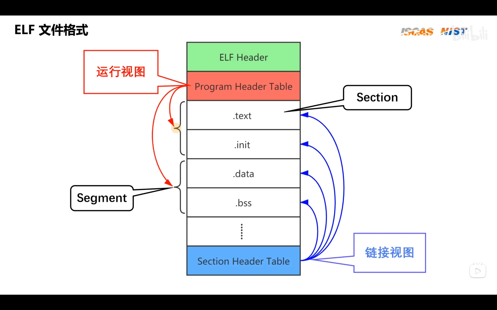
elf header指定了该elf文件的基本内容，包括编译器，可运行的架构等内容，program header table指定了运行时该以何种方式加载进内存。section header table表示了该文件链接时是如何生成的。不将这些section直接加载进内存的原因是这些段需要内存对齐，一旦对齐会浪费很多空间。因此program header table将相似的section作为segment来将其加载进内存  

由于elf文件内有许多运行代码时不需要的调试信息，我们可以生成.bin文件来删除这些信息

## RISCV汇编

**下面的指令均以RV32I为例**  

汇编程序语法与编译器有很大关系，在gnu工具链上的可以运行的汇编程序在llvm可能运行失败  

riscv汇编的结构：  
[label:][operation][comment]
* label：gnu汇编中，任何以冒号为结尾的标识符都被视作标号，label可以被视为地址
* operation：
    * instruction：直接对应机器指令的汇编指令
    * pseudo-instruction：一条伪指令可以产生多条机器指令
    * directive：以"."用来控制汇编器处理代码的指令
    * macro：采用.macro自定义的宏
* comment：注释，常用# ; //

指令长度ILEN：32bits(RV32I)  
指令对齐IALIGN：32bits(RV32I)  
指令在内存中按小端序排列  

大段序：数据高位放在内存低地址  
小段序：数据低位放在内存低地址  

RISC-V 指令的基本长度为 32 位（压缩指令 RV32C 为 16 位），按功能分为 6 种主要格式：

|  格式名称   |         用途          |           主要指令示例            |
| ---------- | --------------------- | -------------------------------- |
| **R-type** | 寄存器-寄存器操作      | `add`, `sub`, `and`, `or`, `sll` |
| **I-type** | 立即数操作、加载、跳转 | `addi`, `lw`, `jalr`             |
| **S-type** | 存储指令              | `sw`, `sh`, `sb`                 |
| **B-type** | 条件分支              | `beq`, `bne`, `blt`              |
| **U-type** | 长立即数（高位）       | `lui`, `auipc`                   |
| **J-type** | 无条件跳转            | `jal`                            |

压缩指令（`RV32C`）也有类似的分类，但采用 16 位编码  

下图是整数指令集的指令：


### 算数运算指令  

rs：register source  
rd：register destination  


立即数指令


riscv没有subi指令，因为subi可以用addi代替

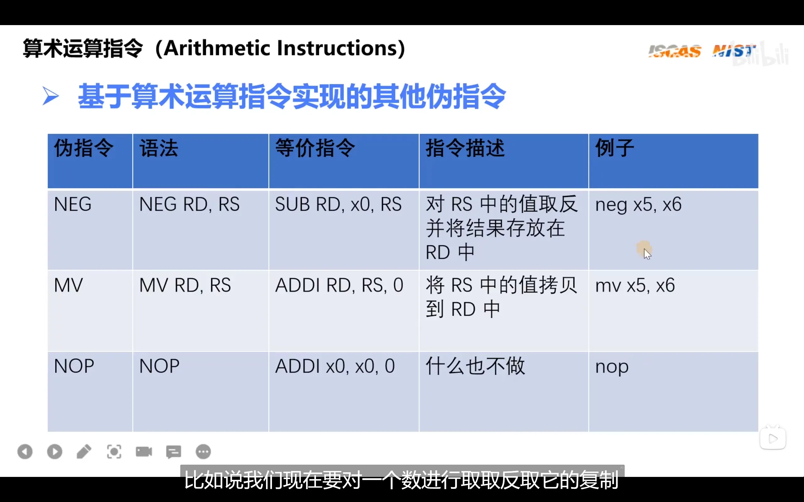


直接加载一个大数会出现符号问题
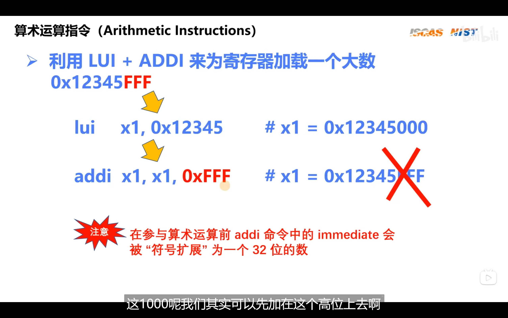

由于addi指令会对立即数进行符号扩展，即不满32位的立即数，其高位/低位会按符号位的值进行填充，这时会出现addi x1,x1,0xfff实际上加的是0xffff ffff，也就是-1的情况


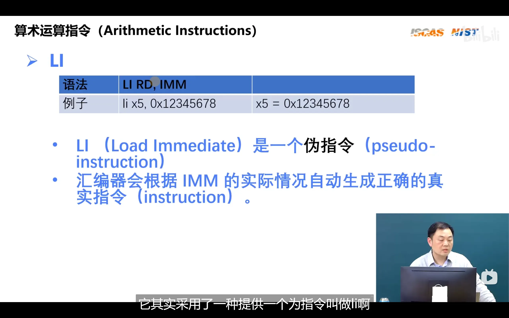
代码中常用li指令赋值，之后由汇编器进行判断对指令转换成何种形式

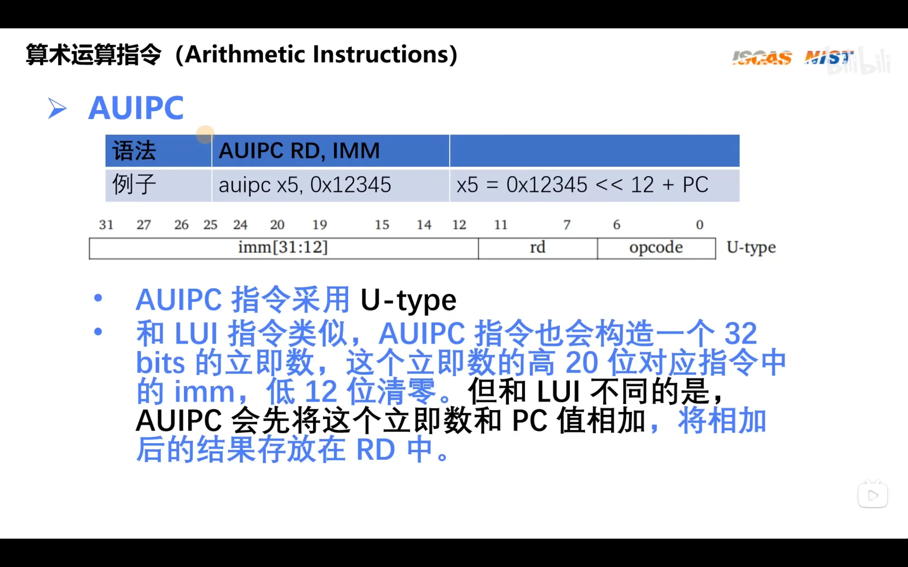
auipc用于构造相对地址，相对寻址和生成位置无关码


使用la伪指令后，链接器会自动找到label的地址并替换，最后使用auipc进行相对寻址

### 逻辑运算指令  

riscv只提供了与，或，异或等指令，并没有直接提供非指令，非指令通过伪指令来提供，实际上它是使用异或来实现的
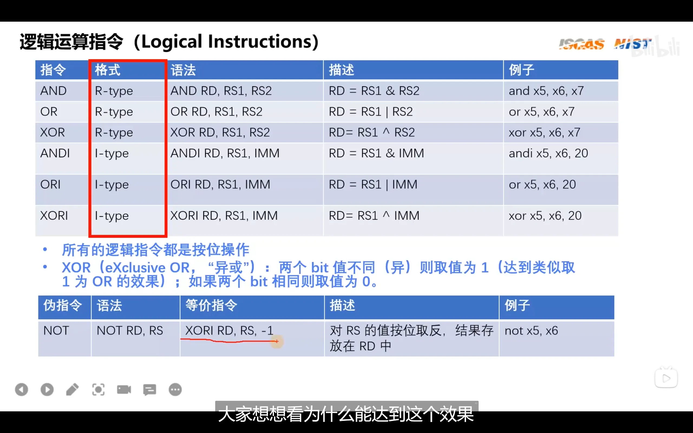

> 如下异或运算  
> &nbsp; &nbsp; 10101010  
> ^ 11111111  
> = 01010101  
因此可以凭借异或取反  

### 移位运算指令

移位运算可以通过寄存器指定移位的值，也可以通过立即数指定


算数移位只有右移没有左移，因为左移会把符号位移丢弃


### 内存读写指令

sign-extended：符号扩展，如果取到的数的位数不足32bit，那么剩下的bit使用该数的符号位填充剩余的位  
zero-extended：零扩展，如果取到的数的位数不足32bit，那么剩下的bit使用0填充剩余的位


LW没有符号扩展和零扩展的原因是加载数据的宽度已经是32位了，无需再将数据扩展至寄存器宽度


内存写指令没有0扩展或者符号扩展是因为磁盘存储单位是字节，而不是寄存器的32位的字，因此无需任何扩展

### 条件分支指令  

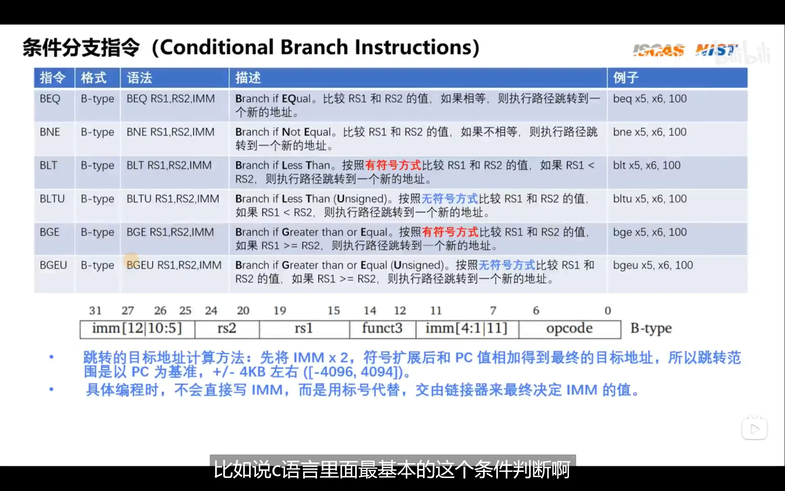

### 无条件跳转指令


## 汇编函数调用约定  

**注意：ra存放的是函数返回地址，a0存放的是函数参数和返回值**

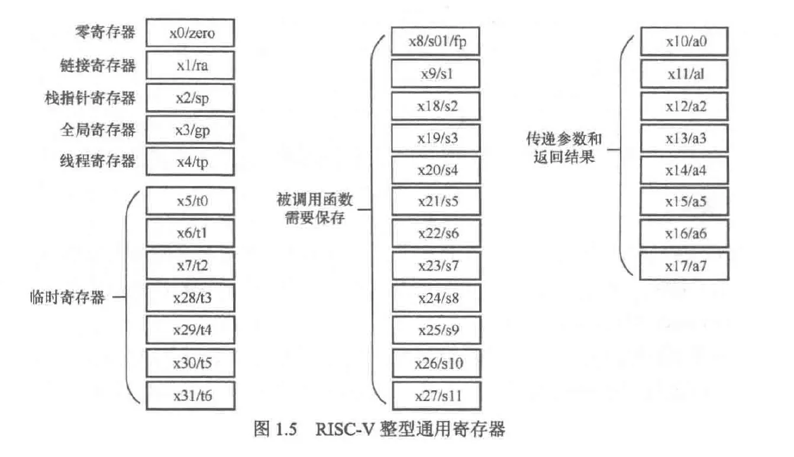
函数参数使用a0-a7传递，返回值使用a0和a1传递

我们在编程时常使用伪指令，尤其是call和ret


编写汇编调用函数时需要在被调用的函数最前方写压栈操作，末尾写出栈操作。在编写c代码时不必如此，因为编译器会自动生成这些代码

## 汇编与C混合编程

在汇编中调用c函数直接使用call func_name即可  

在c中调用汇编代码规则如下：
```c
asm volatile(可选)(
        "汇编指令"
        :输出操作数(可选)
        :输入操作数(可选)
        :可能影响的寄存器(可选)
    );
```
volatile可以取消编译器的优化  

例如如下代码  
首先是复杂一点的
```c
int add(int a, int b){
    int c;
    asm volatile(
        "add %[sum], %[add1], %[add2]"
        :[sum]"=r"(c)    // 输出：c 的值通过寄存器写入
        :[add1]"r"(a),[add2]"r"(b)    // 输入：a 的值通过寄存器读取，输入：b 的值通过寄存器读取
    );
    return c;
}
```
sum，add1，add2是寄存器的代号，这里要求编译器提供，因为如果我们强行指定寄存器可能会丢失这个寄存器之前的内容。"r"代表让编译器为当前变量分配一个通用寄存器，"="代表输出(只写)，时我们也可以使用m代表对内存进行操作

由于sum，add1，add2是寄存器的代号，因此上面的代码还可以利用匿名操作数进行简化
```c
int add(int a, int b){
    int c;
    asm volatile(
        "add %0, %1, %2"    //这里可以不必指定名称
        :"=r"(c)
        :"r"(a),"r"(b)
    );
    return c;
}
```

## 杂项  

在启动时，无论有多少个核，只会有一个hart id为0的才会进入启动流程，其他核都被wfi
```c
_start:
    #park hart with id != 0
    csrr t0 mhartid
    mv tp t0
    bnez t0 park

park:
    wfi
    j park
```
csrr是csrrs的伪指令，csrrs(control state register atomic read and set)，csrr只保留了读取csr的功能

RISC-V 采用了类似 ARM 的统一编址（Unified Addressing）机制，即内存和外设共享同一个地址空间。因此，不像 x86 那样需要通过专门的 I/O 指令（如 in / out）来访问外设，RISC-V 只需通过普通的内存读写指令即可访问外设寄存器，就像操作内存一样。不过，在使用前，必须将外设的寄存器地址映射到系统的物理地址空间中。这一映射过程与内存（如 DRAM）类似。例如，尽管某系统中的 DRAM 被映射在 0x80000000 到 0x88000000 之间，占用 128MB 的地址空间，但这并不意味着系统一定安装了 128MB 的物理内存，它只是预留了一个最大支持范围为 128MB 的地址区间。DRAM 实际可访问的大小取决于具体硬件配置。同样，外设的 I/O 寄存器也被分配到物理地址空间的某些区域，CPU 访问这些地址时，本质上就是在与外设进行读写通信。但系统必须通过 SoC 内部的总线或内存映射（Memory-Mapped I/O, MMIO）机制，将这些地址与对应外设正确连接起来
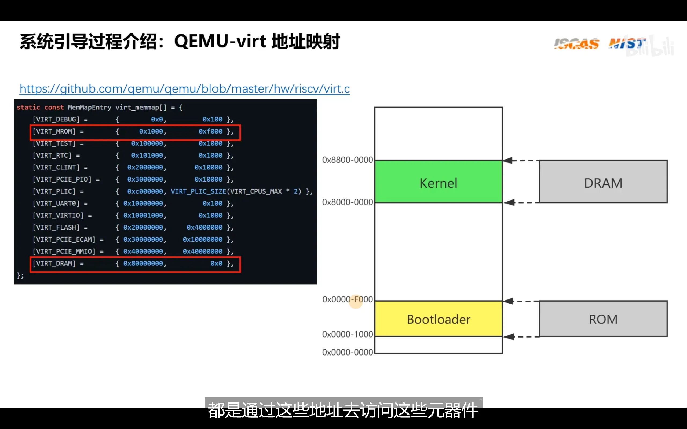

各个.o文件统一被链接为可执行文件的过程会使用链接器脚本，脚本内部指定了链接时各个.o文件的各个段该如何合并为一个.elf文件中的一个段，以及该段应该被加载进内存的哪个位置。因此，链接脚本的内容会根据板子的不同而不同  

链接器脚本会自动帮我们算出各段的起始地址和大小，我们可以给予其名称来在c代码中调用


## rvos  

rvos启动流程(没有bootloader)：
* 设置全局栈的大小
* 选择id为0的hart
* 利用该hart和全局栈大小初始化栈指针
* 跳转到start_kernel函数
* 在start_kernel内初始化第一个任务(将第一个任务的地址放入ra，第一个任务的栈地址放入sp)并执行调度器

### 中断和异常

riscv的csr


mtvec类似arm的中断向量表的基址寄存器，该寄存器有两种模式：
* Direct模式不需要设置中断向量表，但是需要软件主动查询mcause寄存器来判断是异常还是中断，并进一步判断调用哪个处理函数
* Vectored模式需要中断向量表，也就是中断处理函数必须以数组的形式放在内存的某一处并进行内存对齐。该模式会由硬件根据mcause的值自动计算中断号，并跳转到对应函数执行


mtvec的vectored mode类似于arm的中断向量表

类似函数调用时需要保存当前指令地址的作用，调用中断处理函数也需要保存当前正在执行的函数的执行位置，这时应把发生中断时的**指令或下一条指令**保存到mepc


mcause是中断异常原因寄存器


mtval是mcause的补充，可以获得更详细的异常信息，例如发生异常时的指令或地址，错误的返回值等


mstatus的xpie可用于恢复中断时获取原中断状态，xpp用于保存中断发生值前的权限级别(supervisor/machine)，**注意，mstatus并不包含user特权级的中断保存，这是因为user特权级没有资格处理中断**

xpie与xpp的p指的是previous  

riscv的trap处理流程分为上下两部分，上半部通过硬件设置寄存器完成，下半部通过软件处理trap完成

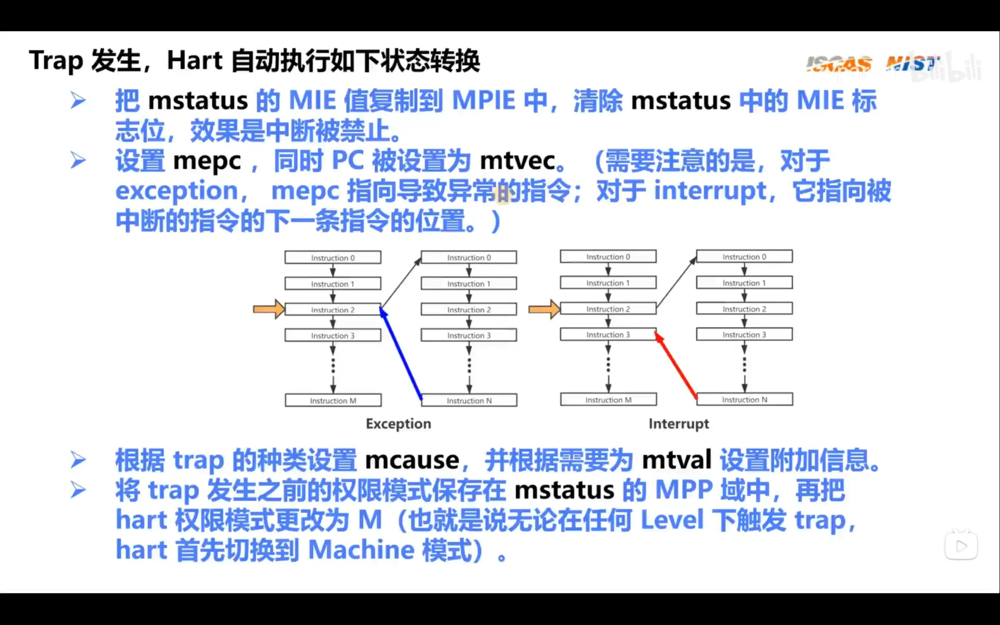

从特权模式下返回
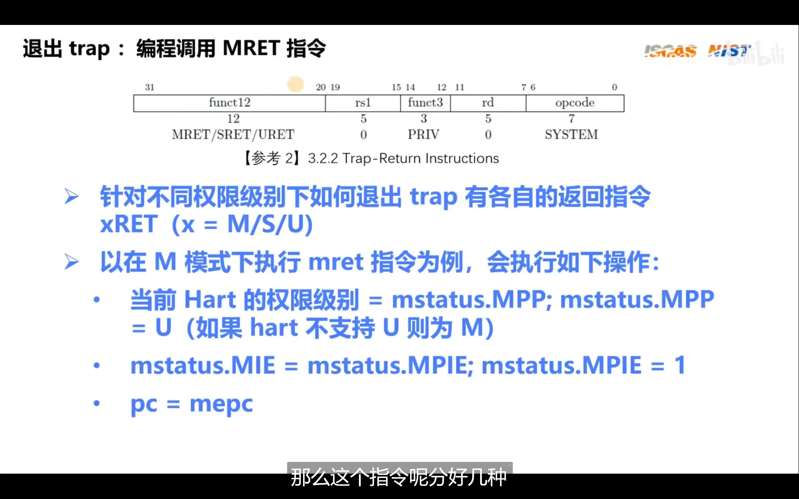

mie可以被写，用来控制中断开关，mip可以被读，用来获取中断状态


plic(paltform level interrupt controller)类似于linux的pinctrl子系统中的gic，它负责将多个中断源汇聚起来分配给若干个hart

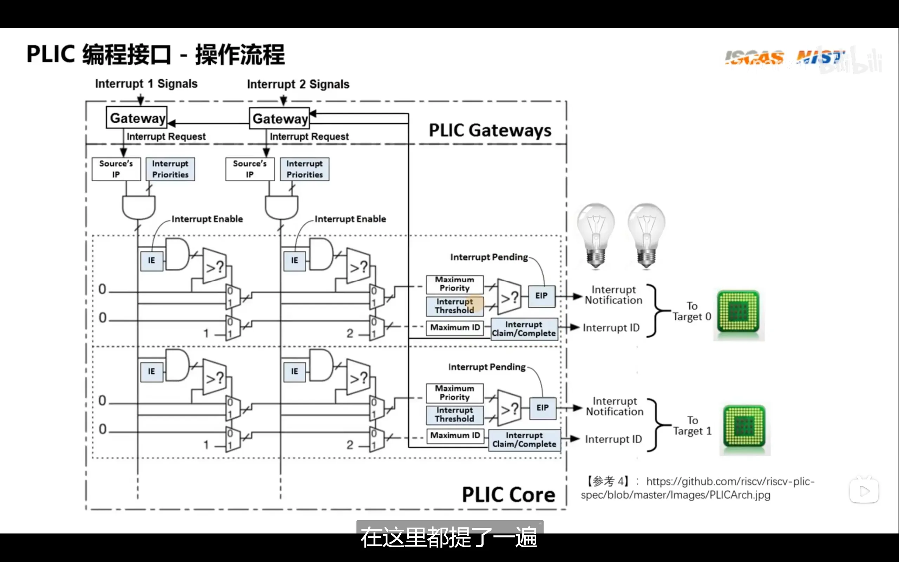

软中断不同于由硬件事件触发的外部中断或定时器中断，它是一种由软件发起的中断。在 RISC-V 架构中，可以通过向 CLINT（Core Local Interruptor） 中的 msip（Machine Software Interrupt Pending）寄存器写入 1 来触发软中断。这会使对应 Hart（硬件线程）产生一个软件中断，从而进入中断处理流程，实现了软件控制中断的目的

异常处理流程总结
* 发生异常时，触发异常的指令被保存进mepc寄存器内
* 随后记录异常，mcause 寄存器会被设置为当前异常或中断的类型编号，同时最高位标志位（bit[63]）表示是中断（1）还是同步异常（0）
* 将mstatus寄存器的mie位保存进mpie位，并将mie位清零即禁止中断，同时还要通过软件将触发异常时的权限模式保存进mstatus的mpp位
* 将pc值修改为mtvec寄存器的值，该值保存了异常处理入口的地址
* 处理异常
* 处理完成后使用mret指令返回
    * 该指令将pc设置为触发异常时保存的mepc的值
    * 将mstatus的mpie位恢复到mie位来恢复中断，并将 MPP 中保存的特权级恢复为当前特权级，回到原来的上下文

### 内核态与用户态  

rvos只实现了m，u两种状态，其原理是在start_kernel之前的汇编代码中需要设置mstatus寄存器的mpp标志位来使中断恢复后系统位于m特权级，为了支持用户态，我们只需取消设置mpp位即可，这样在中断恢复时系统会变为用户态  

在用户态我们就无法获取内核态所能访问的寄存器，例如mhartid寄存器，当用户态强行访问该寄存器时会触发异常，之后系统会转到异常调用表里执行对应异常处理函数(此时并未涉及到系统调用号)  

从用户态转为内核态时需要使用ecall指令，内核处理完成转为用户态时使用eret指令  

ecall 指令类似arm体系结构中的svc，用于主动触发一个环境调用（Environment Call）异常，通常用于从用户态或更低特权级请求操作系统提供服务（即系统调用）。异常发生时，异常类型会根据当前的特权级不同而设置为不同的异常码（mcause 或 scause 中会体现）  

当 ecall 触发异常时，CPU 会将当前指令的地址（即 ecall 指令的地址）保存在 mepc（或 sepc）寄存器中。由于 mepc 保存的是异常发生时的地址，如果在异常处理程序中不手动将其加上指令长度（通常为 4 字节），那么执行 mret 指令返回后将重新执行 ecall，从而导致死循环  

因此，在异常处理函数中，通常需要手动执行：
```c
mepc += 4;
```
最后，通过执行 mret（或 sret）指令，CPU 将从异常处理程序返回，恢复到异常发生前的状态，并切换回用户态或之前的特权级，继续正常执行

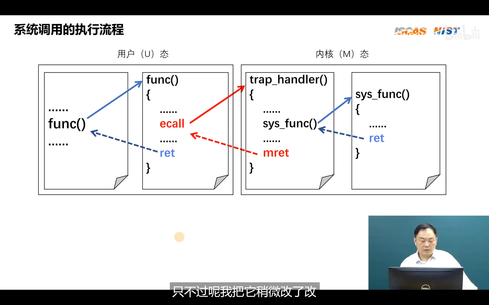

与其他体系架构不同的是，riscv在切换特权级别时并没有寄存器或者比特位来存储系统调用号，它参考linux系统调用，规定了系统调用号放在a7寄存器中

上图的trap_handler是根据riscv芯片手册指定的异常处理函数编写的，内部包含了缺页异常，io异常，系统调用，除零异常等异常

对于syscall头文件需要分为两份，一份给c库，一份给内核。这样在程序开发者的手中可以根据libc的库文件编译出来包含系统调用的app，app在运行时就可以通过系统调用进入内核
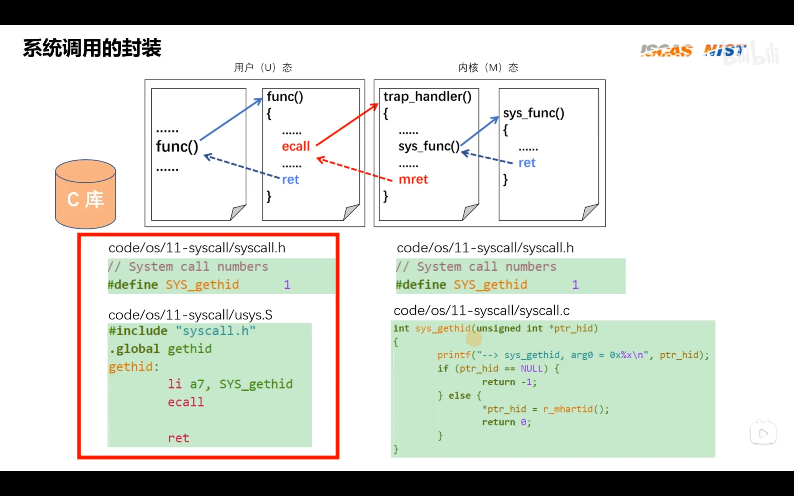

## RISCV体系结构编程与实践    -笨叔

### 链接器与脚本  

链接器ld(loader)：在早期unix系统中被称为加载器，是os的一部分，后来由于os越来越复杂，链接器就独立出来了  

ld常用选项： -T    指定链接脚本    -Map    输出一个符号表文件  

链接脚本：采用AT&T链接脚本语言  

```c
SECTIONS{
    .=0x80000000;
    .text:{\*(.text)}
    .=0x80002000;
    .data:{\*(.data)}
    .bss:{\*(.bss)}
}
```
"."表示当前位置计数器，用于把代码段和数据段的链接地址设置为0x80000000和0x80002000  
"\*"表示所有.o文件，\*(.text)表示所有.o文件的代码段。可以看出，连接器脚本只指定段，符号的地址，而不能指定符号的值，符号的值是在高级语言内指定的  

在实际的编程中，我们常常要访问链接脚本的符号(如rtt中将at命令单独放在一命名符号段)，我们可以进行如下操作  

```c
start_of_ROM=.ROM
end_of_ROM=.ROM+SIZEOF(ROM)
start_of_FLASH=.FLASH
```

在C中可以通过以下操作访问符号的段

```c
extern char start_of_ROM, end_of_ROM, start_of_FLASH;
memcpy(&start_of_FLASH, &start_of_ROM, &end_of_ROM - &start_of_ROM);
```
这样就可以将ROM段的内容拷贝到FALSH  
实际上，我们也可以将段视为数组
```c
extern char start_of_ROM[], end_of_ROM[], start_of_FLASH[];
memcpy(start_of_FLASH, start_of_ROM, end_of_ROM - start_of_ROM);
```
这样就不用取址了  

脚本语言内置函数
* ABSOLUTE(exp)

```c
SECTIONS
{
    .=0xb000;
    .myoffset:{
        myoffset1 = ABSOLUTE(0x100);    #myoffset1地址: 0x100
        myoffset2 = (0x100);            #myoffset2地址: 0xb100
    }
}
```

* SIZEOF(SECTION)
返回一个段的大小
* PROVIDE
将链接脚本中的一个符号导出
* INCLUDE
引入另外的链接脚本

### 内联汇编与C宏结合

宏参数使用"#"，预处理器会将其转为字符串  
"##"用于连接两个标识符
```c
#define ATOMIC_OP(op,asm_op,i,asm_type,c_type,prefix)            \
static __always_inline                                           \
void atomic##prefix##_##op(c_type,I,atomic##prefix##_t *v)       \
{                                                                \
    __asm__ __volatile__(                                        \
        "amo"#asm_op"."#asm_type"zero, %1, %0"    #假设asm_op参数为add，那么该行被改写为amoadd.w zero %1, %0    \
        :"+A"(v->counter)                                        \
        :"r"(I)                                                  \
        :"memory");                                              \
}

#define ATOMIC_OPS(op, asm_op,I)    ATOMIC_OP(op,asm_op,I,w,int,I)

ATOMIC_OPS(add,add,i)
ATOMIC_OPS(add,add,-i)
```

### 链接地址，加载地址与运行地址

链接地址：链接时生成的地址，在含有mmu的系统中链接地址通常被设置为0x0或其他固定地址，并通过PIC(位置无关码)生成受mmu支持的程序。在不含有mmu的系统中，链接地址与rom中的存储地址相同(也被称为加载地址)。需要注意的是即使生成了PIC，但是一些静态、全局数据依然需要确定绝对地址，而这是通过got表(存放全局变量地址)，rel.got表(存放函数地址)，rel.dyn表，动态加载器，指定数据放入链接脚本中已经规划好的段等方式来解决的  
加载地址：程序在rom中的存储地址，在arm中rom与ram不共享存储空间，在一些riscv中，ram与rom可能共享存储空间  
运行地址：程序在ram中的地址，运行地址可以通过PIC与链接地址解耦  

再次强调，使用PIC后，程序可以在链接地址!=加载地址!=运行地址的情况下运行  

### 启动过程中的加载重定位

下面以使用opensbi，uboot和linux的情况下的启动过程为例来介绍启动过程中的加载重定位  

1. 系统启动时，cpu从固化在芯片中的bootrom取出第一行代码并执行，直至将bootrom中所有代码执行完毕。bootrom程序内部包含了基本硬件初始化，但更重要的是它将硬盘中0x0地址处内存页大小的数据(4KB)搬运到芯片中的内存(sram)中。注意此时bootrom是固化在芯片上的，因此他不占用内存地址空间，运行地址为空，加载地址和链接地址相等，并且都为硬盘中的第一个块/扇区的地址0x0。我们还可以发现，当不考虑bootrom时，包含bootloader的系统的rom上第一个块/扇区存储的就是bootloader，对于没有bootloader的系统，rom第一个块/扇区存储的是中断向量表，并在中断向量表中的reset处理函数内执行系统软硬件初始化(对于stm32而言会在hal层的__main进行)，执行完毕后最终跳转到用户main函数。前者将这一阶段放到了os内部进行，例如linux会在内核启动时获得uboot传入的设备树
2. cpu从sram中读取这4KB代码并执行，其内容是初始化ddr并将m模式的opensbi以及uboot装载进ddr(没有opensbi的系统会直接装载uboot)的0x8000 0000地址处(该地址为ddr的地址空间的初始地址，可以由厂商指定存放位置)。这里没有装载进sram的原因是sram太小了(10KB~100KB)，并且由于此时刚完成ddr的初始化，所以优先将opensbi装载到ddr
3. 随后处于m模式的openabi将权限交给s模式的uboot，uboot进行启动准备工作，在将linux内核复制到ddr中的0x8000 2000地址处后将权限交给内核。注意这里内核与uboot地址相距0x2000，这是为了防止内核覆盖掉uboot
4. 内核进行硬件初始化，并开启mmu等操作

### 链接器松弛优化  

链接器松弛优化可以分为两种优化方式
* 函数跳转优化
这种优化可以减少不必要的指令，本质是编译器使用jal指令代替auipc(20位imm左移12位)+jalr(12位有符号数内寻址)指令，前者可在PC±2GB(32位有符号数)范围内寻址，后者可在PC±1MB(21位有符号数)范围内寻址  
例如如下指令
```c
auipc ra 0x0
jalr -24(ra) #5fc<foo>    //跳转到ra寄存器 - 24处的地址。编译器提示该处地址为5fc，是foo函数的地址
```
可被替换为
```c
jal ra, 5fc <foo>
```

* 符号地址访问优化
使用gp(x3)寄存器进行相对寻址以节省指令，gp指向.sdata段(小数据段)中部的一个固定地址，若某变量位于该地址±2KB范围内，可以使用lw或addi来代替auipc+addi指令

### SBI

SBI(system binary interface)：sbi与abi类似，前者是isa给os提供的接口，用于串口打印(opensbi也将串口标准化了)，中断管理，tlb管理以及启动管理，后者是os给app提供的接口，用于资源管理，锁管理等等  

sbi提高了硬件的可移植性，可以在不同种类的os上无感移植，并且提高了芯片的安全性。sbi固件运行在m模式，给s模式的os提供接口

### 异常处理

riscv支持的异常处理模式
* 直接访问模式
所有陷入m模式的异常都会跳转到mtvec的base字段的地址，但**需要软件去判别mcause的值并指定对应的异常处理程序**，该种方式不需要中断向量表，中断处理函数可以分布在代码各处
* 向量访问模式
跳转到异常向量标的某一项，该项**由硬件查询mcause的值并计算出来，无需软件帮助**，该种方式需要中断向量表，中断处理函数集中放在内存固定区域，函数地址需进行内存对齐  

异常不仅有m模式还有s模式，这可以避免因模式切换带来的性能损失.常见的s模式异常包括：ecall，非法指令异常，指定地址未对齐，加载页错误，存储页错误等  

riscv中断分为本地中断(软件，定时器)，和外部中断(外设等)，本地终端通过CLINT(core local interruptor)产生并直接发送给hart来处理，外部中断由外设等产生，经由PLIC路由再发给对应的hart处理，因此内部中断无需PLIC路由

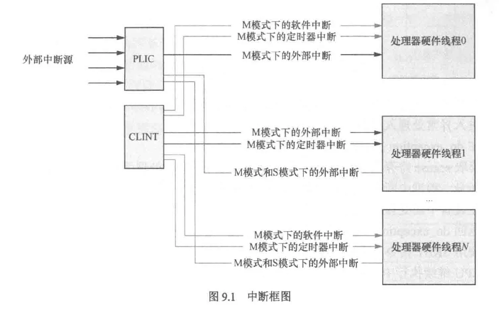

svc是arm的触发软件中断进入内核层的命令，ecall是riscv的。svc通过立即数传递系统调用号，ecall通过寄存器a7传递。并且ecall还支持从s模式向m模式切换

### 主存，高速缓存与TLB简要介绍

多进程访问同一个虚拟地址可以成功的原因是，每个进程都有自己的运行空间，也就有一套自己的页表，根本原因是切换进程时可以通过切换页表基地址寄存器来访问不同进程的页表，这样在查找n级页表时就是对应进程的n级页表了  

rv64通常使用3级(sv39)或4级页表(sv48)，rv32使用2级页表(sv32)，所谓的svxx指的是虚拟地址的低xx位用于页表索引  

以内存为视角，体系结构分为两种：UMA(统一内存访问)， NUMA(非统一内存访问)  


tlb(translation lookaside buffer，翻译后备缓冲区)，该硬件位于mmu内，缓存了查询页表的结果  

以vipt(virtual index physical tagged)为例讲解cpu寻址过程：  
cpu访问虚拟地址时，会将虚拟地址同时发给tlb和高速缓存，若tlb未命中，则需访问对应线程的页表(通常位于主存)，并将地址和数据写入高速缓存中以待cpu读取。若tlb命中，则直接获取物理地址，并根据该地址从高速缓存中获取数据
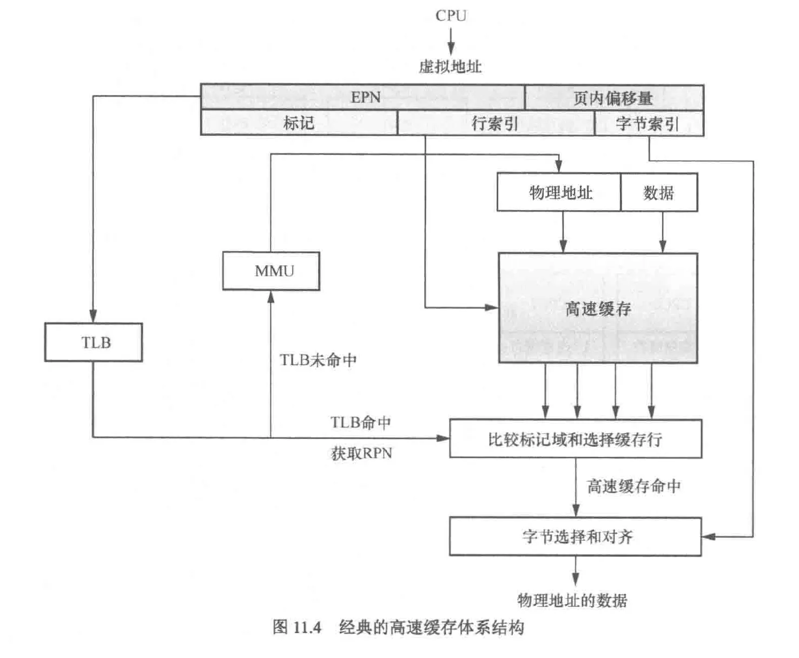

同时高速缓存根据虚拟地址的索引来确定所需的数据位于哪个组，并通过标记域在组内寻找高速缓存的某一行，若找到就被称为高速缓存命中。若未命中，则需要重新从主存获取数据

#### 高速缓存

高速缓存的组织方式包括以下三种
* 直接映射
* 全相联映射
* 组相联映射

由于高速缓存是按行来组织的，因此cpu每次访问内存都至少会将一个高速缓存行大小的数据写入高速缓存，这样，内存中实际的最小单元就不是字节而是高速缓存行大小了。例如某个高速缓存有如下组织：
* 1路，每路64行，每行512字节，共64KB高速缓存。因此，主存就被划分为若干块的区域，每块大小64KB(64KB除以1路)，内存地址与高速缓存的地址映射关系是：数据在高速缓冲区的行号=主存地址%32KB/512，在缓存行的内的偏移量为主存地址%32KB%512

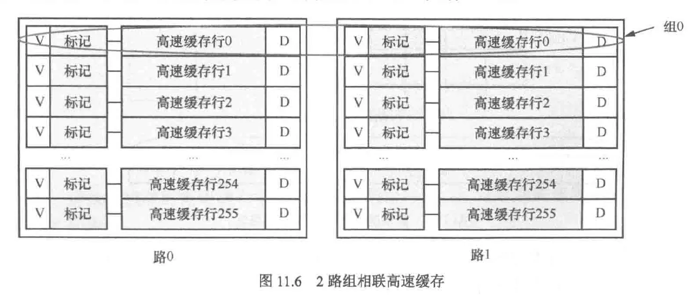

如果我们采用直接映射的缓存组织方式，假设访问内存的数据都落在0x80000000-0x8000000FF(共64KB)，高速缓存将发挥他的最大威力，但是当我们访问的数据位于0x80000000，0x80000100，0x80000200，那么高速缓存的第一个缓存行就会被频繁的换入换出，这就是高速缓存颠簸  


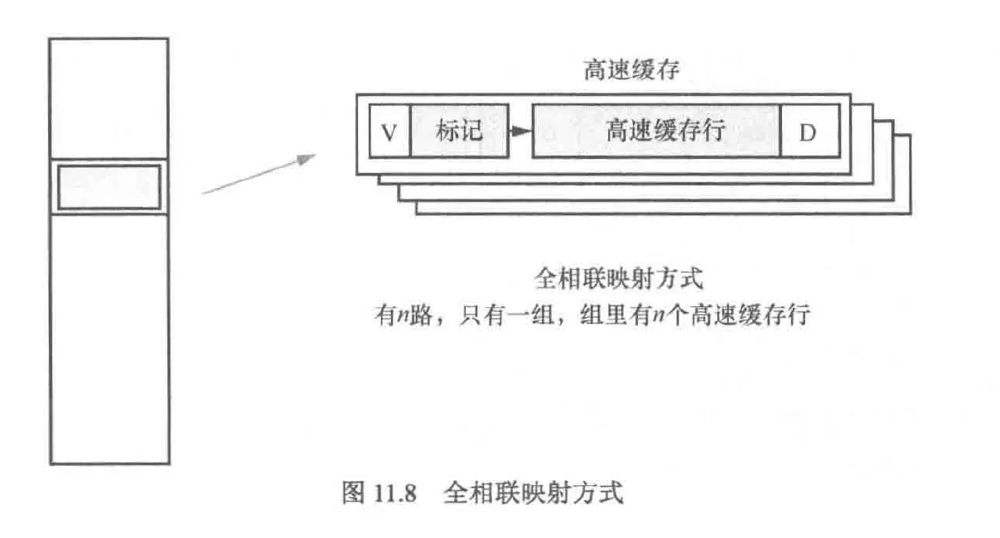


为了解决缓存颠簸问题我们采用了组相连缓存的组织方法，我们只需要将原来的缓存大小一分为二，这被称为2路组相连缓存，其中一个作为备份以应对缓存颠簸，当颠簸发生时，我们有50%的可能性会发生缓存换入换出的问题，如果是4路，该问题发生的可能性降低为25%  
**注意，当采用组相连缓存时，新的组概念意味着彼此不同路的行的集合，路概念被保留**  
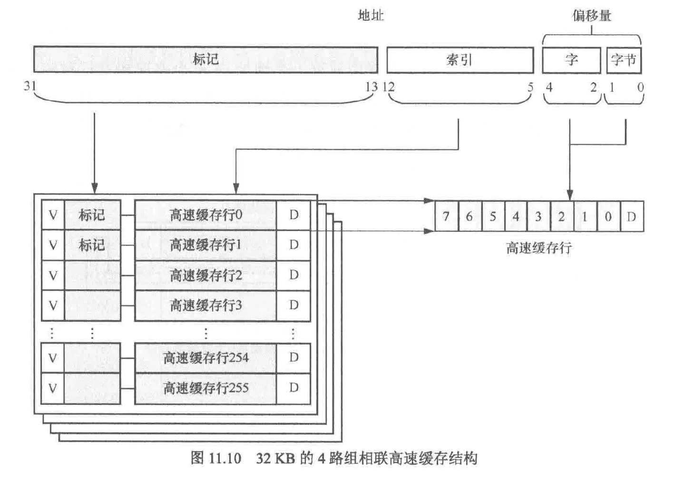

cpu访问高速缓存时，传入的地址是虚拟地址还是物理地址？这实际上分为3种情况
1. PIPT：cpu通过物理地址查询高速缓存，这种方式每次都需要tlb介入，部分情况下甚至需要mmu进行地址转换，效率较低
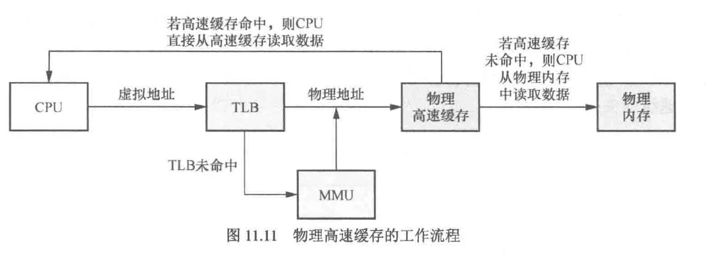
2. VIVT：cpu通过虚拟地址查询高速缓存

3. 实际上，还有一种物理地址和虚拟地址结合的查找方式，详见下文  

当cpu通过地址来查找高速缓存时，该地址被解析为标记域和索引域。也就是说标记域与索引域可能来自虚拟地址也可能来自物理地址，因此有如下3种情况
1. PIPT(physical index physical tagged)，传入的是mmu转换过的物理地址，该地址的索引段和标记段均由物理地址组成，不会导致重名问题以及别名问题。该种组织方式对于大规模高速缓存很友好，但代价是每次获取数据时都需要mmu的参与
2. VIPT(virtual index physical tagged)，传入的是物理地址与虚拟地址的混合体，该地址的索引段为虚拟地址，标记段为物理地址。查找缓冲区项时，需要比较虚拟索引查找高速缓存组与并使用物理标记判断是否为所需的内存地址，这会有重名问题
3. VIVT(virtual index virtual tagged)，传入的是虚拟地址，会导致重名问题以及别名问题，相比PIPT方式，该方式实现的mmu更简单

VIPT可以完全避免歧义问题，这是因为无论进程如何切换，尽管va可以重复，但仍需pt才能识别对应的高速缓存行。而pt则是唯一的，因此VIPT可以完全避免歧义问题  
VIPT解决别名问题的办法：由于别名问题产生的根本原因是多个va引用了同一个pa导致数据不同步的现象，并且在同一个进程内是不会产生别名的，哪怕该进程使用了共享内存。因此要避免别名只需上下文切换时通过冲刷高速缓存(先使主存有效，后令高速缓存无效)保证数据同步即可  

下面是页表，高速缓存，tlb和内存在切换上下文时的更新顺序：
* 切换上下问时会更新页表，因此页表是最早更新的，由于页表主要存储在主存以及保证缓存一致性，我们需要将页表写入主存中
* 在多核系统下，为了能够让其他核和硬件也能察觉页表被更改，我们需要执行fence指令
* 此时本核或本簇的tlb还未更新，执行sfence.vma指令使tlb失效并重新载入主存的页表
* 最后冲刷高速缓存，将脏的高速缓存写回内存，并让部分高速缓存失效，这可以避免别名问题(同一个va指向不同pa)

对于有ASID机制的cpu，不一定要冲刷tlb且即使冲刷也可能会有硬件帮助其自动化  

tlb的作用类似高速缓冲区，因此可以由直接映射，全相联映射，组相联映射三种方式组成


arm9采用的是VIVT方式，arm11采用的是VIPT方式，arm偏爱虚拟索引的原因是不必每次访存都依赖mmu，后期采用物理标记的原因是避免虚拟标记产生的重名问题  

* 重名(也被称为歧义)问题：多个不同的VA映射到一个PA
* 缺点：
    * 浪费高速缓存空间
    * 缓存一致性问题


* 同名(也被称为别名)问题：相同的VA对应不同的PA，这产生于进程切换时，由于不同进程的VA空间是相同的，这就造成了不同进程可能拥有相同的VA，但VA对应的PA不同
* 缺点：
    * 获取到其他线程数据造成错误
* 解决办法：切换线程时把脏的高速缓存写回内存，然后使所有高速缓存行失效，这样新进程就会得到干净的虚拟高速缓存，同时，也有对tlb执行清除操作。每次切换进程时都需要让高速缓存的数据失效，这会造成效率问题，因此rv架构给出了ASID的解决方案，这会在后文详细介绍
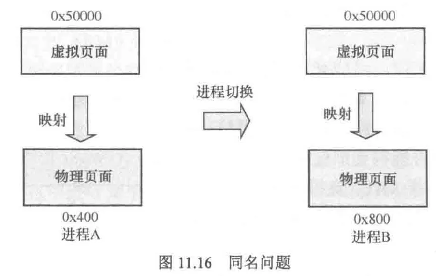

在rv规范中，要求处理器不允许产生别名问题，因此该问题需要在微架构层面得到解决，该机制被称为ASID  

重名(歧义)问题的解决：  
重名问题产生的原因是系统为了支持虚拟内存而允许多个虚拟地址对应同一个物理地址，这可能是不同线程有相同的虚拟空间造成的，也有可能是cow或同一个线程的mmap了同一个fd导致的。我们通过PT理应只能查找到同一页的内容，因为无论是在查找多级页表还是tlb的过程中，PT的职能始终是确定要查找地址的页内偏移。而高速缓存足够大时，PT的位数便不够用了，例如当高速缓存总大小达到了8KB，我们想要查找位于2KB地址的内容，但通过PT会发现有两个候选项2KB和6KB地址处的内容，其中6KB地址处的内容是上次访存留下的。这样当修改2KB地址的内容后也需要修改6KB地址处的内容，否则就会造成缓存一致性问题  
这里会有一个问题：访存指令是32/64位的，足够在内存空间确定唯一地址了，为什么还会出现歧义的问题？这是因为虚拟地址已经在索引高速缓存的过程中已经被用掉了，所以无法确定唯一地址，ASID就采用了引入额外数据——进程号，因此有ASID机制的系统可以解决不同进程造成的歧义问题，但是对于同一个进程产生的歧义问题(例如mmap，cow等操作)就无能为力了  
接下来让我们看下如何彻底解决歧义问题。我们通过PT查找高速缓存时，只有组的限制而没有路的限制，因为路映射着内存的另一页，通过index可以被索引到不同的路，也就是说路与路之间不存在歧义问题。而在组的内部，就产生了重名问题，也就是说：  
$高缓一路的总大小\leq{页大小}$
换句话说：  
$高缓组数\times{行大小}\leq{页大小}$
举一个例子：
| 参数            | 值                  |
| ------------- | ------------------ |
| 页大小           | 4KB                |
| Cache line 大小 | 64B                |
| Cache 组数      | 64 sets            |
| 组相联路数         | 4-way              |
| 总 Cache 大小    | 64 × 64 × 4 = 16KB |

这里还需要注意的是，歧义问题，页表，tlb，虚拟地址空间都是对于**进程**来说的，尽管linux的调度单元是线程，但只有不同进程才拥有不同的虚拟地址空间。也就是说，页表和tlb等操作的调度单位是进程  

重名，同名问题都存在于虚拟高速缓存中  

高速缓存策略：
* 写命中时(在高速缓冲区找到要写的数据)
    * 直写：将数据不通过写缓冲区直接写回内存，这会占用总线带宽
    * 回写：将数据暂存到写缓冲区里，等到合适的时机再写回内存，这会产生缓存一致性的问题
* 写未命中时
    * 写分配：把要写的数据加载到高速缓存中，后修改缓存内容
    * 无写分配：不分配高速缓存，直接写回内存
* 一致性策略：LRU，最近最少使用算法

高速缓存管理指令：
* 失效(CBO.INVAL)：使某一缓存行失效，丢弃上面的数据
* 清理(CBO.CLEAN)：把标记位脏的缓存行写入下一级缓存或内存，然后清除脏位
* 冲刷(CBO.FLUSH)：失效+清理

在缓存一致性系统中，一个数据可能在各种主控制器(cpu，gpu，加速器等)内有多个副本，其中任意一个主控制器执行高速缓存管理指令就会通过广播导致其他所有主控制器也执行该指令，这样其他主控制器就会始终获得最新数据  

### 缓存一致性与MESI协议

尽管MESI协议对软件透明且解决了大部分一致性问题，但仍有少部分问题需要软件解决  

cpu簇的一致性需要AXI总线协议实现  

解决多核间缓存一致性的方法：
1. 关闭高速缓存：这会造成功耗上升，性能下降
2. 使用软件维护一致性：调试难度上升，增加软件复杂度
3. 使用硬件维护一致性：MESI协议，实现该协议的硬件被称为scu(snoop control unit)，监听控制单元

系统间缓存一致性的方法需要使用缓存一致性总线协议，如ACE  

下面对MESI协议做简要介绍：
M(modify)：数据有效，已被修改，只存在于本地cpu高速缓存中
E(exclusive)：数据有效，**数据和内存中一致**，只存在于本地cpu高速缓存中
S(shared)：数据有效，已被修改，**存在于多个cpu高速缓存中**
I(invalid)：**数据无效**

假设系统有cpu0-cpu3 共4个cpu，每个cpu都有各自的一级缓存，他们都想访问数据a
* T0时，4个cpu默认状态为I(数据无效)
* T1时，cpu0率先访问a(读)，cpu0进行本地读时发现并没有数据，因此通过总线发送BusyRd信号询问其他cpu，其他cpu回应无数据，因此，cpu0只能老老实实的从主存中获取数据，并将高速缓存行状态设置为E(数据和内存状态一致)
* T2时，cpu1发起读操作并广播询问其他cpu是否有数据，在其他cpu全部应答之前cpu1不会在主存中查找数据，此时只有cpu0有副本，因此cpu0会应答cpu1的读操作并将数据发送，同时cpu0，cpu1将状态设置为S
* T3时，cpu2想修改a(写)，cpu2发送BusRdX(总线写)信号到总线，其他cpu会将数据对应的的高速缓冲行失效，也就是设置为I，并发送应答信号。cpu2收集所有应答信号后将本地高速缓存设置为M状态(与内存不同)，并写入a的值

#### 高速缓存伪共享

当某2个数据位于高速缓存行的同一行且有2个cpu想修改这2个数据时就会出现问题，其表现是2个cpu会反复修改本地的缓存行并反复让对方的缓存行失效，这会带来严重的性能问题
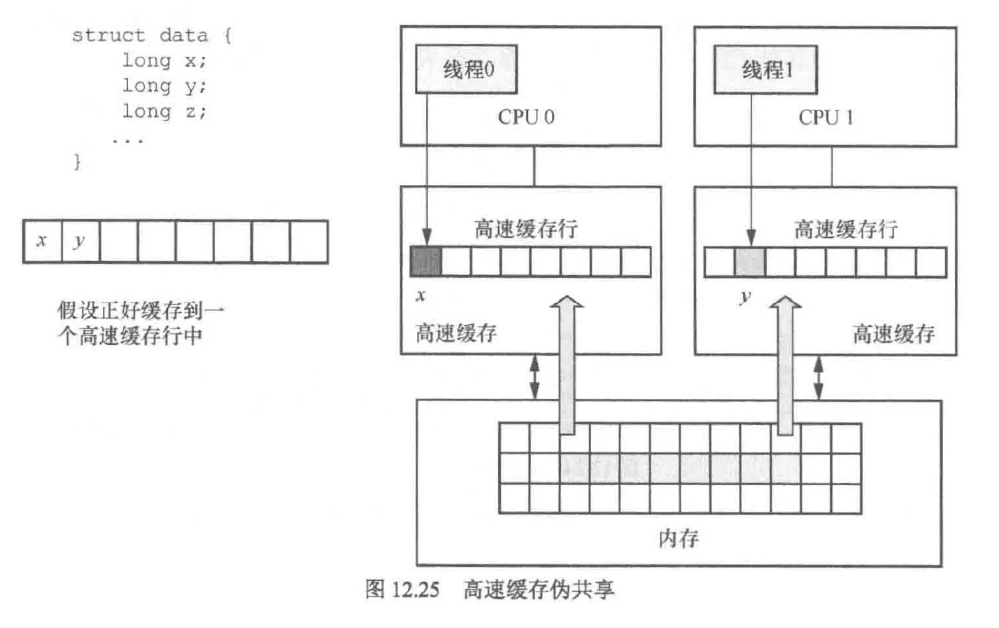
解决的办法是在软件中避免此类问题
1. 缓存行对齐技术：使用 \_\_attribute\_\_((aligned(x))) 指令将结构体整体对齐到缓存行边界（例如 64 字节）。这适用于结构体数组中每个元素被单独访问的情况，有助于避免相邻元素共享缓存行导致两个cpu对相邻元素相互修改导致伪共享的情况  
缓存行对齐技术的例子：

```c
#include <stdio.h>
#include <stdatomic.h>

#define CACHE_LINE_SIZE 64

struct __attribute__((aligned(CACHE_LINE_SIZE))) AlignedCounter {
    atomic_long value;
};

struct AlignedCounter counters[4];  // 每个元素占满一个缓存行

void thread_func(int idx) {
    for (int i = 0; i < 1000000; ++i) {
        atomic_fetch_add(&counters[idx].value, 1);
    }
}
```

2. 缓存行填充技术：通过数组占位来使结构体成员对齐到不同行，其中需要频繁修改的成员单独占一行。这常用于无法使用缓存行对齐技术的大型结构体  
缓存行填充技术的例子：

```c
struct zone{
    spinlock_t lock;
    struct zone_padding pad2;    //填充数组使两个自旋锁分别位于缓存行两行
    spinlock_t lru_lock;
}

strcut zone_padding{
    char x[0];
}__cacheline__internodealigned_in_smp;    //使用该内建函数可以填充某一个高速缓存行
```

高速缓存伪共享十分影响性能，我们可以使用perfC2C工具检查代码是否存在高速缓存伪共享的问题

#### DMA与高速缓存一致性

DMA的数据运输对cpu来说是高效但**透明**的，因此会产生一致性问题  
问题解决：
* 当数据需要从内存发送到设备fifo时
    * cpu侧软件的数据先对内存中的DMA段进行刷写，防止DMA数据是旧的或者cpu的高速缓存已经产生新的数据但并未同步到DMA
    * 外设通过DMA将DMA缓冲区的数据转移到外设fifo中
    * 当cpu软件侧产生新数据时立即使用缓存清理命令将数据刷写到内存的DMA缓冲区中


* 当数据需要从设备fifo发送到内存时
    * 首先由设备接受新的数据并转交给内存中的DMA段
    * 若高速缓冲区有数据则令其失效，因为此时的数据是上次传输的旧数据
    * DMA将设备数据由fifo搬运到DMA缓冲区中


因此，DMA的缓存一致性问题只需要考虑两个方面
* 最新的数据在cpu侧还是设备侧？若为cpu侧则立即清理高速缓冲区，若为设备侧，则令缓冲行失效
* DMA缓冲区对应的高速缓冲区的数据是最新的还是过时的？是最新的则清理，过时的就失效  

还需要注意的是，有些系统会将高速缓存的冲洗（flush）操作安排在上下文切换过程中完成，这样一来，CPU 在每次读写高速缓存时就不需要显式地进行缓存同步。然而，这种方式不适用于异步 I/O  
这是因为异步 I/O 的核心思想是：进程和 I/O 操作可以并行进行，即在发起 I/O 请求后，进程可以继续执行而无需等待 I/O 完成。而高速缓存的冲洗通常是一个同步的过渡操作，它介于用户空间对数据的访问和 DMA（或外设）对内存的访问之间，目的是确保数据一致性  
由于 DMA 和 I/O 控制器本身并不执行缓存同步，而冲洗操作又无法自然地嵌入异步 I/O 的非阻塞流程中，因此不能将高速缓存冲洗纳入异步 I/O 的框架中。如果不显式进行缓存同步，可能导致外设读取到过时或未提交的数据，从而破坏数据完整性

#### MESI协议的问题与内存屏障

MESI进行数据同步时需要操作发起方进行等待，如cpu0想要写a这个变量，如果此时a不在cpu0的本地，那么当前cpu就会发送BusRdX信号给其他cpu，并**等待**其他cpu的结果。其他cpu会将a标记为I(无效)并广播修改完毕的信号。此时cpu0才能收集到全部信息并写a的值。可以看出，上述过程会使cpu0进入停滞(stall)  
解决办法是在cpu和l1缓存之间另设存储缓冲区，这样在cpu0等待时可以执行其他操作，并将a写入存储缓冲区，等到其他cpu完成广播后再将数据从存储缓冲区转移到l1缓存  
但是这也带来了乱序的问题，例如当代码的其他部分依赖于a时，由于本地cpu实际上并未使a失效，只是将a阻塞在本地的存储缓冲区内，这样由于乱序执行，如果本地cpu再次使用a，则会使用到a的旧值  
这个问题的解决办法是使用写内存屏障指令(fence w w)，**即确保在屏障之前的所有写操作完成并对其他处理器可见之后，才会执行屏障之后的写操作**。这种方式确保写操作的顺序和可见性，防止因写缓冲乱序导致的伪共享或一致性问题  
例如下图会将abcd写入l1完成后，再写入ef，否则其他cpu先应答e数据，而后应答d数据的情况  


同样地，在 MESI 协议中，当一个 CPU 想要写入一块本地未缓存的数据时，需要首先让其他 CPU 将该数据标记为无效(I)。这个失效操作涉及总线通信，往往存在一定延迟。如果系统频繁进行加载和写入操作，这种同步机制可能导致整体性能下降  
为优化效率，可以引入无效队列机制：当 CPU 收到失效请求时，不立即执行失效操作，而是将相关条目挂入本地无效队列，并立刻发送应答信号。这样可以缩短总线占用时间，提高系统响应速度，尤其在高并发场景下提升吞吐量  
然而，该优化方式也引入了乱序执行问题：如果失效操作尚未真正生效，而其他 CPU 发起对该数据的读请求，就可能读到过期的旧值，从而破坏数据一致性  
为避免这种问题，需要使用读内存屏障指令（fence r, r），**强制在执行后续读操作之前，确保所有挂在失效队列中的条目已完成失效操作**。这样可确保读取操作不会早于数据失效，从而维持正确的内存可见性和执行顺序

|     特性     |         存储缓冲区         |           无效队列            |
| ----------- | -------------------------- | ---------------------------- |
| 面向对象     | 本 CPU 的写请求            | 其他 CPU 发来的无效请求       |
| 是否异步处理 | 是，写操作异步提交          | 是，无效请求异步响应          |
| 主要目标     | 降低写阻塞，提高写吞吐      | 降低失效同步阻塞，提高并发性能 |
| 风险         | 写乱序 → 伪共享、可见性错误 | 读乱序 → 读到失效前的旧值     |
| 解决机制     | 写内存屏障（`fence w,w`）  | 读内存屏障（`fence r,r`）     |


对于自旋锁而言，不同体系结构有不同实现方式，对于x86而言，由于其内部结构是强内存一致性模型，自旋锁实现就隐含了内存屏障。但对于rv的rvwmo规范，其实现的是弱一致性模型，而自旋锁的实现并不包括内存屏障指令，这也是弱一致性模型效率高的表现但也会造成指令乱序的问题。因此rv为了保证锁的正确性，在自旋锁的实现中也引入了内存屏障指令作为每次调用smp自旋锁后的api，这样，在linux内核中rv的锁编程会多出一步调用内存屏障指令api的操作来保证多核cpu条件下锁状态的正常  

### ASID

由于tlb内部存储了VA与PA的对应关系，而PA不会改变，因此没有重名问题(不同的VA映射到同一个PA)，但在线程切换时会有同名问题，尽管可以通过刷新tlb解决，但这严重影响效率，更好的解决方案是使用ASID  

tlb可以分为以下两种
* 全局类型tlb：用于内核空间，可以不刷新
* 进程独有tlb：用户进程空间，应当刷新

因此rv体系提供了这样一种方案：让tlb识别ASID属于哪个进程。这样，即使是进程独有的tlb，与可以在进程切换时不刷新tlb了，rv的ASID储存在satp寄存器(Supervisor Address Translation and Protection)中，同时satp也存储了页表基地址  

这样通过tlb查询页表步骤如下：
1. 通过va的索引域在tlb内找到对应的组
2. 通过虚拟地址的标记域(也就是PA)找到组内某行
3. 和stap寄存器的ASID以及属性进行匹配，若匹配，则tlb命中，这是新增的步骤

在页表项内，还有一位和tlb相关，这就是G位，用于表示全局类型的tlb页表项  


tlb刷新查找页表的操作已被OpenSBI实现了，并开放接口给Linux

### BBM(break before make)

Linux中，在一些复杂的替换操作执行前，首先要让被替换的内容失效，以防止其他进程引用了过时的资源导致错误  

原子指令是一个整体，不能用仿真器调试，如下3-5行
```c
my_atomic_set:
1:
    lr.d a2 (a1)
    or a2, a2, a5
    sc.d a3, a2, (a1)
    bnez a3,1b
```

### 原子指令与CAS

rv中，原子指令的实现方式并不做规定，不同厂家有不同厂家的实现方式  

cas（Compare And Swap，比较并交换）是arm的重要特性，该指令用于比较并交换值，常用于无锁编程。其原理为：cas检查某个值是否是原值，若为原值则赋为新值，否则什么都不做。但是在rv中却没有对应的指令，这是由于cas会有ABA的问题：既原值在检查时变化了两次，比如由1变3再变回1，这就会使系统误以为原值未改变，因而rv推荐使用lr/sc（Load-Reserved / Store-Conditional）命令监视所有写操作的地址，因此能够避免该问题  

内存一致性：由于乱序执行，多发射，超标量，编译优化带来的cpu执行代码顺序与源代码顺序不一致的现象  

解决办法：使用内存屏障指令  

rv中使用fence作为内存屏障指令  

内存屏障指令格式：fence iorw, iorw  
iorw：要约束的前后指令类型，io代表设备输入输出类型指令，rw代表读写类型指令  
fence rw, w 代表fence语句**之前的rw操作**不应越过fence语句，同时fence语句**之后的w操作**不应越过fence语句

### C语言陷阱

类型转换：C的隐式类型转换会造成该问题。例如在赋值表达式中，表达式右侧的值会自动的隐式转换为表达式左边的值。在算术表达式中，短类型，有符号的数据有向着长类型，无符号的数据类型进行隐式转换的趋势。这就带来了隐式转换的问题
```c
#include <stdio.h>

void main()
{
    unsigned int i = 3;
    printf("0x%x\n",i * -1);
}
```
输出结果
```c
0xffff fffd
```
这是因为-1被隐式的转换为unsigned int，其十六进制表达式为0xffff ffff，i * -1就变成了3 * 0xffff ffff  

整型提升：使用短类型的数据时，如果该数据可以用int表示则转换为int，否则用unsigned int表示。这么做的目的是使cpu内部的alu充分利用通用寄存器的长度，对于两个char类型的计算，cpu难以实现字节相加的运算，这就需要在cpu内部要转换为通用寄存器的长度再运算

```c
#include <stdio.h>

void main()
{
    char a;
    unsigned int b;
    unsigned long c;
    a = 0x88;
    b = ~a;
    c = ~a;
    printf("a = 0x%x, ~a = 0x%x, b = 0x%x, c = 0x%x\n",a, ~a, b, c);
}
```
结果为
```c
a = 0x88 ~a = 0xffff ff77 b = 0xffff ff77 c = 0xffff ffff ffff ff77
```
这是因为~a会转为int类型  

移位操作：在C中，整数变量被看作int类型，如果移位范围超过int的位数，就会产生ub
```c
#include <stdio.h>

void main()
{
    unsigned long reg = 1<<33;
    printf("0x%x\n", reg);
}
```
上面的代码虽然可以编译通过，但是有警告，正确的做法是使用`1UL`，这样编译器会把1视作`unsigned long`类型  

C语言还有符号扩展的问题，当把一个带符号的整数提升为统一类型或更长类型的无符号整数时，它首先被提升为更长类型的带符号等价数值，然后转换为无符号值
```c
#include <stdio.h>

struct foo{
    unsigned int a:19;    //a占据这个结构体的19位宽的大小，究竟是高位19位还是低位19位取决于编译器
    unsigned int b:13;
}

void main()
{
    struct foo addr;
    unsigned long base;
    addr.a = 0x40000;
    base = addr.a << 13;

    printf("0x%x, 0x%lx\n", addr.a << 13, base);
}
```
结果为
```c
0x8000 0000, 0xffff ffff 8000 0000
```
给base赋值时，addr.a<<13为int类型，它先转换为long再转为unsigned long，从int转为long会发生符号扩展，被移动到最高位的1被认为是符号，被扩展到其余高位以补码形式存在，因此高位显示为ffff。而addr.a << 13的结果是32位的，因此无法进行符号扩展，所以也就没有显示符号位了  

系统启动时建立恒等映射是必要的，这有助于mmu的启动，因为一旦mmu启动，它就会将已经预取的指令按va的方式进行地址转换，因此如果不建立恒等映射使va=pa，那么指令流水就会失败

### 可伸缩矢量计算与优化

SISD(single instruction single data，单指令单数据)，同一时刻只能处理一条数据，大多数rv指令是sisd的  
当处理小数据时，需要将一个8位数据对应的加载到一个单独的64位寄存器中，不能有效利用cpu资源  
simd对多个数据元素同时执行相同的操作，这些数据元素被打包在更大的寄存器中的独立通道(也被称为元素)，假设矢量寄存器的长度是128位，那么add指令会把4个32位数据元素加在一起，这些值被打包到两对128寄存器(v1，v2)中的通道中，然后让第一个源寄存器的每个通道与第二个源寄存器的对应通道相加，结果存在v0对应通道中


simd非常适合图像处理场景。图像常用rgb565，rgba8888，yuv422等格式的数据，这些格式的特点是一个像素的一个分量用3或4个8位数据表示，处理的时候是能够并行处理  

#### SIMD的历史

1999年，Intel推出SSE(streaming SIMD extension， 流式SIMD扩展)指令集，解决浮点数运算问题并把矢量寄存器的宽度升级到128位  
2008年，Intel发布AVX(advanced vector extension， 高级矢量扩展)，兼容sse的同时把矢量寄存器的长度从128位提升至256位  
2013年，Intel发布AVX512，矢量寄存器长度进一步提高至512位  

arm阵营中，armv7a推出NEON指令集，矢量寄存器128位，在v8下为256位  

由于上述指令集都属于定长度指令集，64位矢量寄存器无法运行128位的程序，因此arm在armv8.2中引入了可伸缩矢量扩展(SVE，scalable vector extension)指令集，其编程模型被称为可变矢量长度(VLA)模型  

rv架构中，rvv也支持可伸缩矢量计算，且支持的矢量长度最大达65536位  

矢量运算指令提供3个版本：矢量，标量，立即数  
矢量版本：把矢量寄存器1的所有通道与矢量寄存器2的所有通道进行计算  
标量版本：通用寄存器的数据与矢量寄存器进行计算  
立即数版本：矢量寄存器与矢量寄存器生成的立即数进行计算  

#### rvv寄存器组

rvv为矢量计算提供了一个全新的寄存器组，包括
* 32个矢量寄存器(v0~v31)
* 7个非特权级寄存器：vtype，vl，vlenb，vstart，vxvm，vxsat，vcsr

参与运算的矢量长度：必须是$2^n$，最大长度为$2^{16}$(65536位)  
元素长度：必须是$2^n$，最小长度为8位  

mstatus寄存器：内部的vs字段(Bit[10:9])不仅描述矢量上下文状态，还会映射到sstatus寄存器的Bit[10:9]。当vs字段处于初始状态也就是0时，使用rvv指令或访问非特权寄存器都会改变状态触发指令异常  

vtype寄存器：用来描述矢量寄存器中数据类型，决定了数据组织方式和如何对多个矢量寄存器进行分组。vlmul字段决定了多少个矢量寄存器可以组成一个矢量寄存器组，这样一条指令就可以同时操作这个寄存器组了，vlmul不仅可以被设置为整数也可以设置为分数，所以支持高位宽rvv指令集对低位宽指令集的兼容  

| `vlmul(lmul的)` 取值 | 表达式 | 寄存器组大小 | 使用的 v 寄存器 |   含义   |
| -------------------- | ----- | ----------- | -------------- | -------- |
| `000`                | `m1`  | 1 个        | v0             | 标准长度 |
| `001`                | `m2`  | 2 个        | v0, v1         | 两倍长度 |
| `010`                | `m4`  | 4 个        | v0–v3          | 四倍长度 |
| `011`                | `m8`  | 8 个        | v0–v7          | 八倍长度 |
| `111`                | `mf2` | 1/2 个      | v0 (部分使用)   | 半长    |
| `110`                | `mf4` | 1/4 个      | v0 (部分使用)   | 1/4 长   |
| `101`                | `mf8` | 1/8 个      | v0 (部分使用)   | 1/8 长   |

示例代码：
```c
vsetvli t0, a2, e32, m4     # 设置 vtype，使用4个寄存器组成一个逻辑向量组
vadd.vv v0, v4, v8          # 对应的加法
```
整个指令的行为是
```c
[v0,v1,v2,v3] = [v4,v5,v6,v7] + [v8,v9,v10,v11]
```

vl寄存器：用来记录在矢量指令中处理元素的数量  

vlenb寄存器：指定一个矢量寄存器内有多少字节，该值在硬件设计时就确定了，因此该寄存器是只读的  

vstart寄存器：用来指示第一个参与运算数据元素的索引，通常为0，不为0时执行某些运算会触发指令异常  

#### VLA模型

VLA(Vector Length Agnostic，可变向量长度编程模型)  

vla的实现依靠软硬件共同完成，硬件方面由底层提供配置寄存器，vtype以及vl，前者配置要处理数据类型的位宽，后者配置每次处理数据元素的个数  
一般使用vsetvli指令设置：  

```c
//初始化vl和vtype寄存器，其中有效元素位宽为8(eew=8)，有效组乘系数=1(emul=1，使用一个寄存器组成一个寄存器组)。假设矢量寄存器长度为128位，那么一个寄存器组内元素的数量为16
//并把vl的值存在t0寄存器中，a2表示要处理的字节数
vsetvli t0, a2, e8, m1

//初始化vl和vtype寄存器，其中有效元素位宽为16(eew=16)，有效组乘系数=1/2(emul=1/2，使用一个寄存器组成两个寄存器组)。假设矢量寄存器长度为128位，那么一个寄存器组内元素的数量为8
vsetvli t0, a2, e16, mf2
```

一般情况下，矢量寄存器的长度组乘系数与有效组乘系数是相等的(lmul=emul)，并且sew=eew。但在处理不同位宽的数据（如 8 位与 16 位数据相加）时，EMUL 会大于 LMUL。例如，在将 8 位数据与 16 位数据进行矢量加法操作时，为了保证结果宽度足够，可能需要设置 EMUL = 2 × LMUL，以容纳更宽的运算结果

#### 加载和存储指令

##### 单位步长模式

```c
//从rs1指向的地址加载8位宽的数据元素，vm为掩码操作数
vle8.v vd (rs1) vm

//向rs1指向的地址存储16位宽的数据元素，vm为掩码操作数
vse16.v vd (rs1) vm
```
掩码操作数：rvv提供可以控制每一个数据的方法，若vm为v0.t，则表述用v0矢量寄存器作为掩码，每位表示一个数据元素的状态，若v0[i]==1，表示第i个元素被激活，被激活的元素参与计算，未被激活的则不参与。若未激活的元素的计算策略除了保持不变外还有可能令其为1，这就被称为**未知策略**，保持不变的策略被称为**不打扰策略**。这两种策略可以通过配置vtype寄存器的vta，vma字段实现。当掩码操作数在汇编代码中为空时代表激活所有的元素

.v 被称为修饰符，该符号决定了要操作的寄存器的元素的类型，例子如下：
.vv：矢量数据元素与矢量数据元素
.vx：矢量数据元素与整型标量数据元素
.vf：矢量数据元素与浮点标量数据元素
.vi：矢量数据元素与立即数数据元素
.m：掩码元素

##### 任意步长格式

加载指令
```c
//任意步长模式会从内存中以rs1为起始地址，每隔r2为步长，依次将下一个元素加载到vd中，r2的值可以为负数或0
vlse8.v vd (vs1), rs2, vm
```

存储指令
```c
vsse8.v vs (vs1), rs2, vm
```

#### 聚合加载与离散存储

聚合加载与离散存储均支持以下两种模式
* 有序索引：在访问内存时按照索引的顺序有序的访问
* 无序索引：访问内存时不保证访问的顺序

有序索引的聚合加载指令  
```c
//加载8位宽度数据
vloxei8.v vd, (rs1), vs2, vm
```
上述指令以rs1为基地址，vs2中每个通道的数据作为偏移量，而后从内存有序的加载元素到vd中  

有序索引的离散存储指令  
```c
vsoxei8.v vs, (rs1), vs2, vm
```
上述指令以rs1为基地址，vs2中每个通道的数据作为偏移量，而后从vs2有序的存储元素到内存中  

无序索引的聚合加载指令  
```c
vluxei8.v vd, (rs1), vs2, vm
```
无序索引的离散存储指令
```c
vsuxei8.v vs, (rs1), vs2, vm
```

#### 打包数据的加载与存储

现实中有一些数据是以一定格式打包的，如rgb24，正常情况下需要将rgb24加载到矢量寄存器中，之后将其解包为r，g，b三个不同的寄存器组，但这个过程很麻烦。为此rvv推出此指令，打包数据的加载存储指令也有单位步长，任意步长，聚合加载与离散存储三种模式  

单位步长的打包数据加载存储指令如下：
```c
vlseg<nf>e<eew>.v vd, (rs1), vm
vsseg<nf>e<eew>.v vs, (rs1), vm
```
其中，nf是构成打包数据的元素个数，eew是每个元素的位宽，cpu会影响vd~vd+nf-1/vs~vs+nf-1个向量寄存器  

对于rgb24：
```c
//从a1地址开始加载rgb24数据到v4，v5，v6矢量寄存器中
vsseg3e8.v v4, (a1)
```

#### 加载和存储全部矢量数据

```c
//从rs地址处开始将n个矢量寄存器大小的数据加载进vd到vd+n-1的寄存器中
vl<n>r.v vd, (rs)

//存储指令
vs<n>r.v vs, (rs1)
```

#### 矢量掩码指令

##### 逻辑操作指令

我们可以让两个矢量之间进行逻辑运算
```c
vmand.mm vd, vs2, vs1
vmxor.mm vd, vs2, vs1
vmor.mm vd, vs2, vs1
```

与位操作指令不同的是，掩码制控制数据元素的激活与否，而位操作指令是修改元素的值  

此外，rvv的指令集还支持如下伪指令
```c
//将vs中数据全部复制到vd
vmmv.m vd, vs

//将vd中数据全部清0
vmclr.m vd

//将vd中数据全部置1
vmset.m vd

//将vs中数据全部取非后放入vd
vmnot.m vd, vs
```

```c
//统计矢量寄存器内活跃元素(值为1的布尔元素)的数量，因此该指令不能直接作用于存储整型元素的向量寄存器
vcpop.m rd, vs2, vm

//查找第一个活跃数据的元素，然后将其索引写入rd中，如果没有活跃元素则写入-1，该指令也不能直接作用于存储整型元素的向量寄存器
vfirst.m rd, vs2, vm

//查找vs2中第一个活跃的元素，其索引为n，然后在vd中设置第0~(n-1)个元素为活跃状态，剩余元素为不活跃状态，该指令也不能直接查找存储整型元素的向量寄存器
vmsbf.m vd, vs2, vm

//查找vs2中第一个活跃的元素，其索引为n，然后在vd中设置第0~n个元素为活跃状态，剩余元素为不活跃状态，该指令也不能直接查找存储整型元素的向量寄存器
vmsif.m vd, vs2, vm

//查找vs2中第一个活跃的元素，其索引为n，然后在vd中设置第n个元素为活跃状态，剩余元素为不活跃状态，该指令也不能直接查找存储整型元素的向量寄存器
vmsof.m vd, vs2, vm
```

#### 矢量整型算术指令

##### 加宽和变窄算数指令

```c
//vd[i]=vs2[i] op vs1[i]，其中op为算数操作。加入vw前缀为加宽，vn为变窄，vfw，vfn为浮点型
vwop.vv vd, vs2, vs1, vm
//上述操作会将vs2，vd寄存器的emul=2lmul，并要求vd与vs1寄存器必须用序号为偶数的寄存器，否则会触发指令异常，这是因为rvv的寄存器的分组机制决定的，如果rvv支持不进行分组而使用加宽指令的话会导致硬件设计复杂，因为这需要额外电路处理跨寄存器组的边界的情况。所以rvv将寄存器划分v0，v1一组，v2，v3一组，如果遇到更宽的数据，就让v0，v1，v2，v3为一组
```

##### 加减法指令

```c
//矢量元素加法指令
vadd.vv vd, vs2, vs1, vm

//矢量与标量元素间的加法指令
vadd.vx vd, vs2, rs1, vm

//矢量与立即数间的加法指令
vadd.vi vd, vs2, imm, vm

//矢量元素减法指令
vsub.vv vd, vs2, vs1, vm

//矢量与标量元素间的减法指令
vsub.vx vd, vs2, rs1, vm

//矢量与立即数间的减法指令可以由矢量与立即数间的加法指令构造，因此并无对应的减法指令
```


##### 加宽模式的加减法指令

```c
//只有vd寄存器加宽了
vwaddu.vv vd, vs2, vs1, vm

//vd，vs2寄存器都加宽了
vwaddu.wx vd, vs2, rs1, vm

//减法也类似，此处不赘述
```
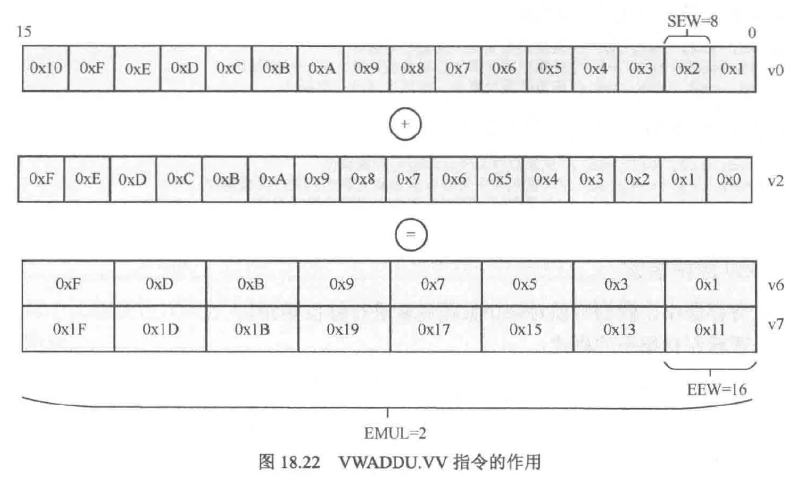

##### 位操作指令

```c
//矢量与矢量间的与操作
vand.vv vd, vs2, vs1, vm

//矢量与标量间的与操作
vand.vx vd, vs1, rs1, vm

//矢量与立即数间的与操作
vand.vi vd, vs1, imm, vm

//矢量与矢量间的或操作
vor.vv vd, vs2, vs1, vm

//矢量与矢量间的异或操作
vxor.vv vd, vs2, rs1, vm
```

##### 比较指令

比较指令可以对每个矢量元素进行比较操作，符合条件会在目标掩码寄存器对应位记1，否则记0
```c
//判断是否相等
vmseq.vv vd, vs2, vs1, vm    //vmseq即Vector Mask Set if EQual
```
除了相等比较外还有其他比较指令，详见rvv手册  

例如实现以下比较：(a<b)&&(b<c)  
其中abc均为矢量，查手册获取rmslt指令，可以通过v0.t来存储a<b判定的结果从而实现掩码操作来替代与操作
```c
//将va vb寄存器的内容进行比较，若a<b，则在v0的对应位记1，否则为0
vmslt.vv v0, va, vb
//将vb vc寄存器的内容进行比较，比较时，只比较v0.t对应位为1的值，若b<c，则在v0的对应位记1，否则为0
vmslt.vv v0, vb, vc, v0.t
```

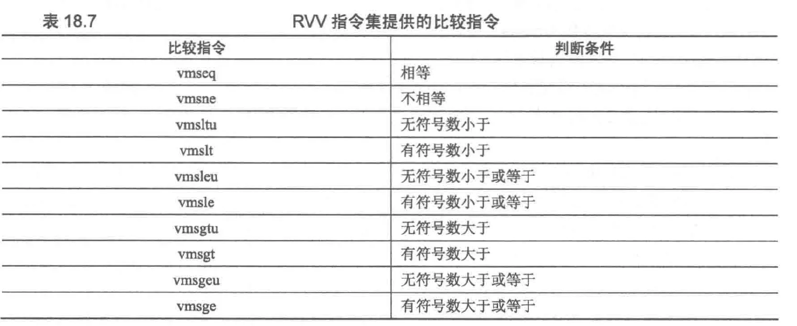

##### 其他

gcc提供了rvv的内置函数，我们可以像c风格一样直接调用，编译器会自动生成对应汇编  
我们也可以使用gcc提供的自动矢量化选项来自动矢量化代码，从而充分利用矢量寄存器的带宽。其原理之一是将已知循环次数的循环体展开到矢量寄存器内，编译选项为-free-loop-vectorize，开启o3优化时会自动选择该项
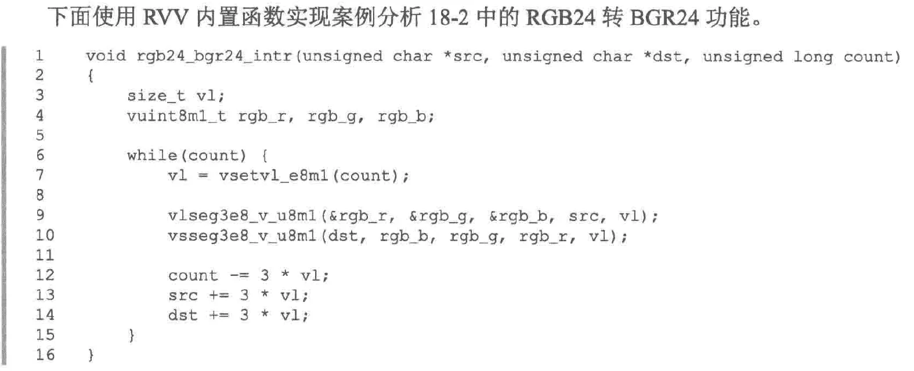

### 压缩指令集

由于riscv指令集相比其他risc商业指令集(如armv8)密度低，例如arm有专用的成对加载/存储指令，一条指令可以完成riscv两条指令的工作。因此使用riscv架构就会造成编译后的代码增多，这样就需要更大的存储介质并，同时指令密度低也造成了提指令缓存的命中率过低，也会降低程序效率  

因此rv推出压缩指令扩展(C)，压缩指令扩展使用16位宽指令替换32位宽或64位宽指令，由于32/64位指令严格兼容16位指令，因此低位宽指令集不会影响高位宽指令集，实验表明，一个程序中有50%的指令可以使用压缩指令集中的指令来替代  

压缩指令集的替代高位宽指令集的策略为
* 当指令中的立即数或地址偏移量很小时
* 当指令中有一个寄存器是x0，x1或x2时
* 当指令中第一个源寄存器和目标寄存器是同一个寄存器时
* 当指令中所有寄存器都使用C指令集常用的8个寄存器时

### 虚拟化

实现虚拟化三要素
* 资源控制：vmm(virtual machine manager)必须能够管理所有的系统资源
* 等价性：虚拟机的运行行为与裸机行为一致
* 效率性：虚拟机运行的程序不受vmm的干涉

敏感指令：操作某些特权资源的指令，如访问，修改vm模式或机器状态指令  
特权指令：具有特殊权限的指令，这类指令只用于操作系统或其他系统软件，一般不直接供用户使用  

三要素中第2点的实现较为困难，要实现就必须保证敏感指令是特权指令的子集。也就是说，当执行敏感指令来操作vm时，一定要陷入特权指令。这样vm就不会发现自己处于用户模式还是系统模式(有些恶意软件会请求vm给予更高权限来判别是否处于vm中)，它只会认为自己运行于用户模式。而vmm使用位于系统模式，vm相对于vmm就类似于app相对于os，它会认为没有其他的vm存在而独享所有资源。为了解决第2点，x86采用了二进制翻译的技术，vmm在vm运行中会动态的将所有有问题的指令替换为符合条件的指令，这被称为**软件虚拟化**  

2005年，Intel引入了硬件虚拟化技术(virtualization technology，vt)。vt的基本思想是创建可以运行虚拟机的容器。vt中，cpu有两种模式：根与非根，这两种模式都有ring0~ring3四个特权级  

根模式是给vmm用的，这种模式支持vmx指令集。非根模式是给vm用的，该模式不支持vmx。进入与退出根模式可以通过指令进行，类似ecall


#### 内存地址的虚拟化

在内存虚拟化中：存在四种地址
* GVA(guest virtual address)：虚拟机虚拟地址
* GPA(guest physical address)：虚拟机物理地址
* HVA(host virtual address)：宿主机虚拟地址
* HPA(host physical address)：宿主机物理地址

在访问内存时，由于页表项位于内存，因此当需要修改页表项时仅仅是对非敏感内存的操作，这并不涉及敏感指令。因此vm不会陷入vmm中，为了能捕获vm行为，vmm会创建影子页表供vm修改。vmm提供给vm的影子页表是只读的，一旦vm尝试修改影子页表就会触发缺页异常导致陷入vmm  
这样，vm修改pa就需要3步：GVA->GPA->HPA，这三步也被称为影子页表。但相比于HVA->HPA的宿主机的页表查询，影子页表引入的额外缺页异常会产生性能问题，为了解决这个问题，可以使用硬件来加速影子页表的查询速度。Intel就实现了这种被称为EPT的技术  
上面修改影子页表的步骤可能会让人迷惑：为什么需要GPA->HPA？直接使用GPA不行么？这是因为vm相对于vmm就类似于app相对于os，因此即使是vm的GPA，实际上还是va，因此为了能够得到真正的pa，我们需要查询宿主机的页表，所以需要GPA->HPA这一步

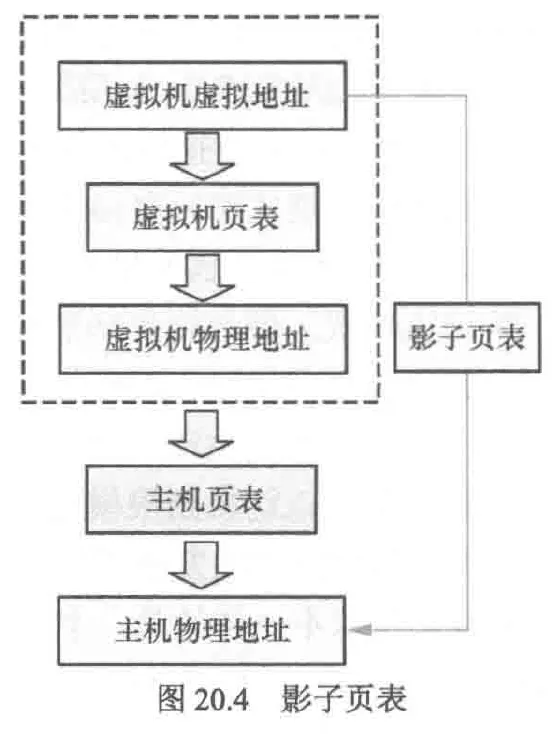

#### io虚拟化  

在虚拟化环境中，虚拟机（VM）不仅使用 I/O 设备，还常常依赖 DMA（直接内存访问）进行高速数据传输。但这也带来了安全隐患：如果不加限制，虚拟机中的外设可能通过 DMA 访问甚至篡改宿主机或其他虚拟机的内存  
为了解决这一问题，系统引入了 IOMMU（输入输出内存管理单元）。它的作用与 CPU 使用的 MMU 类似，但面向的是设备。IOMMU 能够将设备发出的地址请求（通常是设备虚拟地址，DVA，或直接是GPA）映射为主机的实际物理地址（HPA），这一过程被称为： DMA 重映射（DMA Remapping）  
在虚拟化场景下，IOMMU 会根据 VMM（虚拟机管理器）设置的 GPA → HPA 映射，建立一套独立的页表。这使得虚拟机的 DMA 请求只能访问其自身的内存空间（GPA 对应的 HPA），无法越权访问宿主机或其他虚拟机的内存  

#### rv的虚拟化扩展

rv的cpu在虚拟化方面有两个改进：
* 将s模式扩展为hs模式，增加寄存器和指令来同时兼容两类虚拟机(第一类虚拟机指的是vmm作为宿主机的os，第二类虚拟机指的是vmm作为宿主机os管理的一个应用程序)，例如在mstatus寄存器添加了模式(v)字段，v=0表示位于非虚拟化模式，如m，hs或u，v=1表示系统位于vs或vu模式
* 新增vs和vu模式，给vm内部划分权限


在虚拟化场景下，新增了vmm，它被允许运行在hs模式。而vm的os运行在vs模式，vm的应用程序运行在vu模式
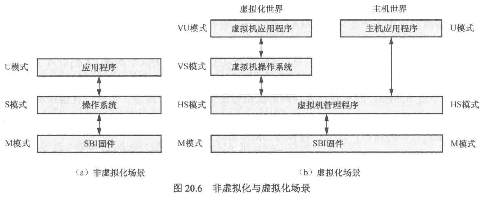

#### rv内存虚拟化

与Intel的ept技术类似，riscv也采用了硬件加速查询影子页表来优化内存虚拟化的性能。为此riscv准备了两个寄存器：vsatp与hgatp。这两个寄存器分别存储v模式和hs模式下的页表基地址，并且hgatp的支持模式包括sv39x4，sv48x4等，相比普通的映射模式，x4代表额外支持2位的页表，如sv39x4支持41位的GPA

虚拟机两阶段的地址映射过程
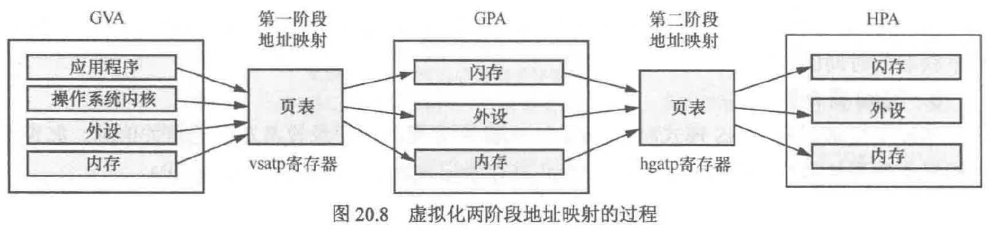

包括宿主机的映射过程


对于tlb刷新指令来说，sfence.vma与v相关，v=0，也就是位于m或hs模式，此时该指令与普通的sfence指令并无区别，都是刷新宿主机tlb缓存，或根据指定的 ASID 刷新特定地址空间的 TLB。v=1时仅仅作用于vs模式的第一阶段地址转换的tlb刷新，此时也可以通过指定 ASID，仅刷新对应虚拟机地址空间的 TLB 条目  
新增指令hfence.gvma：该指令作用于第二阶段地址转换的tlb刷新  

riscv虚拟化扩展提供两种模式：虚拟化模式和非虚拟化模式，这类似于Intel vt中的根模式与非根模式  
虚拟化模式(v=1)：指cpu运行在vm中，如vs或vu模式  
非虚拟化模式(v=0)：指cpu运行在vmm中，如m或hs模式  

进入vm：可以配置hstatus的spv以及spvp字段，然后执行sret指令从而进入vm  
退出vm：vm在运行中遇到需要vmm处理的事件，如外部中断或缺页异常，cpu可以自动挂起vm，切换到非虚拟化模式(hs或m)从而退出vm
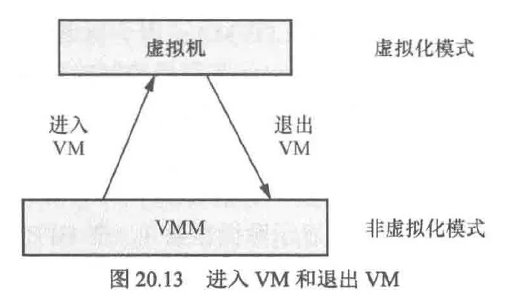

#### 中断虚拟化

由于中断虚拟化标准尚未成熟，此处只做简要介绍，rv的中断虚拟化主要采用中断注入和陷入模拟技术。中断注入指的是提供hvip寄存器来将虚拟中断注入虚拟机。hvip支持软件中断，定时器中断和外设中断  

陷入与模拟：目前riscv在硬件中断虚拟化中仅支持最基本的中断注入功能，要完成一次中断处理过程需要陷入vmm中模拟  

下面以定时器中断触发流程讲解中断注入以及陷入与模拟  

1. vm中的虚拟定时器驱动通过sbi服务接口陷入hs模式的vmm中，从而配置下次定时器的超时事件
2. vmm中的驱动通过sbi服务接口访问m模式下的mysbi固件来配置定时器
3. mysbi设置mtimer
4. 等待一段时间后mtimer触发中断
5. 定时器中断由m模式的mysbi固件优先处理，在其内部的中断处理程序中将该中断委托给hs模式下的vmm处理
6. 在vmm中的中断处理程序中通过虚拟中断注入机制设置hvip寄存器
7. vm收到中断并处理该中断

上述过程为一般的中断注入机制，可见，每次配置定时器都要陷入vmm并且陷入m模式，这会增大开销。为了解决该问题，riscv正在草拟方案，因此本文不做介绍

