# RT-Thread平台搭建实验


本文为笔者的毕业设计相关内容，目的是使用嵌入式系统将振动数据发送至对应主机。系统使用stm32+rtthread作为基本结构，并选用其他中间件丰富系统功能。由于stm32的ram与rom资源紧缺，后期移植文件系统以及其他中间件会爆内存，因此笔者目前暂停这一方案，并转而使用ESP32C3为主控

<!-- more -->

# RT-Thread

实验参照[RTT官方文档](https://www.rt-thread.org/document/site/#/rt-thread-version/rt-thread-standard/README)以及[RTT内核实验手册](https://www.rt-thread.org/document/site/rt-thread-version/rt-thread-standard/tutorial/experimental-manual/experimental-manual.pdf)

## RT-Thread简介  

RT-Thread(下文简称rtt)是一款纯国产的RTOS，其特色在于组件非常丰富，适用于物联网行业。其基本组件包含RTOS内核，wifi协议栈，dfs文件系统，finsh控制台，USB协议栈，安全模块，低功耗模块，音视频框架，压缩解压库等
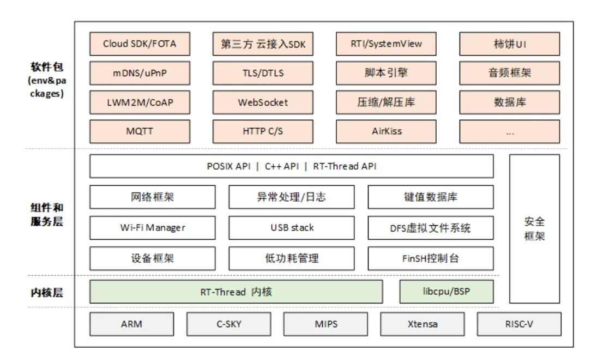

rtt主要运行于32位cpu，但更高等级的cpu也可适用

## 环境搭建

目前我们需要env工具使用menuconfig来进行组件裁剪甚至内核裁剪，在调试的时候我们还需要用到segger公司的systemview工具来查看资源占用，线程调度等信息。在工程代码管理方面，我们使用git从rtt官方库中拉取代码并进行版本管理，使用vscode进行代码编辑，使用keil进行代码烧写，使用scon脚本编译代码和构建产物，使用MobaXterm进行串口调试和执行shell命令。我们暂时不需要MQTT或者websocket等高级功能，但未来可能进行补充

### git环境配置及项目搭建

首先建立工程需要将代码克隆到本地
```shell
git clone git@github.com:RT-Thread/rt-thread.git
```
此操作将会在当前目录下建立一个.git文件夹和一个rt-thread文件夹  

如果克隆时遇到了公钥指纹的问题，可以尝试重新登陆
```shell
git config --global user.name "用户名" 

git config --global user.email "邮箱" 
```

克隆成功后我们得到的是master版本，master更新频繁因此适合尝鲜的发烧友使用。而研究学习以及做产品建议使用stable或者lts版本，为了能够下载多个版本我们还需要执行以下命令
```shell
git branch -r //获取远程仓库分支名

git checkout -b 本地分支名 origin/远程分支名    //将远程分支下载到本地分支
//例如我们如果要下载origin/lts-v4.1.x版本的rtt，我们可以执行以下命令
git checkout -b lts-v4.1.x origin/lts-v4.1.x
```
这样我们就将远程的lts-v4.1.x分支拉取到本地的lts-v4.1.x分支，即使本地之前没有创建lts-v4.1.x分支也无所谓，git会自动创建  

下面是下载好的分支
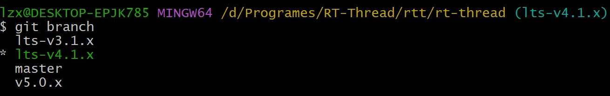
之后我们统一在lts-v4.1.x版本上对代码进行更改  

至此本地仓库搭建完毕

### env环境搭建

Env 是 RT-Thread 推出的开发辅助工具，针对基于 RT-Thread 操作系统的项目工程，提供编译构建环境、图形化系统配置及软件包管理功能。我们使用env最主要的目的就是menuconfig套件，其次env有方便易用的命令行系统。menuconfig是linux和rtt都使用用来配置内核模块的工具。我们可以通过menuconfig图形化系统来配置内核及模块，这样就不必到每个文件夹下修改Kconfig的内容了，十分方便  

首先从官网下载env工具包并安装，而后在对应的bsp目录下`D:\Programes\RT-Thread\rtt\rt-thread\bsp\stm32\stm32f103-blue-pill`打开env命令行，并使用menuconfig命令来配置软件包
```shell
D:\Programes\RT-Thread\rtt\rt-thread\bsp\stm32\stm32f103-blue-pill

menuconfig
```

这里我们只选择 RT-Thread online packages-> tools packages-> SystemView 工具用来配合systemview软件使用。由于我们使用的是在线软件包，因此在选择之后我们还需要去服务器上下载，这一步使用pkgs --update命令
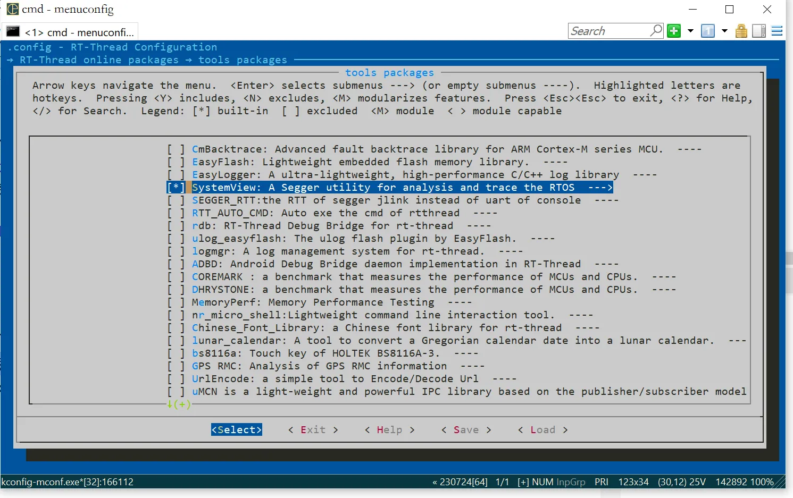
空格键就可以选中，?键可以查看帮助  
进入到SystemView后我们还需要设置内核为M3
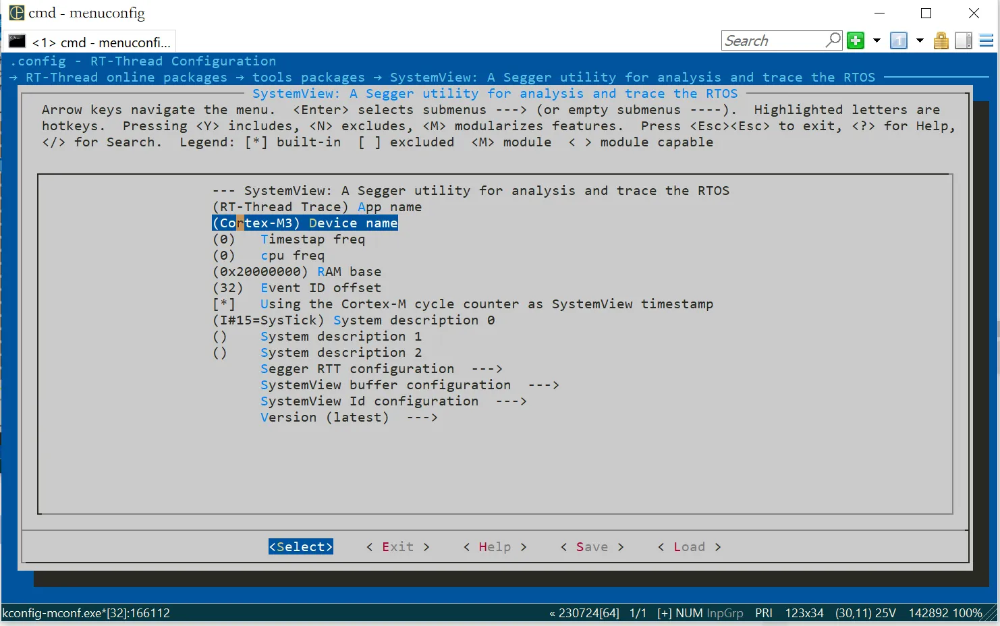
并在SystemView buffer configuration中关闭事后分析模式
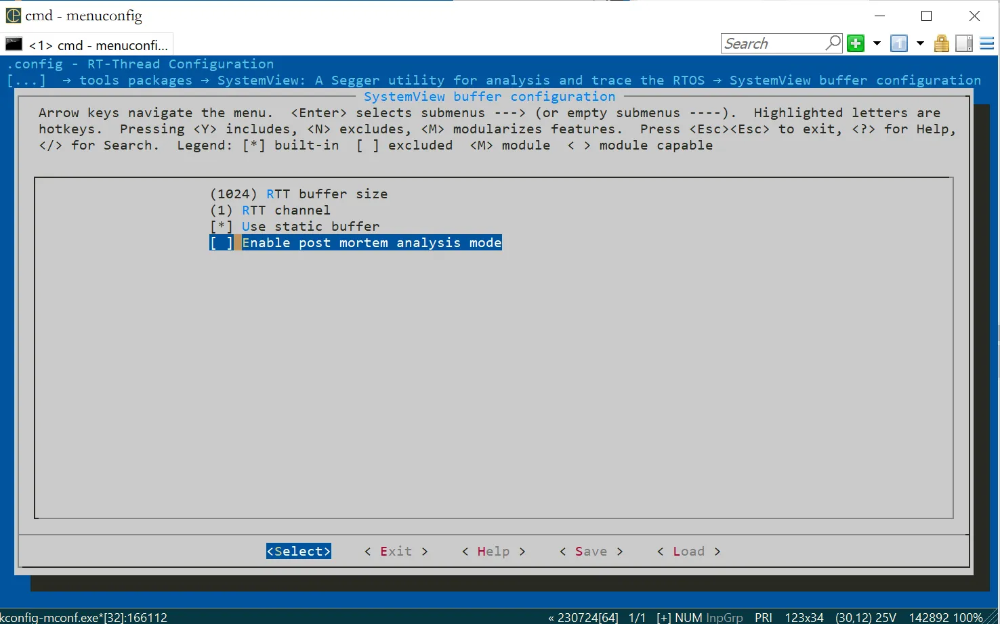
配置完成后退出保存即可  

不要忘了在最后还要获取软件包，pkgs是rtt官方维护的包管理工具
```shell
pkgs --update
```

软件包下载后还需要把他们编译进代码，我们使用基于python的编译脚本scons进行编译。在bsp目录下执行
```shell
scons
```

这样我们就得到了软件包文件夹packages。由于systemview并不能识别rtt系统，我们需要将`packages\segger_debug-xxx\SystemView_Description\SYSVIEW_RT-Thread.txt`文件拷贝到SystemView 工具安装目录下的 Description 目录下


在v5.0.x版本中使用systemview模块时会产生rtt版本过高的问题
  

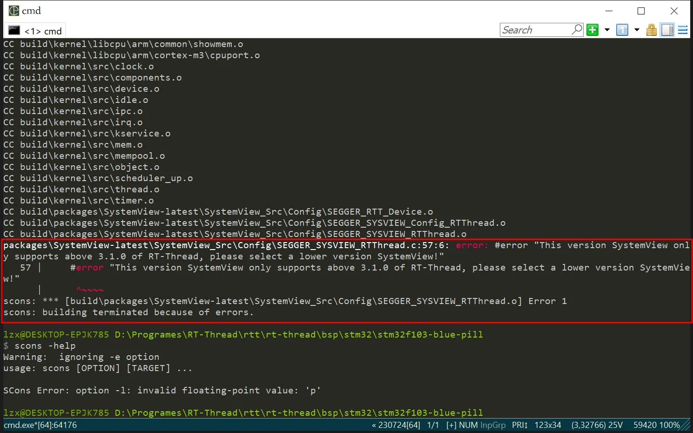

为了支持keil等工具，我们还需要执行
```shell
scons --target=mdk5
```

之后我们就可以在bsp目录下找到project.uvprojx文件了。最后打开keil进行烧录即可

### vscode项目搭建

为了保证编译与编辑的一致性，vscode与keil的项目文件应保持一致。我们在vscode的插件市场搜索project manager，然后将rt-thread文件夹导入，这样在编辑代码时我们就可以保证代码的一致性  

为了能够测试systemview，我们还需要在工程内添加测试代码，测试代码源于[rtt文档中心](https://www.rt-thread.org/document/site/#/rt-thread-version/rt-thread-standard/application-note/debug/systemview/an0009-systemview?id=添加示例代码)

添加后我们还需要重新编译模块，但是执行scons命令后会出现如图所示的错误信息
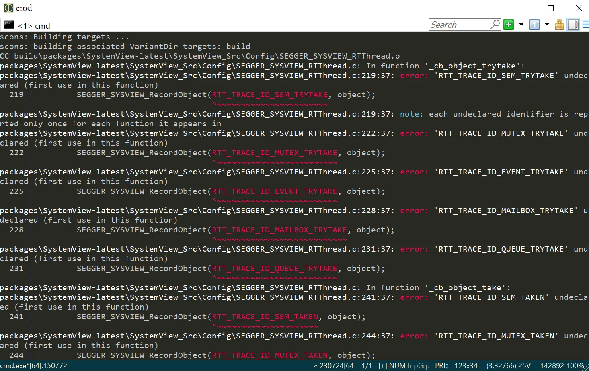
根据提示，原因可能是`packages\SystemView-latest\SystemView_Src\Config\SEGGER_SYSVIEW_RTThread.c`文件中的若干变量未定义，找到对应代码如下
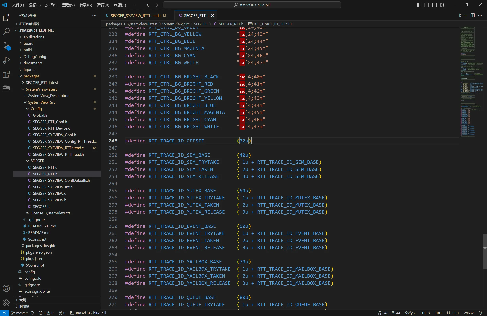
我们发现引用的头文件与当前文件不属于同级目录，这会导致编译器找不到头文件，因此只需要更改头文件索引目录
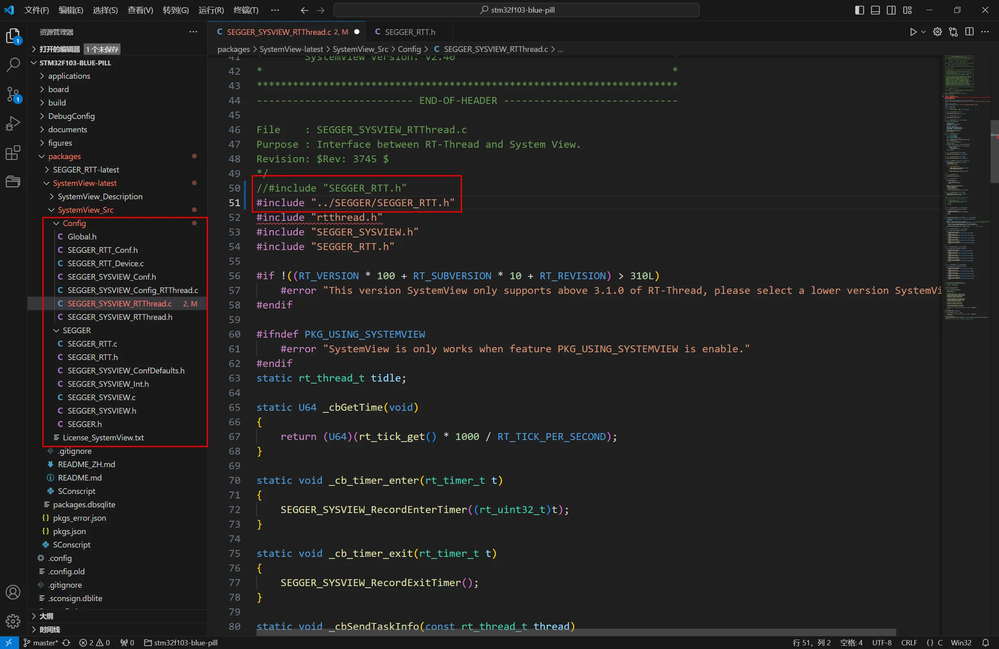

如果在vscode里面不想看见除了stm32的所有芯片bsp，我们可以在settings.json填写如下代码
```json
{
    "files.exclude": {
        "**/bsp/^(stm32)/**": true,
        "bsp/[!s]*": true,
        "bsp/s[!t]*": true,
        "bsp/st[!m]*": true,
        "bsp/stm[!3]*": true,
        "bsp/stm3[!2]*": true,
        "bsp/stm32/stm32[!f]*": true,
        "bsp/stm32/stm32f[!1]*": true,
        "bsp/stm32/stm32f10[!3]*": true,
        "bsp/stm32/stm32f103-[!b]*": true,
        "bsp/stm32/libraries/STM32[!F]*":true,
        "bsp/stm32/libraries/STM32F[!1]*":true,
        "bsp/stm32/libraries/templates/stm32[!f]*":true,
        "bsp/stm32/libraries/templates/stm32f[!1]*":true,
    },
    "search.exclude": {
        "**/bsp/^(stm32)/**": true,
        "bsp/[!s]*": true,
        "bsp/s[!t]*": true,
        "bsp/st[!m]*": true,
        "bsp/stm[!3]*": true,
        "bsp/stm3[!2]*": true,
        "bsp/stm32/stm32[!f]*": true,
        "bsp/stm32/stm32f[!1]*": true,
        "bsp/stm32/stm32f10[!3]*": true,
        "bsp/stm32/stm32f103-[!b]*": true,
        "bsp/stm32/libraries/STM32[!F]*":true,
        "bsp/stm32/libraries/STM32F[!1]*":true,
        "bsp/stm32/libraries/templates/stm32[!f]*":true,
        "bsp/stm32/libraries/templates/stm32f[!1]*":true,
    },
}
```
看起来有点蠢，这是因为vscode目前不支持正则的写法[Github的讨论](https://github.com/microsoft/vscode/issues/869)

### MobaXterm与msh配置  

msh会被系统自动执行，但是由于优先级的问题我们应该在main函数做延时处理，防止饿死其他线程
```cpp
int main(void)
{
	//SEGGER_SYSVIEW_Start();
    /* set LED0 pin mode to output */
    rt_pin_mode(LED0_PIN, PIN_MODE_OUTPUT);
    //demo_init();
    rt_kprintf("hello world\n");
    while (1)
    {
        rt_thread_mdelay(10);
    }
}
```

接下来我们配置MobaXterm，我们新建会话，类型选择串口。在端口上面我们可以打开设备管理器查看com号也可以根据提示直接进行选择，波特率选择115200
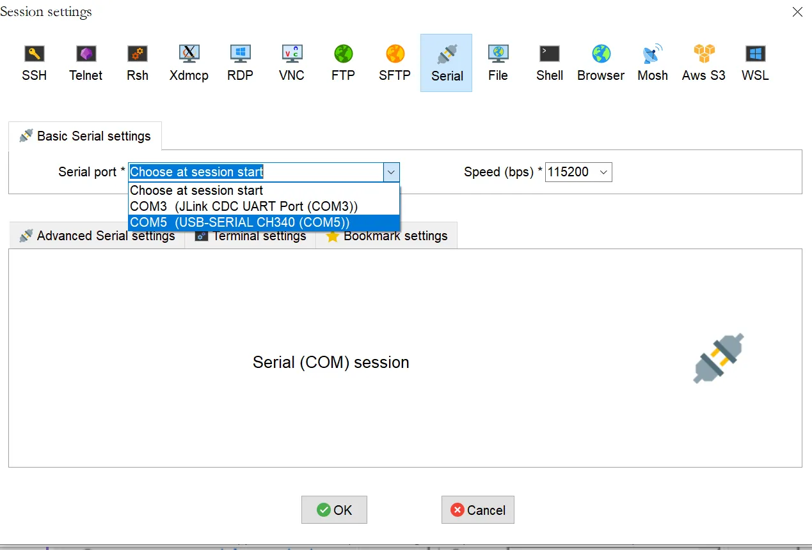

至此软件部分设置完毕

## 硬件接线  

首先将jtag接口连接到转接板上，按照最小系统板的原理图将转接板的3.3v，gnd，nrst，tdi，tdo，tms，tck，vref引脚连接到最小系统板上，其中vref是转接板的参考电压引脚，应该与最小系统板的正极并联。连接完成后我们就可以安装jlink驱动程序并烧写程序进板子了，我们也可以使用keil进行jlink的debug。但之前我们必须设置debug选项：
* 首先选择jlink(注意这里的Driver DLL和Dialog DLL选项及其参数，当修改芯片型号时需要进行修改)
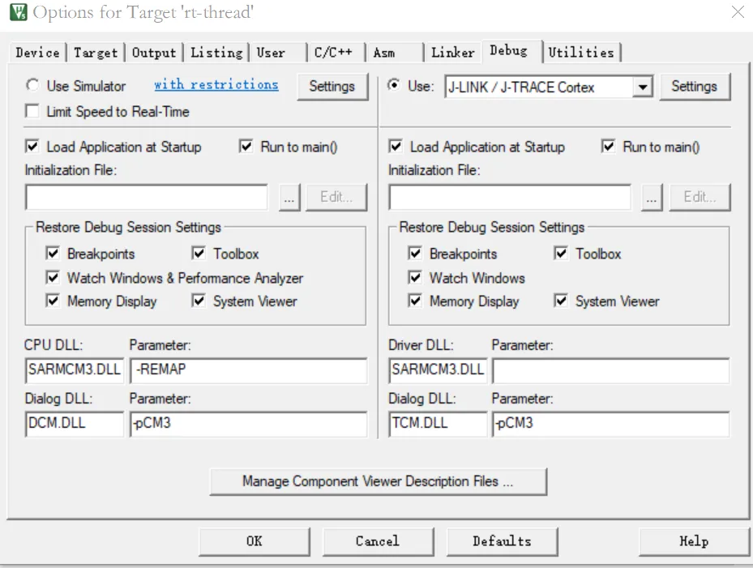

而后选择端口为sw(gpt也不知道为什么不使用jtag调试而使用sw)
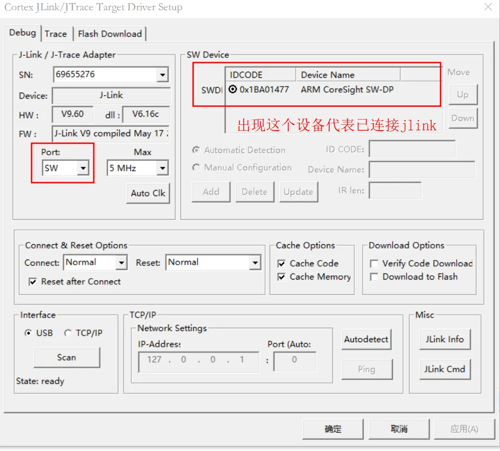

别忘了使能trace
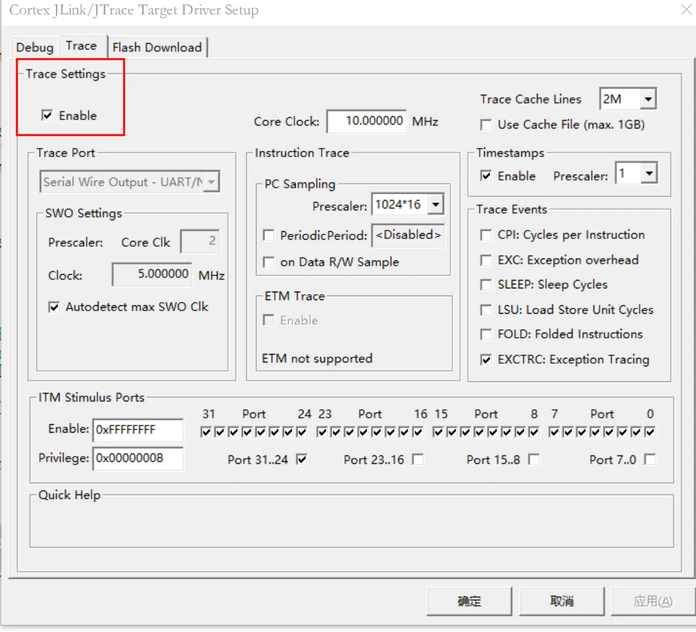

下载运行
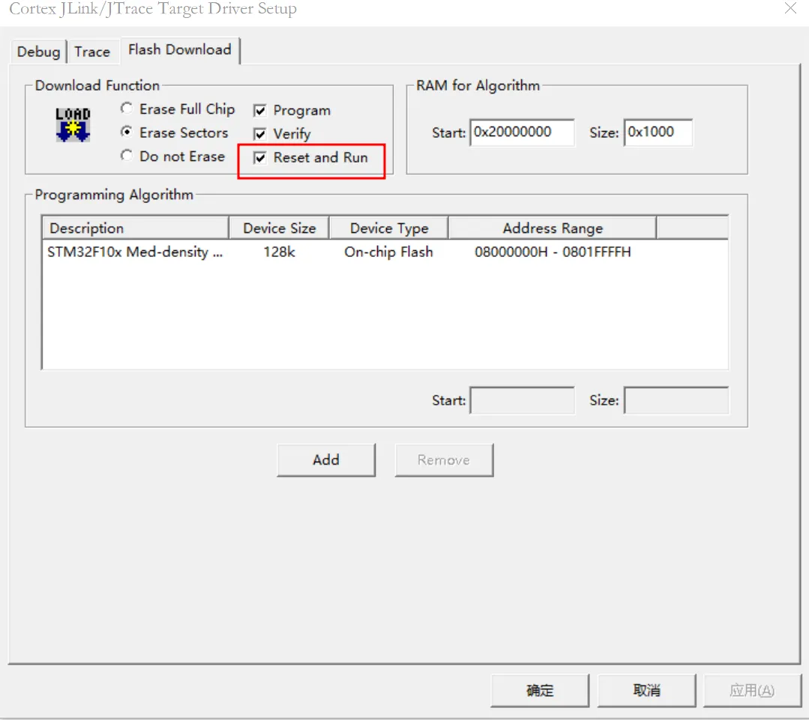

这样keil和调试器我们就设置好了，接下来我们设置串口  

rtt可以通过menuconfig配置对应的串口，具体配置路径如图。rtt默认的串口为uart1，在江科大的板子上对应的是pa9，pa10引脚，因此我们的硬件串口连线应该连接在pa9，pa10上，这样我们才能通过串口使用msh进行调试
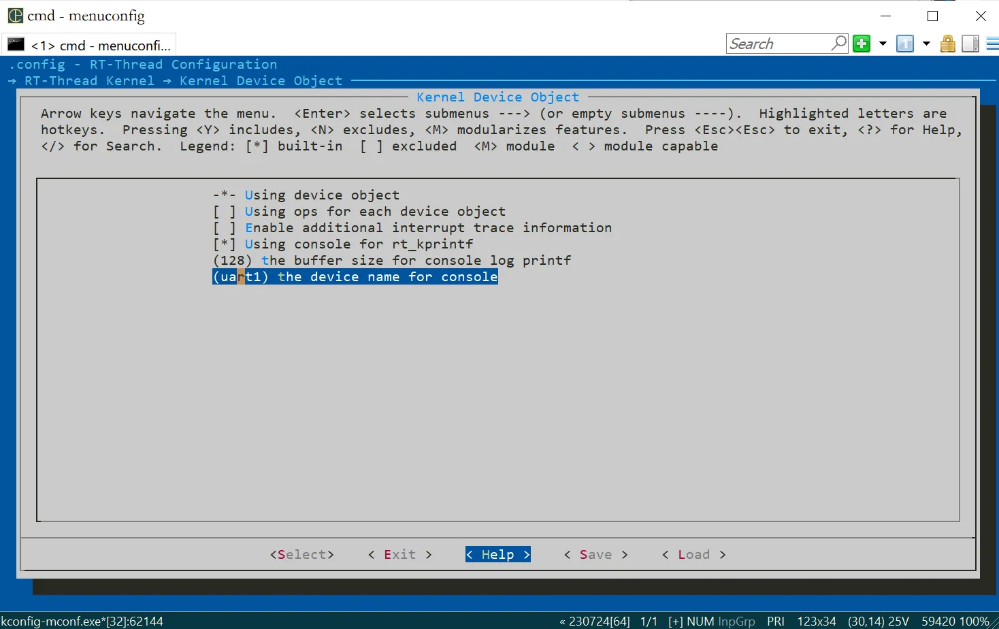

## 实验过程  

### 串口实验  

按照[串口官方文档](https://www.rt-thread.org/document/site/#/rt-thread-version/rt-thread-standard/programming-manual/device/uart/uart_v1/uart)编写程序，需要注意我们使用的是串口1，而官方文档为串口2，我们需要修改代码。除此之外，由于官方例程只能输出固定字符串，我们可以在官方文档上进行改进，添加shell-like serial的功能，这个功能可以使我们像shell一样将从串口发送的信息回显到MobaXterm上  

改进后的例程：
```c
#include <rtthread.h>

#define SAMPLE_UART_NAME       "uart1"      /* 串口设备名称 */

/* 串口接收消息结构*/
struct rx_msg
{
    rt_device_t dev;
    rt_size_t size;
};
/* 串口设备句柄 */
static rt_device_t serial;
/* 消息队列控制块 */
static struct rt_messagequeue rx_mq;

/* 接收数据回调函数 */
static rt_err_t uart_input(rt_device_t dev, rt_size_t size)
{
    struct rx_msg msg;
    rt_err_t result;
    msg.dev = dev;
    msg.size = size;

    result = rt_mq_send(&rx_mq, &msg, sizeof(msg));
    if ( result == -RT_EFULL)
    {
        /* 消息队列满 */
        rt_kprintf("message queue full！\n");
    }
    return result;
}

static void serial_thread_entry(void *parameter)
{
    struct rx_msg msg;
    rt_err_t result;
    rt_uint32_t rx_length = 0;
    static char rx_buffer[RT_SERIAL_RB_BUFSZ + 1];
    char input;

    while(1)
    {
        result = rt_mq_recv(&rx_mq, &msg, sizeof(msg), RT_WAITING_FOREVER);
        if(result < 0)
        {
            rt_kprintf("mq recv err\n");
        }

        rt_device_read(msg.dev, 0, &input, 1);
        rx_buffer[rx_length++] = input;
        rt_kprintf("input: %c\n",input);

        /* 以回车为缓冲区输出标志 */
        if(input == '\r')
        {
            /* 通过串口设备 serial 输出读取到的消息 */
            rt_size_t size = rt_device_write(msg.dev, 0, rx_buffer, sizeof(rx_buffer));
            if(size != sizeof(rx_buffer))
            {
                rt_kprintf("write err\n");
            }
            /* 打印数据 */
            rt_kprintf("rx_buffer: %s\n", rx_buffer);
            /* 重置初始量 */
            rx_length = 0;
            rt_memset((void*)rx_buffer, 0, sizeof(rx_buffer));
        }
    }
}

static int uart_dma_sample(int argc, char *argv[])
{
    rt_err_t ret = RT_EOK;
    char uart_name[RT_NAME_MAX];
    static char msg_pool[256];
    char str[] = "hello RT-Thread!\r\n";

    if (argc == 2)
    {
        rt_strncpy(uart_name, argv[1], RT_NAME_MAX);
    }
    else
    {
        rt_strncpy(uart_name, SAMPLE_UART_NAME, RT_NAME_MAX);
    }

    /* 查找串口设备 */
    serial = rt_device_find(uart_name);
    if (!serial)
    {
        rt_kprintf("find %s failed!\n", uart_name);
        return RT_ERROR;
    }

    /* 初始化消息队列 */
    rt_mq_init(&rx_mq, "rx_mq",
               msg_pool,                 /* 存放消息的缓冲区 */
               sizeof(struct rx_msg),    /* 一条消息的最大长度 */
               sizeof(msg_pool),         /* 存放消息的缓冲区大小 */
               RT_IPC_FLAG_FIFO);        /* 如果有多个线程等待，按照先来先得到的方法分配消息 */

    /* 以 DMA 接收及轮询发送方式打开串口设备 */
    rt_device_open(serial, RT_DEVICE_FLAG_DMA_RX);
    /* 设置接收回调函数 */
    rt_device_set_rx_indicate(serial, uart_input);
    /* 发送字符串 */
    rt_device_write(serial, 0, str, (sizeof(str) - 1));

    /* 创建 serial 线程 */
    rt_thread_t thread = rt_thread_create("serial", serial_thread_entry, RT_NULL, 1024, 25, 10);
    /* 创建成功则启动线程 */
    if (thread != RT_NULL)
    {
        rt_thread_startup(thread);
    }
    else
    {
        ret = RT_ERROR;
    }

    return ret;
}
/* 导出到 msh 命令列表中 */
MSH_CMD_EXPORT(uart_dma_sample, uart device dma sample);
```

遇到的问题：  

* hardfault
    * 在serial_thread_entry中定义了rt_uint32_t rx_length = 0;，如果仅仅是声明而不初始化rt_uint32_t rx_length;就会导致编译器不会初始化为0，从而在rx_buffer[rx_length++] = input;处访问非法地址，这对于没有mmu的单片机来说是致命的，最终很可能导致hardfault

* 键盘输入无反应，直至message queue full！错误产生
    * 在serial_thread_entry中有while(1)循环，当去掉循环结构且不改变内部代码时会产生这个错误。这是由于即使我们有信号量或消息邮箱，但如果我们没有存活的线程OS也不会将休眠的线程唤醒。解决的办法是使用while(1)死循环用来保活，这样才能正常的被调度器调度和中断唤醒  

* 获取信号量失败或其他内核对象失败
    * 可能是子函数占据内存太多把父函数爆栈了，需要在父函数申请一个更大的堆栈空间

#### 遇到的问题  

如果将`rt_uint32_t rx_length = 0;`改写为`rt_uint32_t rx_length;`，则会导致下面printf访问非法的内存地址，这在103上会导致总线错误
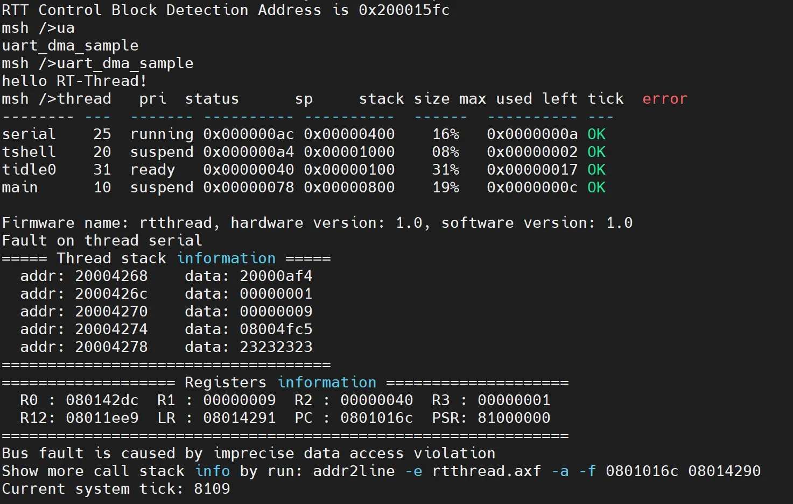

### spi实验  

#### 硬件连线  

我们使用w25q64来作为测试spi通信的硬件设备，同时也为搭建文件系统做准备  

在这里我们使用103的spi1作为通信接口，因此根据引脚定义，我们需要将w25q64的各个引脚连接到103的pa4~pa7上

#### bsp制作  

由于rtt官方bsp给出的f103的bullpill板仅支持spi2，为了能够使用spi1接口我们需要修改bsp  

1. 首先下载安装STM32CubeMX，安装完毕后再下载对应的stm32f1系列的sdk
2. 然后将stm提供的ioc文件(位于D:\Programes\RT-Thread\rtt\rt-thread\bsp\stm32\stm32f103-blue-pill\board\CubeMX_Config\CubeMX_Config.ioc)打开，并将原来复用为adc的pa4~pa7引脚复用为spi，注意不要将pa4设置为spi_nss，因为rtt会对此引脚进行软件控制，我们不需要复用此引脚  
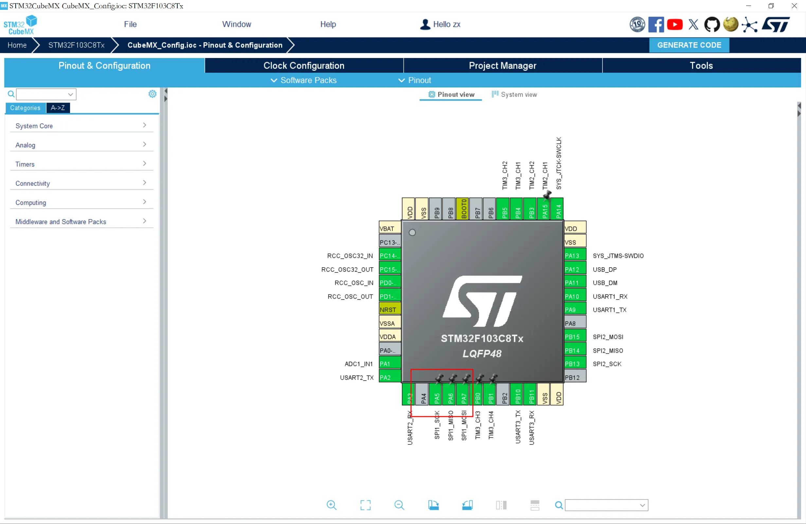
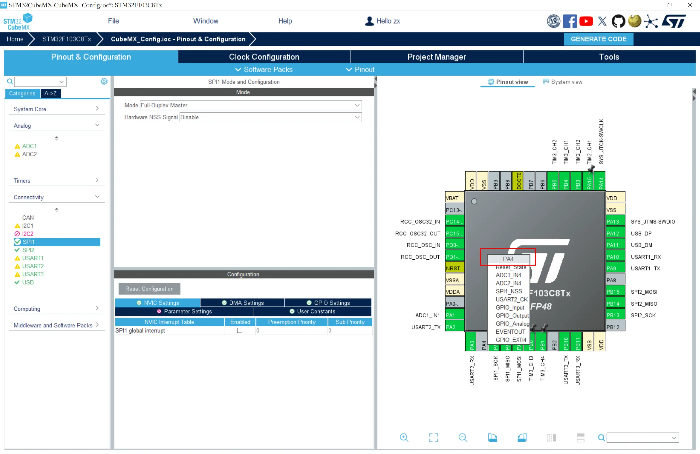
3. 然后通过左侧面板选择复用的spi引脚的模式为全双工。因为rtt会对片选引脚进行软件设置，因此在下方的硬件片选引脚选择disable  
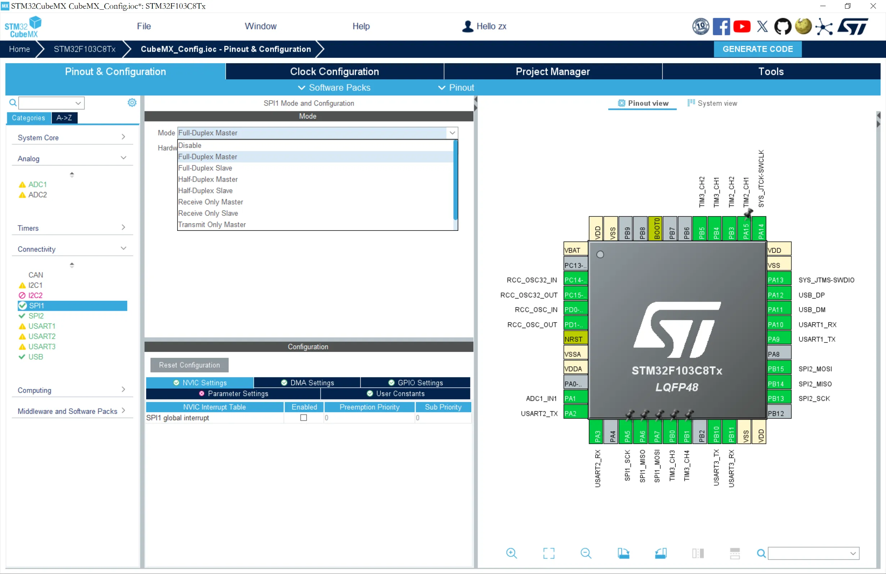  
由于adc1和adc2桥接在不同频率的外设总线上，因此使用预分频的时候adc1选择4，adc2选择2  
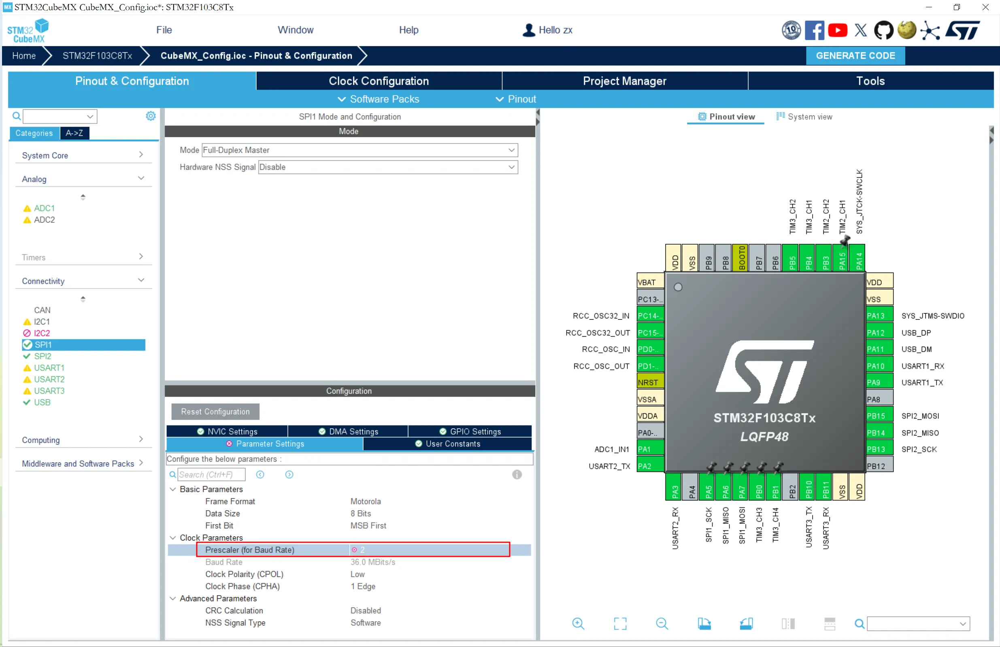
4. 我们也可以在当前栏内配置其他选项，当配置完成后点击generate code就可以生成bsp文件了
5. 为了能够在menuconfig显示菜单项并修改外设配置 ，我们进入board/Kconfig文件，搜索到spi2后复制一份并将spi2替换为spi1，并修改menu项名称为spi1(我这里没修改就会导致出现两个一样的菜单项)
6. 这时我们menuconfig就可以看到新的spi1设备了，使能新设备spi1后进入配置界面，打开dma功能
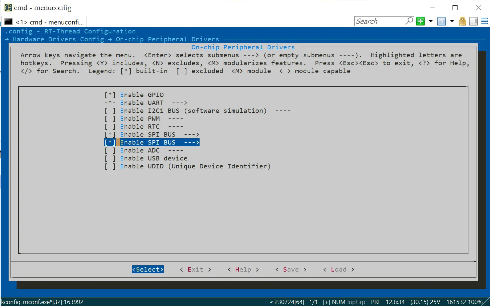

至此，bsp制作完成，接下来进行menuconfig配置rtt组件

#### menuconfig配置  

如图所示，在menuconfig中打开spi总线驱动，启用万能 SPI Flash 驱动库serial flash universial driver(sfud)库来为格式化文件系统做准备
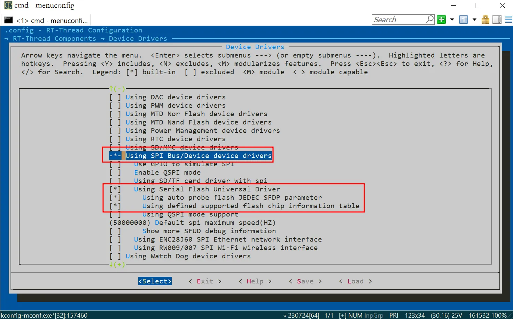

其他选项如qspi模式，gpio模拟spi等是否启用根据需求来  

配置完成后使用scons命令进行编译(或使用keil编译也可)

#### 软件编写

下列代码参考[官方文档](https://www.rt-thread.org/document/site/#/rt-thread-version/rt-thread-standard/programming-manual/device/spi/spi?id=spi-%e8%ae%be%e5%a4%87%e4%bd%bf%e7%94%a8%e7%a4%ba%e4%be%8b)，注意修改参考代码中的spi设备号和总线号
```c
static void spi_w25q_sample(int argc, char *argv[])
{
    struct rt_spi_device *spi_dev_w25q;
    char name[RT_NAME_MAX];
    rt_uint8_t w25x_read_id = 0x90;
    rt_uint8_t id[5] = {0};

    if (argc == 2)
    {
        rt_strncpy(name, argv[1], RT_NAME_MAX);
    }
    else
    {
        rt_strncpy(name, W25Q_SPI_DEVICE_NAME, RT_NAME_MAX);
    }

    struct rt_spi_device *spi_device = RT_NULL;
    spi_device = (struct rt_spi_device *)rt_malloc(sizeof(struct rt_spi_device));
    if(RT_NULL == spi_device)
    {
        LOG_E("Failed to malloc the spi device.");
    }

    /* 查找 spi 设备获取设备句柄 */
    spi_dev_w25q = (struct rt_spi_device *)rt_device_find(name);
    if (!spi_dev_w25q)
    {
        rt_kprintf("spi sample run failed! can't find %s device!\n", name);
    }
    else
    {
        /* 方式1：使用 rt_spi_send_then_recv()发送命令读取ID */
        rt_spi_send_then_recv(spi_dev_w25q, &w25x_read_id, 1, id, 5);
        rt_kprintf("use rt_spi_send_then_recv() read w25q ID is:%x%x\n", id[0], id[1]);

        /* 方式2：使用 rt_spi_transfer_message()发送命令读取ID */
        struct rt_spi_message msg1, msg2;

        msg1.send_buf   = &w25x_read_id;
        msg1.recv_buf   = RT_NULL;
        msg1.length     = 1;
        msg1.cs_take    = 1;
        msg1.cs_release = 0;
        msg1.next       = &msg2;

        msg2.send_buf   = RT_NULL;
        msg2.recv_buf   = id;
        msg2.length     = 5;
        msg2.cs_take    = 0;
        msg2.cs_release = 1;
        msg2.next       = RT_NULL;

        rt_spi_transfer_message(spi_dev_w25q, &msg1);
        rt_kprintf("use rt_spi_transfer_message() read w25q ID is:%x%x\n", id[3], id[4]);
    }
}
/* 导出到 msh 命令列表中 */
MSH_CMD_EXPORT(spi_w25q_sample, spi w25q sample);
```
这里第一步应该是将spi设备绑定到spi总线上，但为了能够快速进行硬件初始化，所以将绑定代码放到主函数中
```c
rt_err_t err;
err = rt_hw_spi_device_attach("spi1", "spi10", GPIOA, GPIO_PIN_4);
if(err != RT_EOK)
{
    LOG_E("Failed to attach the spi device.");
}
```

由于我已经打开了文件系统，这可能会对读写程序有影响，因此读到的数据是0，但是可以看到，系统已经识别了spi1，spi2两条总线，并且还探测到了spi10设备
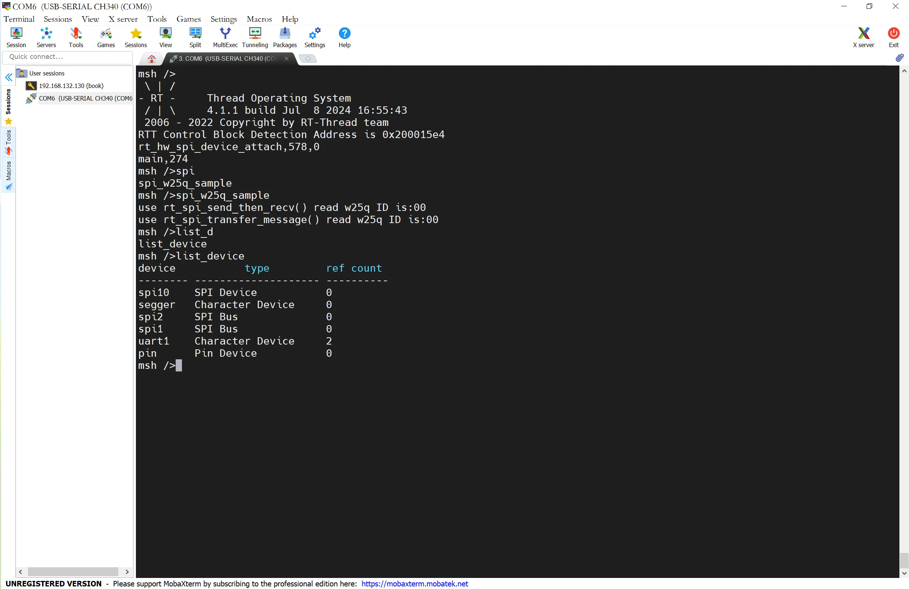

#### 遇到的问题  

* spi找不到设备但能正常识别总线，产生assert failed at rt_hw_spi_device_attach错误
    * 可能是设备绑定函数使用错误，使用`rt_spi_bus_attach_device `api和`rt_hw_spi_device_attach `api是不同的。两者形式如下  

```c
rt_err_t rt_hw_spi_device_attach(const char *bus_name,
                                 const char *device_name,
                                 GPIO_TypeDef* cs_gpiox,
                                 uint16_t cs_gpio_pin);

rt_err_t rt_spi_bus_attach_device(struct rt_spi_device *device,
                                  const char           *name,
                                  const char           *bus_name,
                                  void                 *user_data)
```
注意那个void *user_data，这个是用来传`struct stm32_hw_spi_cs`结构体的。这个结构体包含了端口组号(如GPIOA，GPIOB)和端口号(GPIO_PIN_4，GPIO_PIN_5等)，所以下面的api实际就是上面改进。对于rtt v5+来说，推荐使用`rt_spi_bus_attach_device_cspin`，这个api是对下面的api的进一步改进，它使用RT-Thread的PIN框架来绑定SPI的片选引脚，解决了不同bsp的上层应用对片选引脚操作不统一的问题

### 文件系统实验  

**对于stm32f103c8t6而言，使用文件系统会导致内存不足，这是因为rtt会malloc一个FATFS对象，这个操作会申请4k左右大小的空间，而这对于20k sram的103而言是捉襟见肘的**  

spi实验完成后f103就可以与w25q64芯片进行通讯了，为了能够创建块设备，我们还需要在代码中加入如下代码
```c
static int rt_hw_spi_flash_with_sfud_init(void)
{
    if (RT_NULL == rt_sfud_flash_probe("W25Q64", "spi10"))
    {
        return RT_ERROR;
    };

    return RT_EOK;
}
INIT_COMPONENT_EXPORT(rt_hw_spi_flash_with_sfud_init)
```
最后一行表示将函数导出为组件，其内部实现是将代码放进rtt规定的段内在系统开机初始化的时候调用，详解见[CSDN](https://blog.csdn.net/qq_36310253/article/details/125233779)。因此如果block_device的启动位于spi驱动之前就会导致不能创建块设备，对于这种情况我们有两种解决办法：
1. 要么根据[官方文档-启动流程](https://www.rt-thread.org/document/site/#/rt-thread-version/rt-thread-standard/programming-manual/basic/basic?id=rt-thread-%E5%90%AF%E5%8A%A8%E6%B5%81%E7%A8%8B)将主函数中的`rt_hw_spi_device_attach`函数使用INIT_DEVICE_EXPORT()宏导出，这样可以将spi设备启动顺序提前
2. 要么在主函数中手动调用`rt_hw_spi_flash_with_sfud_init`函数，这样可以将块设备启动顺序滞后
这样我们就可以看到块设备了
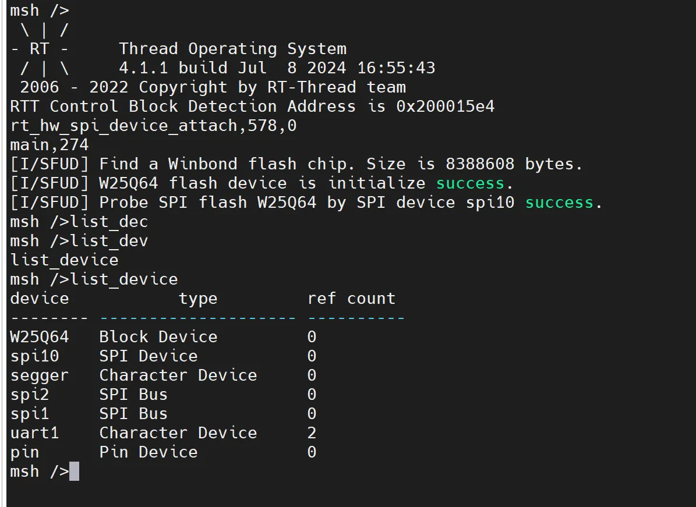

### CmBacktrace移植

在前面的实验中我们发现排查问题时会很困难，例如hardfault。当程序问题产生的时候，最重要的就是定位问题，对于这种情况我们通常的解决办法是使用keil的单步调试一步步看，有经验的工程师还会使用反编译的文件+寄存器现场来定位问题。但上面两种办法效率太低，因此我们使用CmBacktrace工具来定位问题  

CmBacktrace的原理就是栈回溯，所以这跟有经验的工程师所有的寄存器和反编译文件方法没有本质区别  

组件移植过程非常简单，我们只需要进入 RT-Thread online packages -> tools packages，使能CmBacktrace套件并配置相关项即可。注意退出时不要忘记`pkgs --update`

#### 遇到的问题  

* 编译阶段找不到CmBacktrace的头文件，如果包含CmBacktrace的头文件就会导致CmBacktrace头文件的内容与之前已经包含头文件的内容产生冲突
* 造成这个原因的是keil工程并没有包含所需的头文件 ，因此需要在工程里给定相关头文件的路径


