# Rust


本文是笔者学习Rust时系统总结的笔记，内部详细地介绍了Rust的特点以及语法，较为深入的探讨了Rust语言的语资料包括但不限于b站视频[Rust编程语言入门教程](https://www.bilibili.com/video/BV1hp4y1k7SV)，国人出品的开源书籍[Rust语言圣经(Rust Course)](https://course.rs/about-book.html)，[Rust语言中文社区](https://rustcc.cn/)，以及rust的官方书籍[The Rust Programming Language](https://doc.rust-lang.org/book/)

<!-- more -->

# Rust

## 前期准备

### 环境搭建

可选ide/插件式编辑器:  rustrover(jet brains)/rust-analyzer(rust foundation)+vscode  

访问[rust官网](https://www.rust-lang.org/tools/install)来获取下载链接，windows采用msvc编译链，在使用msvc之前需要先下载`Visual Studio C++ Build tools`。浏览器会自动识别平台并提供下载方式

### 创建项目  

```shell
cd path
cargo new project
```

### 编译运行

可使用`rustc`编译
```rust
rustc filename.rs
```

大型项目推荐使用`cargo`进行编译
```rust
cd project
cargo build
```
使用`cargo build`命令会在`project/target/debug`下生成可执行文件，默认编译方式是调试编译  
同时也可以使用`cargo run`编译并运行代码

### 添加外部库

添加外部库有两种方法
* 修改`cargo.toml`文件的[dependencies]部分，添加格式为`lib = "<version>"`
* 在终端执行`cargo add lib<@version>`，不添加@version字段为添加最新版库

### 强弱类型与动静态  

强类型: 编译器对类型有强约束，例如rust，java，python  
弱类型: 编译器对类型无强约束，例如C，C++（有争议）  
动态语言: 类型在运行时才确定，例如python  
静态语言: 类型在编译完成时即可确定，编译时进行类型检查，例如rust  

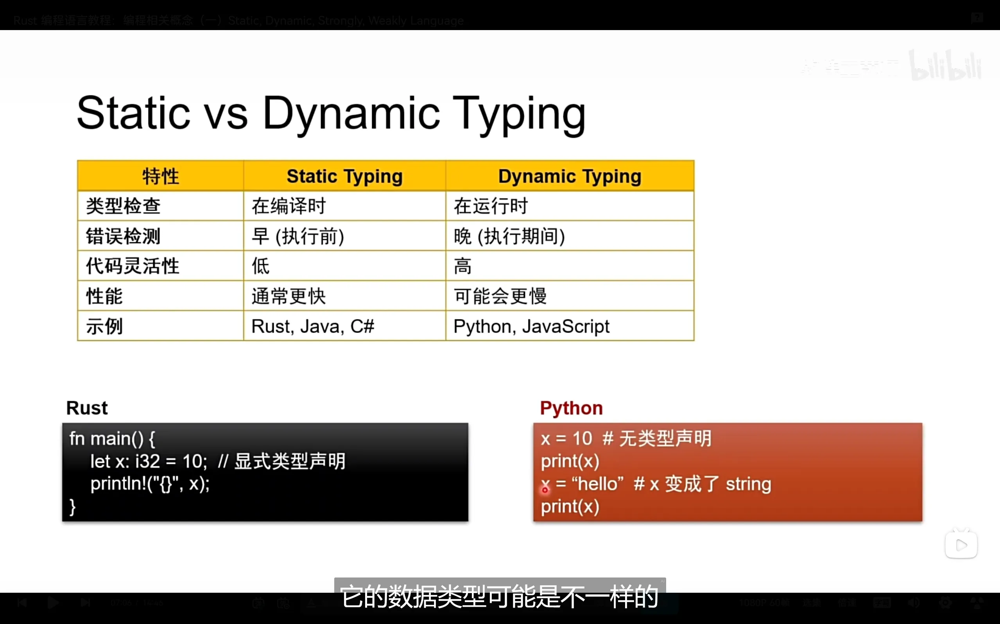

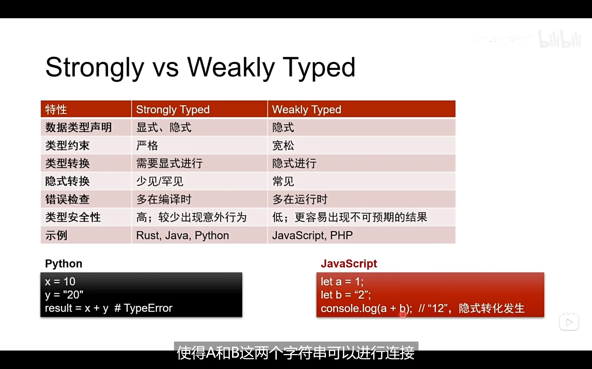

## 基本语法

### 变量与常量

定义变量
```rust
let var; //默认定义的变量是不可变的
let mut var;//定义可变变量
```
定义常量
```rust
const cst:i32; //定义时必须指定类型
```

变量遮蔽(shadowing): 在同一作用域内可定义相同名称变量，但重新定义后只能使用新值
```rust
let num = 1;
let num = 2;    //num使用这个值
```

### 数据类型

我们可以使用`as`关键字来强制指定数字类型
```rust
let thing1: u8 = 89.0 as u8;
assert_eq!('B' as u32, 66);
assert_eq!(thing1 as char, 'Y');
let thing2: f32 = thing1 as f32 + 10.5;
assert_eq!(true as u8 + thing2 as u8, 100);
```
第一行代码等价于
```rust
let thing1 = 89.0 as u8;
let thing1: u8 = 89.0;
```

此外，`as`关键字还可以给导入的模块起别名

#### 标量类型  

包括整数类型，浮点类型，布尔类型和字符类型

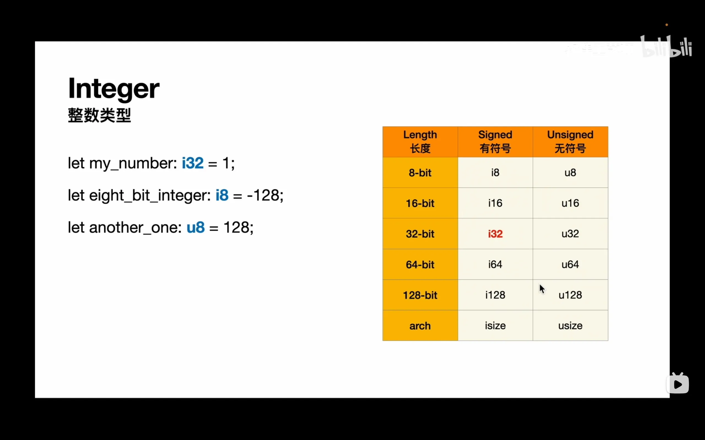

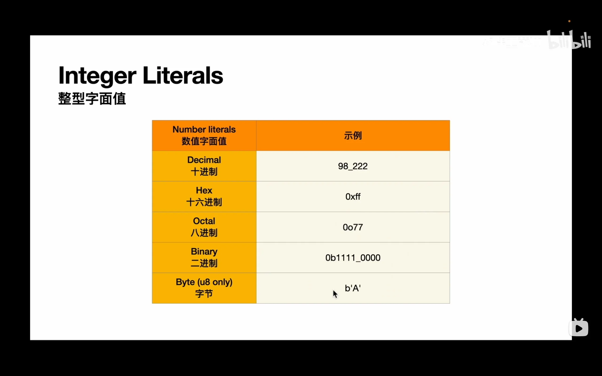

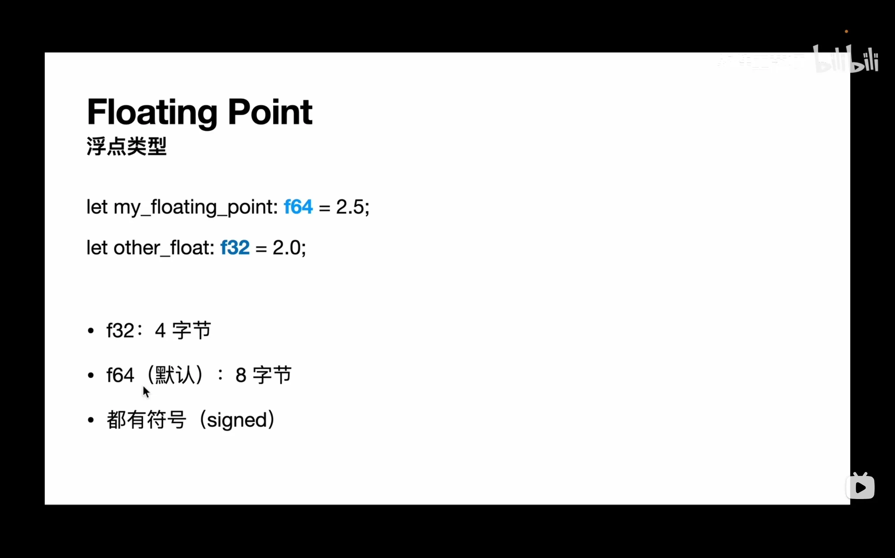

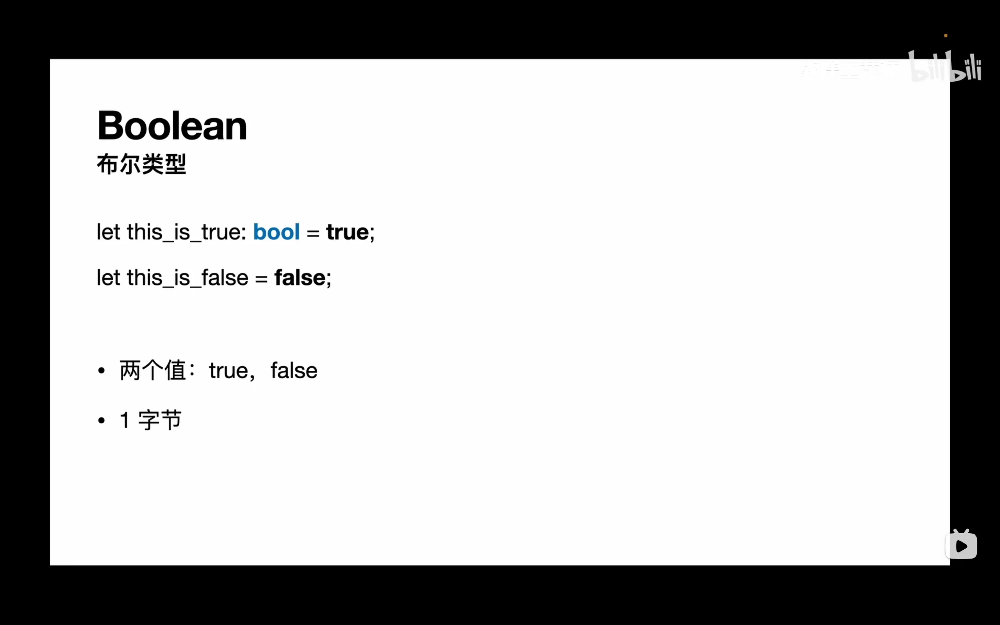

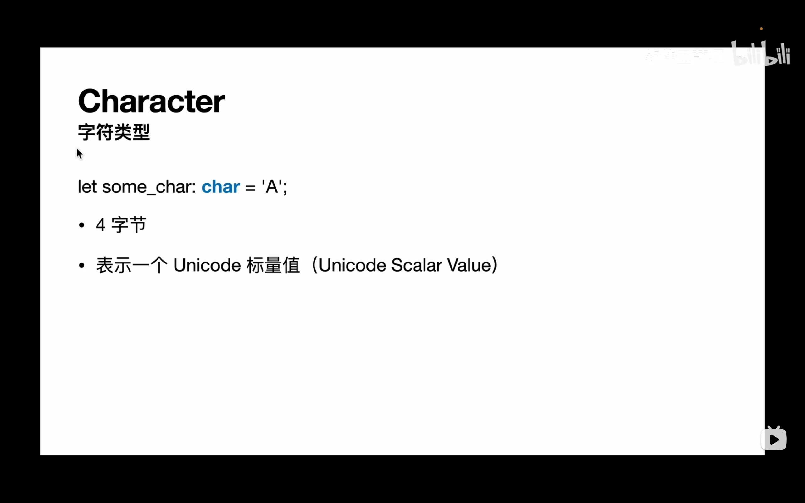

**字符类型是32位的，用以表示unicode字符**

#### 复合类型  

原始复合类型有两种: 元组(tuple)，数组(array)

##### 元组

不同类型数据的集合
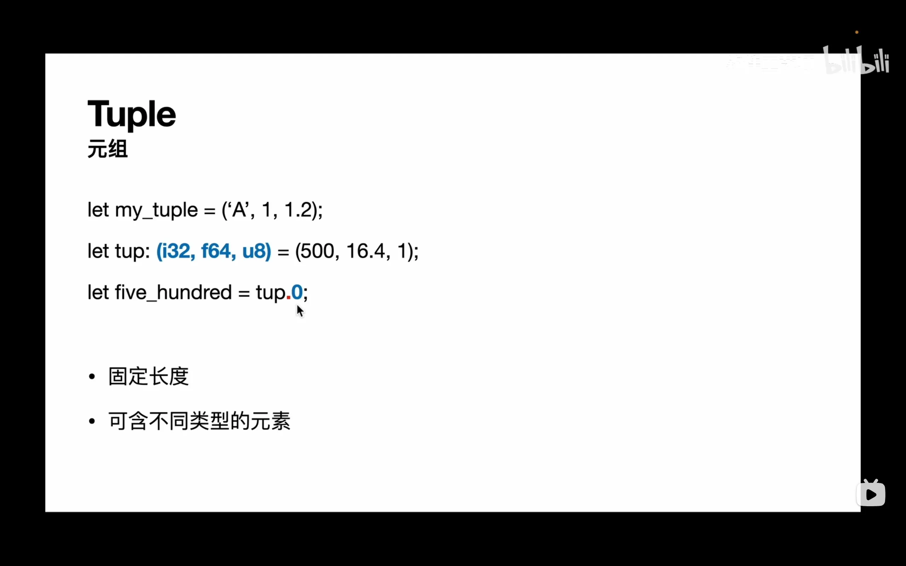

##### 数组

相同数据的集合
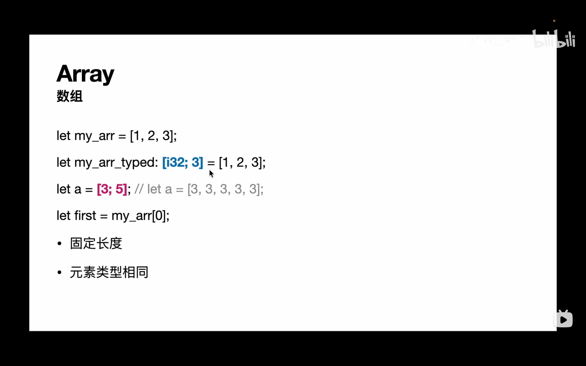

### 函数  

定义函数及参数时必须指明参数类型，并可以指定函数返回值类型(可以返回多个值)
```rust
fn fun(a:i32, b:char) -> i32
{
    return a;
}

fn fun1(a:i32, b:char) -> (i32，i32)
{
    (a,a+1)
}
```

与其它语言不同的是，rust的语句没有返回值，例如在C中，语句的返回值是未定义行为，但是可以视为bool或整型变量。但在rust中则会报错。因此有关下列语句中，x+1的结尾是没有分号的
```rust
fn main()
{
    let y = {
        let x = 3;
        x + 1    //表达式无分号
    }; //y的定义语句才有分号
    println!("y = {}",y)；
}
```

### 控制流（逻辑表达式）

#### if表达式

使用if表达式无论是否使用else if的多重分支都需要将分支语句用花括号括上，并且判断条件不应使用()包括起来
```rust
fn main()
{
    let num = 3;
    if num < 4
    {    //不可省略花括号
        println!("num<4");
    }
    else
    {
        println!("num>4");
    }
}
```

**注意: if表达式的condition必须为bool变量，否则报错**
```rust
fn main()
{
    let x = 1;    //x不是bool变量，会报错
    let y = if x {0} else {1};
    println!("{y}");
}
```

#### 循环语句

##### loop

loop是一个死循环，只能从break处跳出循环  

break 表达式就返回值
```rust
fn main()
{
    let mut counter = 0;
    let result = loop {
        counter += 1;
        if counter==10{
            break counter * 2;
        }
    }
    println!("{result}");
}
```
使用break还可以跳转到标签处，标签写法: 'label: loop
```rust
fn main() {

    let mut count = 0;
    'count_up: loop{
        println!("{count}");
        let mut remaining = 10;
        loop{
            if remaining==9 {
                break;
            }
            if count==2 {
                break 'count_up;
            }
            remaining -= 1;
            println!("{remaining}");
        }
        count += 1;
    }
}
```

##### for

与python的for写法一样
```rust
fn main(){

    let a = [10,20,30,40,50,60];
    for element in a{
        println!("{element}");
    }

}
```

想要指定循环次数或者其它有关循环的高级功能可以使用rust的range库

##### while

与C的while相同，但是判断条件同样不应使用()括起来

## 所有权

为了能够更好的理解所有权的概念，这里现介绍一下字符串的类型，因为字符串在某些情况下是存储在堆上的，而这就会导致各种各样的bug(参考C++的string)

### 字符串类型  

[中文社区的图片](https://rustcc.cn/article?id=094e335f-2321-45ab-9370-e26535b66c80)清晰的指出了字符串和切片类型的区别  

字符串类型远比其它类型要复杂，它首先要处理两种情况:
* 不可修改的字面量类型
* 可修改的String类型

两种需求决定了不同的处理方式:
* 字面量类型由于其不可修改，因此被硬编码到可执行文件里并充分发挥其速度快的优势
* 当需要用户手动输入字符串时，这就需要在堆上开辟一段内存，因此需要使用String::from来将不可变的字面量转换为可变的堆上的对象

为了能够综合利用两种方式的优点，rust规定str类型既可以存储在堆上也可以硬编码到文件里，而前者为了兼容后者，str必须是动态类型的(DST)，而想要使用动态类型就必须使用指针(在字符串中为引用)，这样，即使是硬编码的字符串也必须使用引用来获取。对于String类型则单指存储在堆上的字符串，它也使用引用的方式来获取来避免字符串移动后丢失对象，这样我们常见的字符串都是引用类型的，而最初的字符串str类型则不常见  

当使用String后，拥有GC的语言会自动执行清理。而rust通过编译器执行这一切  

一个String由三部分组成:
* 指向内容的指针
* 长度(当前长度)
* 容量(最大可获取长度)

而一个&str则由两部分组成:
* 指向内容的指针
* 长度(当前长度)

因为切片不管理内存，而String还要管理内存的申请和释放(DST类型的特点)  

### 所有权的基本概念

所有权是一组规则，用于控制rust程序如何管理内存  

rust的基本目标: 消除程序中所有的未定义行为  
rust的次要目标: 在编译时而不是运行时消除程序中所有的未定义行为  

rust提供了类似heap的东西，被称为box，其原理类似C++的移动语义或移动构造函数: 仅仅掌握这块内存地址的指针，而不掌握这块内存地址，这在拷贝数据时会节省开销  

rust不允许手动管理(释放)box上的堆内存数据，而是由rust本身进行管理，这样就保证了程序的正确性，但是可以通过所有权系统制造例外  
这个例外的发生与C++析构函数发生的错误很类似: 一个变量绑定到box上，当这个变量的栈帧被销毁时同时也会将这个box销毁，但我们并不清楚在下文是否有程序会读取写入这个box，或者再次释放这个box，这就引出了所有权的概念  

当一个heap数据的所有权从x转移到y时，原来的x就不能被使用了(防止double free或访问非法内存)，因此当所有权发生移动时访问原变量会导致编译错误  

下面的代码尽管不会进入if分支，但是编译器会进行更严格的检查，因此编译不会通过
```rust
fn main() {
    let s = String::from("hello world");
    let s2;
    let b = false;
    if b {
        s2 = s;
    }
    println!("{}", s);
}
```

引用是没有获取所有权的指针  

下面的代码在进行函数调用时会产生所有权移动(box作为函数参数会复制一份，返回时所有权会转移到full)  
```rust
fn main()
{
    let first = String::from("Ferris");
    let full = add_suffix(first);
    println!("{full}");
}

fn add_suffix(mut name: String)
{
    name.push_str("Jr.");
    name
}
```
**实现了copy trait的类型在函数调用时会传入副本**，函数在返回时也会发生所有权的转移  

**引用的规则(借用规则)：**  
* **只能满足下列条件之一**
    * **一个可变的引用**
    * **任意多个不可变的引用**
* **引用必须一直有效**

引用时不会发生所有权的转移，我们把引用作为函数参数的情况称为借用  

尽管变量是以指针的形式传过来的，但是在子函数中能够直接获取原值，而非二次解引用
```rust
fn main() {
    let m1 = String::from("hello");
    let m2 = String::from("world");
    println!("m1:{m1}");
    println!("m1 addr:{:p}",&m1);
    greet(&m1,&m2);
}

fn greet(g1:&String, g2:&String)
{
    println!("{},{}",g1,g2);
    let addr_in_g1 = g1 as *const String;
    println!("{g1}");
    println!("g1 content:{:p}",addr_in_g1);
    println!("g1 addr:{:p}",&g1);
}
```
`println!`宏内部会自动实现解引用，因此即使我们传入的是指针或指针的指针，只要不明确打印的格式为指针类型，我们在屏幕上看到的结果就是指针最终指向的值  

rust经常会自动进行隐式解引用，以至于我们不会经常看到\*
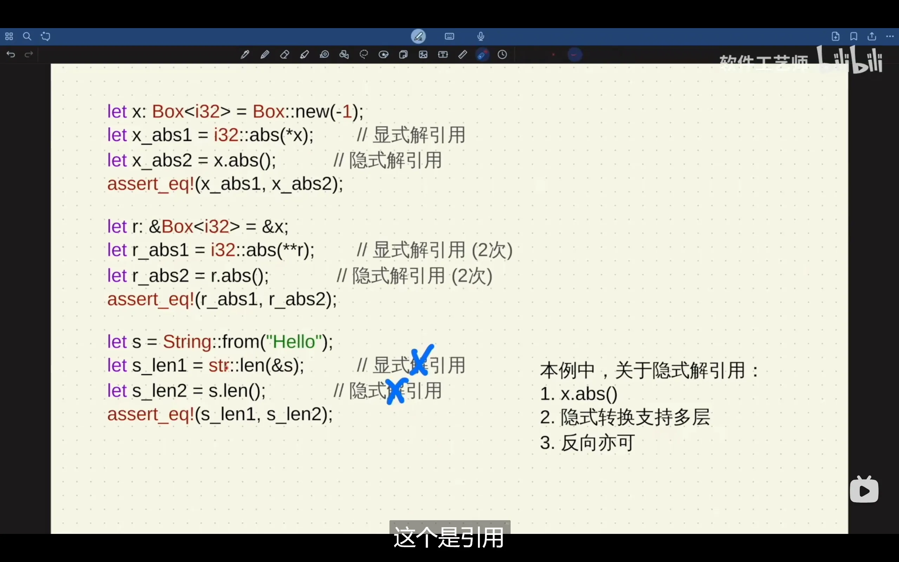

len(&s)写为s.len()是一种语法糖，因为s变量无需其它操作就可以获取自身地址  

**别名和可变性不可同时存在**: 也就是借用规则，C++为了解决这个问题使用了智能指针来解决问题  
别名: 通过不同变量访问同一块内存  

box就是受`别名和可变性不可同时存在`这种规则影响的产物，box规定了每片内存区域只能被一个box占用，因为box内存实现类似于`&mut T`，因此其它任何变量都不能通过别名访问，只能通过box这一媒介来访问原内存，并且box这种权限是独占的，只能被转移到其它box上。这样: **box不能别名，只能移动所有权**  

rust编译器通过借用检查器确保类型安全  
变量对内存中的数据有三种权限:
* 读(R): 数据可以被复制到另一个位置
* 写(W): 数据可以被修改
* 拥有(O): 数据可以被移动或释放

上述权限不在内存中存在，仅存在于编译器中  
默认情况下，变量对内存的数据有RO权限，加上mut后还具有W权限  ，但**引用可以临时移除这些权限**  

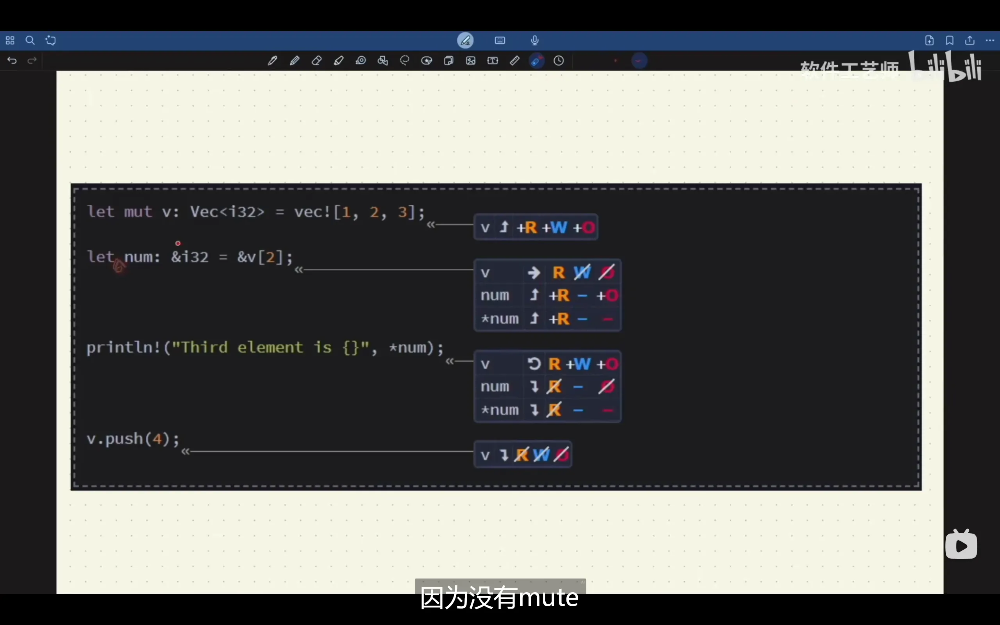

为了类型安全，rust在引用方面也做了特殊设置: 
```rust
let x = 0;
let mut x_ref = &x;    //此时，x_ref有写的权限，但是*x_ref没有写的权限，也就是说，x_ref的指向可以被改变，但是指向的值也就是x不可被改变
```

通过上面的学习发现: 权限与变量强绑定，或者更确切地说，**权限与左值强绑定**

还需要值得注意的是，当一块内存区域被别名了，此时连最初的box或者其它有写权限的变量也会失去写权限，但是我们可以通过**可变引用**来实现对原数据的修改，但修改变量时，最初的变量或box都**失去了全部权限**(包括R权限)
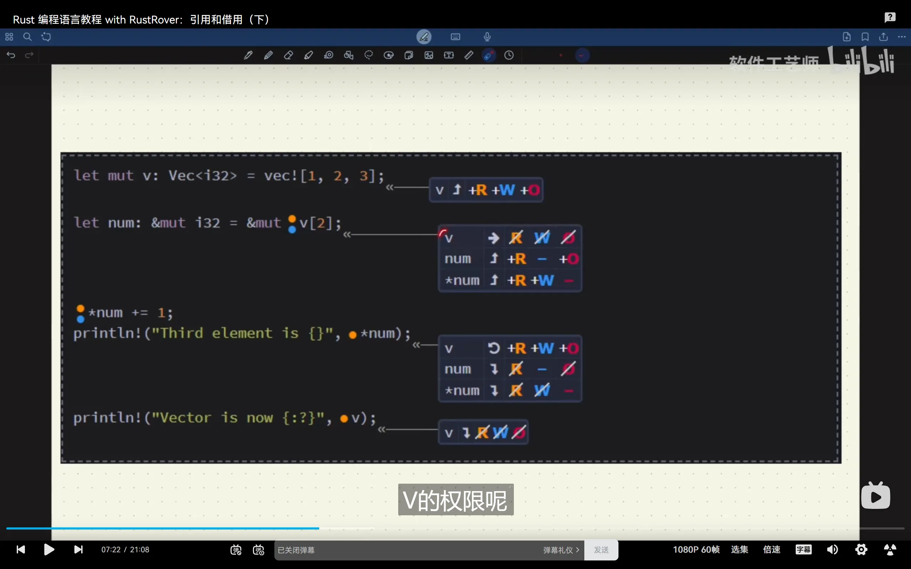

**引用会使数据失去WO权限，可变引用会使数据失去RWO权限**  

在函数输入输出时会产生另外一种权限: 流动权限(F)，这种权限只在函数接受参数以及返回值返回时才产生，并且在函数体内不会发生变化  

随着所有权的到来紧接着就会引入生命周期的问题，在比较复杂的情况中，所有权的并不是很容易被编译器推断出来，因此我们需要使用生命周期参数来指明左值的生命周期

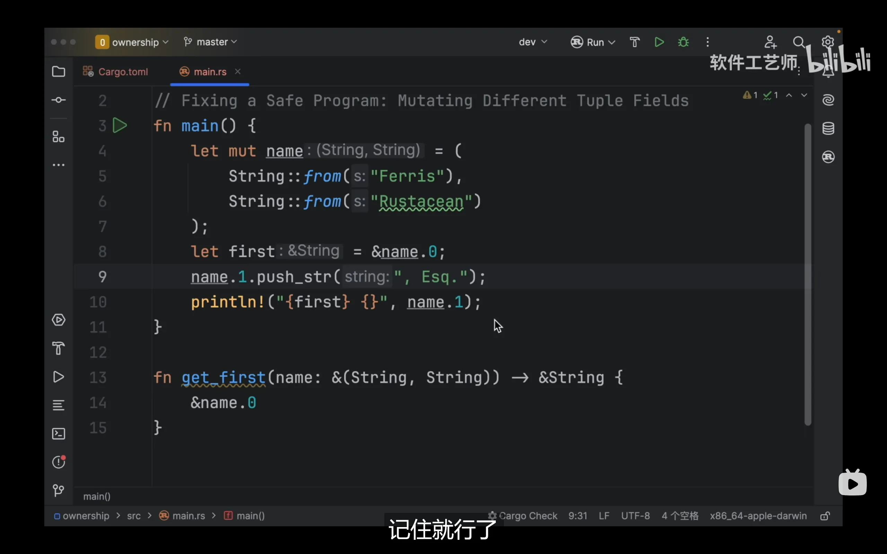

尽管第八行的引用是**不可变**的，在执行完第八行后会发生两件事: 
* 将name的写权限去除
* 将name.0的写权限去除并转移给first  

做完上述两件事后name.1的写权限是保留的，也就是说我们无法对name整个数据进行写操作，但是我们可以对name.1进行写操作  

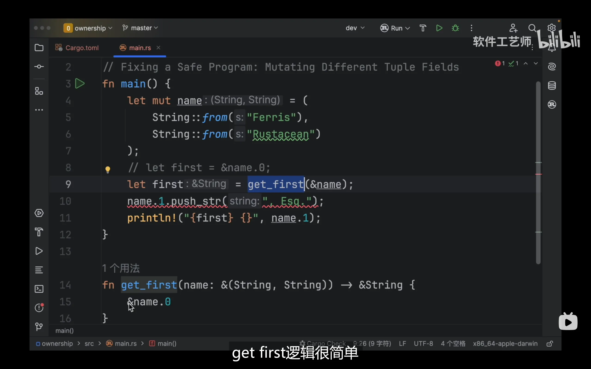

但是上面的代码就不对了，因为在调用函数时，rust会检查函数签名，它发现name.0和name.1都被作为参数调用了，那么在调用后它就会去除作为函数参数的name.0，name.1的写权限，直至first被使用完毕，因此在first未被使用时再对name进行其它操作会出现权限问题。当然，这个问题的根本原因是rust编译器不够聪明，它只能通过函数签名来猜测函数中到底借用了谁，而不能实际检测出参数是否真的被借用了，例如这个例子中只有name.0被借用，因此在未来随着编译器的发展，这行代码可能不会报错

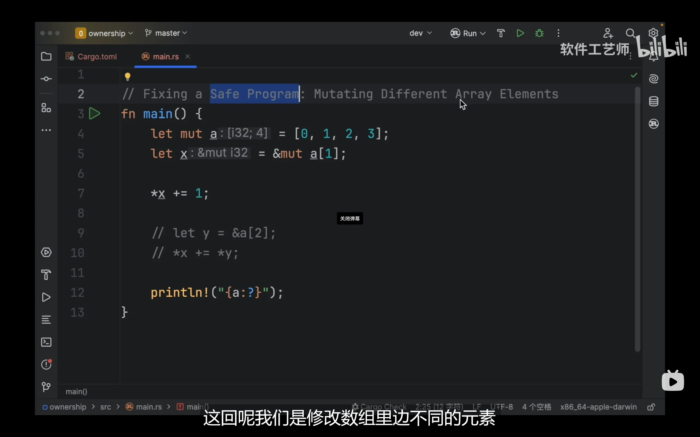

第5行代码发生了可变的引用，因此在第5行执行完毕后，a会失去全部权限，因此假如将第9，10行代码取消注释就会报错

### 深浅拷贝  

上述情况都是在浅拷贝的背景下产生的种种问题与对应的解决方案，而关于深拷贝，rust并没有实现这点(rust认为浅拷贝是非常符合效率的做法)。如果真的需要深拷贝，我们需要自行实现对应数据类型的clone方法(copy负责浅拷贝)  

copy内部实现的是按位复制，行为类似于c的memcpy。因此在复制的过程中复制的指针会指向原对象指向的内存，且不会将原对象指向的内存一起拷贝，所以copy是浅拷贝。而实现深拷贝需要修改复制出来的的指针，并同时将指针指向的对象也一同拷贝  

**注意: 如果类型实现了copy trait，那么就不能实现drop trait**，因为copy发生时操作是隐式的而drop是自动调用的，因此有了深拷贝后编译器就不知道该何时执行drop  

拥有copy trait的类型:
* 所有基础类型
* 元组内所有类型均可copy trait，那么该元组就实现了copy trait
    * (i32,i32) 实现
    * (i32,String) 未实现(String未实现copy trait)

## 切片

在rust中，**任何切片类型的大小都是动态的，因而只能通过引用来使用切片**  
切片的类型常见的有字符串切片和数组切片两种
* 字符串切片: str
* 数组切片: [i32]

数组切片没有指定数组长度，因此是动态类型大小的，而字符串也没有包含类型大小的信息(你无法知道这个字符串(str)储存的是"abc"(String)还是"hello"(String))，所以我们需要一个**胖指针来储存地址信息和长度信息，这就是切片的引用**。实际上，我们更常使用切片的引用，于是**我们常把切片的引用简称为切片**  

综上所述，下面的代码编译会有问题，因为我们指定的类型柄不包含长度信息  
```rust
    let s3:&str= "banana";
    let arr:[i32] = [1, 2, 3, 4, 5];
```
而下面的代码就没有问题，因为"banana"会被编译器推断为&str类型，该胖指针包含长度信息，[1, 2, 3, 4, 5]会被编译器推断为[i32; 5]类型，显式包含了长度信息，因此该程序没有问题
```rust
    let s3 = "banana";
    let arr = [1, 2, 3, 4, 5];
```
还有一种包含长度的切片写法如下
```rust
let arr = [1, 2, 3, 4, 5];
let slice: &[i32] = &arr[1..4]; // slice 包含值 [2, 3, 4]
```

切片不仅仅用于字符串，还可以用于数组，元组等数据类型  

切片有多种表示方法(range语法):  
&s[..]代表全部字符串的切片  
&s[..4]代表从s[0]到s[3]的切片  
&s[2..]代表从s[2]到字符串末尾的切片  
对字符串进行切片是非常危险的操作，必须严格控制切片到字符边界上  

字符串的字面值是切片，例如let s = "hello world";  
但是此时s的类型是&str，它是指向二进制文件特定位置的切片，因此字符串字面量是不可变的  

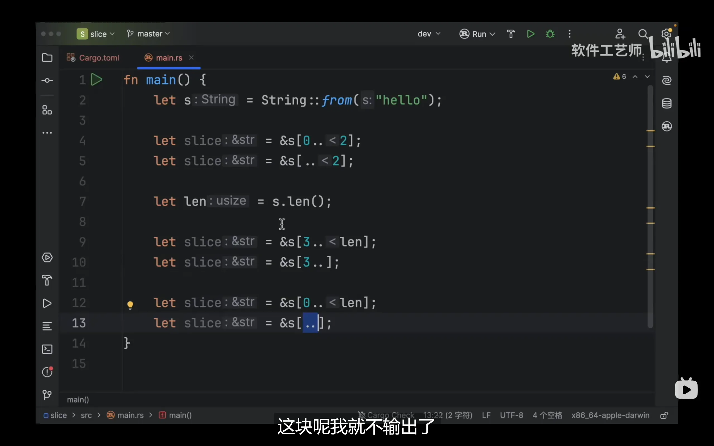

## self与Self  

```rust
trait Draw {
    fn draw(&self) -> Self;
}

#[derive(Clone)]
struct Button;
impl Draw for Button {
    fn draw(&self) -> Self {
        return self.clone()
    }
}

fn main() {
    let button = Button;
    let newb = button.draw();
}
```
上述代码中，self指代的就是当前的实例对象，也就是button.draw()中的button实例，Self则指代的是Button类型  
通过上面的例子我们可以知道：self调用实例方法，而Self只能调用关联函数
```rust
let v= Vec::new();    //Self调用关联函数
v.pop();    //调用实例方法
```

Self不仅指代类型，还可以指代trait或方法

## 结构体  

结构体的定义方式: 
```rust
struct UserStruct{
    active:bool,
    username:String,
    num:u64,
}
```

上面的username存储了字符串的原数据，例如胖指针，容量等内容，而字符串保存在堆上面。对于String类型，即使原始文本来自于硬编码的只读文本，该文本也会被拷贝到堆中  

我们再思考一个更深入地问题：为什么这里的username是String类型而不是&str类型？这是因为String类型更适合于长度动态变化的，运行期难以确定的字符串，而&str适合于硬编码进文件的，长度固定的字符串。因此这里选择了String类型作为切片

struct赋值的简便写法: 
```rust
let mut user = User{
    email:String::from("@email.com"),
    username:String::from("name"),
    active:true,
    num:3,
};

let mut user2 = User{
    num:4,
    ..user
};
```
..user代表除了显式赋值的字段(num:4)，其他结构体成员的值都与user相同  

还有一种struct被称为tuple struct: 它没有像struct那样的字段，定义的形式类似truple
```rust
struct Color(i32,i32,i32)
```

无字段的struct可以实现trait: 
```rust
struct AlwaysEqual;
fn main()
{
    let subject = AlwaysEqual;
}
```
上面代码的含义是：定一个零大小类型AlwaysEqual，该类型在编译后不会占用内存，多用于标记类型标记或占位符(如常见标记泛型的_marker: PhantomData\<T\>)，trait类型等情况。而`let subject = AlwaysEqual;`代表创立一个`AlwaysEqual`实例，将其绑定到`subject`  

与元组一样，当借用了结构体的某一元素时会影响结构体整体的权限，但不会影响结构体其它元素的权限
```rust
struct Point{x:i32,y:i32};

fn prt(p: &Point)
{
    println!("{}",p.x);
}

fn main() {

    let mut p = Point{x:0, y:0};
    let px = &mut p.x;
    p.y += 1;    //这里是有权限的
    *px+=1;
}
```

作为著名的类型体操专家，rust采用了将方法绑定到类型上面的方案，我们使用`impl`来实现struct的方法
```rust
struct Rectangle{
    width:u32,
    height:u32,
}

impl Rectangle{
    fn new() -> Rectangle{
        Rectangle{width:0,height:0}
    }

    fn area(&self) -> u32{    //这里返回值类型不能省略，编译器不能自行推断
        self.height*self.width
    }

    fn can_hold(&self,other:&Rectangle) ->bool{
        self.height>other.height && self.width>other.width
    }

    fn square(size:u32) -> Self{ //参数不是self的方法被称为关联方法
        Self{
            width:size,
            height:size,
        }
    }
}

fn main() {
    let rect1 = Rectangle{
        width:1,
        height:3,
    };

    let rect2 = Rectangle{
        width:2,
        height:4,
    };

    println!("{}",rect1.can_hold(&rect2));
    println!("{}",Rectangle::can_hold(&rect1, &rect2));    //是上一行的语法糖
}
```
**注意: 方法第一个参数永远是self/&self，而函数则没有要求**，对于那些没有参数的函数或参数不包含&self或self的函数，例如上面的new和square函数，我们不能使用"."调用，只能使用"::"调用，因此不能称之为方法。**我们将这种没有参数的函数称为关联函数**(与结构体关系密切)  

对于这些关联函数(即不需要实例化对象就可以调用的方法，如Vec::new())，我们需要使用::来调用  

同时我们还应该注意所有权的问题:
```rust
struct Rectangle {
    width: u32,
    height: u32,
}

impl Rectangle {
    fn area(&self) -> u32 {
      self.width * self.height
    }

    fn set_width(&mut self, width: u32) {
      self.width = width;
    }

    fn max(self, other: Self) -> Self {
      let w = self.width.max(other.width);    //调用u32的max方法
      let h = self.height.max(other.height);
      Rectangle {
        width: w,
        height: h
      }
    }

    fn set_to_max(&mut self, other: Rectangle) {
        *self = self.max(other);    //注意这里
    }
}
```
`*self = self.max(other);`在执行max方法时发生了所有权的移动，因此在赋值给`*self`时就会缺失写权限导致编译错误

## 枚举  

rust中的枚举会按照占用内存的最大那个成员对齐，且**同一时间只能存储一个变体**，类似C的union  

枚举内有不同的变体，每个变体绑定了不同的数据类型: 
```rust
enum IpAddrKind{
    V4(u8,u8,u8,u8),
    V6(String),
}

fn main()
{
    let home = IpAddrKind::V4(127,0,0,1);
    let loopback = IpAddrKind::V6(String::from("::1"));
}

impl IpAddrKind{
    fn call(&self){

    }
}
```
上述写法等同于下面的
```rust
enum IpAddrKind{
    V4,
    V6,
}

fn main()
{
    struct IpAddr{
        kind:IpAddrKind,
        adress:String,
    }

    //为了实现IpAddr结构体，必须根据IpAddrKind内部变体的类型分别实现
    let home = IpAddr{
        kind:IpAddrKind::V4,    //V4变体
        address:String::from("127.0.0.1"),
    }

    let loopback = IpAddr{
        address:IpAddrKind::V6,    //V6变体
        address:String::from("::1"),
    }
}

impl IpAddrKind{
    fn call(&self){

    }
}
```

前者写法的优势在于当每个枚举都需要若干方法时，不必给每个变体都写一份，因为V4，V6变体是类似的，仅仅是类型不同，如果给每个变体实现一份方法就会增加重复代码。并且后者不仅仅在方法的实现上冗余，就连结构体的实现上也会冗余

### 特殊的枚举  

在rust中，使用None代表空指针
```rust
enum Option<T>{
    None,
    Some<T>,
}
```
使用Option\<T\>类型时需要强制实现T为None情况的异常处理(在C语言中就是空指针判断和处理)，只有实现了异常处理，Option\<T\>才会退化为Some\<T\>也就是T类型

## 模式匹配与绑定

模式是rust的一种特殊语法，用于匹配各种结构  
将模式与匹配表达式和其它构造结合使用，可以更好的控制程序流  

最简单的模式匹配就是let a = 1;类似这种的模式匹配就是**无可辩驳**的，这种操作不会产生其它情况。但如果是let Some(x) = Some(5);就是**可辩驳**的，因为 Some(x) 只能匹配 Some 类型的值，对于 None 就无法匹配，可能导致运行时出错。如果将一个不可辩驳的模式匹配到可辩驳的模式，编译器就会发出警告，因为它认为这是不必要的  

下面的代码会令人迷惑：
```rust
fn main() {
    let x = Some(10);
    let y = 20;
    match x {
        Some(5)=>println!("5"),
        Some(y)=>println!("y = {}",y),
        _=>println!("0"),
    }
}
```
输出结果为y = 10。为什么会出现这样的结果？原因在于match会遮蔽外部变量，这里match表达式的作用是绑定，因此Some(y)会跟传入的Some(10)进行绑定。rust这样设计的原因在于防止外部值隐式的对match内部造成影响，为了能够获取并比较外部值，我们必须显式的指出比较的对象  
```rust
let y = 10;
match x {
    Some(n) if n == y => println!("Equal to y"),
    Some(n) => println!("Not equal: n = {}", n),
    None => println!("None"),
}
```

match中可以使用"|"符号代表逻辑或进行模式匹配，还可以使用"..="来匹配范围(闭区间)或者".."(开区间)，而"_"代表任意值  

**注意，使用_name可以让编译器忽略name没有被使用的警告**，例子如下  
```rust
fn main() {
    let _unused_value = 42;
}
```
该代码不会出现未使用变量的警告，但是下面的就会有警告
```rust
fn main() {
    let unused_value = 42;
}
```

模式匹配还可以使用数据结构来获取值
```rust
struct Point{
    x:i32,
    y:i32,
}

fn main() {
    let p = Point{x:3,y:5};
    let Point{x,y} = p;
}
```

### match表达式  

match表达式必须将所有情况都考虑在内，即必须穷尽所有情况，并且每个分支的返回值必须相同

match可以使用变量来表示其它情况
```rust
let var:u8 = 3;
match var{
    1=>do_something(),
    4=>do_anything(),
    other=>do_the_one_thing(),    //也可以换成其它变量
}

fn do_something(){

}

fn do_anything(){

}

fn do_the_one_thing(){

}
```
上面的代码没有用到other变量，因此编译器会提出警报，为了避免这种情况发生，可将代码改成如下形式: 
```rust
match var{
    1=>do_something(),
    4=>do_anything(),
    _=>do_the_one_thing(),    //也可以换成其它变量
}
```
如需要other作为参数也可改成: 
```rust
other=>do_the_one_thing(other),
```

当与所有权发生联系时: 
```rust
let opt:Option<String> = Some(String::from("hello world"));

match opt {
    Some(s) => println!("{}",s),
    None => println!("None"),
}

println!("{:?}",opt);
```
上述代码会报错，因为s在打印完成后其本身就被移动了，再次打印opt就会产生错误  
造成所有权发生移动的原因是，match的核心作用是绑定，因此执行Some分支语句后opt指向的资源就被s移动/复制了，但由于String位于堆上，本身没有实现copy trait，因此只能执行移动语义，这样opt就丧失RWO所有权限。为了避免这种情况，我们可以让s以只读的方式进行绑定，若想改正，只需在opt前加入&  
```rust
let opt:Option<String> = Some(String::from("hello world"));

match &opt {
    Some(s) => println!("{}",s);
    None => println!("None");
}

println!("{:?}",opt);
```

如果想进行更复杂的匹配可以使用match guard进行约束
```rust
let opt:Option<String> = Some(String::from("hello world"));

match &opt {
    Some(s) if s.len() < 5 => println!("{}",s); //match guard
    _ => println!("_");    //这里汇集了len>5和opt为None的情况，因此只能使用_
}

println!("{:?}",opt);
```

### if let

相比match表达式，if let只能匹配一种情况
```rust
let max:u8;
let config = Some(3u8);
if let Some(max) = config {    //不是==号
    println!("{}",max);
}
else{
    println!("None");
}
```

## 项目代码组织  

crate是组织和共享代码的基本构建块，也是rust编译时的基本单元
* binary crate: 可执行的，需要main函数
* library crate: 不可执行的，没有main函数。是为了定义一些功能以共享使用

crate root: 编译crate的入口点
* binary crate: src/main.rs
* library crate: src/lib.rs

package: 由一个或多个crates组成，包含cargo.toml文件  

package规则: 
* 可有多个binary crates
* 最多只能有一个library crate
* 最少由一个crate组成

module: 将代码组织成更小更易管理的单元的办法  

也就是说一个crate包含若干个文件，内部接口以module方式提供，例如math algorithm crate包含add module，sub module。而一个package可以包含多个crate，例如math package包括math algorithm crate和math cli crate等等  

导入模块: 
```rust
mod mod_name;
```

通常rust会在以下路径寻找模块
```rust
// 内联模块：在当前文件中使用 `mod` 关键字定义模块体
mod mod_name {
    // 模块内容
}

// 独立模块文件：Rust 会在 `src/mod_name.rs` 中查找 `mod mod_name;`

// 模块子目录：Rust 也会在 `src/mod_name/mod.rs` 中查找 `mod mod_name;`
```

子模块的创建方法: 在src下新建文件夹(一般命名为models)，之后在这个文件夹下新建文件，文件名为子模块的模块名。之后在父模块中导入模块即可(类似上文的第三种建立模块的方式)  

**新建模块默认权限为私有，想要调用其子模块的函数，需要将子模块，子模块的函数变为公有权限**，对于枚举而言，定义时在enum前加pub就可以访问枚举内所有变体。但是在struct内，我们不仅需要在struct前加pub，还需要在内部成员前加pub才能访问到其成员，这样做的原因是保证只暴露接口，不暴露数据
```rust
src/main.rs
fn main() {
    crate::m1::m2::fun1();    //绝对路径访问方式
}

src/models.rs
mod m1{
    pub mod m2{
        pub fn fun1(){

        }
    }
}

mod x1{
    mod x2{
        fn fun2(){
            super::super::m1    //相对路径访问方式，想要返回上一级应该使用super
        }
    }
}
```
main能够访问到m1的原因是main与m1同级  

在 binary crate 中访问 library crate 中的内容，路径的格式通常如下：
```rust
包名::模块路径::项名

//例如
my_crate::submodule::some_function();
```
其中：
* my_crate 是 library crate 的包名（即 Cargo.toml 中的 name 字段）
* submodule 是 library crate 中的模块路径（可以是文件或文件夹）
* some_function 是你想要访问的函数、结构体或常量等项

所有的东西(function methods structs enum modules)默认对父模块都是私有的  

为了避免模块命名空间重复，可以使用as给引用起别名
```rust
use std::fmt::Result;
use std::io::Result as IoResult;
```

在cargo.toml中，package(项目)是项目本身的信息，包含name，version，authors，edition(rust版本)等字段。而dependencies是项目依赖的信息，包含外部包(crate)，外部crate等信息。下面是例子  
```toml
[package]
name = "my_project"         # 项目名称，对应 crate 名
version = "0.1.0"           # 项目版本
edition = "2021"            # Rust 语言版本（edition）
authors = ["Your Name <you@example.com>"]

[dependencies]
rand = "0.8"                # 添加外部 crate 'rand'，版本号为 0.8
serde = { version = "1.0", features = ["derive"] }  # 启用特性的依赖项
```

**单纯的使用mod关键字引入模块只能以绝对路径/相对路径的路径全名的方式使用模块，但是使用use关键字后就不必输入路径全名引入模块了**，这与C++的use和Python的import很相似
```rust
mod tools;

// ❌ 不使用 use，每次调用都要写完整路径：
fn main() {
    tools::helper::echo();
}

//使用use简化
mod tools;
use tools::helper::echo;

fn main() {
    echo(); // 简洁
}
```

## 常见的集合  

### vectors  

创建vector: 
```rust
let v:Vec<i32> = Vec::new();    //使用方法创建
let v:Vec<i32> = vec![1,2,3];    //使用宏创建
```

获取vector
```rust
fn main() {
    let mut v = Vec::new();
    v.push(1);
    v.push(2);
    v.push(3);
    v.push(4);

    //let v1 = &v[2];
    let v2 = v.get(2);
    match v2 {
        Some(v2)=>println!("{:?}",v2),
        None=>println!("None"),
    }
}
```
使用get方法获取vec时，返回值为Option\<T\>类型，我们还需要match一下，这是为了保证安全性  
更进一步，如果这里访问的是v.[100]，此时如果使用地址访问会导致程序panic，使用get方法会返回None，这就是两种方法的最大的不同  

访问修改vec通常有两种方法:  <span id="iterator">迭代器</span>和range方法
```rust
//iterator
let mut v: Vec<i32> = vec![1,2];
let mut iter: std::slice::Iter<'_, i32> = v.iter();
let n1: &i32 = iter.next().unwrap();
let n2: &i32 = iter.next().unwrap();
let end: Option<&i32> = iter.next();

//range
let mut range: Range<usize> = 0..v.len();    //这里获取的是数组的下标的范围
let i1: usize = range.next().unwrap();
let n1: &i32 = &v[i1];
```
next方法返回的是`Option<&i32>`类型，`unwrap`方法会自动帮我们进行match，去除None的结果，最后返回的就是vec元素的引用  
len方法返回的`Range<usize>`类型，unwarp后获得的是索引

#### vector与所有权  

当新push的元素大于vector容量时内存就会重新分配，这时原vector所有权就被移动到新vector上，这一点和DTL的vector也很相似

### string  

创建string
```rust
let mut s = String::new();

let data = "hello";
let s2 = data.to_string();
let s3 = "hello".to_string();
let s4 = String::from("hello");
```
to_string方法会将字面量转为字符串变量  

相比String::from，to_string语义不是很明确(因为String::from有类似的Vec::from、Box::from)，并且to_string底层也调用了String::from，因此to_string效率没有String::from高  

连接string
```rust
let mut s = String::from("hello");
s.push_str("world");
println!("{s}");
s.push('!');
println!("{s}");
```
push_str可以连接字符串，push只能连接字符  

还可以使用"+"连接字符串
```rust
let s1 = String::from("hello");
let s2 = String::from("world");
let s3 = s1 + &s2;

println!("{s3}");
```
使用"+"会使s1丧失所有权，之后s1就不能使用了。链接字符串语法不设计成`let s3 = s1 + s2;`的原因是未使用&修饰的字符串的所有权会被移动，这样能够避免复制带来的性能损耗，使用&修饰的字符串会保留所有权，防止所有权被移动。这样在连接后的字符串的所有权就可以转移到使用&修饰的字符串了。如果语法被设计为`let s3 = s1 + s2;`就无法保证字符串的所有权。还需要注意的是，我们也不能写为`let s3 = &s1 + s2;`，因为标准库中没有实现  

如果想要保留所有权的话可以使用clone
```rust
let s1 = String::from("hello");
let s2 = String::from("world");
let s3 = s1.clone() + &s2; // 显式克隆 s1

println!("{s3}");
```

rust不允许使用下标的方式去索引string内部的元素。由于string是使用vec\<u8\>将unicode编码包装而成的，而各国文字编码的长度不完全一致。例如应对字母使用单字节编码，汉字使用2或3个字节编码，这样如果允许使用下标的方式去索引string内部的元素就会导致访问元素会返回不同的u8的值，而这并不是我们想看到的  

获取字节或字符
```rust
//单个unicode标量值
for c in "你好".chars(){
    println!("{c}");
}

//存储在计算机中的字节
for b in "你好".bytes(){
    println!("{b}");
}
```

#### string与所有权  

与vector类似，当新push的元素大于string容量时会发生内存重新分配，这时原string所有权就被移动到新string上

string的内部结构
```rust
pub struct String {
    vec: Vec<u8>,
}
```

### hashmap  

创建hashmap
```rust
let mut scores = HashMap::new();
scores.insert(String::from("blue"), 10);
scores.insert(String::from("red"), 50);

let vec = vec![("hello","10"),("world","50")];
let map:HashMap<_, _> = vec.into_iter().collect();
```

访问hashmap
```rust
let mut scores = HashMap::new();
scores.insert(String::from("blue"), 10);

let teamname = String::from("blue");
let scores = scores.get(&teamname).copied().unwrap_or(0);
```
get方法返回Option\<&v\>，copied方法会将&v转换为v变成Option\<v\>，unwrap_or方法提取 Option\<T\> 或 Result\<T, E\> 中的值，如果值是 None 或 Err(e)，返回指定的默认值（不会 panic），而unwrap则会panic  

遍历hashmap
```rust
let mut scores = HashMap::new();
scores.insert(String::from("blue"), 10);

for (key,value) in &scores {
    println!("{}:{}",key,value);
}
```

#### hashmap与所有权  

对于实现copy trait的类型，hashmap会将数据拷贝到map里，对于没有实现的，会**移动**到map里

## 错误处理

我们把rust中产生的错误分成两类: 可恢复的和不可恢复的，同时rust没有异常这一概念

### 不可恢复的错误

panic!()宏就是不可恢复的错误
两种导致panic的方法: 
* 显式调用panic
* 代码中某些行为导致panic  

panic之后会打印信息，unwind(展开stack，清理stack)/立即终止(让os来做清理工作)  

究竟采用unwind还是立即终止取决于cargo.toml的配置  

我们还可以在编译时指定环境变量`RUST_BACKTRACE=full`来指定backtrace也就是unwind的内容详细程度

### 可恢复的错误

**我们常用Result来处理可恢复的错误**
```rust
enum Result<T,E>
{
    Ok(T),
    Err(E),
}
```
Ok的类型在不同情况下是不同的，对于文件访问而言，返回的是std::fs::File对应的handle，Err返回的是std::io::Error，其内部包含了具体的信息

### 出现错误时让程序panic的快捷方式

unwarp: 用于将Option和Result的值提取出来，如果返回的值是Err或None的话就调用panic!，如果返回的值是Ok或Some的话，就会将返回该值  

expect: 允许开发者提供自定义的信息(生产级别代码常用，因为便于调试)  
```rust
use std::fs::File;

fn main() {
    let file = File::open("config.toml")
        .expect("Failed to open config file. Make sure 'config.toml' exists.");

    println!("File opened successfully: {:?}", file);
}
```

由于unwarp不包含错误信息，很不利于调试，测试以及运维，因此官方书籍指明: 只有在十分确定某个函数不会panic时才可以调用unwarp  

### 传播错误  

传播错误可以将错误返回给函数调用者来处理

```rust
use std::{fs::File, io::{self, Read}};

fn read_username_from_file() -> Result<String,io::Error>{
    let username_file_result: Result<File, io::Error> = File::open("hello.txt");
    let mut username_file: File = match username_file_result {
        Ok(file)=>file,
        Err(err)=>return Err(err), //也可能从这返回
    };

    let mut username_str: String = String::new();
    match username_file.read_to_string(&mut username_str) {
        Ok(_)=>Ok(username_str),    //_可以让编译器自动推断类型
        Err(err)=>Err(err),
    }    //没有分号，match表达式的结果就是函数返回的结果
}
```
上述操作也可以使用?运算符来简化
```rust
fn read_username_from_file() ->Result<String,io::Error>{
    let mut username_file_result = File::open("hello.txt")?;

    let mut username_str: String = String::new();
    username_file_result.read_to_string(&mut username_str)?;
    Ok(username_str)
}
```

? 的工作原理几乎与match相同，如果调用的函数返回Ok的话就会解包Ok的值(对于本例就是文件操作符)，之后程序继续执行。如果返回的值是Err的话就会立即从本函数内返回，并将错误传播给上层调用者。因此使用?可以使代码避免大量的match语句从而变的更简洁  

? 与match仍有一些细微差别，当?遇到Err的返回值就会调用from函数，from函数会将下层函数返回的错误类型转换为本层函数的返回值的错误类型。也就是说，**使用?后，错误类型会自动进行转换**，但前提是必须有这种转换的过程: 通常情况下这个from定义在std的from trait上，但是我们也可以实现自己的from trait  

上述例子还可以进一步简化
```rust
    let mut username_str: String = String::new();
    let mut username_file_result = File::open("hello.txt")?.read_to_string(&mut username_str)?;

    Ok(username_str)
```
虽然有些离题了，但是还可以进一步简化，这就是标准库提供的函数
```rust
fs::read_to_string("hello.txt")
```

使用?运算符的条件: 
* 由于? 作用的表达式返回一个 Result 或 Option 类型。因此当前函数的返回类型必须与该表达式的返回类型一致，或当前函数能通过 From / Into 特性将错误类型转换成自己的返回类型。如果返回值类型对应不上，则需要自行实现对应的返回类型
```rust
use std::fs::File;
use std::io::{self, Read};

fn read_config() -> Result<String, io::Error> {
    let mut file = File::open("config.toml")?; // 如果失败，自动返回 Err
    let mut content = String::new();
    file.read_to_string(&mut content)?; // 同上
    Ok(content)
}
```
上述代码中，File::open 和 read_to_string 返回的是 Result<T, io::Error>，两者为同一类型，且与read_config返回值类型一致，因此可以使用?

若想要让下面代码编译通过  
```rust
fn first(myarr: &[i32]) -> Result<String, io::Error> {
   myarr.myget(0)?
}
```
必须保证myget方法的返回值为Result<String, io::Error>类型，如果myget的返回值为Option<&i32>，就需要使用ok_or将Option<&i32>显式转换为Result<String, io::Error>类型
```rust
use std::io;

fn first(arr: &[i32]) -> Result<String, io::Error> {
    let value = arr.get(0).ok_or(io::Error::new(io::ErrorKind::Other, "index out of bounds"))?;
    Ok(format!("Value: {}", value))
}
```

### 错误处理方法  

#### map方法

map 是一种**容器上的变换的操作**，它并不改变 Option 或 Result 的结构，而是在结构内的值存在时对其做变换，否则就保持原样。map支持按函数指针和闭包两种方式传参  

与迭代器适配器类似，Option或Result使用map方法会产生一个新的Option或Result类型，并且这个类型会按照闭包的指示生成
```rust
fn main() {
    let s1 = Some("abcde");
    let s2 = Some(5);

    let n1: Option<&str> = None;
    let n2: Option<usize> = None;

    let o1: Result<&str, &str> = Ok("abcde");
    let o2: Result<usize, &str> = Ok(5);

    let e1: Result<&str, &str> = Err("abcde");
    let e2: Result<usize, &str> = Err("abcde");

    let fn_character_count = |s: &str| s.chars().count();

    assert_eq!(s1.map(fn_character_count), s2); // Some(&str) 映射后变为 Some(usize)
    assert_eq!(n1.map(fn_character_count), n2); // None 映射后仍是 None，不执行闭包

    assert_eq!(o1.map(fn_character_count), o2); // Ok(&str) 映射后变为 Ok(usize)
    assert_eq!(e1.map(fn_character_count), e2); // Err 跳过映射，保持不变
}
```
当 n1 是 Some 类型的值时，map 会调用闭包，并将 Some 中的值作为参数传入闭包，返回一个新的 Option 类型（Some 中的值被替换为闭包的返回值）  
如果 n1 是 None，则不会调用闭包，直接返回 None，即保留原结构  
当 o1 是 Ok 类型的值时，map 会调用闭包，并将 Ok 中的值作为参数传入闭包，生成一个新的 Result 类型（Ok 中的值被闭包的返回值替换）  
如果 o1 是 Err，则不会调用闭包，直接返回原封不动的 Err  

#### map_or_else和map_or方法

两者都在map基础上提供了默认值，但是前者通过闭包提供，后者通过变量提供  

我们在使用两者闭包时的参数传递都是隐式的，闭包参数来源于Some(T)，Ok(T)中的T，最终在标准库中map_or_else和map_or都会显式调用参数T，该过程由内部实现，此处不过多介绍  

下面是map_or_else方法
```rust
fn main() {
    let s = Some(10);
    let n: Option<i8> = None;

    let fn_closure = |v: i8| v + 2;
    let fn_default = || 1;

    assert_eq!(s.map_or_else(fn_default, fn_closure), 12);    // 如果是 Some，应用 `fn_closure`（10 + 2 = 12）
    assert_eq!(n.map_or_else(fn_default, fn_closure), 1);     // 如果是 None，调用 `fn_default`（返回 1）

    let o = Ok(10);
    let e = Err(5);
    let fn_default_for_result = |v: i8| v + 1; // 闭包可以对 Err 中的值进行处理，并返回一个新值

    assert_eq!(o.map_or_else(fn_default_for_result, fn_closure), 12);
    assert_eq!(e.map_or_else(fn_default_for_result, fn_closure), 6);
}
```
下面是map_or方法
```rust
fn main() {
    const V_DEFAULT: u32 = 1;

    let s: Result<u32, ()> = Ok(10);
    let n: Option<u32> = None;
    let fn_closure = |v: u32| v + 2;

    assert_eq!(s.map_or(V_DEFAULT, fn_closure), 12);
    assert_eq!(n.map_or(V_DEFAULT, fn_closure), V_DEFAULT);
}
```

### 自定义错误类型  

虽然标准库为我们提供了多种错误处理方法，但是自定义错误还需要我们自行实现。我们只需要实现Debug trait和Display trait即可，并且由于Debug trait可以由宏自动实现，因此实际上我们只需要实现Display trait

```rust
use std::fmt;

// AppError 是自定义错误类型，它可以是当前包中定义的任何类型，在这里为了简化，我们使用了单元结构体作为例子。
// 为 AppError 自动派生 Debug 特征
#[derive(Debug)]
struct AppError;

// 为 AppError 实现 std::fmt::Display 特征
impl fmt::Display for AppError {
    fn fmt(&self, f: &mut fmt::Formatter) -> fmt::Result {
        write!(f, "An Error Occurred, Please Try Again!") // user-facing output
    }
}

// 一个示例函数用于产生 AppError 错误
fn produce_error() -> Result<(), AppError> {
    Err(AppError)
}

fn main(){
    match produce_error() {
        Err(e) => eprintln!("{}", e),    // eprintln!是个宏，用于将错误输出到标准错误流
        _ => println!("No error"),
    }

    eprintln!("{:?}", produce_error()); // Err({ file: src/main.rs, line: 17 })
}
```
我们还可以实现from trait(就是String::from的那个from，该trait负责类型转换)来实现错误类型转换。使用from trait主要是为了防止自定义错误，标准库错误，第三方库错误混淆，实现该trait后可以将这三种类型错误全部自定义化
```rust
use std::fs::File;
use std::io::{self, Read};
use std::num;

#[derive(Debug)]
struct AppError {
    kind: String,
    message: String,
}

impl From<io::Error> for AppError {
    fn from(error: io::Error) -> Self {
        AppError {
            kind: String::from("io"),
            message: error.to_string(),
        }
    }
}

impl From<num::ParseIntError> for AppError {
    fn from(error: num::ParseIntError) -> Self {
        AppError {
            kind: String::from("parse"),
            message: error.to_string(),
        }
    }
}

fn main() -> Result<(), AppError> {
    let mut file = File::open("hello_world.txt")?;

    let mut content = String::new();
    file.read_to_string(&mut content)?;

    let _number: usize;
    _number = content.parse()?;

    Ok(())
}

// --------------- 上述代码运行后的可能输出 ---------------

// 01. 若 hello_world.txt 文件不存在
Error: AppError { kind: "io", message: "No such file or directory (os error 2)" }

// 02. 若用户没有相关的权限访问 hello_world.txt
Error: AppError { kind: "io", message: "Permission denied (os error 13)" }

// 03. 若 hello_world.txt 包含有非数字的内容，例如 Hello, world!
Error: AppError { kind: "parse", message: "invalid digit found in string" }
```

如果想要一个函数可能返回多种类型的错误，那么上面的方案就不够用了。这时我们可以使用trait对象来将多种错误归一化
```rust
use std::fs::read_to_string;
use std::error::Error;
fn main() -> Result<(), Box<dyn Error>> {
  let html = render()?;
  println!("{}", html);
  Ok(())
}

fn render() -> Result<String, Box<dyn Error>> {    //将多种错误归一化到Box<dyn Error>
  let file = std::env::var("MARKDOWN")?;    //获取名为 MARKDOWN 的环境变量的值
  let source = read_to_string(file)?;
  Ok(source)
}
```
虽然这种方案满足了我们的需求并且实现起来非常简单，但是还有一点瑕疵：Box\<dyn Error\>参数并没有强制要求实现Error trait，也就是说即使一个类型没有实现Error trait，它也可以从render中被返回！  
我们还有一种解决方案就是使用万能的枚举
```rust
use std::fs::read_to_string;

fn main() -> Result<(), MyError> {
  let html = render()?;
  println!("{}", html);
  Ok(())
}

fn render() -> Result<String, MyError> {
  let file = std::env::var("MARKDOWN")?;
  let source = read_to_string(file)?;
  Ok(source)
}

#[derive(Debug)]
enum MyError {
  EnvironmentVariableNotFound,
  IOError(std::io::Error),
}

impl From<std::env::VarError> for MyError {
  fn from(_: std::env::VarError) -> Self {
    Self::EnvironmentVariableNotFound
  }
}

impl From<std::io::Error> for MyError {
  fn from(value: std::io::Error) -> Self {
    Self::IOError(value)
  }
}

impl std::error::Error for MyError {}    //要求MyError强制实现Error trait，防止其它类型返回

impl std::fmt::Display for MyError {
  fn fmt(&self, f: &mut std::fmt::Formatter<'_>) -> std::fmt::Result {
    match self {
      MyError::EnvironmentVariableNotFound => write!(f, "Environment variable not found"),
      MyError::IOError(err) => write!(f, "IO Error: {}", err.to_string()),
    }
  }
}
```

当然，这里也有丰富的第三方错误库来简化上述操作，最著名的是[thiserror](https://github.com/dtolnay/thiserror)以及[anyhow](https://github.com/dtolnay/anyhow)

## 泛型  

rust可以定义泛型，方法的泛型以及泛型的特化。使用泛型时需要先进行声明，声明的位置位于impl与结构体名之间
```rust
struct Point<T>{
    x:T,
    y:T,
}

impl<T> Point<T>{    //为结构体自身实现某个方法不必加for，但为结构体实现某个trait则必须加for
    fn x(&self)->&T{
        &self.x
    }
}

impl Point<i32>{
    fn x1(&self)->&i32{
        &self.x
    }
}
```

strcut里的泛型模板参数和方法的泛型模板参数可能不同
```rust
struct Point<T,U>{
    x:T,
    y:U,
}

impl <T,U> Point<T,U>{
    fn mixup<V,W>(self,other:Point<V,W>)->Point<T,W>{
        Point{
            x:self.x,
            y:other.y,
        }
    }
}

fn main() {
    let p1 = Point{x:5, y:4};
    let p2 = Point{x:"hello",y:'c'};
    let p3 = p1.mixup(p2);
    println!("{} {}",p3.x,p3.y);
}
```

与C++一样，rust的泛型在编译期就可确定，并通过修改函数/方法签名的技术生成对象，这样就可以保证与普通函数有相同的性能

### const泛型  

#### 常量泛型参数

常量泛型参数类似于C++的constexpr，用于编译期计算常量值  

当我们给display_array传递不同的值时，编译器会生成不同长度的arr数组
```rust
fn display_array<T: std::fmt::Debug, const N: usize>(arr: [T; N]) {    //要求T实现std::fmt::Debug trait，否则无法打印
    println!("{:?}", arr);
}

fn main() {
    let arr: [i32; 3] = [1, 2, 3];
    display_array(arr);

    let arr: [i32; 2] = [1, 2];
    display_array(arr);
}
```
常量泛型参数除了可以被作为值传递，还可以作为表达式的结果传递
```rust
// 目前只能在nightly版本下使用
#![allow(incomplete_features)]
#![feature(generic_const_exprs)]

fn something<T>(val: T)
where
    Assert<{ core::mem::size_of::<T>() < 768 }>: IsTrue,    //这里在编译期计算表达式结果
    //       ^-----------------------------^ 这里是一个 const 表达式，换成其它的 const 表达式也可以
{
    //
}

fn main() {
    something([0u8; 0]); // ok
    something([0u8; 512]); // ok
    something([0u8; 1024]); // 编译错误，数组长度是1024字节，超过了768字节的参数长度限制
}

// ---

pub enum Assert<const CHECK: bool> {    //这里声明CHECK常量表达式
    //
}

pub trait IsTrue {
    //
}

impl IsTrue for Assert<true> {
    //
}
```

还可以与常量函数搭配使用
```rust
const fn add(a: usize, b: usize) -> usize {
    a + b
}

const RESULT: usize = add(5, 10);

fn main() {
    println!("The result is: {}", RESULT);
}
```
上面的代码可能会令人疑惑，我们只需要返回值是常量就可以了，为什么还要把函数变成常量？这是因为如果我们想要获得函数返回值就必须要求函数在编译期就可以计算，而普通函数是在运行期进行计算的，因此我们需要将整个函数定义为常量函数，这样才能将函数使用在常量上下文中也就是告知编译器在编译期间提前计算函数结果，这样我们就只能将函数写为常函数，这个过程与C++是一样的，C++也需要将constexpr放在函数定义前

## trait  

trait: 特质，特征  

trait是对于具有相似行为的结构体抽象出来的统一接口，因此尽管相似行为在实现细节上可能不同，但是逻辑上，功能上是雷同的，因此我们可以将其抽象出来作为trait。为了能够支持重载和默认实现等特性，我们可以在trait中实现方法细节，这样该方法可以作为实现trait类型的默认方法，并且类型内部可以对其进行重载  

对于一些不同类型的方法，它们在逻辑上是类似甚至是相同的，因此我们可以将这些方法签名放在一起来定义一组行为
```rust
//lib.rs
pub trait Summary {
    fn summarize(&self);    //在这里可以只写方法签名，如果写方法实现则为默认方法
}

pub struct NewsArticle{
    pub headline:String,
    pub location:String,
    pub author:String,
    pub content:String,
}

impl Summary for NewsArticle {    //注意for关键字
    fn summarize(&self) {
        println!("The summary of NewsArticle is {}",self.content);
    }    //在这里写实现
}
pub struct Tweet{
    pub username:String,
    pub content:String,
    pub replay:bool,
    pub retweet:bool,
}

impl Summary for Tweet {
    fn summarize(&self) {
        println!("The summary of Tweet is {}",self.content);
    }
}

//main.rs
use first_proj::{Summary, Tweet};

fn main() {
    let tweet = Tweet{
        username: "name".to_string(),
        content: "content".to_string(),
        replay:true,
        retweet:false,
    };
    tweet.summarize();
}
```

在某个类型上实现trait的前提是: **这个类型或这个trait是在本地定义的。**如果两者均不在本地定义，则无法实现trait。比如: 我们**不能实现标准库中vector的copy trait**，这个规则可以防止我们破坏上游的代码，同时也可防止下游破坏我们的代码，这被称为**孤儿原则**。如果没有这个原则，不仅可能造成代码的破坏，还可能在上下游为同一类型实现两个trait，编译器就不知道调用哪个了  

我们还可以采用trait的默认实现
```rust
//lib.rs
pub trait Summary {
    fn summarize(&self) {
        println!("The summary of NewsArticle is {}",self.content);
    }    //这里改为实现trait
}

pub struct NewsArticle{
    pub headline:String,
    pub location:String,
    pub author:String,
    pub content:String,
}

impl Summary for NewsArticle {    //注意for关键字
    //fn summarize(&self) {
    //    println!("The summary of NewsArticle is {}",self.content);
    //}    //这里可以省略
}

//下文同样可以省略
```
还可以重写默认实现
```rust
//lib.rs
pub trait Summary {
    fn summarize_author(&self)->String;
    fn summarize(&self) {
        println!("The summary of NewsArticle is {}",self.summarize_author());
    }
}

pub struct NewsArticle{
    pub headline:String,
    pub location:String,
    pub author:String,
    pub content:String,
}

impl Summary for NewsArticle {    //注意for关键字
    fn summarize_author(&self) {    //重写summarize_author
        println!("The summary of NewsArticle is {}",self.content);
    }
}
```

### 静态trait对象  

静态trait对象指的是在编译期就可确定类型的trait实现  

典型的静态trait对象的语法如下
```rust
item:impl Trait1
```
实际上impl trait语法声明静态tait对象是trait bound的语法糖，因此上面的代码等价于
```rust
<T:Trait1> item:T
```
我们还可以item施加多种trait约束
```rust
item:impl Trait1 + Trait2
<T:Trait1 + Trait2> item:T
```
我们还可以使用where子句优化函数签名
```rust
pub fn notify<T:Summary+Display,U:Debug+Clone>(item:T,b:U)

pub fn notify<T,U>(item:T,b:U)
where
    T:Summary+Display,
    U:Debug+Clone,
```

#### 静态trait对象作为函数参数

考虑一个情况: 我需要一个notify函数，它的参数不仅可以接受`NewsArticle`类型还可以接受`Tweet`类型，也就是说，它可以接受`Summary trait`类型的参数  

我们使用impl语法
```rust
pub fn notify(item:impl Summary) {
    println!("notify {:?}",item.summarize());
}
```
impl实际上是trait bound的语法糖
```rust
pub fn notify<T:Summary>(item:T) {
    println!("notify {:?}",item.summarize());
}
```
对于一个参数需要多种trait进行约束，rust提供了"+"运算符
```rust
use std::fmt::Display;

pub fn notify(item:impl Summary+Display) {
    println!("notify {:?}",item.summarize());
}
//也可以写为下面的形式
pub fn notify<T:Summary+Display>(item:T) {
    println!("notify {:?}",item.summarize());
}
```
对于较复杂的trait bound，rust还提供了where子句优化函数签名
```rust
pub fn notify<T,U>(item:T,b:U)
where
    T:Summary+Display,
    U:Debug+Clone,
{
    println!("notify {:?}",item.summarize());
}
```
只要使用impl Trait可以让用户不用考虑结构体的特性，只需要考虑trait的共性，当然缺点是失去了结构体特有的方法。下民的代码中用户就会失去调用Weibo这个结构体内部方法的能力，只能使用Summary这个trait的公有方法
```rust
fn returns_summarizable() -> impl Summary {
    Weibo {
        username: String::from("sunface"),
        content: String::from(
            "m1 max太厉害了，电脑再也不会卡",
        )
    }
}
```
如果想要返回多种类型就需要使用到动态trait对象了  

**我们甚至可以给已经实现了的trait的某个类型再次实现其它trait，也就是trait的覆盖实现**
```rust
/// # Panics
///
/// In this implementation, the `to_string` method panics
/// if the `Display` implementation returns an error.
/// This indicates an incorrect `Display` implementation
/// since `fmt::Write for String` never returns an error itself.
#[cfg(not(no_global_oom_handling))]
#[stable(feature = "rust1", since = "1.0.0")]
impl<T: fmt::Display> ToString for T {
    // A common guideline is to not inline generic functions. However,
    // removing `#[inline]` from this method causes non-negligible regressions.
    // See <https://github.com/rust-lang/rust/pull/74852>, the last attempt
    // to try to remove it.
    #[inline]
    default fn to_string(&self) -> String {
        let mut buf = String::new();
        let mut formatter = core::fmt::Formatter::new(&mut buf);
        // Bypass format_args!() to avoid write_str with zero-length strs
        fmt::Display::fmt(self, &mut formatter)
            .expect("a Display implementation returned an error unexpectedly");
        buf
    }
}
```
上面的代码表示了: 对于满足实现`Display`这个trait的T，就实现`ToString`这个trait  

下面的代码展示了trait对于参数约束的用法: 
```rust
trait Trait {}

fn foo<X: Trait>(t: X) {}    //参数X必须满足Trait，即使Trait是空实现

impl<'a> Trait for &'a i32 {}    //让i32实现Trait

fn main() {
    let t: &mut i32 = &mut 0;    //报错，类型不匹配
    let t: & i32 = & 0;    //这个是对的
    foo(t);
}
```
通过空trait实现和trait约束来让foo函数只接受i32的参数，这对于限制参数类型很有用

### 动态trait对象  

为了能够支持动态trait实现的多态，产生了trait对象这一概念。类似oop语言的动态多态，rust也采用虚表结构实现多态，为此，实现动态trait要使用dyn关键字声明一个动态trait的指针，**这个指针就是trait对象**  
简要但精确的trait对象和胖指针原理可以看[中文社区](https://rustcc.cn/article?id=094e335f-2321-45ab-9370-e26535b66c80)  

下面的代码来自于[Rust语言圣经](https://course.rs/basic/trait/trait-object.html?highlight=dyn#特征对象定义)
```rust
trait Draw {
    fn draw(&self) -> String;
}

impl Draw for u8 {
    fn draw(&self) -> String {
        format!("u8: {}", *self)
    }
}

impl Draw for f64 {
    fn draw(&self) -> String {
        format!("f64: {}", *self)
    }
}

// 若 T 实现了 Draw 特征， 则调用该函数时传入的 Box<T> 可以被隐式转换成函数参数签名中的 Box<dyn Draw>
fn draw1(x: Box<dyn Draw>) {
    // 由于实现了 Deref 特征，Box 智能指针会自动解引用为它所包裹的值，然后调用该值对应的类型上定义的 `draw` 方法
    x.draw();
}

fn draw2(x: &dyn Draw) {
    x.draw();
}

fn main() {
    let x = 1.1f64;
    // do_something(&x);
    let y = 8u8;

    // x 和 y 的类型 T 都实现了 `Draw` 特征，因为 Box<T> 可以在函数调用时隐式地被转换为特征对象 Box<dyn Draw>
    // 基于 x 的值创建一个 Box<f64> 类型的智能指针，指针指向的数据被放置在了堆上
    draw1(Box::new(x));
    // 基于 y 的值创建一个 Box<u8> 类型的智能指针
    draw1(Box::new(y));
    draw2(&x);
    draw2(&y);
}
```
我们可以看到，dyn指针只在draw1和draw2定义时使用，在使用时不必强调指针是否为动态trait对象  

正如前面所言，dyn指针维护了指向当前trait的"父trait"的实例，其内部存放了"父trait"的数据，还维护了指向虚表vtable的行为指针，**此时vtable只包含实现自特征的方法**，不能调用"父trait"或者其它衍生trait的方法，**也就是说，btn是哪个trait对象的实例，它的vtable中就包含了该trait的方法**

### 对象安全

在 Rust 中，对象安全（Object Safety）是指一个 trait 能否被用作动态 Trait 对象（dyn Trait）的条件。如果一个 trait 是对象安全的，那么它可以用于 dyn Trait，否则编译器会报错  

并不是所有trait都能拥有trait对象，只有满足以下两点条件才符合对象安全
* 方法的返回类型不能是Self且参数也不能包含Self
* 方法没有任何泛型参数  

原因如下：
> 对象安全对于特征对象是必须的，因为一旦有了特征对象，就不再需要知道实现该特征的具体类型是什么了。如果特征方法返回了具体的 Self 类型，但是特征对象忘记了其真正的类型，那这个 Self 就非常尴尬，因为没人知道它是谁了。而对于泛型类型参数来说，泛型的单态化是编译期确定的，但是动态特征对象要求其参数(也就是T)需要在运行期确定，这样动态特征对象的参数要求旧雨泛型要求冲突了  

标准库中的Clone方法就不是对象安全的
```rust
pub trait Clone {
    fn clone(&self) -> Self;
}
```

从常识上也可以推断出来为什么Clone不是对象安全的: 当我们使用Clone时，我们只想要获得对应的对象，而最方便获得对象的方法就是memcpy，对于内存的操作来说，它无需考虑传入的类型是什么，也无需对操作实现动态trait以满足其它要求，它只是忠实的进行内存复制罢了。如果Clone支持动态trait对象，那么它也无能为力，它只进行内存复制，对象是什么样子它也不知道，最多维护个编译器交给它的胖指针，但是胖指针也只是个指针而已，要想生成完整的Self类型也是不太可能的  

## 生命周期  

`The Rust Programming Language`如此解释生命周期:  
> Lifetimes are another kind of generic that we've already been using.  

生命周期可以被视为rust与其它语言最与众不同的特征  

rust的借用检查器原理如下代码所示  
```rust
fn main() {
    let r;
    {
        let x = 5;
        r = &x;
    }

    println!("{}",&r);
}
```
借用检查器会检查r及赋予它的值的变量x的生命周期，它发现x的生命周期并没有完全覆盖r的生命周期，因此编译这段代码时借用检查器会报error

### NLL (Non-Lexical Lifetime)

**在1.31版本后，引用的生命周期从借用处开始，一直持续到最后一次使用的地方。这与之前版本的持续到作用域结束会更智能**
```rust
let mut u = 0i32;
let mut v = 1i32;
let mut w = 2i32;

// lifetime of `a` = α ∪ β ∪ γ
let mut a = &mut u;     // --+ α. lifetime of `&mut u`  --+ lexical "lifetime" of `&mut u`,`&mut u`, `&mut w` and `a`
use(a);                 //   |                            |
*a = 3; // <-----------------+                            |
...                     //                                |
a = &mut v;             // --+ β. lifetime of `&mut v`    |
use(a);                 //   |                            |
*a = 4; // <-----------------+                            |
...                     //                                |
a = &mut w;             // --+ γ. lifetime of `&mut w`    |
use(a);                 //   |                            |
*a = 5; // <-----------------+ <--------------------------+
```
这段代码一目了然，a有三段生命周期：α，β，γ，每一段生命周期都随着当前值的最后一次使用而结束

### Reborrow 再借用  

对NLL了解后就可以对借用进行再借用  

再借用（Reborrowing） 是 Rust 借用检查器（Borrow Checker）中的一种机制，它允许在不违反借用规则的前提下，对已经借用的变量再次创建一个新的借用，并让原借用暂时失效，直到新借用结束  

有时候我们需要临时让一个可变引用“降级”为不可变引用，或者让一个可变引用传递给另一个函数，而不会导致冲突。这时就需要再借用

```rust
#[derive(Debug)]
struct Point {
    x: i32,
    y: i32,
}

impl Point {
    fn move_to(&mut self, x: i32, y: i32) {
        self.x = x;
        self.y = y;
    }
}

fn main() {
    let mut p = Point { x: 0, y: 0 };
    let r = &mut p;
    let rr: &Point = &*r;    //合法，r暂时失效

    println!("{:?}", rr);
    r.move_to(10, 10);
    println!("{:?}", r);
}
```
上述代码并不会报错，其中let rr: &Point = &*r;并不是对p的不可变引用，而是对r的借用，只要在println!("{:?}", rr);这行代码之前不对r进行任何操作，那么就不会报错  

再借用的核心规则：
* 新借用必须基于原借用（如 &\*r1 或直接传递 r1）
* 新借用期间，原借用暂时失效（不能同时使用）
* 新借用结束后，原借用恢复可用

### 生命周期的标注语法  

**生命周期是类型的一部分，因此在声明需要生命周期的类型时，必须将生命周期带上**  

**由于生命周期是为了解决悬垂引用的问题，因此非引用类型的变量不需要标注生命周期，我们只需要标注&，&mut两种类型的生命周期参数即可**  

生命周期参数名: 
* 以'开头
* 通常以小写字母开头且非常短
* 很多人使用'a
```rust
&i32
&'a i32
&'a mut i32
```
函数签名中的生命周期标注: 
生命周期在标注时需要先声明，声明位置也与泛型类似，也就是说生命周期参数要标注在函数名和参数列表间的<>  

对于以下函数，生命周期参数'a代表的是生存时间较短的那个参数，这是因为只有将生存时间按最短考虑，才可能发生生命周期不足的错误
```rust
fn main() {
    let string1 = String::from("abcd");
    let string2 = "xyz";
    let result = longest(&string1, &string2);
    println!("{result}");
}

fn longest<'a> (x:&'a str, y:&'a str) -> &'a str{
    if x.len() > y.len(){
        x
    }
    else {
        y
    }
}
```

在早期的rust中，每个引用都需要标注生命周期，但随着rust发展，rust团队发现很大一部分的生命周期标注都是重复性的，可预测的情况，所以rust团队将这些代码写进了编译器内部，从而让编译器自动推导生命周期。这样，我们现在看到的rust很多时候不必进行手动标注生命周期  

生命周期省略的三个规则: 
* 每个引用类型的参数都有自己的生命周期
* 如果只有一个输入生命周期参数，那么该生命周期参数就会赋值给所有的输出生命周期参数
* 如果有多个输入生命周期参数，但其中一个是&self或&mut self，那么self的生命周期会被赋值给所有的输出生命周期参数

这三条规则适用于fn和impl块，如果在执行完这三条规则后仍有无法确定的生命周期，那么编译器就会报错  

注意第三条规则，该规则只是说输出生命周期参数会被确定，但假如有多个输入生命周期参数，我们还需要将除了&self和&mut self的其他输入生命周期参数标注出来。例如如下代码  
```rust
impl<'a> Tweet<'a>{
    fn func(&mut self,content:&'a str) ->&str {
    }
}
```

对于结构体而言，由于没有像函数那样的生命周期省略规则，所以应该**为所有引用的成员**添加生命周期标注。由于要保证结构体的引用成员所引用的内容必须比结构体本身要活的长，也就是要保证结构体的引用成员活的比结构体本身要长，这只有使用生命周期参数才能做到  
下面的生命周期参数标注说明part要比s1活的时间长
```rust
struct s1<'a>{
    part:&'a str,
}
```
而对于结构体的方法，impl块中的生命周期不能省略
```rust
struct s1<'a>{
    part:&'a str,
}

impl<'a> s1<'a>{    //这里不能省略生命周期标注
    fn do_something(self) -> {    //由于方法的第一个参数固定为self，因此可以在方法处省略生命周期参数
        //do_something
    }
}
```

下面的例子同时使用了泛型参数类型，trait bound和生命周期
```rust
fn longgest_with_an_announcement<'a,T>(x:&'a str, y:&'a str, ann:T) -> &'a str
where
    T:Display,
    {
        println!("Announcement {}",ann);
        if x.len() > y.len(){
            x
        }
        else {
            y
        }
    }
```

### 生命周期标注的原理

```rust
fn main(){
    let a = 1;
    let my_num = complex_func(&a);
    println!("{my_num}");
}

fn complex_func(a:&i32)->&i32{
    let b = 2;
    max_ref(a, &b)
}

fn max_ref<'a>(a:&'a i32,b:&'a i32)->&'a i32{
    if *a > *b{
        a
    }else {
        b
    }
}
```
在为上述代码添加生命周期标注时，编译器会分析 max_ref 函数两个参数的生命周期。它发现参数 a 的生命周期贯穿整个程序，而参数 b 仅在 complex_func 函数内部有效。因此，编译器会推断出 max_ref 的返回值的生命周期应为两者中较短的那个，也就是 b 的生命周期  
然而，在 complex_func 中，这个返回值又被直接返回给外部调用者，此时 b 已经被销毁(标记引用的生命周期不能实际延长其生命周期)，返回的是一个悬垂引用（dangling reference），于是编译器报错以防止潜在的内存不安全  
```rust
error[E0515]: cannot return value referencing local variable `b`
  --> src/main.rs:92:5
   |
   |     max_ref(a, &b)
   |     ^^^^^^^^^^^--^
   |     |          |
   |     |          `b` is borrowed here
   |     returns a value referencing data owned by the current function
```
至于max_ref函数内部，编译器不会涉及生命周期的检查，只会进行函数内部的借用检查，因此如果返回值只依赖一个函数参数，那么另一个函数参数就不必标注生命周期  
下面的代码是正确的，但可惜已经和原函数的行为不同了，修改之后的代码由于要求返回值的生命周期为'a，所以只会返回a而不会返回任意生命周期'_的b
```rust
fn max_ref<'a>(a:&'a i32,b:&i32)->&'a i32{
    a
}
```

下面是道找错练习题
```rust
fn main(){
    let x;
    {
        let input = String::from("aaa");
        x = foo(&input);
    }
    println!("{x}");
}

fn foo<'a>(_input:&'a str)->&'a str {
    let s = "abc";
    s
}
```
我们应该从两方面分析该题，在主函数内根据调用的函数签名分析生命周期，通过函数签名可以确定foo的输入参数与返回值的生命周期相同或返回值的生命周期不长于输入参数的生命周期。而输入参数input的生命周期截止于println!之前，因此返回值x也应该在这行之前就被系统回收，但是在println!中使用了x，这就造成了悬垂引用。而foo内部我们只进行返回值的检查，尽管s是一个字面量，理论上的生命周期是'static，但是我们将其生命周期缩短是可行的，因此将s的生命周期与输入参数绑定并无错误，该函数没有错误  
具体改正方法如下
```rust
fn foo<'a>(_input:&'a str)->&'static str
```
我们只需要适当延长返回值的生命周期就可以了

上面的叙述只说明了编译器是如何检查生命周期的，但是如何标注呢？这个要依靠生命周期的省略原则和函数内部具体实现，前者决定我们是否需要标注生命周期参数以及需要标注多少个生命周期参数，后者决定我们选择应该选择哪个生命周期参数标注返回值

### 生命周期约束 HRTB

我们还可以对生命周期进行约束
```rust
impl<'a: 'b, 'b> ImportantExcerpt<'a> {
    fn announce_and_return_part(&'a self, announcement: &'b str) -> &'b str {
        println!("Attention please: {}", announcement);
        self.part
    }
}
```
在定义ImportantExcerpt方法时，使用了<'a: 'b,'b>的约束方法，其具体含义是：该方法有两个生命周期'a和'b，并且a的生命周期必须比b的久  
我们还可以使用where来约束
```rust
impl<'a> ImportantExcerpt<'a> {
    fn announce_and_return_part<'b>(&'a self, announcement: &'b str) -> &'b str
    where
        'a: 'b,
    {
        println!("Attention please: {}", announcement);
        self.part
    }
}
```
上面两个例子中必须添加约束'a: 'b，因为如果self.part的生命周期与self的生命周期一致，将&'a类型的生命周期强行转换为&'b类型会报错，编译器是不知道b的生命周期是什么样子的，因此必须规定'a与'b的生命周期关系

#### 多生命周期参数约束的意义

大部分情况下我们不必使用多生命周期参数约束，因为这会使生命周期理解难度加大，但是**当某个函数需要的返回值依赖多个入参并且无法确定依赖哪一个，那么这时使用生命周期就在所难免了**，并且由于这种不确定性，**我们必须给出这些生命周期参数的大小关系，这样才能帮助编译器确定函数内部是否符合调用规则**

```rust
//由于涉及到结构体本身的生命周期参数a，因此还需要引入第二个生命周期参数来标注方法参数
impl<'a: 'b, 'b> ImportantExcerpt<'a> {
    fn announce_and_return_part(&'a self, announcement: &'b str) -> &'b str {
        println!("Attention please: {}", announcement);
        self.part
    }
}
```

### 静态生命周期  

我们可以使用`'static`来标注静态生命周期，所有字符串字面量都有`'static`生命周期

## 生命周期详解  

练习参考[lifetimekata项目](https://tfpk.github.io/lifetimekata)以及[b站视频](https://space.bilibili.com/50713701)

### 可变引用和容器

给下面的代码找找错：
```rust
fn insert_value<'b>(my_vec: &'b mut Vec<&'b i32>, value: &'b i32) {
    my_vec.push(value)
}

fn main(){
    let mut my_vec = vec![];
    let val1 = 1;
    let val2 = 2;

    insert_value(&mut my_vec, &val1);
    insert_value(&mut my_vec, &val2);

    println!("{my_vec:?}");
}
```
正常情况下在执行完insert_value(&mut my_vec, &val1);可变引用my_vec会被释放，所以我们能够再次执行insert_value(&mut my_vec, &val2);，但是这里却并不能如我们所愿。原因在于我们第一次执行insert_value时my_vec获得了一个持续到函数结束的可变借用（生命周期 'b1），第二次执行insert_value时my_vec又获得了一个持续到函数结束的可变借用，而这这违反了 Rust 的借用规则：不能同时存在多个可变借用  
下面是正确的代码
```rust
fn insert_value<'a,'b:'a>(my_vec: &'a mut Vec<&'b i32>, value: &'b i32) {
    my_vec.push(value)
}
```
由于value与Vec内部元素有依赖，因此统一设为'b的生命周期，并且要求b的生命周期一定长于a的，否则产生悬垂引用。通过&'a mut Vec<&'b i32>这行代码也能看出依赖关系

### 结构体的生命周期

```rust
struct SplitStr<'str_lifetime> {
    start: &'str_lifetime str,
    end: &'str_lifetime str
}

fn split<'text, 'delim>(text: &'text str, delimiter: &'delim str) -> Option<SplitStr<'text>> {
    let (start, end) = text.split_once(delimiter)?;

    Some(SplitStr {
        start,
        end
    })
}
```
上面的标注是正确的，但是为什么呢？我们在标注时会遇到两个问题：
* 结构体成员的生命周期是否彼此依赖
* split函数的生命周期如何标注

解决这两个问题需要查看split内部的具体实现，尤其是split_once函数
```rust
#[stable(feature = "str_split_once", since = "1.52.0")]
#[inline]
pub fn split_once<P: Pattern>(&self, delimiter: P) -> Option<(&'_ str, &'_ str)> {
    let (start, end) = delimiter.into_searcher(self).next_match()?;
    // SAFETY: `Searcher` is known to return valid indices.
    unsafe { Some((self.get_unchecked(..start), self.get_unchecked(end..))) }
}
```
我们发现split_once函数返回值的两个生命周期参数相同，这也就意味着let (start, end) = text.split_once(delimiter)?;中的start和end生命周期也相同，也就是说结构体成员的生命周期参数是相同的。对于split_once而言，返回值生命周期只跟self有关，在我们代码中self指的就是text，因此最后确定函数返回值的生命周期与text参数的生命周期相同

下面来看个比较复杂的例子作为练习
```rust
use std::collections::HashSet;

#[derive(Debug, Default)]
pub struct Difference {
    first_only: Vec<&str>,
    second_only: Vec<&str>,
}

pub fn find_difference(sentence1: &str, sentence2: &str) -> Difference {
    let sentence_1_words: HashSet<&str> = sentence1.split(" ").collect();
    let sentence_2_words: HashSet<&str> = sentence2.split(" ").collect();

    let mut diff = Difference::default();

    for word in &sentence_1_words {
        if !sentence_2_words.contains(word) {
            diff.first_only.push(word)
        }
    }

    for word in &sentence_2_words {
        if !sentence_1_words.contains(word) {
            diff.second_only.push(word)
        }
    }

    diff.first_only.sort();
    diff.second_only.sort();

    diff
}

#[cfg(test)]
mod tests {
    use super::*;

    #[test]
    fn main() {
        let first_sentence = String::from("I hate the surf and the sand.");
        let second_sentence = String::from("I love the surf and the sand.");

        let first_only = {
            let third_sentence = String::from("I love the snow and the sand.");
            let diff = find_difference(&first_sentence, &third_sentence);
            diff.first_only
        };

        assert_eq!(first_only, vec!["hate", "surf"]);

        let second_only = {
            let third_sentence = String::from("I love the snow and the sand.");
            let diff = find_difference(&third_sentence, &second_sentence);
            diff.second_only
        };

        assert_eq!(second_only, vec!["surf"]);
    }
}
```
下面是答案
```rust
pub struct Difference<'a,'b> {
    first_only: Vec<&'a str>,
    second_only: Vec<&'b str>,
}

pub fn find_difference<'a,'b>(sentence1: &'a str, sentence2: &'b str) -> Difference<'a,'b>
```
ai更推荐下面的标注
```rust
pub struct Difference<'a> {
    first_only: Vec<&'a str>,
    second_only: Vec<&'a str>,
}

pub fn find_difference<'a>(sentence1: &'a str, sentence2: &'a str) -> Difference<'a>
```

### &'static T与T: 'static  

&'static T与T: 'static代表的意义如下：
* &'static T: 必须是一个指向 'static 生命周期的引用
* T: 'static: 不要求T包含引用类型，但如果包含引用类型，则其包含的所有引用都必须是 'static 生命周期

下面是道找错练习
```rust
fn main(){
    let input = String::from("aaa");
    foo(&input);
    bar(&input);
}

fn foo<T>(_input:&'static T) {
    println!("foo works");
}

fn bar<T:'static>(_input:&T) {
    println!("bar works");
}
```
&'static T 表示一个引用，要求该引用指向的数据拥有 'static 生命周期，即在程序整个运行期内都有效  
T: 'static 是一个**更宽松**的约束，它要求类型 T 本身不包含任何非 'static 生命周期的引用。如果** T 是拥有所有权的类型（如 String、Vec<_> 等），那么它天然满足 T: 'static**  
在上面代码中，foo(&input) 无法通过编译，因为 &input 的生命周期不是 'static；而 bar(&input) 是合法的，因为 T = &String，此类型本身不包含内部引用，因此满足 T: 'static。后者不是很好理解，因为这是rust的一个语义陷阱。Rust 中 T: 'static 并不意味着值的生命周期是 'static，而是：只要 类型 T 本身 没有嵌套任何非 'static 的引用，就满足 T: 'static。代码中的&String尽管不是'static的，但是它不包含非'static的引用，因此可以通过编译

### 动态trait对象的生命周期

trait对象的生命周期遵循以下规则：
* 如果trait对象被作为容器的参数(如box，refcell，这对于动态trait对象是必须的)并有唯一的生命周期约束，那就将其设置为默认生命周期约束
* 如果trait对象有多个生命周期约束则必须指定一个  
不符合上面的规则时会进行下面规则的判定
* 如果trait有了一个生命周期约束，那么trait对象就应该使用这个生命周期约束
* 如果trait没有任何生命周期约束，那么默认约束为'static

**但是当我们指定生命周期省略规则时(也就是使用'_时)，编译器会优先使用省略规则标注生命周期而不是使用默认规则**  

下面是trait对象的生命周期标注以及对应的规则

```rust
//对应第1条规则
type T5<'a> = std::cell::Ref<'a, Box<dyn Foo>>;    //Ref要求必须传入生命周期和trait对象，而根据第1条规则，传入的trait对象会与生命周期进行绑定，因此等同于下面的代码
type T6<'a> = std::cell::Ref<'a, Box<dyn Foo> + 'a>;
```
```rust
//对应第2条规则
struct TwoBounds<'a, 'b, T: ?Sized + 'a + 'b> {
    f1: &'a i32,
    f2: &'b i32,
    f3: T,
}
type T7<'a, 'b> = TwoBounds<'a, 'b, Box<dyn Foo>>;    //由于dyn Foo动态对象只能使用一种生命周期约束，因此dyn Foo并不知道应该使用a还是b
//                                  ^^^^^^^
// Error: the lifetime bound for this object type cannot be deduced from context
```
```rust
//对应第3条规则
trait Bar<'a>: 'a { }    //对trait进行生命周期参数的定义和标注

type T1<'b> = Box<dyn Bar<'b>>;    //T1与T2相同
type T2<'b> = Box<dyn Bar<'b> + 'a>;
//实际上，由于Box在标准库中的定义为Box<T>，因此dyn Bar<'b>与dyn Bar<'b> + 'a均可被视作泛型，进而有
T: dyn Bar<'b>    //代表传入的T要求是Bar的动态trait对象，并且至少比'b活得长
T: dyn Bar<'b> + 'a    //不仅代表传入的T要求是Bar的动态trait对象，并且至少比'b活得长，并且还要比'a活的长

//静态trait对象也一样，因此下面两行是相同的
impl<'a> dyn Bar<'a> {}
impl<'a> dyn Bar<'a> + 'a {}
```
```rust
//对应第4条规则
trait Foo { }

//由于Box内没有指定dyn Foo的生命周期，并且Foo的trait也没有指定生命周期，因此dyn Foo的生命周期被设置为默认的'static
type T1 = Box<dyn Foo>;
type T2 = Box<dyn Foo + 'static>;

//由于&'a T 是 T:&'a 的子集，因此也就有下面两行
type T3<'a> = &'a dyn Foo;    //等同于下面那一行
type T4<'a> = &'a (dyn Foo + 'a);

//静态trait对象也是如此
struct MyType;
impl<'a> Foo<'a> for MyType { /* ... */ }
```

下面是练习
```rust
fn fetch(trace_id:&str,span_id:&str)->Box<dyn Future<Output = ()>>{
    Box::new(async move{
        println!("{}",trace_id);
        println!("{}",span_id);
    })
}
```
上述代码在编译器眼中是这样的
```rust
fn fetch<'a,'b>(trace_id:&'a str,span_id:&'b str)->Box<dyn Future<Output = ()> + 'static>
```
这会导致trace_id与span_id活的没有static长，编译器也会这么提示，因此我们有两种解决办法: 延长函数参数的生命周期或缩短Future对象的生命周期，前者指定trace_id与span_id的生命周期为'static并要求传入的参数生命周期为static。这里着重讲后者  
最简单的一种解决办法如下
```rust
fn fetch<'a,'b:'a>(trace_id:&'a str,span_id:&'b str)->Box<dyn Future<Output = ()> + 'a>
```
我们还可以使用下面的解决办法
```rust
fn fetch<'a,'b,'c>(trace_id:&'a str,span_id:&'b str)->Box<dyn Future<Output = ()> + 'c>
where: 'a:'c, 'b:'c
```
这种解决办法也是编译器解决trait中不能使用async块的办法，当我们使用#[async_trait]宏修饰某个trait时，该宏会将代码改为上面代码的形式以使编译检查通过  

trait对象的生命周期练习题放在下一节

### 静态trait对象的生命周期

由于impl trait是T: trait的语法糖，据可指代静态对象，因此我们impl trait的生命周期也就是静态生命对象的生命周期  

impl trait的生命周期规则如下
* impl生命周期只捕获泛型参数T的生命周期，而不捕获普通类型的生命周期
* 当没有指定生命周期的泛型参数或根本没有泛型参数但是返回值为impl trait的情况，默认impl trait没有生命周期并需要手动指定
* 当使用impl Trait + 'a标注时，范围内的trait的生命周期会被设置为a的生命周期
* 当使用impl Trait + '_标注时，范围内的trait的生命周期会被自动推导

下面是trait对象的生命周期与impl trait的生命周期找错练习题  
```rust
trait Foo {}

impl Foo for &'_ str {}

fn f1<T:Foo>(t:T)->Box<impl Foo>{
    Box::new(t)
}

fn f2<T:Foo>(t:T)->Box<dyn Foo>{
    Box::new(t)
}

fn f3(s:&str)->Box<impl Foo>{
    Box::new(s)
}

fn f4(s:&str)->Box<dyn Foo>{
    Box::new(s)
}
```
只有f1是正确的，接下来让我们逐条分析
* 对于f1而言，impl Foo只会捕捉泛型T的生命周期，因此在调用f1并给实例化T时，f1会捕捉impl Foo for &'\_ str中str的生命周期，此时在编译器的眼里来看是这样的fn f1<SomeT:Foo + '\_>(t:SomeT + '\_)->Box<impl Foo + '\_>，因此f1生命周期约束完全，编译无问题
* 对于f2而言，由于我们没有指定dyn Foo的生命周期，因此编译器会根据trait对象的生命周期规则生成'static的生命周期，但是f2内部Box返回的并不是一份具有'static生命周期的变量，因此编译报错
* 对于f3而言，impl不会捕捉s的生命周期而只会捕捉泛型T的生命周期，因此f3在编译器的眼里来看是这样的fn f3<'\_>(s:&'\_ str)->Box\<impl Foo\>，而返回值并没有标注生命周期，生命周期约束不完全，编译器会提示error[E0700]: hidden type for `impl Foo` captures lifetime that does not appear in bounds
* 对于f4而言，它发生错误的原因类似f2，也就是dyn Foo没有指定生命周期从而被编译器推导为'static的生命周期

那么我们应该怎样才能修改正确呢？

* 对于f2，我们可以指定参数s的生命周期为'static来应对默认生成的dyn Foo的生命周期，我们也可以指定dyn Foo的生命周期来放宽传入参数的约束  

```rust
fn f2<T:Foo>(t:T)->Box<dyn Foo + 'static>

fn f2<'a,T:Foo + 'a>(t:T)->Box<dyn Foo + 'a>
```

* 对于f3，我们应该约束s参数的生命周期为'static，或者补充impl Foo的生命周期

```rust
fn f3(s:&'static str)->Box<impl Foo>

fn f3<'a>(s:&'a str)->Box<impl Foo + 'a>
fn f3(s:&str)->Box<impl Foo + '_>//也可以让编译器实现
```

* 对于f4，解决方法有多种，我们既可以约束传入的生命周期参数也可以为返回类型指定生命周期参数

```rust
fn f4(s:&'static str)->Box<dyn Foo>

fn f4<'a>(s:&'a str)->Box<dyn Foo + 'a>
fn f4(s:&str)->Box<dyn Foo + '_>
```

## 闭包

闭包的定义
```rust
let closure = |param|{
    //function body
};
```

闭包不像函数那样要求标注参数和返回值类型，这是因为闭包不必暴露接口，它只是在本地临时使用。而函数有时需要暴露给用户或下游，这就需要在接口方面取得一致性。另一方面，闭包比较小，上下文的工作环境比较明确，编译器可以自动推断类型，当然rust也支持手动给闭包标注类型  

一个闭包不支持多次不同参数的计算
```rust
fn main() {
    let closure = |x|{x};
    let y = closure(String::from("value"));
    let z = closure(5);
}
```
上述代码在定义z时会报错，因为闭包类型已经被推断为String类型的了，再将i32类型的值传入就会报错  

闭包可以捕获上下文环境。此时需要使用move关键字
```rust
fn main() {
    let x = vec![1,2,3];
    let closure = move |z|{ z == x};
    let y =  vec![2,3,4];
    println!("{}",closure(y));
}
```
在创建闭包后可能会发生所有权的问题(C++的闭包是惰性加载的，rust不是)，我们可以使用trait(Fn,FnMut,FnOnce)来约束所有权，但如果让编译器自行推断的话就会产生错误
```rust
fn main() {
    let x = vec![1,2,3];
    let closure = move |z|{ z == x};
    println!("{}",x[0]);    //注意这里，没有实现copy trait的类型的所有权在上一行代码中已经发生了移动，这里想再次获得所有权就会失败
    let y =  vec![2,3,4];
    println!("{}",closure(y));
}
```

获取所有权的情况多发生在多线程的数据转移或共享的环境  

在rust中，闭包的一大用处就是用于缓存计算结果
```rust
struct Cacher<T>
where
    T: Fn(u32) -> u32,
{
    query: T,
    value: Option<u32>,
}

impl<T> Cacher<T>
where
    T: Fn(u32) -> u32,
{
    fn new(query: T) -> Cacher<T> {
        Cacher {
            query,
            value: None,
        }
    }

    // 先查询缓存值 `self.value`，若不存在，则调用 `query` 加载，并把加载后的值存入value
    fn value(&mut self, arg: u32) -> u32 {
        match self.value {
            Some(v) => v,
            None => {
                let v = (self.query)(arg);
                self.value = Some(v);
                v
            }
        }
    }
}
```
上面的例子中，我们可以给cacher传入不同逻辑的闭包来缓存各种计算结果。但只能缓存一次结果，并且没有实现cacher内部元素的泛型

### 闭包的trait  

所有的闭包都实现了以下trait之一，且函数指针实现了全部3种闭包trait:
* Fn: 从环境中不可变借用值
* FnMut: 从环境中可变借用值
* FnOnce: 从环境中取得值的所有权

这三种方式规定了闭包从环境中捕获变量的方式  

仅实现FnOnce特征的闭包在调用后会失去所有权，所以不能对已失去所有权的闭包变量进行二次调用：
```rust
fn fn_once<F>(func: F)
where
    F: FnOnce(usize) -> bool,
{
    println!("{}", func(3));
    //println!("{}", func(4));    //不能进行二次调用
}

fn main() {
    let x = vec![1, 2, 3];
    fn_once(move |z|{z == x.len()})
}
```

下面是FnMut的情况，闭包中获取并修改s的值导致update_string必须使用mut进行修饰
```rust
fn main() {
    let mut s = String::new();

    let mut update_string = |str| s.push_str(str);
    update_string("hello");

    println!("{:?}",s);
}
```
我们也可以指明闭包内部使用可变借用FnMut，这样就不必指明update_string为mut类型了
```rust
fn main() {
    let mut s = String::new();

    let mut update_string =  |str| s.push_str(str);

    exec(update_string);

    println!("{:?}",s);
}

fn exec<'a, F: FnMut(&'a str)>(mut f: F)  {
    f("hello")
}
```
如果一个地方需要使用Fn特征，我们使用了FnMut特征也无妨
```rust
fn main() {
    let s = "hello, ".to_string();

    let update_string =  |str| println!("{},{}",s,str);

    exec(update_string);

    println!("{:?}",s);
}

fn exec<'a, F: FnMut(String) -> ()>(mut f: F)  {    //使用FnMut也可以，但换为Fn更准确
    f("world".to_string())
}
```

**闭包实现了哪种Fn特征取决于它如何使用捕获的变量，而不是如何捕获变量。后者通过move关键字修饰，前者依靠编译器推导**，因此当我们使用move的时候只是将变量所有权移动到闭包内部，至于闭包对这些变量进行只读(Fn)，写(FnMut)还是消耗(FnOnce)这些变量，move无法确定

### 闭包作为返回值  

首先我们需要知道impl trait语法: 该语法用于说明函数返回一个类型，该类型实现了某个trait，该语法常用于返回的具体类型十分复杂或该函数返回了多种类型以至于我们不想将这个/这些类型暴露为函数接口时，唯一的替代方法就是返回这个类型的trait。这样，我们就可以告诉调用者: "你不必关注类型，只关注trait就可以了"。下面的代码就是一个很好的例子
```rust
fn returns_summarizable() -> impl Summary {
    //Weibo实现了Summary trait
    Weibo {
        username: String::from("sunface"),
        content: String::from(
            "m1 max太厉害了，电脑再也不会卡",
        )
    }
}
```
但是当返回值是多种类型时，该方法就失效了
```rust
fn returns_summarizable(switch: bool) -> impl Summary {
    //Post与Weibo都实现了Summary trait
    if switch {
        Post {
            title: String::from(
                "Penguins win the Stanley Cup Championship!",
            ),
            author: String::from("Iceburgh"),
            content: String::from(
                "The Pittsburgh Penguins once again are the best \
                 hockey team in the NHL.",
            ),
        }
    } else {
        Weibo {
            username: String::from("horse_ebooks"),
            content: String::from(
                "of course, as you probably already know, people",
            ),
        }
    }
}
```
报错如下
```rust
`if` and `else` have incompatible types
expected struct `Post`, found struct `Weibo`
```
我们就需要使用特征对象来指定，这一过程类似与C++的多态
```rust
fn returns_summarizable(switch: bool) -> Box<dyn Summary> {
    //Post与Weibo都实现了Summary trait
    if switch {
        Post {
            title: String::from(
                "Penguins win the Stanley Cup Championship!",
            ),
            author: String::from("Iceburgh"),
            content: String::from(
                "The Pittsburgh Penguins once again are the best \
                 hockey team in the NHL.",
            ),
        }
    } else {
        Weibo {
            username: String::from("horse_ebooks"),
            content: String::from(
                "of course, as you probably already know, people",
            ),
        }
    }
}
```

对于闭包，我们需要函数返回值是闭包类型
```rust
fn factory() -> impl Fn(i32) -> i32 {
    let num = 5;

    |x| x + num
}

let f = factory();

let answer = f(1);
assert_eq!(6, answer);
```
这同样只能支持一种返回类型，对于下面的使用方式impl就无能为力了
```rust
fn factory(x:i32) -> Box<dyn Fn(i32) -> i32> {
    let num = 5;

    if x > 1{
        Box::new(move |x| x + num)
    } else {
        Box::new(move |x| x - num)
    }
}
```
这令人奇怪，两条分支的类型不是一样的么？**这是由于就算签名一样的闭包，类型也是不同的**，因此会产生如下错误
```rust
error[E0308]: `if` and `else` have incompatible types
  --> src/main.rs:15:9
   |
12 | /     if x > 1{
13 | |         move |x| x + num
   | |         ---------------- expected because of this
14 | |     } else {
15 | |         move |x| x - num
   | |         ^^^^^^^^^^^^^^^^ expected closure, found a different closure
16 | |     }
   | |_____- `if` and `else` have incompatible types
   |
```
究其根本在 Rust 中，闭包是匿名结构体，每个闭包的类型是唯一的，即使签名一样，下面是rust编译器眼中的闭包
```rust
//源代码
let a = |x| x + 5;
let b = |x| x + 5;

//编译器眼中的
type A = impl Fn(i32) -> i32;
type B = impl Fn(i32) -> i32;
// A != B
```

所以我们只能使用特征对象来实现
```rust
fn factory(x:i32) -> Box<dyn Fn(i32) -> i32> {
    let num = 5;

    if x > 1{
        Box::new(move |x| x + num)
    } else {
        Box::new(move |x| x - num)
    }
}
```

## 迭代器  

rust中的迭代器是惰性加载的，只有当执行next方法或者调用了next的其它方法(这被称为消耗型适配器)时才会执行代码。正如在vector小节[提到的](#iterator)，只有执行了next方法迭代器才会向前一步，返回的值是向前一步之前的位置的值  

所有迭代器均实现了Iterator trait  

常用的迭代方法
```rust
iter: 在不可变引用上创建迭代器
into_iter: 创建的迭代器会获得所有权
iter_mut: 迭代可变的引用
```

sum，collect方法是消费者型适配器，collect会将一个迭代器转换为其它集合类型的结构，如Vec、HashMap等，sum会对迭代器中所有元素求和  

使用消费型迭代器后原迭代器的所有权就丢失了，因为 Iterator 没有实现 Copy，也通常没有实现 Clone

### 迭代器适配器  

迭代器适配器会返回一个新的迭代器，常用的生成迭代器适配器的方法是map方法，我们可以使用闭包来指定返回的新的迭代器的值
```rust
let v1: Vec<i32> = vec![1, 2, 3];

v1.iter().map(|x| x + 1);
```
由于消费者型适配器会消耗掉原始迭代器，因此如果希望对数据执行多个操作，可以使用迭代器适配器来返回一个新的迭代器，进行链式调用。这种方式不会立即执行操作，而是等到调用消费者适配器时才真正开始计算

```rust
fn main() {
    let numbers = vec![1, 2, 3, 4, 5];

    // 使用迭代器适配器 map 和 filter，返回新的迭代器
    let processed = numbers
        .iter()
        .map(|x| x * 2)      // 每个元素乘以2
        .filter(|x| x > &5); // 只保留大于5的元素

    // 最终调用 collect（消费者）来收集结果
    let result: Vec<_> = processed.collect();

    println!("{:?}", result); // 输出: [6, 8, 10]
}
```

### fliter方法  

fliter方法要求的参数与C++的谓词类似，但是谓词是返回值为bool的仿函数，而fliter方法要求的参数是一个闭包，并且这个闭包的返回值是bool类型，符合闭包的值将会包含在fliter保存的迭代器中

```rust
struct Shoe{
    size:u32,
    color:String,
}

fn shoes_fit_my_size(mysize:u32, shoes:Vec<Shoe>)->Vec<Shoe>{
    shoes.into_iter().filter(|x| ->bool{x.size == mysize}).collect()    //into_iter获得所有权，filter从符合要求的迭代器中生成新的迭代器，collect将新的迭代器转化为集合(也就是Vec<Shoe>)
}

fn main() {
    let shoes = vec![
        Shoe{
            size:10,
            color:String::from("black"),
        },
        Shoe{
            size:30,
            color:String::from("red"),
        },
        Shoe{
            size:10,
            color:String::from("green"),
        }
    ];
    let new_shoes = shoes_fit_my_size(10, shoes);
    for iter in new_shoes{
        println!("color:{},size:{}",iter.color,iter.size);
    }
}
```

通过上文介绍可知，iterator最为关键的是next方法(在iterator trait规定的唯一方法就是next)，因此如果我们想要自定义迭代器，只需实现对应的next方法即可
```rust
struct Counter{
    count:u32,
}

impl Counter {
    fn new()->Counter{
        Counter{
            count:0,
        }
    }
}

impl Iterator for Counter {
    type Item = u32;

    fn next(&mut self) -> Option<Self::Item>{
        if self.count < 5{
            self.count += 1;
            Some(self.count)
        }else {
            None
        }
    }
}
```
实际上，自行实现的`Iterator trait`来自于标准库
```rust
pub trait Iterator {
    ...
    type Item;
    ...
    fn next(&mut self) -> Option<Self::Item>;
    ...
}
```

相比手写循环并维护mut变量，迭代器的速度会更快！这是因为迭代器虽然是高级抽象概念，但编译后的产物与手写的底层代码几乎相同。这被称为零开销抽象(抽象实例化后不会引入额外的运行时开销)  
我们再详细的解释一下为什么迭代器会更快一些: 在使用迭代器时，编译器不会直接使用循环替代迭带操作，由于大部分情况迭代器的元素数量是已知的，因此编译器会进行**循环展开**的操作。相比之下，传统的 for 或 while 循环在每次迭代时都需要进行边界判断或条件比较，而这恰恰是循环中主要的性能开销之一。Rust 的迭代器通过消除这些重复判断、内联函数调用以及展开循环等方式，减少了运行时的开销，提高了性能  
这也是为什么在 Rust 中推荐使用迭代器风格编程：不仅代码更简洁表达力更强，而且经过优化后，运行效率往往比手写循环还要高  

下面的例子很好的说明了filter，map和迭代器的工作模式
```rust
let v = vec![1u64, 3, 3, 2, 5, 6];
let val = v.iter()
    .enumerate()
    // 每两个元素剔除一个
    // [1, 3, 5]
    .filter(|&(idx, _)| idx % 2 == 0)
    .map(|(_, val)| val)
    // 累加 1+3+5 = 9
    .fold(0u64, |sum, acm| sum + acm);

println!("{}", val);
```
首先v调用iter()方法产生一个迭代器并使用enumerate()方法将迭代器转为枚举迭代器，此时迭代器的序列如下所示
```rust
(0, &1), (1, &3), (2, &3), (3, &2), (4, &5), (5, &6)
```
第一个元素为枚举迭代器的索引，第二个元素为原迭代器元素的引用。之后使用filter方法将迭代器的元素进行过滤，过滤方式使用闭包描述，闭包的第一个参数是元素索引，第二个参数本应该是value但由于过滤规则不涉及value因此留空。过滤完成后的迭代器如下所示
```rust
(0, &1), (2, &3), (4, &5)
```
而后使用map产生一个新的迭代器，迭代器的具体值是filter过滤完成后枚举迭代器的元素的值，此时迭代器如下所示
```rust
&1, &3, &5
```
最后调用fold方法将迭代器的值按总和输出

## crate  

### 注释与文档

crates.io是官方维护的crate源，但lib.rs包更丰富  

对于代码注释，我们使用//来标注，对于生成文档的注释，我们使用///来标注，并且在文档注释中rust还支持markdown语法  

文档注释编写后需要生成
```shell
cargo doc
```
生成并浏览
```shell
cargo doc --open
```

### 模块导入  

使用mod对模块进行定义，注意函数体的写法
```rust
// 模块定义（无分号）
pub mod front_of_house {
    // 子模块（无分号）
    pub mod hosting {
        pub fn add_to_waitlist() {}    //没有分号
        pub fn seat_at_table() {}
    }    //没有分号

    pub mod serving {
        pub fn take_order() {}
        pub fn serve_order() {}
        pub fn take_payment() {}
    }
}
```
模块的声明
```rust
mod front_of_house::hosting;
```

pub use 用于将内部结构的接口重新导出为外部结构的接口。如下代码所示，在不使用pub use时必须在main.rs中提前指定use的路径，如果要导入的方法和crate很多，那么这对于要使用接口的下游开发者很不友好，它们必须在层级文件夹中找到对应的crate和方法
```rust
//lib.rs
pub mod kinds{
    pub enum PrimaryColor {
        Red,
        Yellow,
        Blue,
    }

    pub enum SecondaryColor {
        Orange,
        Purple,
        Green,
    }
}

pub mod utils{
    use crate::kinds::*;

    pub fn mix(c1:PrimaryColor,c2:SecondaryColor)->SecondaryColor{
        SecondaryColor::Green
    }
}

//main.rs
use first_proj::kinds::PrimaryColor;
use first_proj::utils;

fn main() {
    //do someting
}
```
使用pub use后在main.rs导入crate和方法会方便很多，这里的self指的是模块内可见(想要包内可见需使用crate)
```rust
//lib.rs
pub use self::kinds::PrimaryColor;
pub use self::kinds::SecondaryColor;
pub use self::utils::mix;

pub mod kinds{
    pub enum PrimaryColor {
        Red,
        Yellow,
        Blue,
    }

    pub enum SecondaryColor {
        Orange,
        Purple,
        Green,
    }
}

pub mod utils{
    use crate::kinds::*;

    pub fn mix(c1:PrimaryColor,c2:SecondaryColor)->SecondaryColor{
        SecondaryColor::Green
    }
}

//main.rs
use first_proj::PrimaryColor;    //这里等价于use first_proj::kinds::PrimaryColor;;
use first_proj::utils;

fn main() {
    //do someting directly with PrimaryColor and utils
}
```
这样实际的源代码无论有多少层级，在下游开发者看来只有一个层级  

由于src/main.rs与src/lib.rs构成了包根(crate root)，而包根可以作为该包的树形结构的根部，因此我们可以用包根的绝对路径来引用到其它模块
```rust
crate
 └── front_of_house
     ├── hosting
     │   ├── add_to_waitlist
     │   └── seat_at_table
     └── serving
         ├── take_order
         ├── serve_order
         └── take_payment
```
模块默认属性是私有的，所以其他模块调用本模块时需要加pub，并且尽管父模块使用pub修饰但仍不影响子模块私有的属模块中的项（如函数、结构体、常量等）默认是私有的（private），因此其他模块在访问这些项时，必须使用 pub 关键字显式地将其设为公有。同时需要注意的是，即使父模块被声明为 pub，这并不会自动让其子模块中的项变为公有。要使外部模块能够访问某个子模块中的项，必须在从顶层模块到目标项的每一级路径上都使用 pub 修饰符进行公开
```rust
mod front_of_house {
    mod hosting {
        fn add_to_waitlist() {}
    }
}

pub fn eat_at_restaurant() {
    // 绝对路径
    crate::front_of_house::hosting::add_to_waitlist();
}
```
上面代码会报错
```rust
error[E0603]: module `hosting` is private
 --> src/lib.rs:9:28
  |
9 |     crate::front_of_house::hosting::add_to_waitlist();
  |                            ^^^^^^^ private module
```

当一个项目比较大，同时需要多个crate才能构建时。rust提供了cargo.lock文件以维护版本依赖。例如，当一个crate依赖0.8.0版本的rand crate，而另一个crate依赖0.8.1的rand crate时。如果我们执行cargo build命令，那么cargo就会去crate.io寻找符合两个crate的rand crate，其最终结果是0.8.1版本。而后cargo在cargo.lock文件中指明两个crate所需rand crate的版本为0.8.1，尽管它们在各自的cargo.toml中指定了不同的版本号。但假如两个crate所需依赖的版本相差太大，那么cargo也不会去寻找它们的公共依赖(因为这时可能有冲突)，这时cargo会为两个crate准备不同版本的依赖，比如rand 0.8.0和rand 0.7.0。详情参考[The Rust Programming Language](https://rust-book.cs.brown.edu/ch14-03-cargo-workspaces.html#depending-on-an-external-package-in-a-workspace)  

可以看到，cargo.lock与cargo.toml作用上很相似，但cargo.lock提供了更精确的版本号(如0.8.0-20250215)，而cargo.toml提供了更精确的元数据，指明了该包的仓库地址，作者等信息。所以我们cargo.lock常用于开发二进制程序时的提交文件，而cargo.toml用于库项目，软件项目等程序时的提交文件

### mod声明与use导入

mod声明要求
* 被声明的模块在src文件夹下有对应的文件名及其实现
* 如果不能满足这个要求就需要在src文件夹下有对应的文件夹，并且这个文件夹与被声明模块同名，且该文件夹下要求有模块实现的文件

第一种的文件树如下
```rust
src
├── mod1.rs
├── mod2.rs
└── lib.rs
```
第二种是更被推荐的
```rust
src
├── mymod
|   ├── mod1.rs
│   └── mod2.rs
│── mymod.rs
└── lib.rs
```
第二种会将所有模块放在一个文件夹内，管理更方便  

如果使用第二种方式进行项目管理，mymod.rs应添加如下代码
```rust
//mymod.rs
mod mod1;
mod mod2;
```
并在lib.rs中
```rust
//lib.rs
pub mod mymod;
```
实现则需要放在mod1.rs和mod2.rs文件内进行
```rust
//mod1.rs
pub mod mod1{
    pub mod1_func(){}
}

//mod2.rs
pub mod mod2{
    pub mod2_func(){}
}
```
使用方法如下
```rust
//main.rs
use project_name::mod::mod1;
use project_name::mod::mod2;
```

可以看出，与模块文件夹同名的 .rs 文件（如 foo.rs 或 foo/mod.rs） 负责该模块目录下的子模块引入、私有/公开接口控制和再组织。这类文件通常充当模块的根模块（module root），管理其子模块结构和对外暴露的符号  
而 lib.rs 则作为整个 crate 的主入口文件，在模块根文件的基础上进一步组织整个项目的公共 API。它不仅可以引入顶层模块，还负责将整个库需要向外暴露的接口进行统一的 pub use 重导出，从而隐藏内部实现细节，形成清晰且简洁的对外 API 层  

pub use放在lib.rs内
```rust
// lib.rs
pub mod mymod;
pub use mymod::*;  // 可选：将 mymod 中公开的内容再公开一层
```

## 安装二进制crate  

我们使用`cargo install`来安装二进制crate，存放目录位于`$HOME/.cargo/bin`  

**注意: 我们只能安装binary crate**

## 智能指针  

引用与智能指针的不同: 
* 引用大部分情况下只借用数据
* 智能指针拥有数据  

智能指针的例子: 
* String
* Vec\<T\>

智能指针的实现: 
* 通常使用struct实现，并且实现了`Deref trait`和`Drop trait`
* `Deref trait`允许智能指针像引用一样使用
* `Drop trait`定义了智能指针走出作用域时执行的代码

常见的智能指针: 
* Box\<T\>: 在堆内存上分配
* Rc\<T\>: 多重所有权的引用计数类型
* Ref\<T\>和RefMut\<T\>: 通过RefCell\<T\>访问，在运行时而不是编译时检查借用规则的类型  

### Box\<T\>

Box\<T\>是最简单的智能指针，功能类似C的malloc或者C++的new，因此Box相比其它智能指针也就没有额外的性能开销  

Box\<T\>只会将T类型封装并放在堆上，想要获取指针需要同时使用new的关联方法
```rust
let p = Box::new(5);    //将5放在堆上并获取不可变引用
// *p += 1； //不能更改不可变引用的值

let mut p = Box::new(10);
*p += 1;    //这样就可以更改堆上的数据
```

#### 链表  

用rust写链表简直折磨，这里我写了个示例。具体实现使用头插法，并且在数据插入链表中间时会丧失链表头的所有权(显然clone能够解决，但是我不想实现trait)
```rust
#[derive(PartialEq)]
#[derive(Clone)]
struct List{
    data:i32,
    node:Option<Box<List>>,
}

impl List {
    fn new()->List{
        List{
            data: 0,
            node: None,
        }
    }

    fn insert_benhind(from:&mut List,mut to:List)->List{ //from 插到 to后
        from.node = to.node;
        let from_inlist = from.clone();
        to.node = Some(Box::new(from_inlist));
        to
    }

    fn add_to_head(mut head:List,prv:List)->List{
        head.node = Some(Box::new(prv));
        head
    }

    fn insert_benhind_self(&mut self, to:List) -> List{
        let rt = List::insert_benhind( self, to);
        rt
    }

    fn add_to_head_self(self, head:List)->List{
        let rt = List::add_to_head(head, self);
        rt
    }

    fn print_list(&self)->(){
        let mut cur = self;
        println!("{}",cur.data);
        while let Some(ref header) = cur.node {
            println!("{}",header.data);
            cur = header;
        }
    }
}

fn main(){
    let mut l1 = List::new();
    l1.data = 1;

    let mut l2=List::new();
    l2.data = 2;

    let mut l3=List::new();
    l3.data = 3;

    let mut l4=List::new();
    l4.data = 4;


    let l1 = l2.add_to_head_self(l1);
    let l1 = l3.insert_benhind_self(l1);
    // let l2 = l4.insert_benhind_self(*l1.node.unwrap());

    l1.print_list();
}
```
标准库中的链表实现也是unsafe的，因此不必过于纠结

### Deref trait  

自行实现Deref trait可以自定义解引用符号*的行为，这可以像常规引用一样处理智能指针  

在std中，Box\<T\>被定义为拥有一个元素的tuple struct
```rust
use std::ops::Deref;

struct MyBox<T>(T);

impl<T> MyBox<T> {
    fn new(x:T)->MyBox<T>{
        MyBox(x)
    }
}

impl<T> Deref for MyBox<T> {
    type Target = T;

    fn deref(&self) -> &Self::Target {
        &self.0
    }
}
```

Deref trait的实现有一些令人困惑的地方
```rust
impl<T: ?Sized> Deref for &T {
    type Target = T;

    fn deref(&self) -> &Target {
        *self
    }
}

//当调用deref trait时，rust会在底层调用如下代码
*(y.deref())
```
`fn deref(&self) -> &T`这行代码正确地理解是&T作为self，但参数是&self，因此这行代码的效果是将&T类型传入，之后获取&&T类型并返回为&T类型。这里可能有疑问：传入&T，返回的还是&T，这函数有什么用？而且这个函数名字是解引用，但是实际上并没有任何解引用的操作  
让我们一条一条来解答，首先为什么输入输出类型相同？实际上输入输出类型可以不相同，这取决于我们的需求。例如对于某个struct，我想要通过deref获得第一个元素的值，那么代码应该换成这样
```rust
fn deref(&self) -> &Target {
    &self.0
}
```
通过这样我们可以换成第一个元素的不可变借用(.0操作导致Deref Coercion)。那么我们为什么非得返回引用，直接返回值不好么？  
这是由于**借用规则**，当我们想要返回值的时候，原值的所有权会被调用deref trait的那个类型的对象持有，也就是y那里，这之后想再次使用原值时就会违反借用规则。而返回引用则不涉及所有权移动，这只是在栈上创建了&T的副本，我们将这个副本解引用来获得T或转移副本，都不会违反借用规则

### 函数和方法的隐式解引用转化(Deref Coercion)  

对于实现了Deref trait的类型，编译器会根据上下文自动判断并调用Deref trait以使编译通过  

产生条件: 
* 把某类型的**引用**作为函数或方法的参数但与函数或方法要求的参数不匹配时，Deref Coercion就会自动发生

```rust
fn hello(name:&str){
    println!("hello {}",name);
}

fn main() {
    let m = MyBox::new(String::from("rust"));

    //&m &MyBox<String>
    //deref &String
    //deref &str

    hello(&m);
    //上下两个函数结果相同
    hello("rust");
}
```
上述代码在执行`hello(&m);`时就会产生Deref Coercion，编译器会检查MyBox\<String\>是否实现了deref trait，而后自动进行deref将&MyBox\<String\>转化为`&String`，之后编译器还会继续判断`String`是否实现了deref trait，并继续调用对应的deref trait将`&String`转为`&str`。这就是我们在println!填入&String和str都可以正常打印的原因

### Drop trait  

Drop trait 可以被理解为 Rust 中的析构函数。当一个值离开作用域时，编译器会自动调用其实现的 Drop::drop 方法，以执行清理逻辑（如关闭文件、释放堆内存等）  
需要注意的是，Rust 禁止手动调用 Drop::drop 方法。这是因为 Drop::drop 可能会释放该值拥有的内部资源（例如堆内存、文件句柄等），但不会标记该值本身为“已被销毁”。这样一来，当该值离开作用域时，编译器仍会再次自动调用 drop，导致**双重释放（double free）或使用已释放资源（use-after-free）**等未定义行为。也就是说，Rust接管了堆内存的管理，我们只有在Rust不清楚如何管理堆内存时才会实现Drop trait，例如实现某些自定义结构体时  
为了安全地提前释放一个值，可以使用标准库提供的 std::mem::drop 函数。它会转移值的所有权并立刻销毁它，确保该值之后不会再被使用，也不会再被自动 drop，从而避免 double free 等问题  

Drop trait与std::mem::drop的区别在于，前者可能会关闭堆内存，如fd，mpsc::channel等，这就意味着Drop是个trait，也就是允许我们自定义清理逻辑，这常见于自定义结构体或其他数据类型的情况。但是真正提前清理栈内存则需要std::mem::drop出手  

stm::mem::drop位于预导入模块(prelude)，直接使用即可  

### Rc\<T\>

Rc\<T\>: reference counting，类似shared_pointer的引用计数，只能使用在单线程环境  

Rc::clone(): 只进行指针的拷贝操作，不进行数据的拷贝操作  
类型的clone: 进行数据的拷贝操作  

Rc\<T\>: 是不可变引用，可以在内存中共享只读数据。不支持可变引用的原因是这会破坏借用规则  

下面是Rc\<T\>的使用示例
```rust
use std::rc::Rc;

fn print_data(data: Rc<i32>) {
    println!("Data inside function: {}", data);
    println!("Reference count in function: {}", Rc::strong_count(&data)); // 3
}

fn main() {
    let data = Rc::new(42);
    let cloned1 = Rc::clone(&data);
    let cloned2 = Rc::clone(&data);

    print_data(cloned1);
    println!("Reference count after function: {}", Rc::strong_count(&data)); // 2
}
```

Rc::clone(&a): 增加引用计数  
Rc::strong_count(&a): 获得当前强引用计数值  
Rc::weak_count(&a): 获得当前弱引用计数值  

下面是Rc\<T\>的使用例子
```rust
use std::rc::Rc;

fn main() {
    let data = Rc::new(42);
    println!("Initial count: {}", Rc::strong_count(&data)); // 1

    {
        let _cloned = Rc::clone(&data);
        println!("Count inside scope: {}", Rc::strong_count(&data)); // 2
    } // _cloned 离开作用域，计数减 1

    println!("Count after scope: {}", Rc::strong_count(&data)); // 1
}
```

### RefCell\<T\>与内部可变性  

RefCell\<T\> 是 Rust 提供的运行时借用检查的智能指针，允许在不可变引用下修改内部数据（内部可变性）  

RefCell\<T\>运行时检查并抛panic的原理:  
每次调用borrow时，不可变借用计数会+1，每次调用borrow_mut时，可变借用计数就会+1。当Ref\<T\>的值或RefMut\<T\>的值离开作用域被释放时，对应的计数器就会-1。这样我们对引用计数进行检查就可以判定运行时是否违反借用规则了

要访问 RefCell\<T\> 中的值，必须通过 .borrow() 获取不可变引用（类型为 Ref\<T\>），或通过 .borrow_mut() 获取可变引用（类型为 RefMut\<T\>）  
* .borrow() 返回一个 Ref\<T\>，用于只读访问数据
* .borrow_mut() 返回一个 RefMut\<T\>，用于修改数据

内部可变性是Rust的设计模式之一，这允许我们持有不可变引用时对数据进行修改，**这违反了编译期借用规则是因为对应的数据结构中使用了unsafe代码来绕过Rust的借用规则**，请注意，这只是绕过了编译时的借用规则检查，**在运行时的借用规则检查仍不可避免**，违反了就会导致panic  

|          Rc\<T\>           |     RefCell\<T\>      |
| :------------------------: | :------------------: |
| 编译阶段强制代码遵守借用规则 | 只在运行时检查借用规则 |
|        否则出现错误         |     否则触发panic     |

出现RefCell\<T\>的原因是: rust编译器是保守的，它会对所有不符合所有权和借用规则的代码抛出错误。但是对于一些正确的代码rust编译器可能分析不出来，这就有可能造成编译错误。尽管借用规则对于维护rust的安全性无疑是必须的，这保证了rust能始终受到开发者的信任，但同时也会造成不必要的错误。这样，为了满足这些“正确的”代码的需要，RefCell\<T\>就诞生了  

与Rc\<T\>类似，RefCell\<T\>只能用于单线程场景  

选择Box\<T\>，Rc\<T\>和RefCell\<T\>的依据  

|                   |          Box\<T\>          |        Rc\<T\>        |        RefCell\<T\>        |
| :---------------: | :------------------------: | :------------------: | :------------------------: |
| 同一个数据的所有者 |            一个            |         多个          |            一个            |
| 可变性，借用性检查 | 可变，不可变借用(编译时检查) | 不可变借用(编译时检查) | 可变，不可变借用(运行时检查) |

如果上面的解释还是有点抽象，那么想象一个现实问题: 我们是中间件开发者，需要将下游应用开发者传进来的String类型的数据压入对应的Vector(这个Vec由下游开发者定义并传入)，但是为了保证接口的安全和一致性，我们暴露的接口允许接受的参数是&self类型的，但是由于"数据压入"这一操作需要&mut self类型的数据，这就违反了借用规则，此时比较好的解决办法就是使用RefCell\<T\>  

以下是 RefCell\<T\> 的详细使用示例：
```rust
use std::cell::RefCell;
use std::rc::Rc;

struct Button {
    // 按钮点击回调列表（可以在不可变引用下添加）
    callbacks: RefCell<Vec<Box<dyn Fn()>>>,
}

impl Button {
    fn new() -> Self {
        Button {
            callbacks: RefCell::new(Vec::new()),
        }
    }

    // 添加点击回调，注意这里是 &self，不是 &mut self！
    fn add_callback<F: Fn() + 'static>(&self, f: F) {
        self.callbacks.borrow_mut().push(Box::new(f));
    }

    // 触发点击事件
    fn click(&self) {
        for cb in self.callbacks.borrow().iter() {
            cb();
        }
    }
}

fn main() {
    let button = Button::new();

    button.add_callback(|| println!("按钮被点击！"));
    button.add_callback(|| println!("另一个回调触发！"));

    button.click();
}
```

* 为什么只能用 RefCell\<T\>
    * add_callback 的签名是 &self，不是 &mut self，因为我们希望允许多个地方共享这个按钮并添加回调
    * 但是 Vec::push 需要可变引用，怎么办？这就是内部可变性的经典场景
    * RefCell\<T\> 可以让你在只持有 &self 时内部修改内容
    * 换成 Box\<Vec\<_\>\> 是不行的，因为那就必须要 &mut self 才能 push，而这就与该方法的本意相违背

我们可以将Rc\<T\>与RefCell\<T\>组合起来，这样我们就可以获得多个可变借用。但是我们要注意**不能随意的使用Rc\<T\>和RefCell\<T\>组合类型**，因为有可能造成循环引用，这会导致内存泄漏

### 何时使用Rc\<T\>与RefCell\<T\>

Rc\<T\>与普通指针都实现了drop trait，但当一个程序中很多地方用到了普通指针，并且我们不知道哪个地方的指针时最后用到时，我们应该使用Rc\<T\>而不是普通指针，因为这可能在生命周期的管理上给普通指针造成巨大的困难。在使用方面，**Rc\<T\>并没有违反借用规则，它只是简化了我们对借用规则的运用**，它实际上是创建了一个新的指针并返回，同时内部维护了一个计数器  
RefCell\<T\>适合用来处理可变的引用。与Rc\<T\>不同，RefCell\<T\>**违反了编译时的借用规则，将其延后至运行时**，这样我们就可以进行方便的但不"安全"的操作

### 循环引用与weak\<T\>

与C++类似，rust并没有解决循环引用的问题，因此也只能采用weak指针的方法  

Rc\<T\>可以通过Rc::downgrade方法创建弱引用，其返回类型是weak\<T\>  
在使用weak\<T\>前，需要保证它指向的值仍然存在，我们可以使用upgrade方法，返回值为Option<Rc\<T\>\>，如果资源已经被释放，返回值为None
```rust
use std::rc::Rc;
fn main() {
    // 创建Rc，持有一个值5
    let five = Rc::new(5);

    // 通过Rc，创建一个Weak指针
    let weak_five = Rc::downgrade(&five);

    // Weak引用的资源依然存在，取到值5
    let strong_five: Option<Rc<_>> = weak_five.upgrade();
    assert_eq!(*strong_five.unwrap(), 5);

    // 手动释放资源`five`
    drop(five);

    // Weak引用的资源已不存在，因此返回None
    let strong_five: Option<Rc<_>> = weak_five.upgrade();
    assert_eq!(strong_five, None);
}
```

## 无畏并发

实现线程的方式: 
* 通过调用os的api来创建线程
    * 一个os线程对应一个语言线程(1:1模型)
    * 需要较小的运行时
* 通过编程语言api创建线程
    * m个os线程对应n个语言线程(m:n模型)
    * 需要较大的运行时

rust为了保持较高的效率，它采用了1:1模型，但是社区也提供了m:n模型的包  

我们可以通过thread::spawn并传入闭包来创建线程
```rust
use std::{thread, time::Duration};

fn main() {
    thread::spawn(||{
        for i in 1..10{
            println!("thread1 {}",i);
            thread::sleep(Duration::from_millis(1));
        }
    });

    for i in 1..5{
        println!("thread2 {}",i);
        thread::sleep(Duration::from_millis(1));
    }
}
```
虽然上述程序是交替执行的，但是在主线程执行完毕后，不管子线程是否执行完毕都会进行退出，这就可能导致主线程退出时子线程还没有结束，所以我们可以使用join来让主线程等待子线程
```rust
use std::{thread, time::Duration};

fn main() {
    let handle = thread::spawn(||{
        for i in 1..10{
            println!("thread1 {}",i);
            thread::sleep(Duration::from_millis(1));
        }
    });

    for i in 1..5{
        println!("thread2 {}",i);
        thread::sleep(Duration::from_millis(1));
    }

    handle.join().unwrap();
}
```
我们也可以让子线程全部执行完毕后再执行主线程
```rust
use std::{thread, time::Duration};

fn main() {
    let handle = thread::spawn(||{
        for i in 1..10{
            println!("thread1 {}",i);
            thread::sleep(Duration::from_millis(1));
        }
    });

    handle.join().unwrap();

    for i in 1..5{
        println!("thread2 {}",i);
        thread::sleep(Duration::from_millis(1));
    }
}
```
我们可以使用move来将其它线程变量的所有权转移到当前线程
```rust
use std::{thread, time::Duration};

fn main() {
    let v= vec![1,2,3];

    let handle = thread::spawn(move ||{
        for i in 1..10{
            println!("v {:?}",v);
            thread::sleep(Duration::from_millis(1));
        }
    });

    //drop(v);    //会报错
}
```
如果在主线程获得v的所有权的话就会报v已经被借用的错误  

**线程数并不是越多越好**，创建线程本身也有开销，每创建一个线程就需要耗费微秒甚至毫秒级时间，每个线程也需要空间开销。上面这一切都是不可忽略的，只有当多线程收益超过多线程开销时使用多线程才是必要的  
**有时创建的多线程数量等于cpu核数时甚至也不是最优的**，详见[Rust语言圣经](https://course.rs/advance/concurrency-with-threads/thread.html#创建多少线程合适)，简单来说有以下几点原因  
* 虽然是rust基本数据结构采用无锁(CAS)实现，但是即使是 CAS ，大量线程的同时访问也会让 CAS 重试次数大幅增加从而增大开销
* 线程过多时，CPU 缓存的命中率会显著下降，同时多个线程竞争一个 CPU Cache-line 的情况也会经常发生
* 大量读写可能会让内存带宽也成为瓶颈
* 读和写不一样，无锁数据结构的读操作开销往往可以伴随线程数线性增长，但是写操作会指数级增长，因为写竞争太大

### 线程间消息传递

#### channel  

使用mpsc::channel来创建channel，mpsc代表muti producer,single consumer(多生产者，单消费者)
```rust
use std::{sync::mpsc, thread, time::Duration};

fn main() {
    let (tx,rx) = mpsc::channel();
    let handle = thread::spawn(move ||{    //tx是在主线程内定义的，所以应使用move获取tx
        let v1= vec![1,2,3];
        tx.send(v1).unwrap();
        //此时v1的所有权已经移动到主线程身上了
    });

    let v2 = rx.recv().unwrap();

    println!("v {:?}",v2);
}
```
**注意，recv只能接受单条消息，想要接受多条消息可使用迭代器**
```rust
use std::{sync::mpsc, thread::{self, JoinHandle}, time::Duration};

fn main() {
    let (tx,rx) = mpsc::channel();
    let tx1 = mpsc::Sender::clone(&tx);

    let handle = thread::spawn(move ||{
        let v1= vec![1,2,3];
        tx.send(v1).unwrap();
    });

    let handle1 = thread::spawn(move ||{
        let v3= vec![4,5,6];
        tx1.send(v3).unwrap();
    });

    for recv in rx{
        println!("{:?}",recv);
    }
}
```
输出为
```shell
[1, 2, 3]  // 线程1先发送
[4, 5, 6]  // 线程2后发送
```
或
```shell
[4, 5, 6]  // 线程2先发送
[1, 2, 3]  // 线程1后发送
```
但不可能是
```shell
[1, 2, 4]
[3, 5, 6]
```
因为rust的mpsc::channel的send方法保证消息的原子性，也就是说一次send只能完整的发送一条信息，该过程是原子的  

如果不使用迭代器就需要两次打印操作才能将两个子线程的信息接受完毕
```rust
println!("{:?}",recv);
println!("{:?}",recv);
```
使用迭代器的好处还包括：
* 自动维护通道，当发送通道关闭时(也就是drop掉所有sender)，迭代器也会自动退出
* 无需手动管理阻塞

我们也可以使用try_recv非阻塞的获取消息。下面的程序貌似没有问题，但是由于子线程的创建需要时间，因此channel内部是空的，这就会导致使用recv收到错误，而try_recv则可以避免这个问题
```rust
use std::sync::mpsc;
use std::thread;

fn main() {
    let (tx, rx) = mpsc::channel();

    thread::spawn(move || {
        tx.send(1).unwrap();
    });

    println!("receive {:?}", rx.try_recv());
}
```

channel收发消息是异步的，但是我们也可以创建同步通道
```rust
use std::sync::mpsc;
use std::thread;
use std::time::Duration;
fn main() {
    let (tx, rx)= mpsc::sync_channel(0);

    let handle = thread::spawn(move || {
        println!("发送之前");
        tx.send(1).unwrap();
        println!("发送之后");
    });

    println!("睡眠之前");
    thread::sleep(Duration::from_secs(3));
    println!("睡眠之后");

    println!("receive {}", rx.recv().unwrap());
    handle.join().unwrap();
}
```
sync_channel的参数是消息的缓冲区大小，消息没有超出缓冲区时，发哦宋喆进行同步发送，接收者拿到数据后立即返回，超出缓冲区时进行阻塞当前线程直到缓冲区有空间存放数据/有数据放入缓冲区  

对于channel，**所有发送者被drop或者所有接收者被drop后，通道会自动关闭**。对于新手这点可能会是一个坑
```rust
use std::sync::mpsc;
fn main() {

    use std::thread;

    let (send, recv) = mpsc::channel();
    let num_threads = 3;
    for i in 0..num_threads {
        let thread_send = send.clone();    //多个 Sender（通过 clone() 创建）可以发送数据
        thread::spawn(move || {
            thread_send.send(i).unwrap();
            println!("thread {:?} finished", i);
        });
    }

    // 在这里drop send才对

    for x in recv {    //这里只有一个Receiver<T>
        println!("Got: {}", x);
    }
    println!("finished iterating");
}
```
输出为
```shell
thread 0 finished
thread 1 finished
thread 2 finished
Got: 0
Got: 1
Got: 2
finished iterating
```

上述代码会导致主线程一直被阻塞不能退出，这是由于通道不能关闭导致的。尽管子线程持有的发送者thread_send在线程退出时就已经被drop了，但是最初的send并没有被释放，这就导致通道不能正常关闭。解决办法也很简单，在子线程结束后将send drop即可  
主线程还留有send的原因是主线程的send通过clone方法复制3个，并move到子线程，但主线程原始的send并没有被move。这样在子线程内，当所有数据被发送完毕后系统会自动drop子线程内的所有send，但是主线程的send不会drop

### 自定义并发

我们只需实现send trait(std::maker::Send)和sync trait(std::maker::Sync)就可以实现并发  
send trait可以在线程间转移所有权，sync trait可以在多线程环境下访问，并且只要实现了sync trait，编译器就会自动帮我们实现send trait  

只要 T: Sync，那么 &T: Send 成立 —— 即 不可变引用可以在线程之间安全传递，是因为 T 支持并发读访问。更进一步说，实现了Sync trait的类型，在多线程间传递信息的是Box<&T>或者Arc<&T>类型  

### 线程屏障(Barrier)  

注意：这是线程屏障**而不是内存屏障**  

rust支持线程屏障
```rust
use std::sync::{Arc, Barrier};
use std::thread;

fn main() {
    let mut handles = Vec::with_capacity(6);    //预先创建容量为6的动态数组
    let barrier = Arc::new(Barrier::new(6));    //Arc是线程安全的Rc<T>，这里创建了一个屏障，它会让6个线程在屏障点同步

    for _ in 0..6 {
        let b = barrier.clone();
        handles.push(thread::spawn(move|| {
            println!("before wait");
            b.wait();
            println!("after wait");
        }));
    }

    for handle in handles {
        handle.join().unwrap();
    }
}
```
输出结果如下
```rust
before wait
before wait
before wait
before wait
before wait
before wait
after wait
after wait
after wait
after wait
after wait
after wait
```

### 共享内存

#### 互斥锁  

共享内存会有数据竞争的问题，因此我们使用互斥锁进行访问
```rust
use std::sync::Mutex;

fn main() {
    let mut n = 5;
    // 使用`Mutex`结构体的关联函数创建新的互斥锁实例来报数数据n
    let m = Mutex::new(n);

    {
        // 获取锁，然后deref为`m`的引用
        // lock返回的是Result
        let mut num = m.lock().unwrap();
        *num += 1;
        // 锁自动被drop
    }

    println!("m = {:?}", m);
}
```

我们可以通过Mutex::new(T)来创建Mutex\<T\>，Mutex\<T\>是一个共享指针  
在访问数据前通过lock的方式获取锁，这会阻塞当前线程  

下面的程序有错误，尝试找出原因  
```rust
use std::rc::Rc;
use std::sync::Mutex;
use std::thread;

fn main() {
    // 通过`Rc`实现`Mutex`的多所有权
    let counter = Rc::new(Mutex::new(0));
    let mut handles = vec![];

    for _ in 0..10 {
        let counter = Rc::clone(&counter);
        // 创建子线程，并将`Mutex`的所有权拷贝传入到子线程中
        let handle = thread::spawn(move || {
            let mut num = counter.lock().unwrap();
            *num += 1;
        });
        handles.push(handle);
    }

    // 等待所有子线程完成
    for handle in handles {
        handle.join().unwrap();
    }

    // 输出最终的计数结果
    println!("Result: {}", *counter.lock().unwrap());
}
```
当某个数据被多个线程使用时，由于我们在定义线程handle时会使用move方法，这会产生所有权的问题。因此我们需要使用多使用权的智能指针来解决，但由于Rc\<T\>不能在多线程中使用(它没有实现send trait)，因此我们需要使用Arc\<T\>(A代表atomic)  

RefCell\<T\>对应的就是Mutex\<T\>，但是使用Mutex\<T\>有死锁风险  

下面是一段很容易就看出来错误的代码
```rust
use std::{sync::{Mutex, MutexGuard}, thread};
use std::thread::sleep;
use std::time::Duration;

use lazy_static::lazy_static;
lazy_static! {
    static ref MUTEX1: Mutex<i64> = Mutex::new(0);
    static ref MUTEX2: Mutex<i64> = Mutex::new(0);
}

fn main() {
    // 存放子线程的句柄
    let mut children = vec![];
    for i_thread in 0..2 {
        children.push(thread::spawn(move || {
            for _ in 0..1 {
                // 线程1
                if i_thread % 2 == 0 {
                    // 锁住MUTEX1
                    let guard: MutexGuard<i64> = MUTEX1.lock().unwrap();

                    println!("线程 {} 锁住了MUTEX1，接着准备去锁MUTEX2 !", i_thread);

                    // 当前线程睡眠一小会儿，等待线程2锁住MUTEX2
                    sleep(Duration::from_millis(10));

                    // 去锁MUTEX2
                    let guard = MUTEX2.lock().unwrap();
                // 线程2
                } else {
                    // 锁住MUTEX2
                    let _guard = MUTEX2.lock().unwrap();

                    println!("线程 {} 锁住了MUTEX2, 准备去锁MUTEX1", i_thread);

                    let _guard = MUTEX1.lock().unwrap();
                }
            }
        }));
    }

    // 等子线程完成
    for child in children {
        let _ = child.join();
    }

    println!("死锁没有发生");
}
```
两线程在锁住自己的同时去获取对方线程的资源，这会导致死锁  

但当我们使用try_lock时情况就不同了
```rust
use std::{sync::{Mutex, MutexGuard}, thread};
use std::thread::sleep;
use std::time::Duration;

use lazy_static::lazy_static;
lazy_static! {
    static ref MUTEX1: Mutex<i64> = Mutex::new(0);
    static ref MUTEX2: Mutex<i64> = Mutex::new(0);
}

fn main() {
    // 存放子线程的句柄
    let mut children = vec![];
    for i_thread in 0..2 {
        children.push(thread::spawn(move || {
            for _ in 0..1 {
                // 线程1
                if i_thread % 2 == 0 {
                    // 锁住MUTEX1
                    let guard: MutexGuard<i64> = MUTEX1.lock().unwrap();

                    println!("线程 {} 锁住了MUTEX1，接着准备去锁MUTEX2 !", i_thread);

                    // 当前线程睡眠一小会儿，等待线程2锁住MUTEX2
                    sleep(Duration::from_millis(10));

                    // 去锁MUTEX2
                    let guard = MUTEX2.try_lock();
                    println!("线程 {} 获取 MUTEX2 锁的结果: {:?}", i_thread, guard);
                // 线程2
                } else {
                    // 锁住MUTEX2
                    let _guard = MUTEX2.lock().unwrap();

                    println!("线程 {} 锁住了MUTEX2, 准备去锁MUTEX1", i_thread);
                    sleep(Duration::from_millis(10));
                    let guard = MUTEX1.try_lock();
                    println!("线程 {} 获取 MUTEX1 锁的结果: {:?}", i_thread, guard);
                }
            }
        }));
    }

    // 等子线程完成
    for child in children {
        let _ = child.join();
    }

    println!("死锁没有发生");
}
```
try_lock会尝试获取锁，如果获取不到就返回一个错误，之后代码继续在子线程中执行，因此不会导致死锁

#### 读写锁

rust中的读写锁类似linux中的读写锁，要么同时允许多个读，要么同时允许一个写
```rust
use std::sync::RwLock;

fn main() {
    let lock = RwLock::new(5);

    // 同一时间允许多个读
    {
        let r1 = lock.read().unwrap();
        let r2 = lock.read().unwrap();
        assert_eq!(*r1, 5);
        assert_eq!(*r2, 5);
    } // 读锁在此处被drop

    // 同一时间只允许一个写
    {
        let mut w = lock.write().unwrap();
        *w += 1;
        assert_eq!(*w, 6);

        // 以下代码会阻塞发生死锁，因为读和写不允许同时存在
        // 写锁w直到该语句块结束才被释放，因此下面的读锁依然处于`w`的作用域中
        // let r1 = lock.read();
        // println!("{:?}",r1);
    }// 写锁在此处被drop
}
```

#### 条件变量

下面是使用条件变量来进行线程的同步以控制顺序
```rust
use std::sync::{Arc,Mutex,Condvar};
use std::thread::{spawn,sleep};
use std::time::Duration;

fn main() {
    let flag = Arc::new(Mutex::new(false));
    let cond = Arc::new(Condvar::new());
    let cflag = flag.clone();
    let ccond = cond.clone();

    let hdl = spawn(move || {
        let mut lock = cflag.lock().unwrap();
        let mut counter = 0;

        while counter < 3 {
            while !*lock {
                // wait方法会接收一个MutexGuard<'a, T>，且它会自动地暂时释放这个锁，使其它线程可以拿到锁并进行数据更新。
                // 同时当前线程在此处会被阻塞，直到被其它地方notify后，它会将原本的MutexGuard<'a, T>还给我们，即重新获取到了锁，同时唤醒了此线程。
                lock = ccond.wait(lock).unwrap();
            }

            *lock = false;

            counter += 1;
            println!("inner counter: {}", counter);
        }
    });

    let mut counter = 0;
    loop {
        sleep(Duration::from_millis(1000));
        *flag.lock().unwrap() = true;
        counter += 1;
        if counter > 3 {
            break;
        }
        println!("outside counter: {}", counter);
        cond.notify_one();
    }
    hdl.join().unwrap();
    println!("{:?}", flag);
}
```
输出结果如下
```rust
outside counter: 1
inner counter: 1
outside counter: 2
inner counter: 2
outside counter: 3
inner counter: 3
Mutex { data: true, poisoned: false, .. }
```

#### 信号量  

尽管rust标准库支持信号量，但是并不推荐使用，下面以`tokio`库中的信号量为例
```rust
use std::sync::Arc;
use tokio::sync::Semaphore;

#[tokio::main]
async fn main() {
    let semaphore = Arc::new(Semaphore::new(3));
    let mut join_handles = Vec::new();

    for _ in 0..5 {
        let permit = semaphore.clone().acquire_owned().await.unwrap();
        join_handles.push(tokio::spawn(async move {
            //
            // 在这里执行任务...
            //
            drop(permit);    //释放信号量，也可以用permit.release代替
        }));
    }

    for handle in join_handles {
        handle.await.unwrap();
    }
}
```

### Atomic原子类型与内存顺序

对于高性能库、基本库而言，原子类型十分重要，但是对于下游用户而言就没那么重要了  

下面是原子变量的使用
```rust
use std::ops::Sub;
use std::sync::atomic::{AtomicU64, Ordering};
use std::thread::{self, JoinHandle};
use std::time::Instant;

const N_TIMES: u64 = 10000000;
const N_THREADS: usize = 10;

static R: AtomicU64 = AtomicU64::new(0);

fn add_n_times(n: u64) -> JoinHandle<()> {
    thread::spawn(move || {
        for _ in 0..n {
            R.fetch_add(1, Ordering::Relaxed);    //Ordering::Relaxed代表原子变量不要求顺序，只保证原子性，这样便于编译优化从而有最高的效率
        }
    })
}

fn main() {
    let s = Instant::now();
    let mut threads = Vec::with_capacity(N_THREADS);

    for _ in 0..N_THREADS {
        threads.push(add_n_times(N_TIMES));
    }

    for thread in threads {
        thread.join().unwrap();
    }

    assert_eq!(N_TIMES * N_THREADS as u64, R.load(Ordering::Relaxed));

    println!("{:?}",Instant::now().sub(s));
}
```
上面的代码可以看到，原子变量有内部可变性，可以对原子变量保护的值进行修改，同时由于原子变量是并发原语，因此不必进行加解锁操作，也就是说原子变量是**无锁类型**  
由于mutex内部使用了原子变量，因此上述代码完全可以使用mutex来实现  

使用原子变量时还需要考虑内存屏障的问题，也就是`R.fetch_add(1, Ordering::Relaxed);`这行代码。内存顺序有五种选项
* **Relaxed** 这是最宽松的规则，它对编译器和 CPU 不做任何限制，可以乱序
* **Release** 释放，设定内存屏障(Memory barrier)，保证它之前的操作永远在它之前，但是它后面的操作可能被重排到它前面
* **Acquire** 获取，设定内存屏障，保证在它之后的访问永远在它之后，但是它之前的操作却有可能被重排到它后面，往往和Release在不同线程中联合使用
* **AcqRel**是 Acquire 和 Release 的结合，同时拥有它们两个的保证。比如你要对一个 atomic 自增 1，同时希望该操作之前和之后的读取或写入操作不会被重新排序
* **SeqCst** 顺序一致性， SeqCst就像是AcqRel的加强版，它不管原子操作是属于读取还是写入的操作，只要某个线程有用到SeqCst的原子操作，线程中SeqCst操作前的数据操作绝对不会被重新排在该SeqCst操作之后，且该SeqCst操作后的数据操作也绝对不会被重新排在SeqCst操作前

由于这些规则是系统提供的，因此也与其它语言提供的规则大同小异

## 面向对象特性  

rust有面向对象的特性，但并不是完全的面向对象的语言。首先，rust的确有封装的特性，但对于继承来说则并没有很大支持，只有trait这种“方法”的继承才可能称的上是继承，作为代替，rust使用的思想更近于组合。至于多态也是在trait和泛型才会涉及到的东西，例如某个类型可以重写默认trait  

trait实现的是动态派发，这与泛型实现的静态派发不同，动态派发无法在编译阶段确定我们调用的是哪一种方法，它只能从运行时推断我们希望调用的方法。这种技术的代价是编译器无法进行内联，使得部分优化操作无法进行

## 高级特性

### unsafe rust

可以使用unsafe关键字来切换到unsafe rust，这在实现必须功能时是一种妥协，但是通过显式标记unsafe可以在出现问题时快速定位，这样就把不安全代码的影响降到了最低

unsafe rust里可执行的四个动作: 
* 解引用原始指针
* 调用unsafe的函数或方法
* 访问可修改的静态变量
* 实现unsafe trait  

注意
* unsafe并没有关闭借用安全检查或其它安全检查
* 任何内存安全相关的错误必须留在unsafe块里
* 应该隔离unsafe代码，最好将其封装在安全的抽象里，对外提供安全的api  

接下来详细解释需要注意的第三点: 
```rust
use std::slice;

fn split_at_mut(values: &mut [i32], mid: usize) -> (&mut [i32], &mut [i32]) {
    let len = values.len();
    let ptr = values.as_mut_ptr();    //ptr为*mut i32类型的指针

    assert!(mid <= len);

    unsafe {
        (
            slice::from_raw_parts_mut(ptr, mid),    //创建原始指针
            slice::from_raw_parts_mut(ptr.add(mid), len - mid),
        )
    }
}

fn main() {
    let mut v = vec![1, 2, 3, 4, 5, 6];

    let r = &mut v[..];

    let (a, b) = r.split_at_mut(3);

    assert_eq!(a, &mut [1, 2, 3]);
    assert_eq!(b, &mut [4, 5, 6]);
}
```
上述代码在调用from_raw_parts_mut时是不安全的，但是可以只限定在split_at_mut函数内部，因此这个函数是安全的，这就是不安全代码的安全抽象  

原始指针(裸指针，raw pointer): 使用方法与C语言相同
* 可变指针: \*mut T
* 不可变指针: \*const T，这意味着在解引用之后不能对其赋值  

下面是原始指针的性质: 
* 允许违反借用规则(指针不是引用)
* 允许值为null
* 不实现任何自动清理

**原始指针仅有\*const与\*mut两种类型**，不允许出现`let a:*i32`这种形式，同时原始指针**只允许在unsafe块里进行解引用**，但是可以在块之外定义

#### 使用extern调用外部代码  

extern关键字: 简化创建和使用外部函数接口(FFI)的过程，由于代码来自外部函数因此它也是不安全的  

FFI: 它允许一种编程语言定义函数，并让其它编程语言调用这些函数  

在其它语言使用rust的函数时，还需加上#[no_mangle]注解，防止rust在编译时改变函数的名称  

使用extern关键字调用其它语言函数
```rust
#[link(name = "adder", kind = "static")]    //从adder.c文件中加载c的函数，并以静态库的方式加载
extern "C" {
    fn abs(input: i32) -> i32;
}

fn main() {
    unsafe {
        println!("Absolute value of -3 according to C: {}", abs(-3));
    }
}
```
假设adder.c已经被编译为libadder.a，我们只需要指定链接库的位置即可(假设链接库被放在./c_lib/adder文件夹中)
```shell
RUSTFLAGS='-L ./c_lib/adder'
```

使用extern关键字从其它语言调用rust函数
```rust
#[no_mangle]
pub extern "C" fn call_from_c() {
    println!("Just called a Rust function from C!");
}
```

#### static变量  

变量使用static修饰意味着该变量存储于程序的静态内存区，生命周期贯穿整个程序且**可以全局访问**。由于rust默认变量是不可变的，因此static不支持修改而static mut支持修改  

由于static是不可变(只读)的，所以我们可以安全的跨线程访问static变量，而static mut可写且没有实现内置的锁或者原子机制，因此是线程不安全的
```rust
static mut COUNTER: u32 = 0;

fn add_to_count(inc: u32) {
    unsafe {
        COUNTER += inc;
    }
}

fn main() {
    add_to_count(3);

    unsafe {
        println!("COUNTER: {COUNTER}");
    }
}
```

#### 不安全trait  

如果一个trait的实现是unsafe的，那么它的方法也需要使用unsafe修饰
```rust
unsafe trait Foo {
    // methods go here
}

unsafe impl Foo for i32 {    //方法的实现需要使用unsafe修饰
    // method implementations go here
}

fn main() {}
```

#### 内联汇编  

rust最新版本已经支持内联汇编了，但同样的，内联汇编不能享受到rust编译器的严格检查，因此需要使用unsafe声明(目前内联汇编支持的架构包括RISCV)

```rust
use std::arch::asm;

let i: u64 = 3;
let o: u64;
unsafe {
    asm!(
        "mov {0}, {1}",
        "add {0}, 5",
        out(reg) o,
        in(reg) i,
    );
}
assert_eq!(o, 8);
```
上面代码的大意如下：
定义两个变量o和i，把o作为输出寄存器的值，i作为输入寄存器的值，之后将i和o放在两个占位符中。因此程序变为：
```rust
use std::arch::asm;

let i: u64 = 3;
let o: u64;
unsafe {
    asm!(
        "mov {o}, {i}",
        "add {o}, 5",
        out(reg) o,
        in(reg) i,
    );
}
assert_eq!(o, 8);
```
这样就可以计算出o的值了

### 高级trait  

trait是rust中**唯一的接口抽象方式**，并且这种为类型实现接口的思维方式增加了代码可读性(只需要关注函数名，参数和返回类型就可以知道函数的意图)。trait的使用充分贯彻了**组合优于继承和面向接口的编程思想**

#### 关联类型  

在trait定义中可以使用关联类型来指定占位类型，虽然这与泛型十分相似，但是泛型支持对不同类型特化具体trait，而关联类型不允许，并且关联类型对于某个类型只能实现一次  

rust库中，迭代器就是一个使用关联类型的例子
```rust
pub trait Iterator {
    type Item;    //关联类型

    fn next(&mut self) -> Option<Self::Item>;
}
```

`type Item;` 是 `Iterator` trait 中定义的 **关联类型**（Associated Type），它表示：
- **实现 `Iterator` 的类型需要指定一个具体的不依赖调用者的 `Item` 类型**
- 这个 `Item` 类型代表迭代器每次调用 `next()` 时返回的元素的类型

对于具体的迭代器，我们需要**实现这个关联类型**才能让程序完整，所以我们只需要补充Item的类型
```rust
impl Iterator for Counter {    //给自定义的类型实现Iterator trait时需要将Item补充完整
    type Item = u32;

    fn next(&mut self) -> Option<Self::Item> {    //这样返回值也就清楚了
        // --snip--
    }
}

fn main() {
    let c = Counter{..}
    c.next()
}
```

关联类型还可以保证代码的可读性，在阅读代码的过程中我们只需要把关联类型视为类型就可以了

#### 完全限定语法  

完全限定语法适用于trait很多以至于重名的情况
```rust
trait Animal {
    fn baby_name() -> String;
}

struct Dog;

impl Dog {
    fn baby_name() -> String {
        String::from("Spot")
    }
}

impl Animal for Dog {
    fn baby_name() -> String {
        String::from("puppy")
    }
}

fn main() {
    println!("A baby dog is called a {}", Dog::baby_name());
    println!("A baby dog is called a {}", <Dog as Animal>::baby_name());    //完全限定语法
}
```
输出为
```shell
A baby dog is called a Spot
A baby dog is called a puppy
```

这很类似于C++子类继承父类实现多态的情况，其传入的子类指针可以被编译器识别为父类的形式

#### supertrait  

在 Rust 中，Supertrait 是指一个 trait 依赖另一个 trait，即某个 trait 要求实现它的类型必须先实现另一个 trait  

语法与C++的继承类似
```rust
use std::fmt;

struct Point {
    x: i32,
    y: i32,
}

trait OutlinePrint: fmt::Display {    //supertrait，OutlinePrint trait依赖于Display trait
    fn outline_print(&self) {
        let output = self.to_string();
        let len = output.len();
        println!("{}", "*".repeat(len + 4));
        println!("*{}*", " ".repeat(len + 2));
        println!("* {output} *");
        println!("*{}*", " ".repeat(len + 2));
        println!("{}", "*".repeat(len + 4));
    }
}

impl fmt::Display for Point {   //首先实现Dispaly trait
    fn fmt(&self, f: &mut fmt::Formatter) -> fmt::Result {
        write!(f, "({}, {})", self.x, self.y)
    }
}

impl OutlinePrint for Point {}    //而后实现Dispaly trait
```

#### newtype模式

前文曾提到，对于第三方库和官方库，我们都没有权限对其内置类型实现额外的trait，这就是孤儿原则。但是使用newtype模式可以做到这一点，其具体原理与适配器模式类似: 
```rust
use std::fmt;

struct Wrapper(Vec<String>);

impl fmt::Display for Wrapper {
    fn fmt(&self, f: &mut fmt::Formatter) -> fmt::Result {
        write!(f, "[{}]", self.0.join(", "))
    }
}

fn main() {
    let w = Wrapper(vec![String::from("hello"),String::from("world")]);
    println!("w = {w}");
}
```
这里使用了Wrapper这样一个struct tuple作为适配器，从而将我们想要实现的trait(在这里就是String的Display trait)放入这个适配器中，这里注意的是使用时需要使用self.0的形式从vec提取string

#### 默认泛型参数和运算符重载  

rust并不支持对所有的运算符进行重载，目前来说，只有定义在std::ops中的运算符才能进行重载  

默认泛型参数的语法与C++的默认函数参数类似
```rust
trait Add<RHS=Self> {
    type Output;

    fn add(self, rhs: RHS) -> Self::Output;
}
```
上述代码将RHS默认为Self，也就是传入的类型，因此我们不必指定Add trait的类型
```rust
use std::ops::Add;

#[derive(Debug, PartialEq)]
struct Point {
    x: i32,
    y: i32,
}

impl Add for Point {    //不必指定，只需实现即可
    type Output = Point;

    fn add(self, other: Point) -> Point {
        Point {
            x: self.x + other.x,
            y: self.y + other.y,
        }
    }
}

fn main() {
    assert_eq!(Point { x: 1, y: 0 } + Point { x: 2, y: 3 },
               Point { x: 3, y: 3 });
}
```
但是如果我们想传入不同的类型并且能够相加，返回值与泛型参数也不同，那么就必须指定泛型的参数类型
```rust
use std::ops::Add;

struct Millimeters(u32);
struct Meters(u32);

impl Add<Meters> for Millimeters {    //指定传入的参数类型
    type Output = Millimeters;

    fn add(self, other: Meters) -> Millimeters {
        Millimeters(self.0 + (other.0 * 1000))
    }
}
```

### 高级类型

#### type别名  

我们可以通过type关键字为现有类型**提供别名**  

下面是比较简单的用法
```rust
type Kilometers = i32;

let x: i32 = 5;
let y: Kilometers = 5;

println!("x + y = {}", x + y);
```
例如标准库中的Result就使用了type简化Result类型
```rust
type Result<T> = std::result::Result<T, std::io::Error>;
```
type关键字更常用于关联类型中
```rust
pub trait Iterator {
    type Item;

    fn next(&mut self) -> Option<Self::Item>;
}

impl Iterator for Counter {
    type Item = u32;

    fn next(&mut self) -> Option<Self::Item> {
        // --snip--
    }
}
```

#### never类型 (!) 

函数返回的空类型是()，什么也不返回的类型是"!"，我们通常称这种类型为never类型  

例如下例
```rust
impl<T> Option<T> {
    pub fn unwrap(self) -> T {
        match self {
            Some(val) => val,
            None => panic!("called `Option::unwrap()` on a `None` value"),
        }
    }
}
```
当触发panic时返回类型就是!  

下面的函数如果陷入loop的话返回类型就是!
```rust
print!("forever ");

loop {
    print!("and ever ");
}
```

在使用match时必须要求分支返回类型相同，因此下面的程序会报错
```rust
fn main() {
    let i = 2;
    let v = match i {
       0..=3 => i,    //返回类型i32
       _ => println!("不合规定的值:{}", i)    //返回类型()
    };
}
```
这时我们如果将第二个返回值改为!就可以编译通过，因为没有任何返回值，那就可以与所有类型匹配
```rust
fn main() {
    let i = 2;
    let v = match i {
       0..=3 => i,
       _ => panic!("不合规定的值:{}", i)
    };
}
```

### 动态大小的类型(DST)  

rust在编译时需要指定给每个类型分配多少内存空间，但有些类型是在运行时才确定下来的，这时我们就需要使用指针来代替对应类型  

每一个trait都是动态大小的类型，可以通过名称对其引用  

rust中常见的DST类型有str、[T]、dyn Trait，它们均无法直接使用，需要使用引用或Box间接使用，**在引用时，DST类型的指针被称为胖指针，内部存储了长度和指针两种信息，64位机上所占空间为8字节**，非DST类型的指针为普通指针，由于长度已知或可被推断，因此只存储指针，大小为8字节  

为了处理动态大小的类型，rust提供了一个sized trait来确定一个类型的大小在编译时是否已知，**对于泛型函数，rust会隐式的添加这个约束**
```rust
fn generic<T: Sized>(t: T) {
    // --snip--
}
```
这样，使用Sized trait约束代表传入generic函数的泛型T应当具有固定大小，也就是说str、[T]、dyn Trait必须使用String，Box或Rc将对象包装  

对于一些不确定是否sized的函数可以使用?sized放宽约束，该trait表示无论T是否有固定大小，都可以作为generic函数的泛型参数(即支持Sized类型和?Sized类型)
```rust
fn generic<T: ?Sized>(t: &T) {
    // --snip--
}
```

由于trait是DST大小的，因此在将trait作为函数参数传递时，需要将其换为固定大小的类型，这也就是前文提到过的**trait对象**，使用时需要使用`Box<dyn trait>`或`Rc::new(dyn trait)`

### 零大小的类型(ZST)  

当单元类型或单元结构体大小为0时，该类型为ZST
```rust
enum Void{}
struct Foo;
struct Bar{
    foo: Foo,
    a: (),
    b: [u8;0],
}
```
上述单元和单元结构体大小均为0，运行时不占用内存空间

### 高级函数和闭包  

函数指针(fn)是一个类型，可以作为函数参数传递给其它函数
```rust
fn add_one(x: i32) -> i32 {
    x + 1
}

fn do_twice(f: fn(i32) -> i32, arg: i32) -> i32 {
    f(arg) + f(arg)
}

fn main() {
    let answer = do_twice(add_one, 5);

    println!("The answer is: {answer}");
}
```
函数指针实现了全部三种闭包trait(Fn，FnMut，FnOnce)，这样函数指针不仅可以接收普通函数还可以接收闭包  

在 Rust 中，某些构造器可以像函数一样使用，甚至可以作为函数指针或闭包传递。看下面的示例：
```rust
enum Status {
    Value(u32),
    Stop,
}

let list_of_statuses: Vec<Status> = (0u32..20).map(Status::Value).collect();
```
这里的 Status::Value 实际上就像一个函数，它接受一个 u32 参数并返回一个 Status::Value(u32) 枚举变体。我们可以将其直接传递给 map，这说明 枚举的变体（带字段的构造器）可以作为函数或闭包使用  

这与我们通常的写法也一致，比如：
```rust
let v = Status::Value(3);
```
看起来就像是在调用一个函数。这并不是巧合，这些构造器背后本质上就是函数，因此可以像函数一样使用它们，也可以将它们作为高阶函数的参数  

我们还可以返回闭包，但是下面的代码会报错，因为rust并不知道返回类型所占空间的大小
```rust
fn returns_closure() -> dyn Fn(i32) -> i32 {
    |x| x + 1
}
```
这样我们就可以使用上小节的内容进行改造
```rust
fn returns_closure() -> Box<dyn Fn(i32) -> i32> {
    Box::new(|x| x + 1)
}
```
返回一个指针就可以了

## 宏(to be continue...)  

rust宏是对编译器前端进行修改，因此对使用者提出高要求的同时功能也非常强大。它可以获取和操控变量和数据结构的签名和内存，以此来生成代码。由于宏编程难度大，复杂性高，本节不做介绍

## 异步编程

### 异步与多线程  

异步常用于高IO场景例如数据库，网络服务器等领域，这是由于异步IO的性能瓶颈在于IO而不在于内存或CPU，如果使用同步模型的话，CPU就有大量的时间被浪费在等待IO上面了。异步IO就是在等待IO的时间内去做别的事，可以是其它线程的其它任务，也可以是本线程的其他任务，甚至是其它线程的IO任务  

rust的异步性能远高于go，而go又高于其它语言。这是因为go采用了协程的异步框架，但是协程并不支持底层的自定义异步程序，因此go要逊色于rust。而go异步性能高于其它语言的原因是go语言的协程是基于底层写的并有对应的关键字，而其它语言并未深入到底层，并且它们大多采用**事件驱动**(就是回调)的框架，这会导致**回调地狱**的问题：：非线性的控制流和结果处理导致了数据流向和错误传播变得难以掌控，还会导致代码可维护性和可读性的大幅降低。下面是异步框架的分类及介绍  

* **OS多线程**， 它最简单，也无需改变任何编程模型(业务/代码逻辑)，因此非常适合作为语言的原生并发模型，我们在多线程章节也提到过，Rust 就选择了原生支持线程级的并发编程。但是，这种模型也有缺点，例如**线程间的同步将变得更加困难，线程间的上下文切换损耗较大**。使用线程池在一定程度上可以提升性能，但是对于 IO 密集的场景来说，线程池还是不够
* **事件驱动**(Event driven)， 这个名词你可能比较陌生，如果说事件驱动常常跟回调( Callback )一起使用，相信各位就恍然大悟了。这种模型性能相当的好，但**最大的问题就是存在回调地狱的风险**， JavaScript 曾经深受其害
* **协程**(Coroutines) 可能是目前最火的并发模型，Go 语言的协程设计非常优秀，这也是 Go 语言能够迅速火遍全球的杀手锏之一。协程跟线程类似，无需改变编程模型，同时，它也跟 async 类似，可以支持大量的任务并发运行。但**协程抽象层次过高，导致用户无法接触到底层的细节**，这对于系统编程语言和自定义异步运行时是难以接受的
* **actor** 模型是 erlang 的杀手锏之一，它将所有并发计算分割成一个一个单元，这些单元被称为 actor ，单元之间通过消息传递的方式进行通信和数据传递，这跟分布式系统的设计理念非常相像。由于 actor 模型跟现实很贴近，因此它相对来说更容易实现，但是一旦遇到流控制、失败重试等场景时，就会变得不太好用
* **async/await**， 该模型性能高，还能支持底层编程，同时又像线程和协程那样无需过多的改变编程模型，但有得必有失，async 模型的问题就是内部实现机制过于复杂，对于用户来说，**理解和使用起来也没有线程和协程简单**，好在前者的复杂性开发者们已经帮我们封装好，而理解和使用起来不够简单，正是本章试图解决的问题

**rust采用了OS多线程以及async/await异步框架的解决方案。前者通过标准库实现，使用简单。后者通过标准库和第三方库(例如tokio)实现**，尽管async/await模型性能优异，但是代码编写以及维护难度高(异步编程debug时编译器不是很友好，还有可恶的生命周期也参与进来了)，因此对程序员提出了高要求  

async/await的**缺点**：尽管async/await有如此多的好处，但是对应的代价是**编译器会为async函数生成状态机，然后将整个运行时打包进来，这会造成二进制可执行文件体积显著增大**  

* async/await与多线程性能比较

|   操作   |  async   |   线程    |
| :------: | :------: | :-------: |
|   创建   | 0.3 微秒 |  17 微秒  |
| 线程切换 | 0.2 微秒 | 	1.7 微秒 |

多线程**执行器**虽然比单线程**执行器**功能强大，承受的工作负载也更高，但是在多线程间同步数据时也更为复杂和昂贵，具体选用那种执行器需要进行测试

### async/await与future

async/await异步模型原理：**最外层的async函数**称为future，它们实现了future trait。future trait内部指定了poll函数，poll的参数包括了当前任务等待时要唤醒的线程函数wake:fn()。当显式调用pending或阻塞函数时，当前future会被阻塞并**由当前future调用**future trait中的poll函数来将其它future调用。那么具体是什么时候调用wake的呢？这个问题等价于**什么时候应该在当前线程内继续执行已经pending的future(子任务)**。类似的需求在linux基础那篇文章介绍过，我们应该使用内核提供的**IO多路复用技术(poll/epoll)**，这两种异步调用接口会在一个线程内异步执行多个任务(个人猜测，当某个任务/future执行完毕后会给内核发信号，之后将本线程内的其它任务/future唤醒并执行)  

在future间使用block_on函数来相互异步运行，在同一个future内的任务之间(也就是内层的async与async之间)使用await来相互异步运行  

执行器类似于os，它负责调度，轮询，监听IO等任务  

async/await 是基于 Future 的高级语法糖，该语法糖隐藏了future的复杂性，future拥有强大的控制能力，而async/await拥有强大的抽象能力和易用性。例如，使用future需要手动处理poll，Pin等机制，而aysnc将代码转为一个future的状态机  

async把一段代码转化为一个实现future trait的状态机，阻塞当前future会导致其它future的执行。使用await可以异步的等待当前future执行  

实现了future trait的类型表示目前可能还用不到但将来可能用到的值。因此future可以表示：下一次网络数据包的到来，下一次鼠标事件的到来  

await只能在async块中使用，当执行await时，对应的代码会被执行器poll，根据poll的结果(ready/pending)来决定继续执行当前代码还是将当前代码pending并执行其它async块的代码。为了能够实现这个特性，在async块被pending时，rust会记住当前上下文以应对重新await时的环境恢复  

### pin  

pin用来将对象的内存位置固定，防止其被移动、销毁导致的内存问题，而移动内存对象在多线程异步编程中会经常遇到  

使用时只需将对象用Pin包裹即可  

Pin的原理：  
只有拥有!Unpin标记的对象才可被Pin固定，而拥有Unpin标记的对象使用Pin包裹后**仍可被移动**。!Unpin对象内部被用一个符号(_marker:PhantoPinned)标记了，因此该对象可以被Pin固定  

使用Pin时遇到的unsafe操作
* 将被Pin固定住的&mut T进行解引用
* 将!Unpin对象Pin到栈上

当不需要Pin的那个对象时，需要手动drop掉

### join与select

join!：等待所有future都必须完成，在此期间会并发的执行所有future。在第一次运行时，join!会同时运行所有future  
select!：等待多个future中的一个完成  

```rust
use futures::executor::block_on;
use futures::future::select;
use futures::{join, pin_mut, select, FutureExt};
use std::thread;
use std::time::Duration;
use std::future::*;

async fn enjoy_book(){
    println!("enjoy book");
}

async fn enjoy_music(){
    println!("enjoy music");
}

async fn poll(){
    let book = enjoy_book();
    let music = enjoy_music();
    join!(book,music);
}

async fn poll2() -> impl Future<Output = ()>{
    async {
        enjoy_book().await;
        enjoy_music().await;
    }
}


async fn spoll(){
    let book = enjoy_book();
    let music = enjoy_music();

    let bf = book.fuse();
    let mf = music.fuse();

    pin_mut!(mf ,bf);

    select! {
        ()=bf => println!("bf finished"),
        ()=mf => println!("mf dinnished"),
    }
}

fn main() {
    let p = spoll();
    //let p = poll();
    //let p = poll2();
    block_on(p);
}
```
上面的代码在执行spoll时调用了.fuse与pin_mut!方法。前者让当前future实现了fusedfuture trait，实现这个trait的future如果在select循环中已经被异步执行完成，select就不可以对它进行poll。而后者让对象拥有了Unpin trait，这样在第一次pollu有可能不能完成当前future，有了这个trait后，即使在其它线程中也可以poll这个future而不必担心该线程被移动


