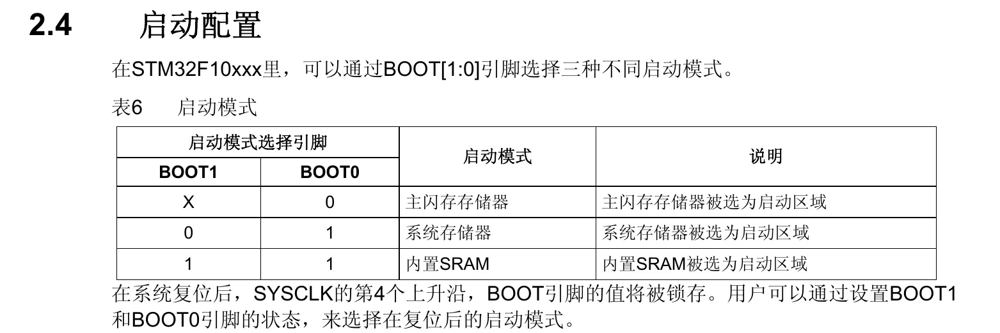
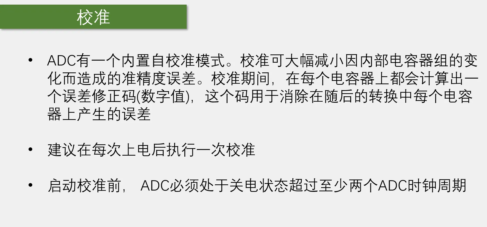
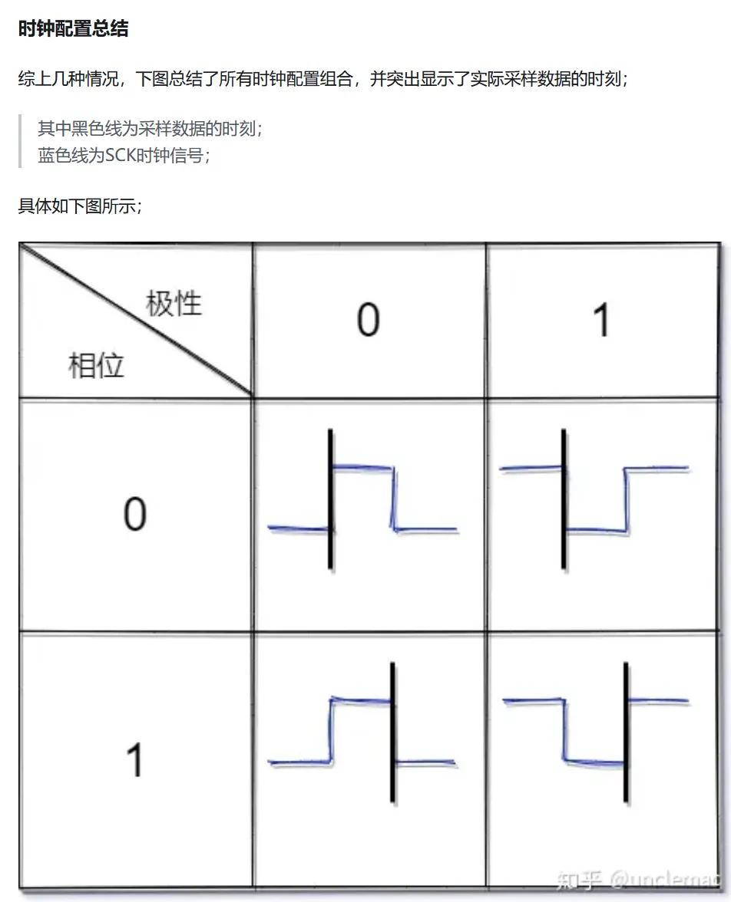

# STM32

本文是笔者研究生入学期间对STM32进行系统性学习总结而成的笔记，可用作入门参考资料使用，主要参考资料为b站江协科技的[STM32入门教程-2023版](https://www.bilibili.com/video/BV1th411z7sn/)

<!-- more -->

# STM32
STM32 常用寄存器缩写: CR 控制寄存器 SR 状态寄存器 DR 数据寄存器  
ST公司出品的Microcontroller(微控制器) Cortex-M内核，本文学习的是M3内核  
供电电压 2.0V-3.6V(标准3.3V)，USB输出电压是5V  
AHB 先进高性能总线  
APB 外设总线  
内核的外设不需要开启时钟  

复用输入指的是同一引脚默认有很多输入功能，需要对GPIO指定使用哪个功能(TIM4就无复用功能)，而重定义则是非默认功能，需要进行AFIO选择进而变为复用功能

最小系统电路: 单独的芯片不能工作，需要连接最基本的电路，由这些电路组成的就是最小系统电路
## GPIO
RCC : 复位和时钟控制  
GPIO(General Purpose Input Output)通用输入输出口  
GPIO高低电平看外部输入输出,输入情况下,与外部电平极性相同.如果外部信号非常小,则为避免引入干扰源选择浮空输入,不清楚外部信号的情况下也选择浮空输入,输出情况下看外部负载电压要求  
AIN是模拟输入专用模式，此时GPIO不输入输出，防止对外界信号干扰  
AF_PP是复用推挽模式，片上外设使用这种模式  

VDD 3.3V     VSS 0V  
GPIO 控制流程：1.激活 RCC 时钟    2.使用 GPIO_Init 初始化 GPIO 函数   
施密特触发器的作用是对外界信号进行滤波，规定上下限，使得当超过上限输出为1，低于下限输出为0，上下限之间输出不变，这样可以维持信号的稳定性  
在输出模式下，输入也是有效的  
## 中断
NVIC (Nested Vectored Interrupt Controller) 嵌套中断向量控制器: 统一分配中断优先级和管理中断  
响应优先级: 完成当前任务后进行响应优先级的任务    中断优先级: 立即结束当前任务并进行中断优先级任务(可以决定中断嵌套,抢占优先级高的可以进行中断嵌套)  
两个优先级相同的情况下按中断号排队,所以并不是先来后到  
NVIC 分组在整个项目中只需要执行一次  

EXTI (external interrupt) 外部中断控制器  
EXTI 负责监控GPIO的电平变化,当产生跳变时,EXTI向NVIC发送中断申请,经NVIC裁决优先级后执行中断程序

GPIO_EXTILineConfig(GPIO_PortSourceGPIOx,GPIO_PinSourcex) 是配置AFIO的函数，参数是GPIO的通道和引脚
## 定时器
TIM (timer) 定时器  
TRGO(Trigger Out)定时器主模式，该模式下可以将触发信号传递给从定时器，并由从定时器执行动作，同时可以不用进中断就可以执行程序。

预分频器(PSC)对时钟频率进行分频,置0 不分频,置1 频率=原时钟频率/2  置2 频率=原时钟频率/3 等等，注意预分频器需要加 1,ARR加1的原因是ARR从 0 开始计数 CK_PSC是 72MHz

OC(output compare) : 输出比较  
PWM(pause width modulation) : 脉冲宽度调制

IC(Input Capture): 输入捕获  
输入捕获每次CNT转运到CCR时需要清0,此时可以配置从模式,让硬件电路自动清零

FP(filter polarity)，滤波器极性选择  
主模式:让定时器内部信号映射到TRGO引脚,用于触发别的外设    从模式:接受其他外设或自身的信号用于控制自身定时器的运行

使用PWMI测量PWM频率和占空比有两种方法：测频法和测周法。测频法是给定一闸门时间T，测量在T内的信号源产生的频率数量，这种方法适合测量高频信号，这很好理解：当信号频率足够低时，闸门时间可能要比待测信号的周期要短，这样就永远测不到信号源频率了。测周法是给定一采样频率f，当信号经过一个完整的周期时得到采样点数量，进而计算出信号源周期，该方法不适合测量高频信号
滤波器也是计数器,但不会改变信号原有的频率,原理是当有x个信号均为同一性质(高电平或低电平时)才滞后输出信号,x是给定的参数值  
通道3,4不支持PWMI配置且不支持编码器  
使用编码器时,定时器的其他功能就无法使用了  

TI1可以选择接到TI1FP1上也可以选择TI1FP2上，这样可以通过极性选择来计算出上升沿到下降沿的时间，这个功能可以在PWMI模式中体现

编码器会接管时钟,所以不需要TIM_InternalClockConfig()  
uint16_t 中比0小一位是65535，如果想变为-1需要把uint强制转换为int
## ADC
ADC(Analog-Digital Converter)  
STM32 ADC是12位的 最大值4096 可以测量0-3.3V  
PWM是DAC的一种，具有功率损耗小的优点，常用来给大型直流电机调速，f103没有DAC外设  
ADC数据来源于比较器的结果，其核心是未知的外界信号与芯片给定的信号进行比较，并用逐次逼近寄存器(SAR)采用二分法分割芯片信号，直至与外界信号相等，此时SAR的值即为外界信号值  
规则组支持16通道，注入组支持4通道，但规则组只有一个数据寄存器，注入组有四个。这意味着当使用规则组时，它可以同时接受16个gpio的信号，但是由于只有一个数据寄存器，因此如果数据读取不及时，后一个gpio的数据会将前一个gpio的数据覆盖掉，极端情况下会丢失15个通道的数据，而注入组可以规避这个问题。使用规则组时可以申请DMA来帮助通道转换效率  
EOC(End Of Convert) 规则组: EOC 注入组: JEOC  
注意要开启RCC_ADC的时钟

通道数大于1扫描模式才有意义，转换是对循环而言
在连续转换模式下，会自动读取EOC的值，所以不需要手动写 while 判断是否转换完毕

单次连续模式是针对某个通道，扫描非扫描模式针对所有通道
保持时间越长，越能抵抗毛刺信号的干扰

由于ADC数据寄存器有16位，但是ADC本身是12位，因此就有左右对齐的问题。ADC数据对齐方式一般选右对齐，这样可以快速获取数据，如果使用左对齐则需要将数据右移4位.左对齐是为了直接取出数据的高n位，方便裁剪分辨率，但是也可以通过右对齐然后读取出的数据进行右移的方式来操作分辨率
## DMA
DMA(Direct Memory Access)直接存储器访问  
STM32有1个DMA1,共7个通道,每个通道都是独立的DMA，都支持软件触发和特定的硬件触发。DMA虽然有多个通道,但是只有一条DMA总线,需要仲裁器进行仲裁,使优先级高的通过获得数据,通道号越小优先级越高  
DMA中的软件触发和硬件触发不同与其他外设的软件触发和硬件触发，前者的软件触发意味着想要把数据最快的从一处搬到另一处而不考虑搬运的时机，当配置M2M结构体成员时就意味着使用软件触发了 ，硬件触发指的是当收到外部中断时才进行数据转运。因此如果是**Flash到SRAM**的数据搬运,应使用**软件触发**，此时数据运输速率最快,如果是外设到SRAM,应使用硬件触发，此时不需要以最快的速度转运数据,而是需要特定时机才触发。   
DMA只操作存储器到存储器的数据搬运,上面提的外设到SRAM是指外设的存储器到SRAM  
内核外设: NVIC SysTick  
DCode总线专门访问Flash  

数据宽度参数  字节: 8位 半字: 16位 字: 32位 、  
自动重装器决定传输计数器自减到0后是否恢复到初值,如果恢复到初值则为连续模式,否则为单次模式  
软件触发不能与自动重装器同时使用,那样DMA就停不下来了  
M2M位置1是软件触发,M2M置0是硬件触发  
**传输计数器等于0后需要将DMA_Cmd DISABLE,然后改变传输计数器的值,再DMA_Cmd ENABLE,DMA才能重新工作,简而言之,写传输计数器需要关闭DMA**  
小位数数据转移到大位数数据会在高位补0,大位数数据转移到小位数数据会舍弃高位  
DMA和CPU对同一地址进行访问时,仲裁器会优先选择DMA进行访问(为了防止DMA数据丢失),但是也会为CPU保留一半的总线带宽  
Flash存储编译后的C代码和常量数据  
const定义的常量存储在Flash里 普通变量存储在SRAM里  
ADC -> DR 得到的是DR的值 &ADC -> DR得到的是DR的地址  
## UART

USART支持同步异步传输，有时钟线，并对协议进行增强  
UART仅支持异步传输，没有时钟线

全双工: 通信双方能够同时双向通信    一般两根通信线，一根发射一根接收  
半双工: 通信双方同时只能有一方通信  
单工：无论何时都只有一方能进行通信，另一方始终接收  
全双工: 打电话    半双工: 对讲机    对讲机: 广播  
差分信号抗干扰能力强，传输速度和距离会很高  
硬件流控制: 当信息发送方向接收方发送数据太快时可能造成发送方发送的数据超出接收方的缓冲区大小从而导致阻塞，这是就需要引入硬件流控制来让接收方反馈缓冲区已满，停止发送数据的请求  
I2C 和 SPI 有时钟线，所以是同步的传输方式  
USART默认为低位先行

RS232 1 0 位如此设置的原因是增加抗干扰能力  
RS485 是差分信号，传输距离可达上千米

二进制调制情况下波特率 == 比特率  
奇偶校验: 校验位补 0 或 1 使得数据位+校验位有偶数或奇数个 1

TXE(发送数据寄存器非空)与RXNE(接受移位寄存器非空)是TDR与RDR置位的  
单片机的TX和RX与USB转串口模块的TX和RX要交叉连接

波特率除以16是因为采样时钟(fpclk)是以波特率的16倍频进行采样的，这是为了防止噪声对程序产生影响。其检测方法是在检测到起始位时(也就是下降沿)，后按波特率的16倍频进行采样，在第3，5，7次采样需要保证至少有两个0，否则就舍弃数据，之后在第8，9，10次采样时也需要保证至少有两个0，否则就意味着有噪声，硬件就会在NE寄存器内置1。在实际使用过程中我们只需要直接给出波特率就行  
Odd 奇数 Even 偶数

固定包长适合载荷数据与包头包尾重复率高的情况，这样利于分割以及接收数据

在发送数据时需要加上包头包尾(个人规定0xFF为包头，0xFE为包尾)  
相比文本数据包，HEX数据包效率高，因为文本还需要编码译码的过程

HEX数据包接收运用了状态机的思想，通过不同的S的值控制进中断后的行为，进而执行相应的动作
## I2C
I2C(inter IC Bus)  
同步协议需要时钟线来控制数据的读写，好处是对时钟要求不严格，不需要硬件电路的配合，而异步需要硬件电路产生准确的时钟信号才能通信。因此同步协议主打低端市场。同时，如果主机进入中断，异步协议就会接受到错误数据，产生的错误更隐蔽，而同步协议利用时钟线则会直接丢失数据，但也方便排查错误  
第一个数据帧最低位0为写，1为读

I2C两根总线为避免主从设备同时输出造成电源短路现象(主机输出1从机输出0)，规定了SDA与SCL均采用开漏输出模式，这样，无论主从设备是否同时输出，均不会达到强上拉，而是在外接电阻R的作用下被限制为弱上拉，下拉模式不受影响。同时，在下拉状态中，多主机情况下可以进行I2C控制权的仲裁

0表示应答 1表示非应答  
SCL低电平变换SDA数据，高电平读取SDA数据  
由于I2C对硬件要求不高，因此软件可以完全模拟I2C协议  

硬件I2C与USART类似，都是通过TXE和RXNE寄存器控制数据收发，只不过I2C是高位先行，因此移位寄存器向左移位，而USART低位先行，是向右移位，这里的高低位先行指的是HEX数据的发送接收模式，正常的文本模式下仍按照人类的从左至右(从高到低)发送文本  
7位寻址与10位寻址的区别是，10位寻址时前两个数据包是寻址，之后的是数据，而7位则是第一个数据包是寻址  
EV(event): 事件，产生多个标志位

I2C在频率很高时，由于开漏模式弱上拉的作用，实际的SCL和SDA并不完美，当频率快到一定程度时，SCL的方波甚至会被压缩至三角波，为了给SDA传送数据时所需要的上拉一定时间，所以需要SCL低电平时占空比适当增加  
由于I2C的弱上拉的作用，使得在标准模式下支持100KHz的信号，快速模式下也只能支持400KHz的信号  
硬件I2C下，STM32默认为从模式  
STM32的I2C被分为主从两种模式，每种模式又被分为发送和接受两种模式

硬件I2C接收模式下，要在发送最后一个字节前将STOP置1，并把Ack置0，这是因为停止位(EV7_1)配置位于接收数据之前，只有接受下个数据后，才能把之前设置的停止事件发送出去。而发送模式的停止事件(EV8_2)位于发送数据后，这种情况下就可以正常发送
## SPI
SPI(serial peripheral interface)，应用领域与I2C类似，都用来负责主控与外挂芯片之间的通信，支持一主多从但不支持多主机。通信模式为同步，全双工。与I2C区别在于，I2C耗费硬件资源最少，SPI实现功能最多.  
SPI有四根通信线，分别为SCK(serial clock)，MOSI(master output slave input)，MISO(master input slave output)，SS(slave select)  
SPI与I2C一样，均采用高位先行的传输模式  
SPI没有应答机制，有几个从机就有几个SS线  
由于所有从机的MISO都连接在一起，为了避免从机在推挽输出时互相影响导致短路，SPI规定当从机的SS没有被选中(置0)时，从机的MISO默认为高阻态，SS被选中时，MISO才被改为推挽输出。同时，主机输入为上拉输入(MISO)，主机输出为推挽(包括片选，时钟，MOSI)  
从机输出引脚为推挽输出，从机输入引脚为浮空(片选未选中时) 或上拉(片选选中时)  
理解SPI的另一种方式：[CSDN](https://blog.csdn.net/p0o9i83463rrfd4/article/details/123900524)

[知乎](https://zhuanlan.zhihu.com/p/290620901)

当波特率发生器产生时钟信号时，如果设置CPOL=0，CPHA=0,那么主机和从机就会在第一个时钟信号的上升沿采样并读取对方发来的信号并将其放在移位寄存器中，然后在第一个时钟信号的下降沿处将MSB(最右侧的数字)放到各自的引脚上

存储器划分 Block - Sector，并且整个存储空间全被划分成了Page  
发送的3个字节组成的地址，最低位是页里的字节地址，高2个字节是页地址  
由于结构特性，Flash的数据bit位只能由1变为0，不能由0变为1，因此写入数据前必须先擦除，将所有数据由0“擦除”至1，而后写入数据.  

为了防止误操作，Flash使用前需要先写使能  
事前等待就是把WaitBusy放在读写函数之前的位置，这样可以提高效率，但安全性会降低(因为程序在读写操作后可能会运行其他代码，这样可以节省时间，但安全性会降低，比如读写操作后再次进行类似读写的操作)，事后代码效率较低但安全性高。并且需要注意的是事前等待需要放在读写函数之前，但事后等待仅放在写函数后即可  
写入不能跨页，读取能跨页，写入超过页的限制之后会从页头开始覆盖  
SPI要想接收数据必须发送数据，因此可以发一些没用的数据(Dummy Data)给从机
## BKP与RTC

UNIX时间戳默认从1970年1月1日开始，而有些C库默认为1900年开始

HSE(高速外部时钟)  
RTC时钟优先选择LSE，因为频率为2^15^因而容易分频产生1Hz信号

## PWR
只有外部中断才能唤醒STM32的停止模式，因此PVD，RTC，USB，ETH等可以通向EXTI中断  
f103内部划分了很多供电区域，其中vdda专为模拟模块供电，电压2.4v-3.6v，vdd专为io供电，电压3.3v，电压cpu、内存及外设电压1.8v(外设在通过io与外部交互时才会显现3.3v)，其电源来源于vdd的电压调节器

从上到下越来越省电，但也越来越难被唤醒  
系统进入停机模式时，HSI被选为系统时钟，此时系统主频8MHz，而正常情况下使用的是HSE*9=72MHz，因此会发生Running刷新不及时的现象，此时需要SystemInit来重新初始化时钟  
待机模式唤醒后，程序从头开始执行，因此，不需要调用SystemInit
## 看门狗
看门狗负责复位程序  
独立看门狗精度低，使用LSI时钟(40KHz)，窗口看门狗精度高，使用PCLK1的时钟(APB1的时钟，36MHz)

所谓的喂狗就是将12位重装计数器的值重装到12位递减计数器内，方式递减计数器归零产生溢出信号  
键寄存器可以以理解为多位的控制寄存器，这样设计是为了防止外界干扰导致控制寄存器的某一位失效，假如这一位是喂狗的，那情况就会比较危险，因此设置键寄存器

早期唤醒中断可以进行保存数据，再次喂狗等紧急操作，以防止程序未被喂狗而复位

窗口时间即为进入WWDG最小的时间，并非通常意义的"窗口"时间

利用内部闪存编程时，当读取内部闪存时CPU会被暂停，因为程序放在闪存里，CPU运行的程序需要从闪存中取出，如果此时正在执行中断函数时中断会卡住一段时间

## 启动文件详解  

[野火Startup_file.html](https://doc.embedfire.com/mcu/stm32/f407batianhu/std/zh/latest/book/Startup_file.html)

