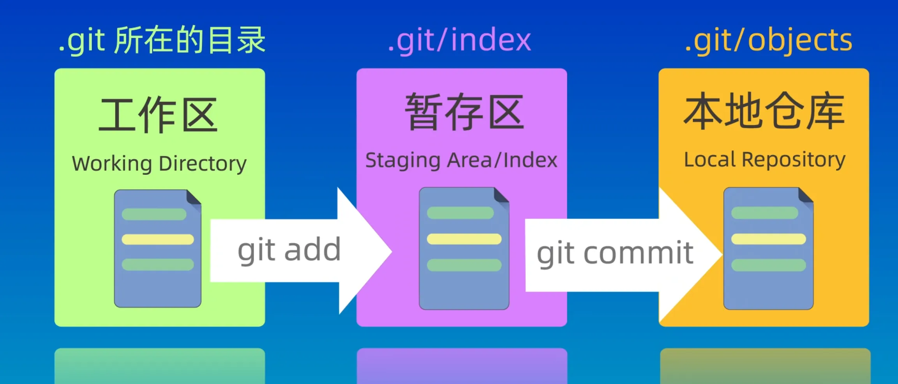
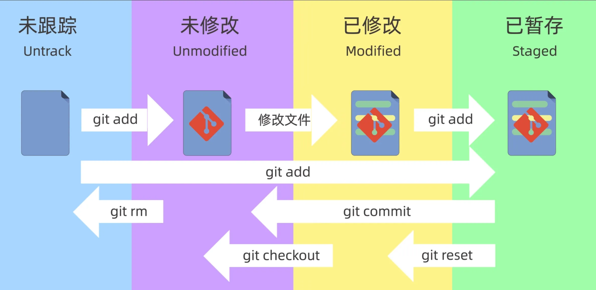
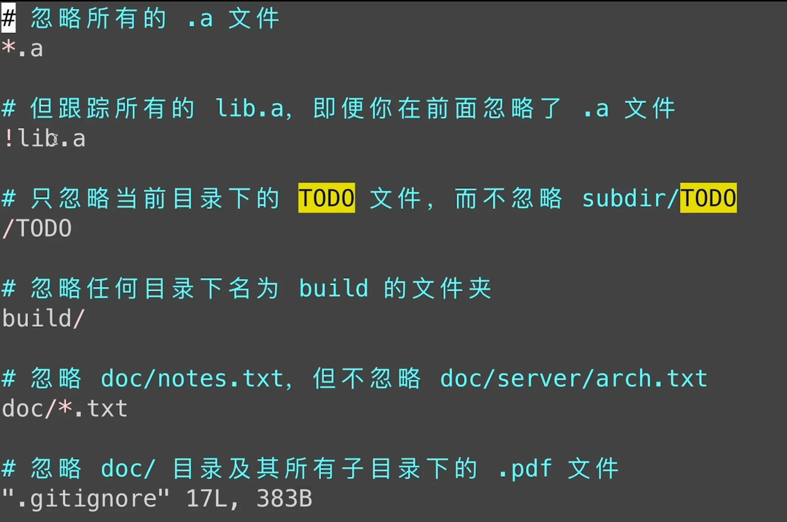
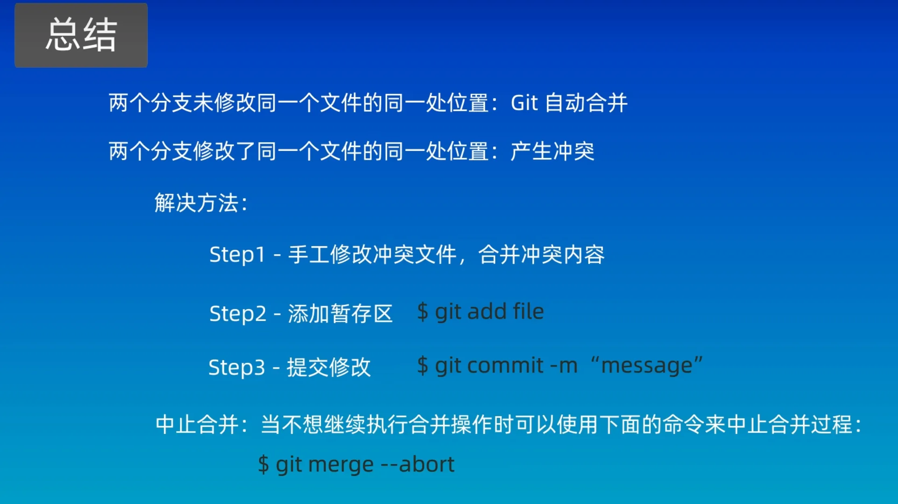
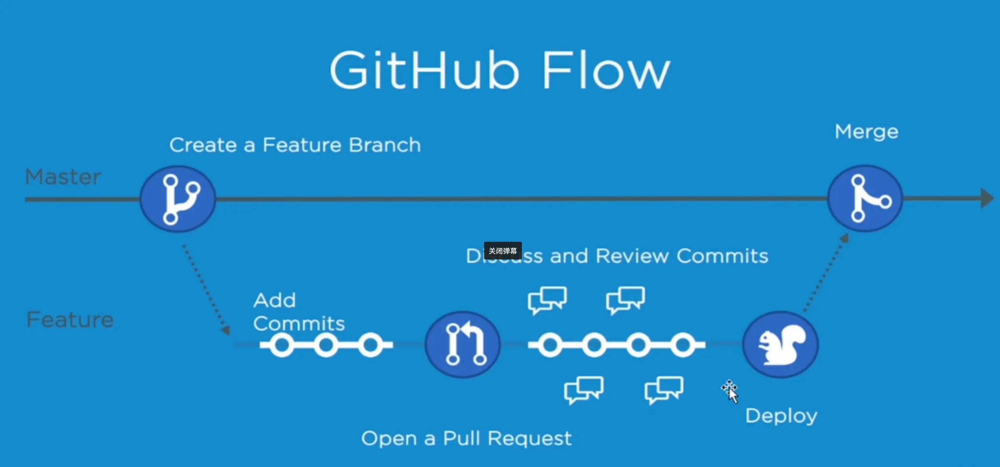
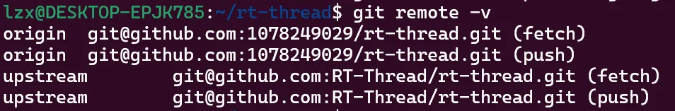
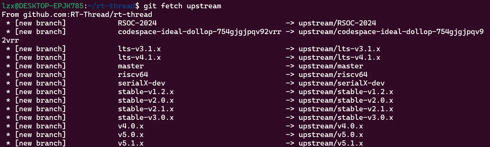
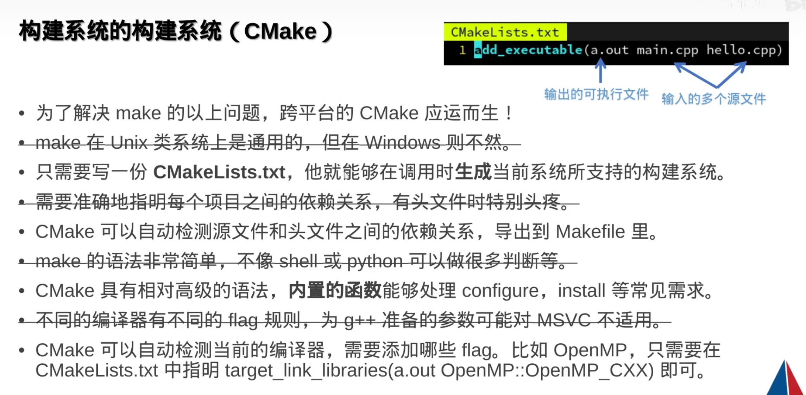

# 工具链


本文介绍了Git，GDB，Makefile，CMake四种C/C++编程中常用的工具链，还涉及一点GCC制作库文件的内容  

<!-- more -->

# 工具链  

## Git

### Git本地操作
版本控制系统分为2种
* 集中式版本控制系统 如SVN
* 分布式版本控制系统 如Git  

相比SVN，Git可靠性高但操作复杂
  
```git
git init [dir]//在dir下创建新的本地仓库，缺省则在当前目录创建

/* 全局配置git仓库的用户名，对所有仓库生效，省略则为本地仓库有效 */ 
git config --global user.name "用户名" 

/* 全局配置git仓库的邮箱，对所有仓库生效，省略则为本地仓库有效 */ 
git config --global user.email "邮箱" 

/* 保存用户名和密码 */
git config --global credential.helper store

/* 查看当前git配置 */
git config --global --list

```


git的数据管理分为三部分
* 工作区    .git所在目录，正常编辑代码的区域
* 暂存区    .git/index所在目录，即将提交到git的文件区域
* 本地仓库  .git/objects所在目录，init生成的文件区域，是git存储代码和版本信息的主要位置  
每次修改文件都需要提交很麻烦，因此产生了暂存区，当修改所有文件完毕后再统一提交至本地仓库


```git
/* 将filename文件添加到暂存区内，支持通配符( * . 等) */
git add [filename]

/* 查看当前文件状态 */
git status 

/* 提交，支持通配符 */
git commit -m "提交说明"

/* 暂存且提交，支持通配符 */
git commit -a -m "提交说明"

/* 查看提交日志 */
git log

/* 查看暂存区文件 */
git ls-files

```


需要将文件提交到暂存区内才能使用 git commit命令


```git
/* 将文件撤销所有更改到最后一次提交的状态 */
git checkout -- <filename>

/* 回退到某一版本,保留工作区和暂存区内容 */
git reset --soft [版本id]

/* 不保留工作区和暂存区内容 */
git reset --hard

/* 仅保留工作区内容 */
git reset [版本id] 
git reset --mixed

/* 恢复git reset --hard的操作 */
git reflog

/* 当在一个分支上进行修改而且需要转到另一个分支上时，可能会提示未保存修改，这时需要用到如下命令保存当前分支已修改的文件 */
git stash

```
使用 --hard 参数需要谨慎考虑，git reset默认执行 --soft命令

```git
/* 从工作区和暂存区中删除文件 */
git rm [filename]

/* 仅在暂存区中删除文件，保留工作区内容 */
git rm --cached [filename]

/* 查看工作区和暂存区的不同，如果暂存区内无文件，就比较工作区与最新提交的不同 */
git diff

/* 查看暂存区与本地仓库的不同 */
git diff HEAD

/* 查看前第n个提交版本与当前提交版本的不同 */
git diff HEAD~[n] HEAD

/* 查看前上个提交版本与当前提交版本的不同(^不支持前第n个版本) */
git diff HEAD^ HEAD

/* 查看前第n个提交版本与当前提交版本的某个具体文件不同 */
git diff HEAD~[n] HEAD [filename]
```
diff后红色内容表示删除内容，绿色表示增加内容

### 常用高级操作  

下面是git的高级操作
```shell
/* 从其他分支获取文件，需要在想要获取文件的分支上执行 */
git restore --source <otherbranch> -- <filename/pathname/blob>

/* 我们使用checkout也能达到相同效果，并且会更简单 */
git checkout <otherbranch> -- <filename/pathname/blob>

/* 如果想要查看过去的某一版本又不想使用reset，可以使用checkout来临时查看 */
git checkout <commit-hash>
/* 退出时切换到对应分支即可 */
git checkout <your-branch>

/* 从其他分支获取commit，详见[阮一峰](https://www.ruanyifeng.com/blog/2020/04/git-cherry-pick.html) */
git cherry-pick <commitHash>

/* 以交互式方式(-i)打开commit编辑页面，可以编辑的commit数为n */
git rebase -i HEAD~n

/* 编辑commit message */
git commit --amend

/* 仅在暂存区中删除文件，保留工作区内容。可用于提交了不想提交的文件需要撤销时 */
git rm --cached [filename]

```

### Git远程操作


可以配置.gitignore来不想被版本控制的文件，只需将文件或文件夹添加到.gitignore即可，语法支持如上
  
```git

/* eg git remote add origin git@github.com:1078249029/toyFreeRTOS.git */
git remote add <远程仓库别名><远程仓库地址> //仓库别名缺省为origin

/* 将本地分支与远程仓库的远程分支联系起来
*   eg git push -u(upstream) origin main(远程分支与本地分支重名只写一个即可)
*/
git push -u <远程仓库名><远程分支名> <本地分支名>

/* 获取远程仓库名，分支名等信息 */
git remote -v

/* 拉取远程仓库并自动合并 */
git pull <远程仓库名><远程分支名> <本地分支名>

/* 查看分支列表 */
git branch

/* 图形化查看分支图 */
git log --graph --oneline --decorate --all

/* 创建分支 */
git branch [branch-name]

/* 切换分支 */
git switch [branch-name]

/* 合并分支 */
git merge [branch-name]

/* 将主分支文件同步到其他分支 */
git merge [主分支名称]    //使用前需要切换到其他分支

/* 删除分支 */
git branch -d [branch-name]    //删除已合并分支
git branch -D [branch-name]    //删除未合并分支

/* 恢复某分支的状态 */
git checkout -b [branch-name] [commit-id]

/* 从PR中取消提交某个已提交的文件 */
git switch master    //切换到保留这个文件最初状态的分支
git checkout origin/master -- <filename>    //用最初的文件替换掉已提交文件
```


merge时需要切换到主分支  
merge后分支依然存在，除非手动删除分支




```git
/* 当提交的PR被合并后，需要进行以下操作来同步上游仓库 */

/* 设置上游仓库 */
git remote add upstream https://github.com/original-owner/original-repo.git

/* 切换到本地主分支并将上游主分支的更改同步到本地主分支，最后同步到远端主分支 */
git switch master
git pull upstream master
git push origin master

/* 切换到本地开发分支上并将本地开发分支变基到本地主分支上，可能会产生冲突 */
git switch dev
git rebase master

/* 将本地开发分支上的更改同步到远端开发分支上 */
git push origin dev 

```

### GitFlow

适用于团队水平适中的情况  

五种分支: main hotfix release develop feature  

main 包含项目最新的稳定代码  
hotfix 用于解决线上问题，从main分离出来  
dev 用于开发测试  
release 均来源于develop，测试稳定后发布到main，发现bug发布到dev  

主要分支包括dev和main  
  
### GitHub Flow

适用于团队水平较高的情况

  

整个项目只有两个分支，开发者从Master中branch一个分支用于开发，需要进行merge时发起一个Pull Request请求，待团队审核后再merge到Master
  
### GitHub
配置Github的SSH密钥时，最好把密钥统一放在.ssh文件夹下(win下是C:\Users\你的用户名\.ssh)，并且写好config文件来管理多份密钥
  
### Repo

* repo是什么？
    * repo是Google开发的用于管理Android版本库的一个工具，repo是使用Python对git进行了一定的封装，并不是用于取代git，它简化了对多个Git版本库的管理。用repo管理的版本库都需要使用git命令来进行操作。因此，使用repo工具之前，**请先确保已经安装git**
  
* 为什么要用repo？
    * 项目模块化/组件化之后各模块也作为独立的 Git 仓库从主项目里剥离了出去，各模块各自管理自己的版本。Android源码引用了很多开源项目，每一个子项目都是一个Git仓库，每个Git仓库都有很多分支版本，为了方便统一管理各个子项目的Git仓库，需要一个上层工具批量进行处理，因此repo诞生。
  
repo用于Android项目管理

### Git实战——以RTThread为例  

为了能够与开发团队保持同步，我们对rtt项目进行fork，需要注意的是在fork时需要选择fork全部分支，这样才能使用长期维护或其他的版本  

fork操作仅仅是在github上生成我们自己的仓库，但是本地还没有生成，因此我们需要执行
```shell
git clone my_github_fork
```

随后会在我们本地生成一个项目文件夹，我们进入这个rt-thread文件夹内，执行branch命令会发现这里仅有master分支。而远端仓库只有我们fork出来的rtt项目


由于我们需要使用的是lts-v4.1.x分支，而这个分支与rtt项目的master分支是同步开发的，因此我们首先需要建立本地仓库与rtt官方仓库的联系，执行
```shell
git remote add 远程仓库的别名 远程仓库
```
在这里我们使用upstream作为别名
```shell
git remote add upstream git@github.com:RT-Thread/rt-thread.git
```

这样当我们执行`git fetch upstream`的时候就会与rtt官方仓库保持一致了  
下面是建立联系后的样子
  

我们最好还要同步一下分支状态
```shell
git fetch upstream
```


这里我们就可以正式建立分支了
```shell
git branch 本地分支名 远程仓库别名/远程分支名
```

**至此，我们的项目就可以进行开发了，之后同步官方仓库的状态可以使用 git fetch upstream，上传到我们自己的仓库使用 git push origin**  

如果遇到了本地需要新建文件但是该文件不能上传到云端，同时也不能修改.gitignore文件，因为这是项目所有人共有的。这就需要将其添加到exclude文件内了，具体位置在`.git/info/exclude`，将对应文件的相对项目文件夹的地址(也就是相对.git的地址)写入exclude文件内即可  
使用这种方法的前提是新文件从来没有被git追踪，如果文件已经被追踪，可以使用下面的方式
```c
git update-index --assume-unchanged <path_to_file>
```
该命令会忽略对应文件的任何更改，我们也不能对文件进行添加到暂存区和提交的操作。注意这里必须指定具体文件路径，不能指定使用"."或者正则表达式所涵盖的文件  
想要让git再次追踪文件:  
```c
git update-index --no-assume-unchanged <path/to/file>
```
查看当前文件是否被git忽略
```c
git ls-files -v
```
文件前有"h"标记的就代表已经被忽略，即hide，带有"H"代表没有被被忽略，表示位于Head，带有"M"代表已经修改，但未提交，即Modify

## GCC

gcc(g++) <options> <sourcefile>  
    options  
        -o<filename>                     指定输出的文件名  
        -fexec-charset=GBK            指定运行时编码  
        -finput-charset=UTF-8        指定源文件编码  
        -fno-omit-frame-pointer    编译时不忽略栈指针寄存器，即保留栈指针寄存器来用于硬件栈回溯  
        -Wall                                   输出警告信息  
        -O(0-3)                                指定代码优化等级(0为不优化)  
        -I                                          指定文件目录来查找头文件(一般为./)  
        -L                                         指定文件目录来查找库文件(一般为./)  
        -v                                         输出编译的信息  

* 预处理阶段    (-E，得到.i文件)（巧记：ESC，iso）
    * 处理#include预编译指令，将被包含的文件直接插入到预编译指令的位置
    * 处理所有的条件预编译指令，比如#if，#else，#endif，#ifdef等
    * 预处理器将所有的#define删除，并且展开所有的宏定义
    * 删除所有的注释
    * 添加行号和文件标识，以便编译错误时提供错误或警告的行号
    * 保留所有#pragma编译器指令
```shell
gcc -E -o hello.i hello.c
```

* 编译阶段    (-S，调用cc1程序得到.s文件)
    * 将预处理后的file.i文件进行语法词法分析，翻译成文本文件file.s，里面储存了各种汇编指令
```shell
gcc -S -o hello.s hello.i
```

* 汇编阶段    (-c，调用ar程序得到.o文件，-c代表编译但不链接)
    * 根据编译文件中的汇编码得到二进制机器码文件，生成各个段，生成符号表
```shell
gcc -c -o hello.o hello.s
```

* 链接阶段    (gcc file.o，调用collect2程序)
    * 将链接文件链接到file.o文件中
    * 静态链接：内存开销大，速度快。将所有需要的函数的二进制代码拷贝到可执行文件中去
    * 动态链接：内存开销小，速度慢。不需要将所有需要的函数的二进制代码拷贝到可执行文件中去，而是记录一系列符号和参数，在程序运行或加载时将这些信息传递给操作系统，操作系统将这些动态库加载到内存中，然后当程序运行到指定代码时，去共享执行内存中找到已经加载动态库可执行代码，最终达到运行时链接的目的

```shell
gcc -M hello.c    打印hello.c的依赖
gcc -M -MF hello.d hello.c    输出hello.c的依赖到hello.d文件内
gcc -c -o hello.o hello.c -MD -MF  hello.d    编译hello.c并输出依赖到hello.d文件
gcc -I /usr/hello    指定头文件目录
gcc -L /usr/hello    指定库文件目录
gcc -l /usr/hello/libm.so    指定哪个库文件
gcc -T /usr/hello/link.ld -o /usr/hello/hello.elf   指定使用哪个链接脚本生成可执行文件
objcopy hello.elf -O binary hello.bin    使用elf文件通过objcopy生成bin文件
```

linux-gcc默认最终的输出文件为elf类型，经过编译的.c文件是 .o文件(object，目标文件)，链接后的为.elf文件，但同时也可以指定输出.out文件，这是一种老的可执行文件格式

### GCC制作库文件  

制作静态库
```shell
gcc -o hello.o hello.c
ar crs libhello.a hello.o
```

制作动态库
```shell
gcc -o hello.o hello.c
gcc -shared -o libhello.so hello.o
```

## GDB  

```shell
gcc -g //编译时记录调试信息，否则无法调试
gdb 可执行文件 //调试可执行文件
gdb 可执行文件 core转储文件 //调试含有core转储文件的可执行文件

进入gdb后

回车默认重复上一条命令
r(run)        运行程序
quit          退出调试
l             查看源码
bt(backtrace) 查看调用栈
list          查看源代码及行号
b(break)      行号/函数名 在行号或函数名打断点
info b        查看打断点的位置
delet b       删除断点
n(next)       逐过程调试，但是不进入调用的函数内
s(step)       逐步调试，进入调用的函数内
c(continue)   继续运行
p(print) 表达式   打印变量或地址
watch 表达式   监视表达式的值，一旦变化，调试将会停在对应的行

shell 终端命令 调用终端命令
```

## Makefile  

* 如何判断哪个文件被更改了？
    * 比较源文件与输出文件的时间，如果源文件更新的话，那就意味着源文件已经被修改了  

```makefile
#makefile核心：规则

#目标：依赖1 依赖2...
#[TAB]命令
#下列目标文件test由a.o b.o链接生成

test:a.o b.o
    gcc -o test a.o b.o

#-c代表编译但不链接
a.o:a.c
    gcc -c -o a.o a.c

b.o:b.c
    gcc -c -o b.o b.c
```

通配符：
    \*： 任意字符，但对于目标文件，优先使用%代替\*  
    $：取值  
    @：目标值，@后加shell命令可以不显示命令但输出结果  
    $@：目标文件  
    $<：第一个依赖文件  
    $^：所有依赖文件  
$(shell 命令)可以执行shell命令  
假想目标文件：.PHONY 用于当目标文件与make命令重名时使用，用法：在makefile文件末尾加上.PHONY: 命令  

A = xxx 变量赋值  
$(A) 变量取值  
= 延时变量，makefile分析完成整个文档后才会对变量赋值，没有类似写程序时顺序执行的逻辑  
:= 即时变量，类似写程序时的顺序执行的关系，需要在当前行之前声明定义变量  
?= 若在此行之前就已经定义变量，则该语句无效，类似#ifndef  
+= 附加，并不是加，而是根据变量原本状态是延时变量还是即时变量进行相加，是延时变量还是即时变量取决于前文  

$(foreach var,list,text)    在list中的每一个var，都换为text  
$(filter pattern,text)    在text中取出符合pattern的值  
$(filter-out pattern,text)    在text中取出不符合pattern的值  
$(wildcard pattern)    在已存在的文件中取出符合pattern的值  
\$(patsubst pattern,replacement,\$(var))    在var中取出符合pattern的值，并替换为replacement  
CFLAGS 这个变量可以后加gcc的编译选项  

## CMake  

待更新...



